# 电阻

## 欧姆定律

$R = \frac{U}{I}$   $I = \frac{U}{R}$    $U = I * R$​

> 万用表本身就有几 $\Omega$

## 电阻的阻值识别

### 电阻色环

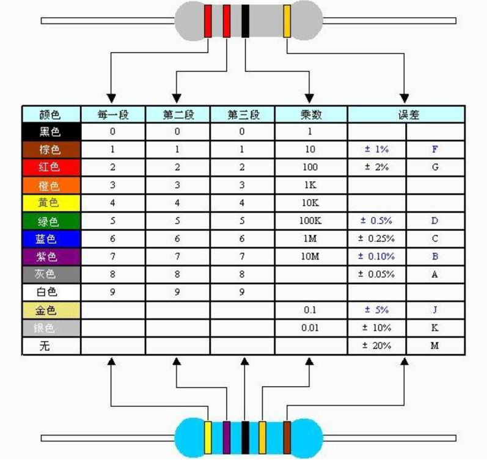

### 贴片电阻

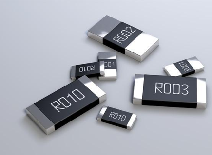 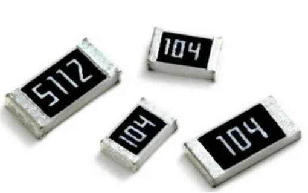

> 1）3 位读数：前 2 位为有效数字，第 3 位表示 $10^n$(也可以理解为 0 的个数)。精度为 ±5%
>
> 2）4 位读数：前 3 位为有效数字，第 4 位表示 $10^n$(也可以理解为 0 的个数)。读法和 3 位的原理一样，精度为 ±1%
>
> 3）阻值小于 10 的读数：通常在两个数之间插入一个字母 R，用字母 R 来代替小数点。
>
> 例如：$104 = 10 * 10^4\Omega$  $5R60 = 5.60\Omega$

## 电阻的功率

计算公式：$P = I * U$    $P = I^2 * R$     $P = \frac{U^2}{R}$​

设计电路的过程中，一定不超过电阻的功率，否则电阻发热会很严重

> $10\Omega$ 对应的 $\frac{1}{4}W$

## 电阻的限流作用

当供电电压大于负载的工作电压时，可以利用电阻限流

> ==注意：电路中不能超过电阻的功率，同时尽可能只工作在供电电压与负载电压相差不大或者工作电流很小的场景==

这样会导致负载的损伤因此要加电阻，进行限流 $V_{CC} = V_R + V_{led}$  $R = \frac{U}{I}$​​ 可以求出电阻的阻值​

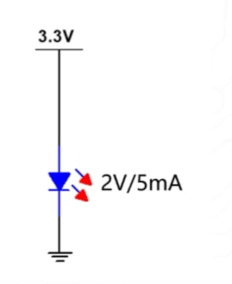

> 小tips:
>
> $\frac{U}{A} = R$    $\frac{U}{mA} = KR$   $\frac{U}{uA} = MA$

## 电阻的分流功能

电阻分流公式：$I_{总} = I_1 + I_2 + I_3$​

并联电阻的公式：

- 对于多个电阻$R_1,R_2,...,R_N $并联的情况，总电阻$R_{总}$的倒数等于各电阻倒数之和：
  $\frac{1}{R_{总}} = \frac{1}{R_{1}} + \frac{1}{R_{2}} + ... +\frac{1}{R_{N}}$计算时需先对右侧求和，再取倒数得到$R_{总}$​。

> 1. 如果直接加电压到电机，点击会很容易烧掉，加电阻限流 $R = \frac{V_1 - V_M}{I_M} = \frac{10V - 5V}{0.5A} = 10\Omega$
>
> 2. 电机的电流是很大的，如果电阻限流，电阻的功率也是很大的，小的电阻很容易会烧 
>
> 3. 如果拿很大的电阻限流，损耗会很高（得不偿失），因此要进行分流（$U$不变，$I$减小，$P$​​减小）
>
>    $P_{总} = U * I = 2.5W$，$P_R$（限流电阻是$10\Omega$）是$0.25W$，因此需要10个电阻，这10个电阻并联的结果是$10\Omega$，即是10个$100\Omega$的电阻进行并联
>
> 4. 串联和并联都是可以的，区别就是，并联（$U$电压不变，$I$电流降低），串联（$I$电流不变，$U$电压降低），都会导致$P$功率降低

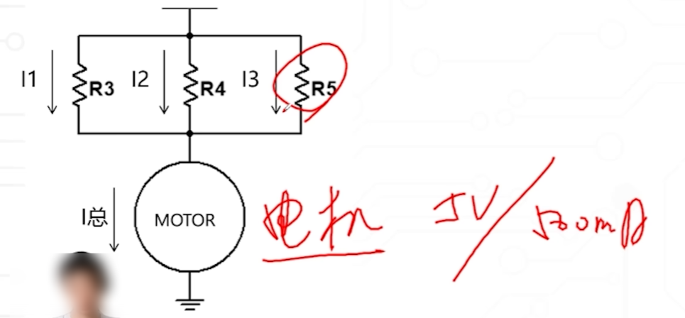

## 电流的分压功能

电阻分压公式：$V_R=\frac{(V_1-V_2)*R_2}{R1+R2}+V_2$

> 注：很多时候$V_2$是$GND$

> 1. 串联（$I$电流不变，$U$电压降低），都会导致$P$功率降低（防护作用）
>
> 2. 做参考电压$V_R$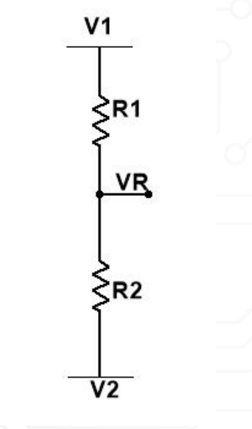

# 电容

## 什么是电容

电容简单来说就是两块不连通的导体加上中间的绝缘材料

> 1. 电容：又叫电容器，是指容纳电荷本领的物理量。
>
> 2. 电容一般用通常用 $C$ 表示（Capacitance）电容的单位是法拉，简称法，符号是F，常用的电容单位有毫法（$mF$）、微法（$μF$）、纳法（$nF$）和皮法（$pF$）等，单位为千进行换算，如$1uF=1000nF$；$1nF=1000pF$。
>
> 3. ==实际的电子产品应用中，根据电容“通交流，隔直流”的特性，在电路中所起的作用主要是储能与滤波==。

无极性电容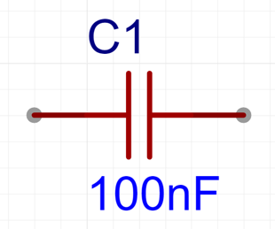有极性电容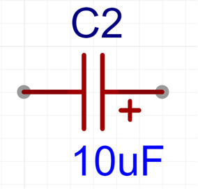

### 电容元件

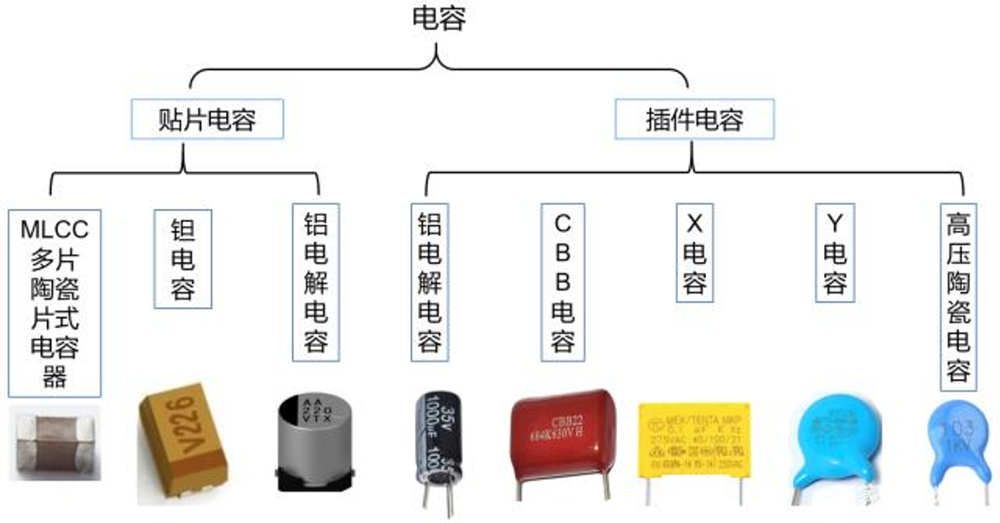

### 电容的正负极

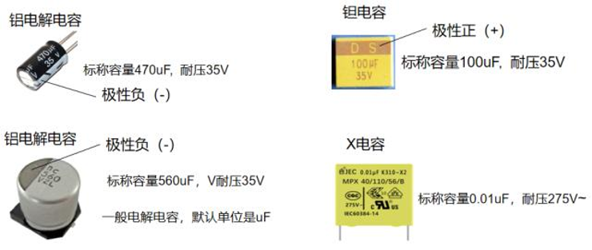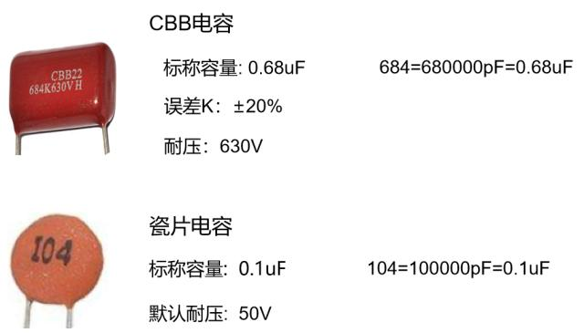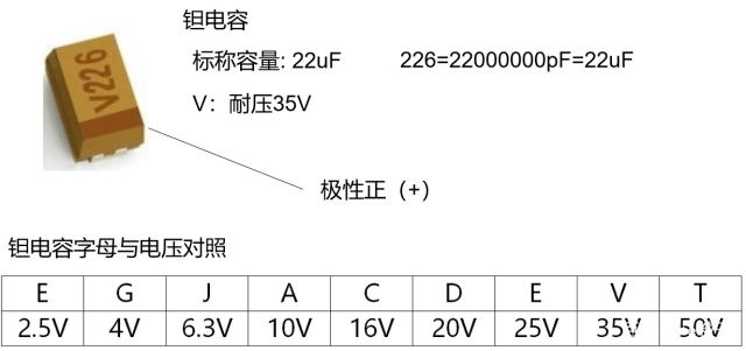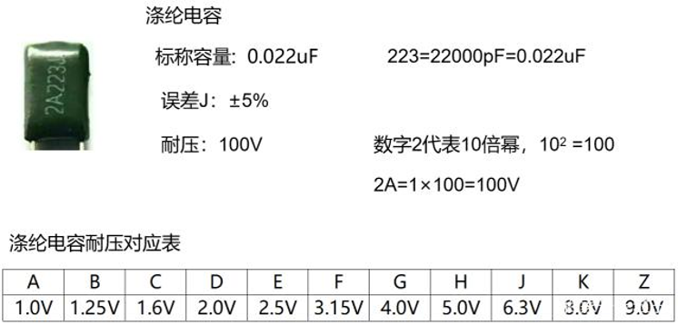

> 并不是到$100uF$就会炸，会有一定的余量

### 特性

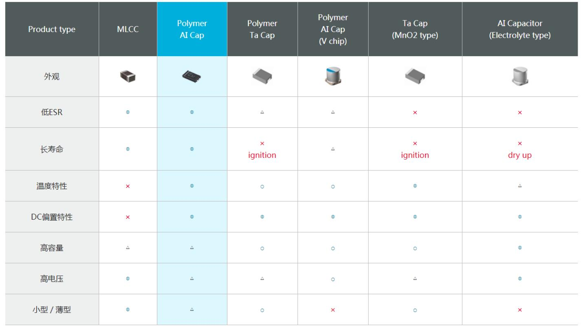

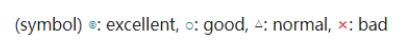

> ESL：ESL低代表着它的高频特性是很好的
>
> ESR：ESR很低代表着它的瞬态电流相对来说会很大
>
> 电解电容的寿命会很差，因为里面是一种电解液，会挥发的，电解电容温度越高，挥发越快

## 电容两端电压不能突变

电容两端的相对电压不能突变，只要电容不充电或放电，电容两端的电压就不变

==注意：电容两端的相对电压不能突变（充放电发送变化），但是两端相对于GND的电压可以同时突变（两端可以同时突变，相对电压差不会发生突变）==

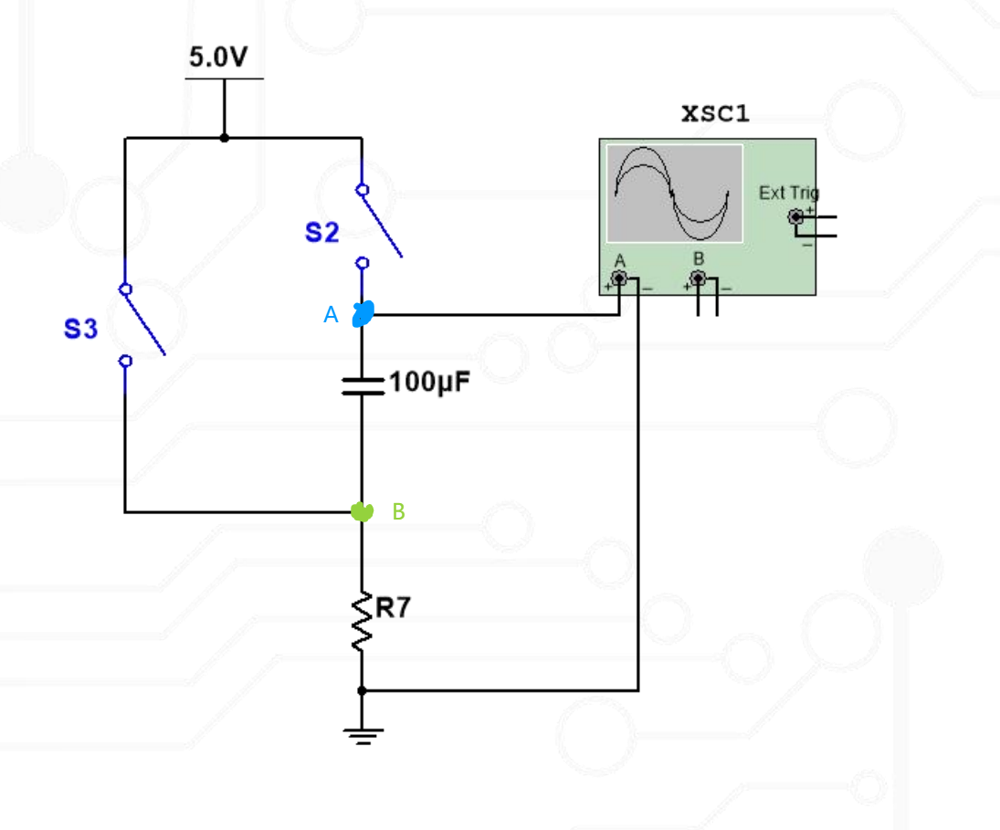

> 电容在两段电压不会突变，所以在S2电路接通的那一刻，5v电压加在电容正极A点时，电容负极B点也会处于5v的电压，此时电容开始充电，随着时间t的变化，电容中的电荷变多，电容两端出现电压降，B点电压逐渐减小，就有了5V的电势差，断开S2，打开S3，因为B点的电压突变为5V，因为电容电压可以同时突变，即A点的电压为10V，电势差还是5V

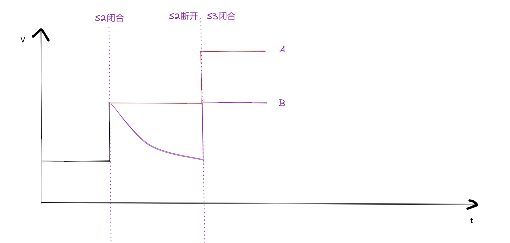

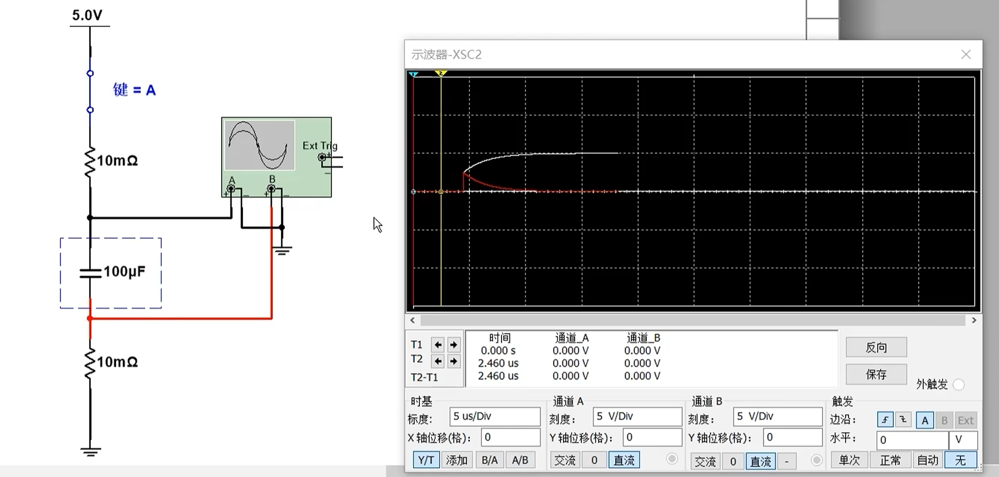

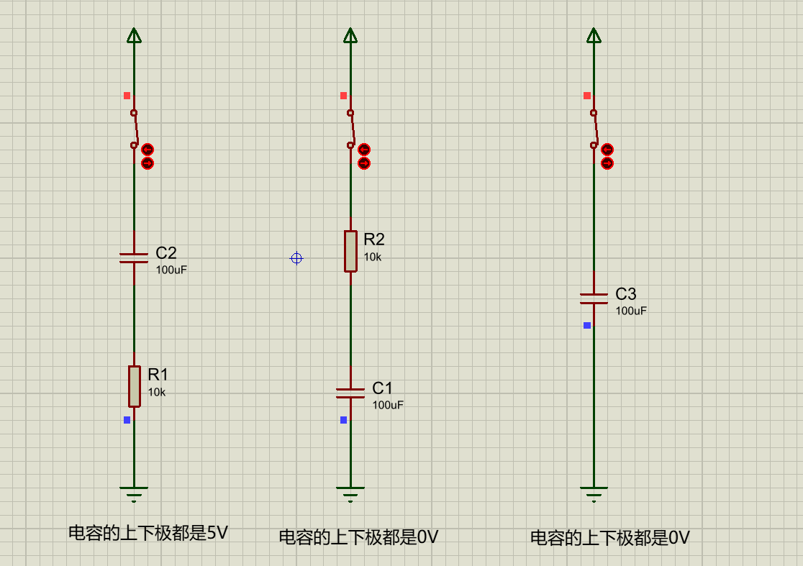

## 电容的储能特性

电容可以简单理解成一个小电池

电容的充电速度与电容大小以及充电电流有关

电容的充电时间常数：$\tau=R*C$

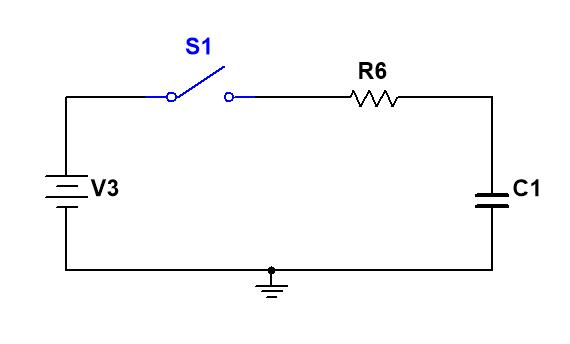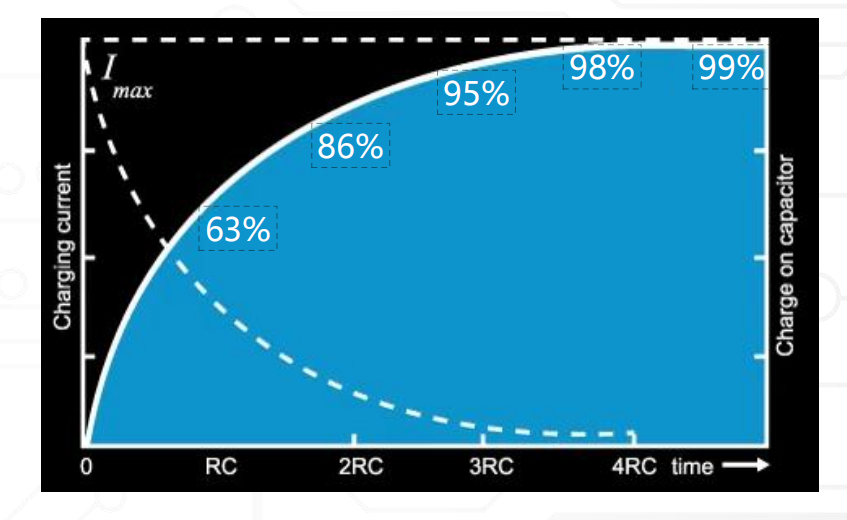

## 利用电容的储能特性可以实现关断延时

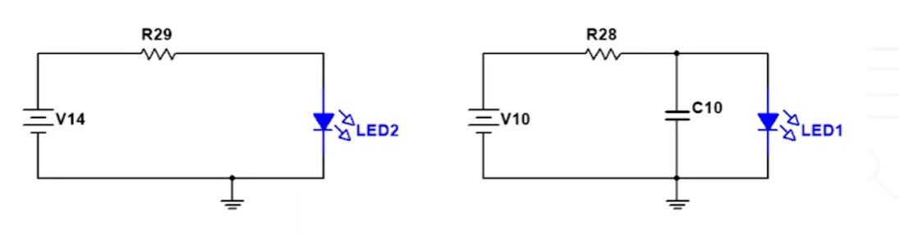

> 第一个图是很快会亮，很快熄灭；
>
> 第二个图是很快会亮，慢慢的熄灭；（在开关闭合的一瞬间，电容导通，此时对于二极管来说已经是短路了，然后对电容进行了一个充电，充电时间很快，相当于断路，二极管是慢慢亮的，时间很短，肉眼看不出来）

## 电容稳定电压的作用（滤波）

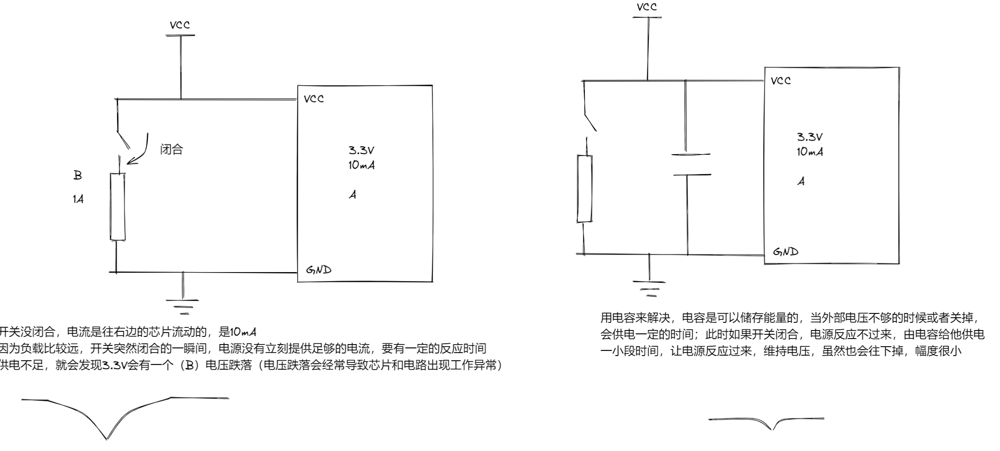

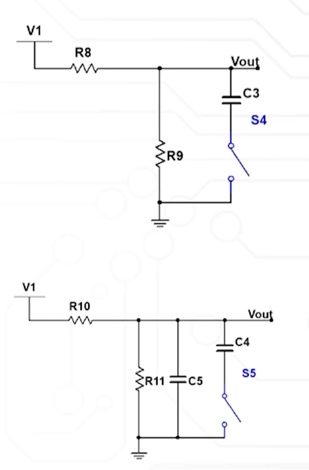

> 图1：$R_8=1K$ $R_{9}=1K$ $V_1=3.3V$​​ 
>
> $R_9$ 分到电压$1.65V$，一开始的电容是没有能量的，如果开关闭合，$C3$电容接电瞬间相当于短路，$V_{out}$ 会跌倒0（速度很快），之后会缓慢上升
>
> 图2： $R_{10}=1K$ $R_{11}=1K$ $V_1=3.3V$​ 
>
> $R_9$ 分到电压$1.65V$，一开始的电容是没有能量的，如果开关闭合，$C4$电容接电瞬间相当于短路，$C5$给$C4$供电，$V_{out}$电压跌落会很小
>
> 注意：如果想要进行一个仿真，那么把开关放到电容前面

## 电容的容抗计算公式

电容在频率越高时，阻抗越小，频率越低，阻抗越大

$R_C=\frac{1}{2 \pi fc}$​

> 频率越高，$R_C$越小，$R_{总}$越小，电流越大

> “隔直通交，通高频阻低频”：交流电充电方向来回变，导致电容循环充放电。频率高充放电更快，则通过的更快，显得阻力小。

## 低通滤波电路原理及作用

**低通滤波电路可以让“低频”的信号通过，衰减“高频”的信号**

**低通滤波电路有以上作用是利用了电容充放电特性实现的。**

> 低通滤波电路输出的电压是电容两端的电压

截止频率$f_t=\frac{1}{2 \pi RC}$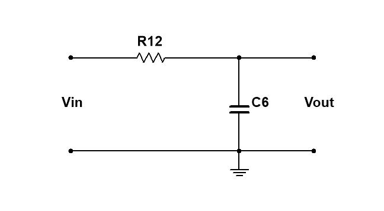

> $V_{in}$输出信号的频率等于截止频率$f_t$​, 会衰减-3dB（衰减自己的0.707倍）==有一定的相位差==
>
> - 假如峰值为+1/-1，$V_{in}$输出信号的频率等于截止频率$f_t$，那么它的峰值变为+0.707/-0.707（$有效值 = \frac{峰值}{ \sqrt{2} }$​​）
> - 意思是频率增高，然后根据容抗的计算公式，容抗会减小，那么电容的分压就减小了，所以测的示波器的电压就会小
> - 此时的电容可以看作电阻，算出对应容抗，让外加电阻和容抗一样，就会衰减一半分压-3db，而交流分压和直流不一样，否则是电压的一半

> 高频信号：电容容抗小，高频信号被电容直接短路到地，无法到输出端

> 低频信号：电容容抗大，无法讲低频信号短路到地，信号顺利从输出端输出

> 高频信号的频率高，那么容抗就小，电容几乎像短路一样，允许高频信号通过电容流向地，绕过电阻，这也就是高频信号被衰减的原因（频率不同，能流入地的信号也不同，衰减就不同）；相反低频信号容抗大，大部分信号就不会从电容流走，而选择阻值更低电阻，更容易通过。

## 低通滤波电路的本质原理

电阻分压原理的理解：意思是频率增高，然后根据容抗的计算公式，容抗会减小，那么电容的分压就减小了，所以测的示波器的电压就会小

电容的充放电时间的理解：电容两端的电压是不能突变的，电容充放电是有一定的时间$\tau=R*C$，跟$R和C$有关，$R和C$确定了，电容的充放电速度就是固定的状态

**直流信号**

> 1. 电容充电，电压慢慢往上升，到最后电容电压一定等于电源电压
>
> ==如果是交流电，那就不一定了==

**交流信号**

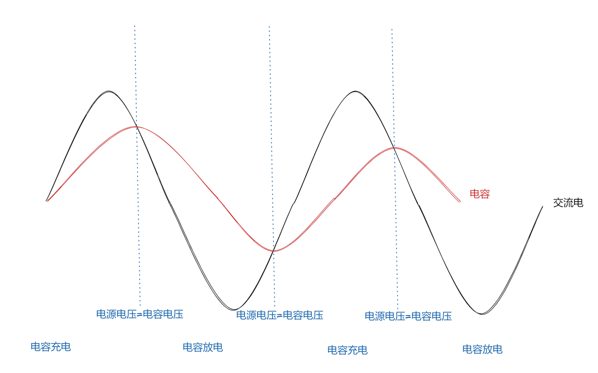

> 交流电频率远远快于电容的充电电的速度（电容充电速度跟不上交流电的变化的速度），会衰减

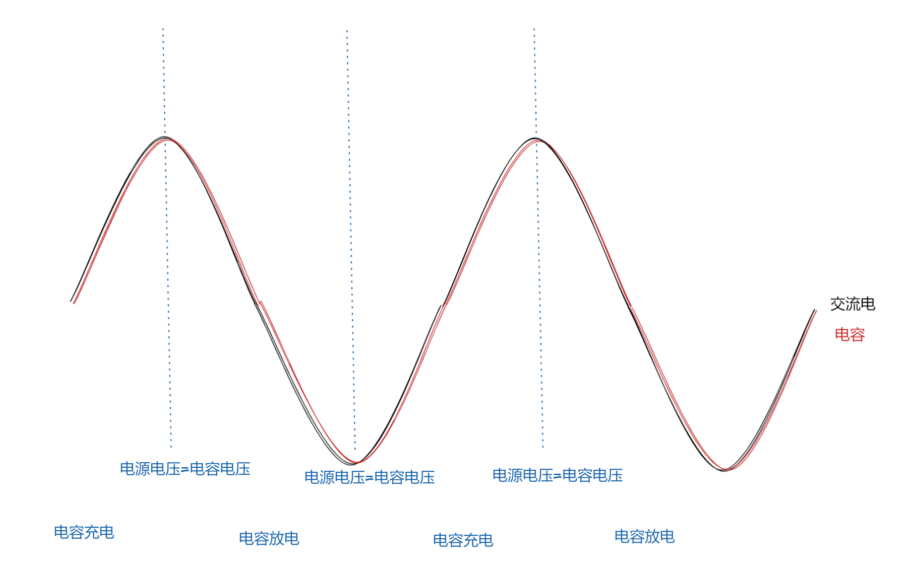

> 交流电频率很低（电容充电速度跟得上交流电的变化的速度），就基本一致

## 高通滤波电路原理及作用

==高通滤波电路可以让“高频”的信号通过，衰减“低频”的信号==

$f_t=\frac{1}{2 \pi RC}$

> 高通滤波电路输出的是电阻两端的电压（$V_R=V_{vin}-V_C$）
>
> 电阻分压原理的理解：意思是频率增高，然后根据容抗的计算公式，容抗会减小，那么电容的分压就减小了，电阻的分压就增大了

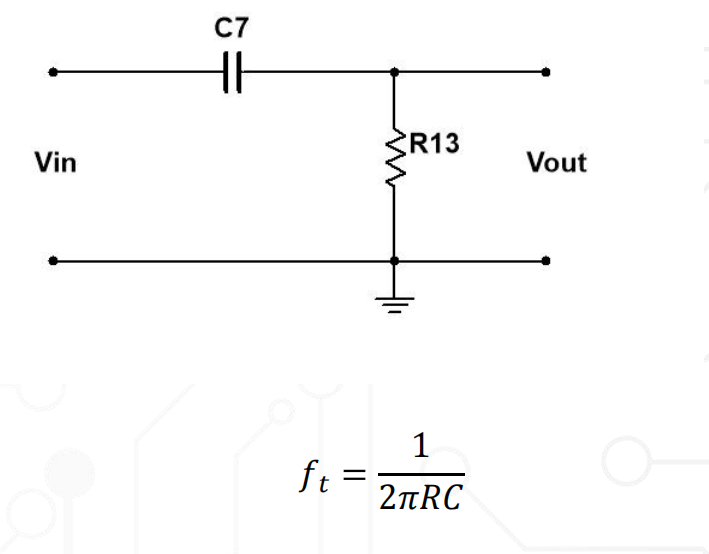

> 高频和低频是相对的概念，RC电路构成的高通截止频率是1K，当你的输出信号大于1K就是相对于这个RC电路就是比较高的频率，那就可以通过

> 低频被电阻过滤掉了，剩下高频了

> $V_{in}$输出信号的频率等于截止频率$f_t$, 会衰减-3dB（衰减自己的0.707倍）
>
> - 低于$f_t$的频率衰减
> - 高于$f_t$的频率通过

**作用**

- 工频干扰（低频的干扰）
- 如果是共模，那就用共模的滤波（共模高频滤波）的办法

# 电感

## 电感是什么

电感定义：是能够把电能转化为磁能而存储起来的元件。

电感（Inductor）：通常用字母“$L$”表示电感的单位是亨利，简称亨，符号是$H$，常用的电感单位有亨（$H$）、毫亨（$mH$）、微法（$\mu H$），换算关系是：$1H=1000mH；1mH=1000 \mu H$；

==实际的电子产品应用中，根据电感“通直流，隔交流”的特性，在电路中所起的作用主要是滤波，扼流，谐振，储能。==

$u=L\frac{di}{dt}$​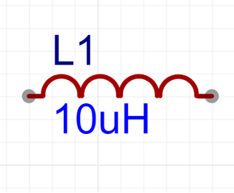

> 电感就是一根导线加一个磁性材料
>
> 生活中，所有由线圈组成的器件，都是电感

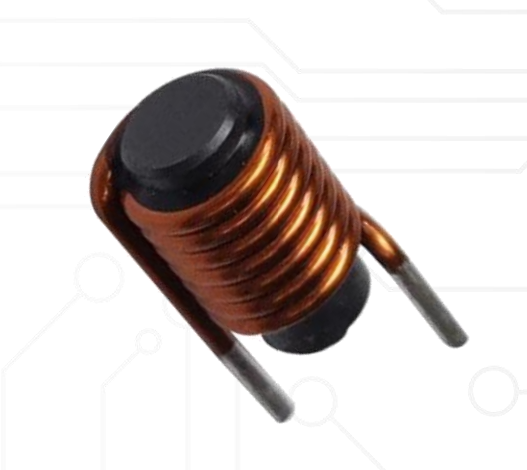

> 一个线圈就是一个电感(任何导线都有一个电感特性)
>
> 磁性材料：增加电感/控制电感

### 电子元件

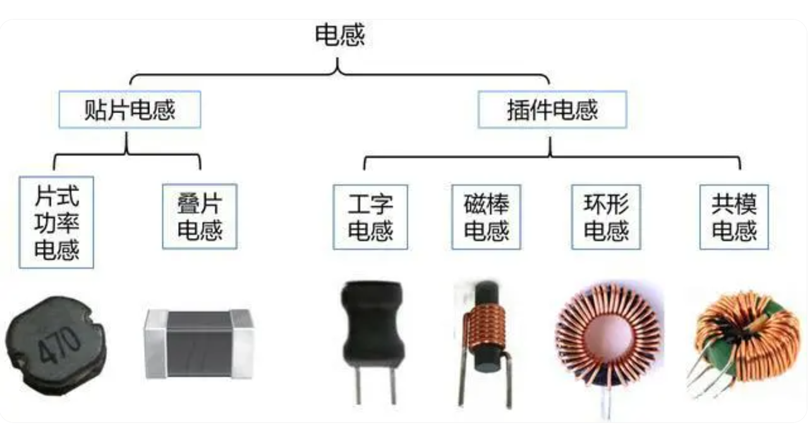

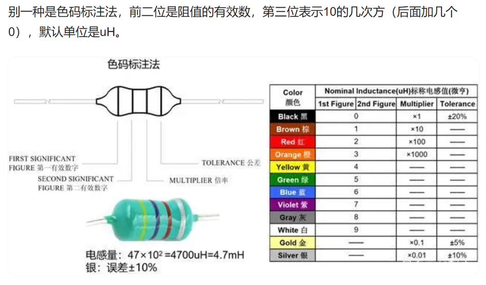

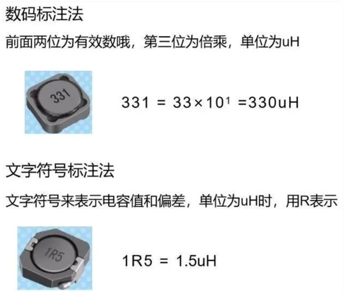

## 电感的基本特性

==流过电感的电流不能突变==

**直上直下**

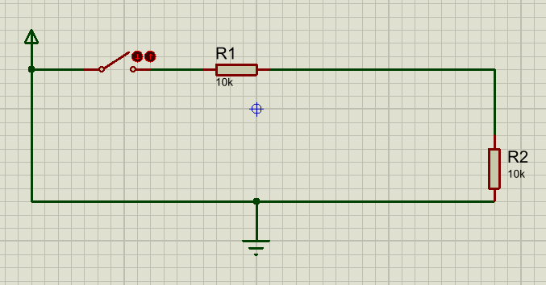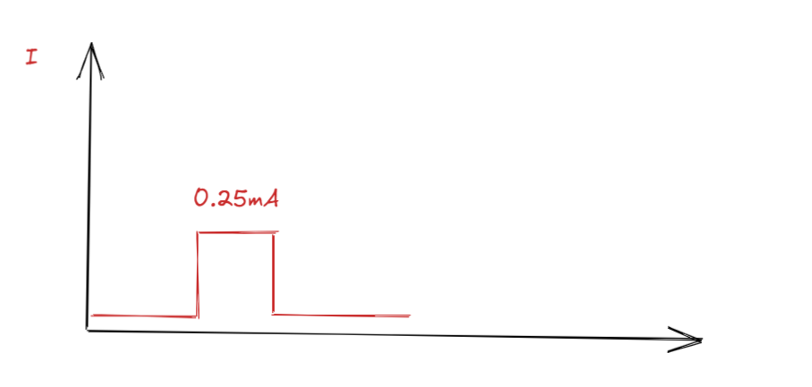

> 开关闭合，电流会立刻从$0A$到$0.25A$
>
> 开关断开，电流会立刻从$0.25A$到$0A$​

**缓冲**

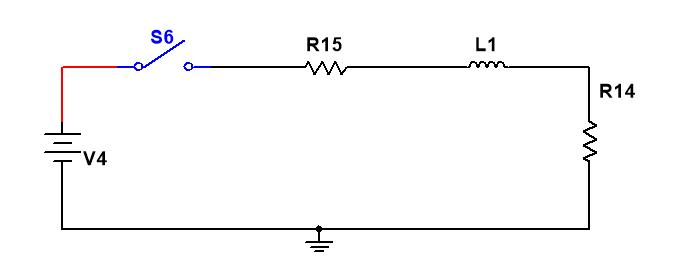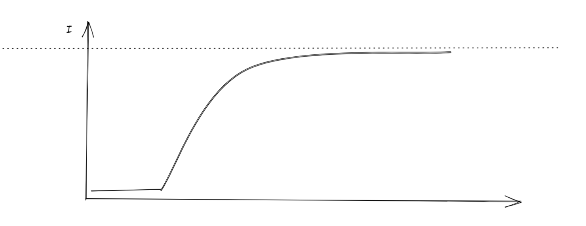

> 电感会把电流的上升速度抑制住，下降的电流同样也如此
>
> 电感上电瞬间相当于一个断路，因此从0开始

## 电感只能限制电流的变化速度

==常见电路中，电感只能改变电路中的电流变化速度，但是不能改变电路的电流最大值==

> 直流电流
>
> 电感抑制电流的原理是线圈的构造产生磁场，磁场在抑制电流的变化，其本质还是一段导线；

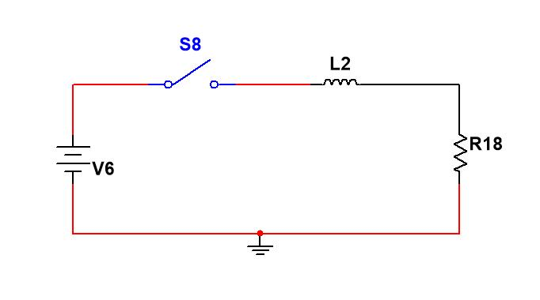

## 电感回路的电阻突然变很大会怎样

==电感流过电流时，如果电感回路的电阻突变变得很大，电感会感生出一个很高的电压，此时容易击穿器件，所以应用电感时，必须要考虑电感的续流回路==

> 把开关$S8$进行闭合，电流从$0$慢慢到$I_A$但是如果突然断开的话，因为电感不能突变（上升/下降过程不能突变），电感的回路没有了，电感的电流还在$I_A$，虽然回路断开了，但是电感会强制性的让回路流过电流，时电感电流降到$0$​​,，存储到断开的开关两边，开关的两端有高压（很容易达到几百伏-击穿空气）
>
> 我觉得可以这么理解，存储的载流子很多，开关断开之后L左侧载流子全部排放到S右侧，L右侧（开关左侧）载流子流入大地，便会形成一个巨大的电势差，就形成了一个很大的电压
>
> 同样的如果这个开关处有一个器件，如果这个器件的阻值很大，容易击穿器件（假设有$10K$的电阻，如果有电流是$500mA$,那么产生的电压$50KA$）

解决：加一个二极管，造一个新的回路，避免产生高压，但是二极管那里还是有一定的压差（二极管的特性）

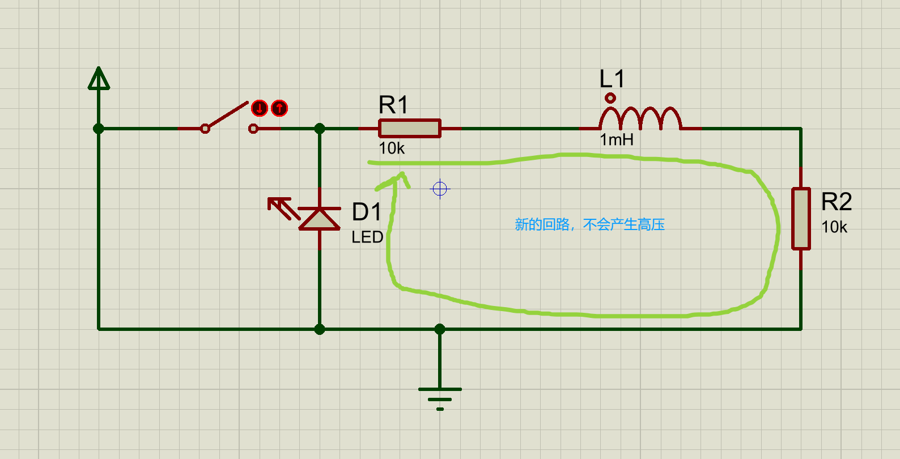

## 电感的感抗计算公式

==电感在频率越高时，阻抗越大，频率越低时，阻抗越小。==

==$R_L=2 \pi fL$==

> 电感：不损耗的器件
>
> 交流电有频率，直流电频率为0

## 电感的低通滤波原理

==低通滤波电路可以让低频的信号流过，衰减高频信号==

==截止频率计算：$f_t=\frac{R}{2 \pi L}$==

利用了电感电流不能突变的特性

> 高频率：电感电流的上升速度和下降速度跟不上频率的变化
>
> 低频率：电感电流的上升速度和下降速度跟得上频率的变化

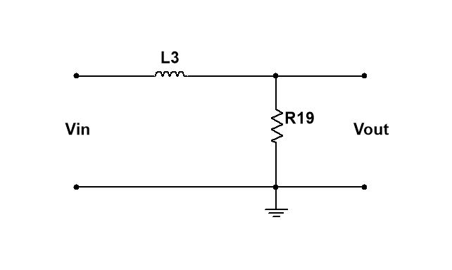

> $V_{in}$输出信号的频率等于截止频率$f_t$​, 会衰减-3dB（衰减自己的0.707倍），但是有一定的==相位差==
>
> 阻抗分压来解释：
>
> - $V_{out}在这个电路中就是电阻$$R_{19}$上面的电压
> - $V_{out}=\frac{R_{19}}{R_L+R_{19}}V_{in} = \frac{R_{19}}{2 \pi fL+R_{19}}V_{in}$​
> - 输入频率越低变化越快，电感抑制作用越大，电流变化与输入变化偏差越大，$R$上的电压也与输入偏差越大
> - 反之输入频率越低变化越慢，电感抑制作用越小，电流变化与输入变化越接近，$R$上的电压也与输入越接近

> 应用场景
>
> - 电容低通滤波（RC）：因为电阻是耗能器件（只要有电流流过电阻，电阻就会发热，电阻是会耗能的），因此一般适用于电流很小的电路，主要就是滤除一些信号传输的场景
> - 电感低频滤波（LR）：适用于电流比较大的电路，电感是不损耗能量的，主要是电源线上的滤波
> - $RC$的$V_{out}$是经过$R$之后的，$LR$的还没经过，也就是说$LR$的$R$可以代表实际电路中，之后用到的元器件的阻值，而$RC$​的已经是消耗过后的，可能是这个意思，输入的大电流先经过电感不会耗能，然后电路分流，分别到电阻和后面输出，此时流过电阻的电流就会小一些，耗能少。如果先流过电阻，再分流到输出耗能就太大了

## 电感的高通滤波原理

==高通滤波电路可以让高频的信号流过，衰减低频信号==

==截止频率计算：$f_t=\frac{R}{2 \pi L}$==

> 电阻分压原理的理解：意思是频率增高，然后根据感抗的计算公式，感抗会增大，那么电感的分压就增大了，电感的分压就增大了

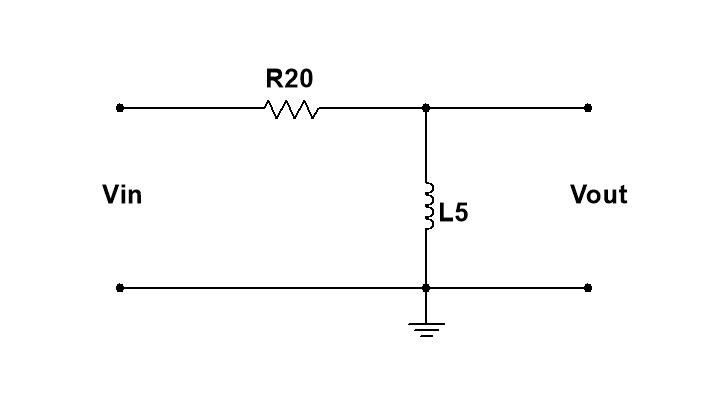

> **高频信号**：电感感抗 $R_L$ 远大于电阻阻抗$R$，电感分压占比极大，电阻两端可获得大部分信号电压，高频信号能顺利传输至输出端。
>
> **低频信号**：电感感抗 $R_L$ 远小于电阻阻抗$R$，电感相当于 “低阻通路”，大部分低频信号会被电感分流到地，电阻两端的信号电压被大幅衰减。

> 注意：
>
> - 这一个输出，是以电感作为输出的，在里面会发生电感是接地的，意味着电感滤除信号的时候，电路中不存在一些直流偏置的
>
> - 标准的正弦波（+1/-1），基准电压是$0V$,这一种信号是可以正常工作的；有一些信号的基准电压是$2V$（+3/+1），有$2V$的偏置，叠加了$2V$的直流信号上面，$2V$的直流信号是不能过滤掉的（因为是一个偏置信号，不是噪声，是固有存在的），但是$LR$会过滤掉偏置的$2V$(这个$2V$​是我们想要的)
> - ==就是有直流偏置的，用电容的高频滤波==

==滤除直流偏置：$RC$,$RL$高通滤波电路；保留直流偏置：$RC$,$RL$低通滤波电路==

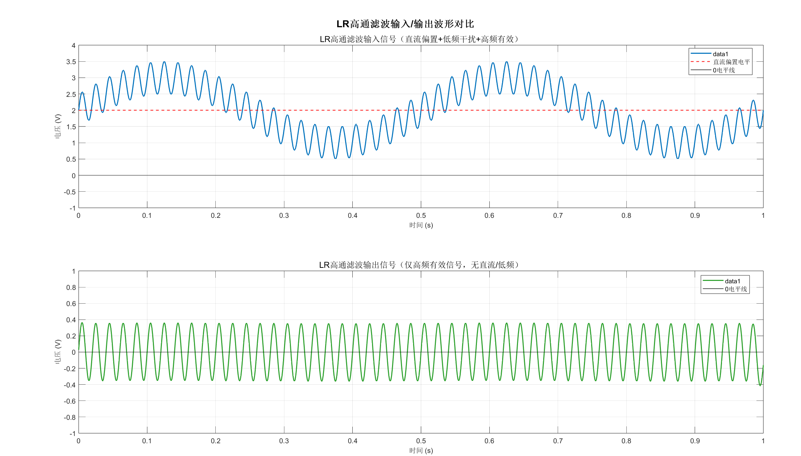

## LC低通滤波原理

==LC低通滤波电路比RC低通滤波、LR低通滤波电路的滤波效果更好==

> 阻抗分压解释：
>
> - $LC$:$V_{out}=\frac{R_C}{R_C+R_L}V_{in}$​
> - $RC$:$V_{out}=\frac{R_C}{R_C+R_21}V_{in}$
>
> 如果输入频率发生变化的时候
>
> - $RC$阻抗会发生变化的一个参数只有电容一个，如果$f$变大$R_c$会减小，电压就会下降
> - $LC$阻抗会发生变化的一个参数有电容和电感，如果$f$变大$R_C$减小，$R_L$变大，变化量会更大，因此$LC$低通滤波电路它的衰减速度，随着频率的升高，衰减速度是更快的

谐振/振荡频率$f_t = \frac{1}{2 \pi \sqrt{LC}}$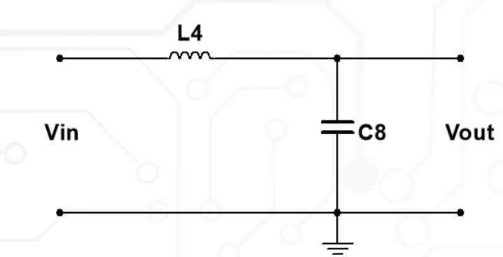

截止频率$f_t = \frac{1}{2 \pi RC}$​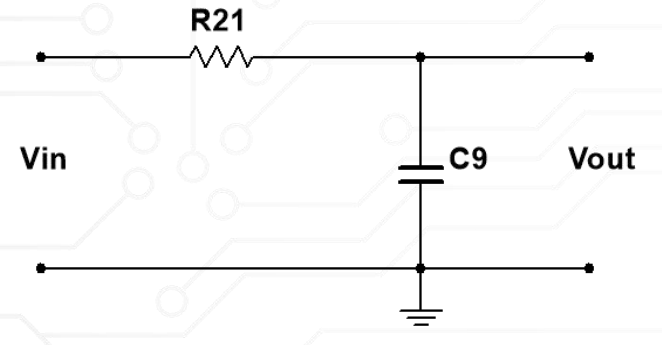

# 二极管

## 基本结构

==二极管的结构就是一个PN节，导通后肯定会存在压降（硅管≈0.7V；锗管≈0.3V==

==其结构就像一个漏斗结构，普通二极管只能单向导通==

==注意：二极管两端不能直接接大于二极管导通压降的电压，否则电流会很大，烧毁二极管==

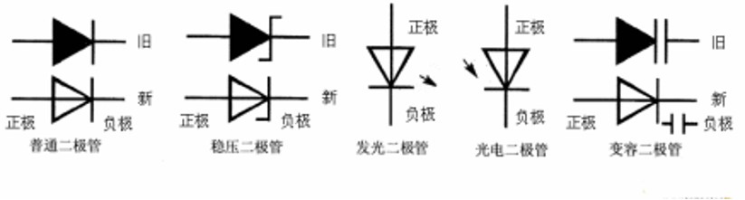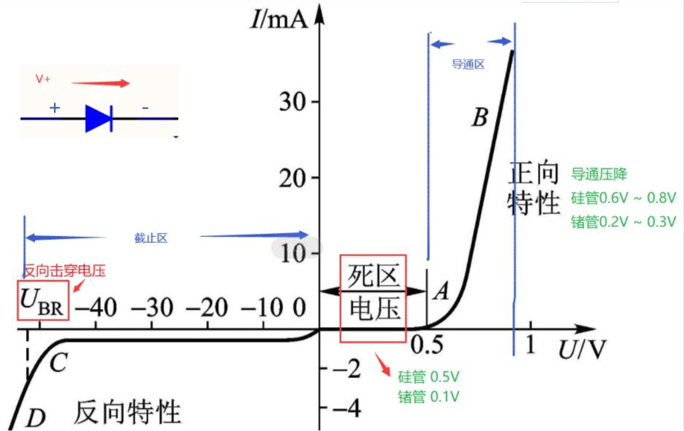

二极管的导通压降（如硅管0.7V）是**PN结内建电场的势垒电压**，是载流子（电子/空穴）克服内建电场、形成显著导通电流的**最低电压阈值**。当外加正向电压**超过**这一阈值后，二极管进入**导通状态**，此时：

- 外加电压的“超额部分”（5V - 0.7V = 4.3V）会**全部加在串联的电阻、负载或导线上**（若电路中存在电阻），而非二极管本身。
- 二极管的压降会**稳定在0.7V左右**，仅随电流、温度有微小变化（如电流增大时压降可能升至0.8V，但不会随外加电压成比例增加）。

二极管的**导通压降**（正向压降）是指二极管正向偏置时，阳极与阴极之间需要施加的**最低电压**，以使其开始显著导通电流

当施加5V/10V正向电压时，二极管的导通压降仍为**0.7V左右**（以硅二极管为例）

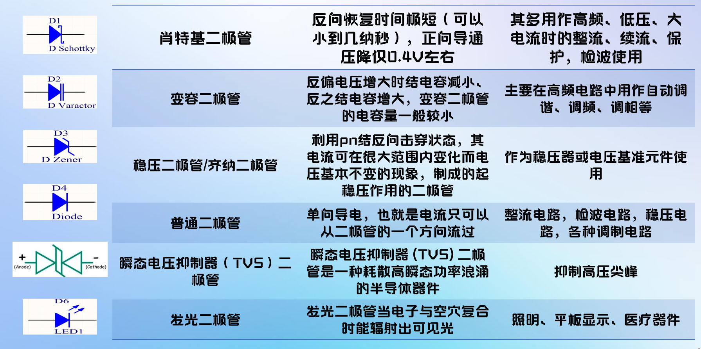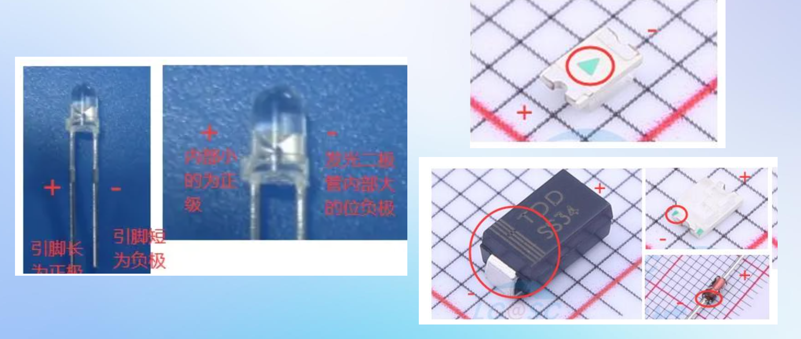

## 单向导通

==二极管具有单向导电性能，导通时电流方向是由阳极通过管子流向阴极==

## 漏电特性

==二极管反向截止并不代表完全关断，其实会有微弱的漏电流，其中肖特基二极管的漏电流会比较大==

## 整流功能

==二极管的整流功能（峰值检波功能）==

> 可以把交流电变为一个直流电
>
> 

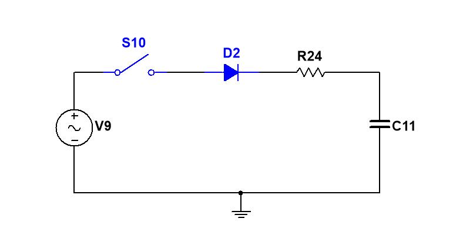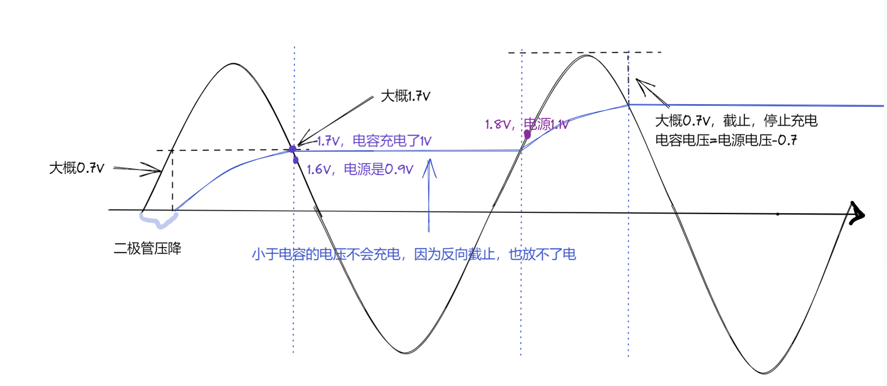

> 电阻：限制电容充电速度

## 全波整流工作原理

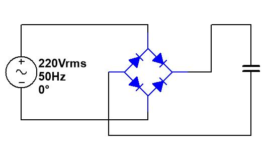

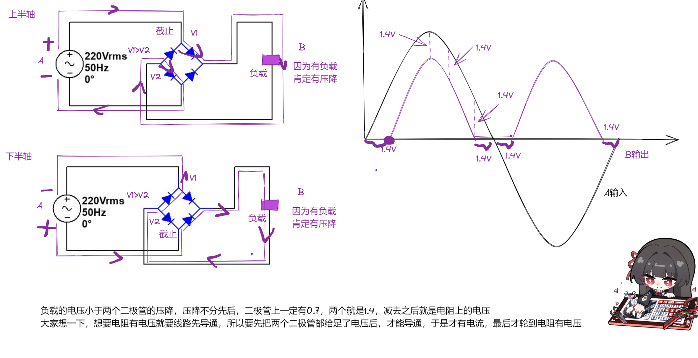

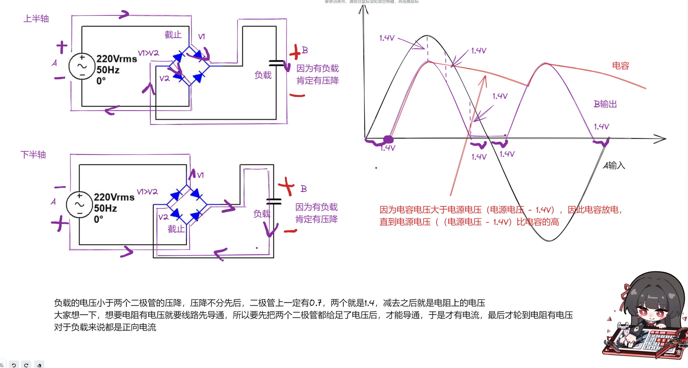

## 二极管的钳位功能

==二极管的钳位功能（串联没有钳位）==

==利用二极管的导通电压特性，可以实现对信号线进行钳位==

二极管的压降会**稳定在0.7V左右**，仅随电流、温度有微小变化（如电流增大时压降可能升至0.8V，但不会随外加电压成比例增加）

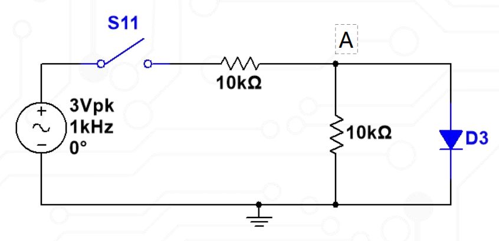

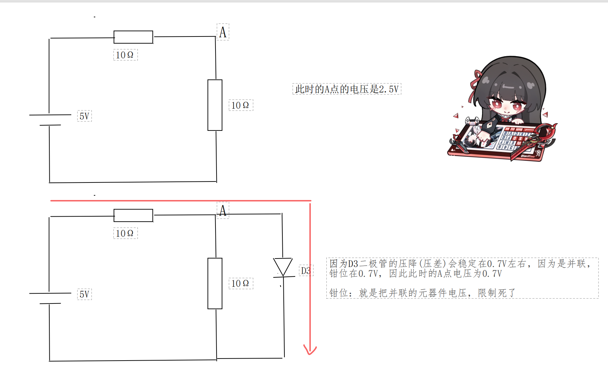

> 前提：
>
> 1. 两个电阻的分压要大于二极管的导通压降
>
> 作用：
>
> 1. 做电路的防护

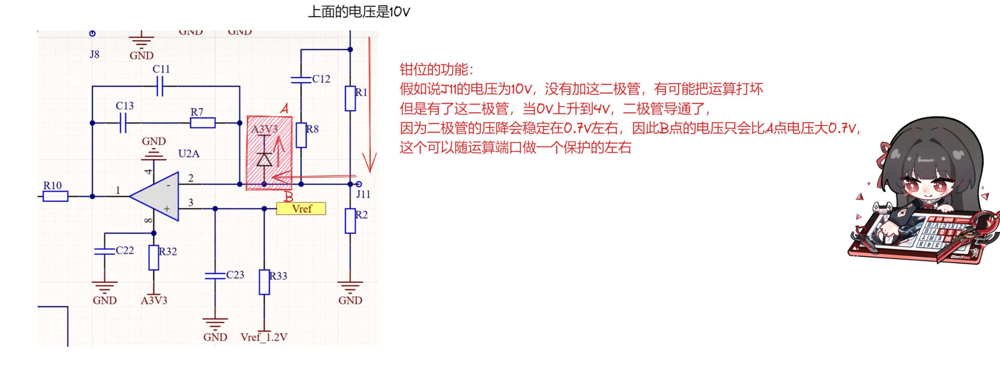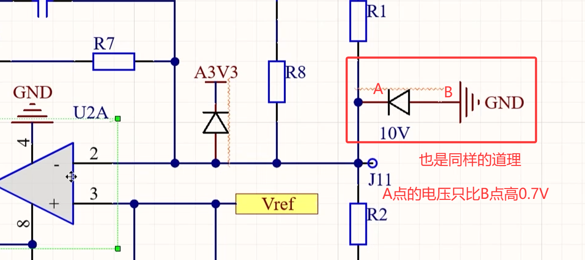

## 二极管控制电路的电流方向

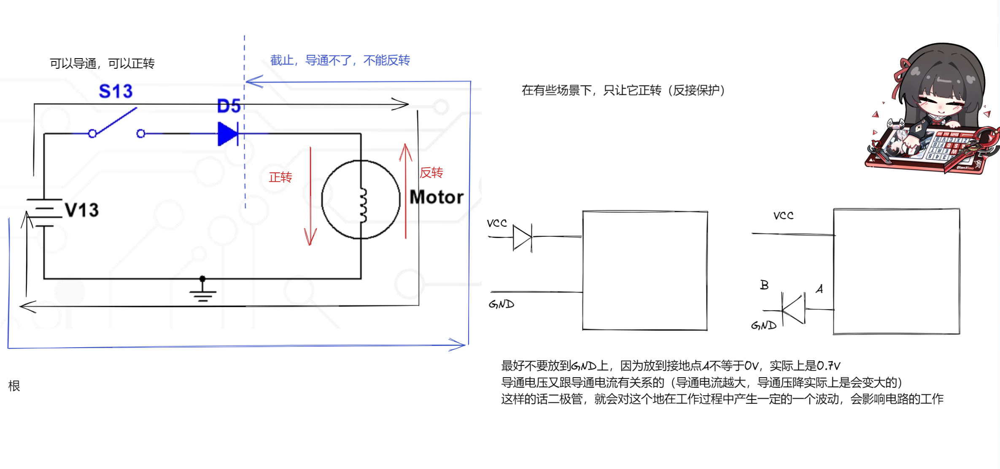

## 二极管的最大反向耐压

==二极管承受反向电压时会自动截止，但是每一个二极管都有最大反向耐压值==

店家标记的最大反向耐压是有一定的余量

## 稳压二极管的基本功能

==稳压二极管是工作在反向击穿状态，当其发生反向击穿时，稳压二极管两端的电压会保持在某个电压值==

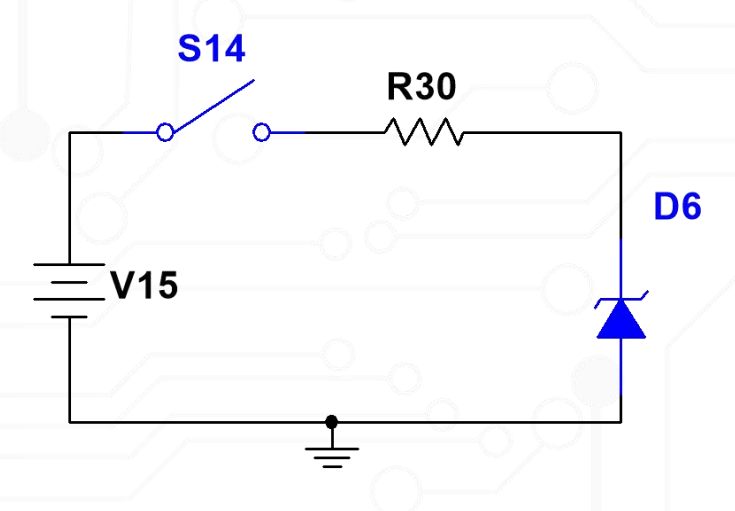

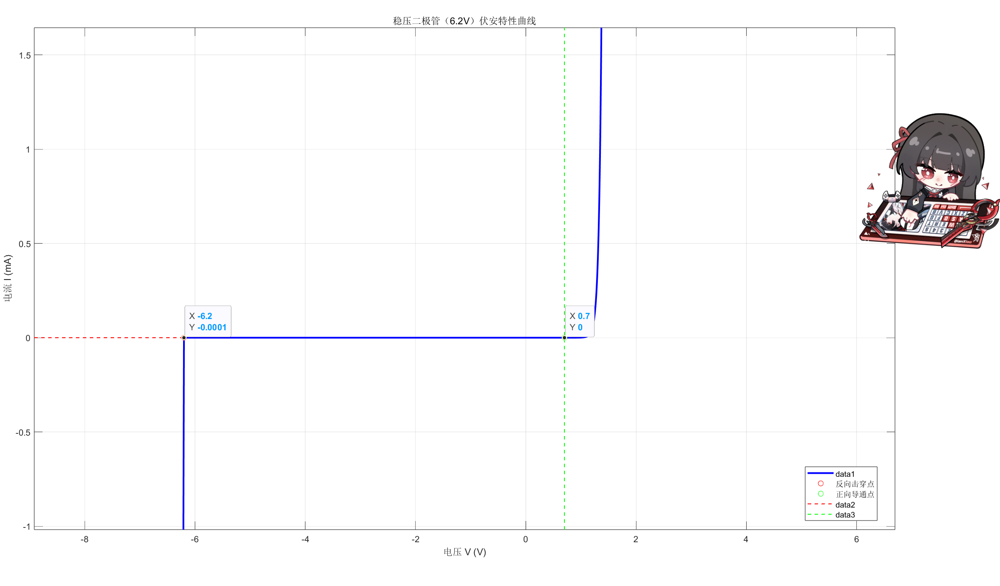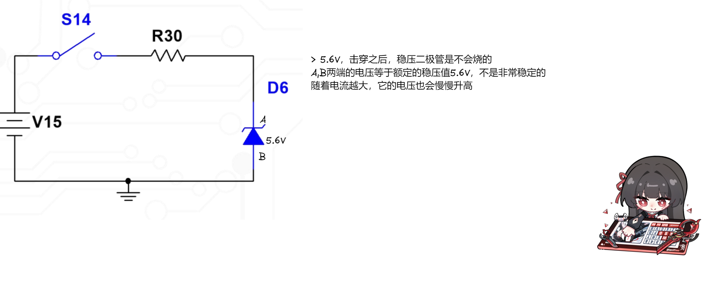

> 重点理解：
>
> 1. 反向击穿之后，相当于钳位作用
>
> 注意：
>
> - 稳压管击穿之后，电流是有限的，反向击穿之后，有一个$5.6V$的压降（不同稳压管，它的稳压值不一样），流过电流$i$，是有功耗的$P=I*V$，就会发热，当超过额定功率的时候，这时候的稳压管就坏掉了
> - 用稳压管做稳压的时候，一定要注意稳压电流，一定不能够太大，也不要太小（没那么稳定），建议在$5mA$​作用（大部分）
> - 现有电流，后有电压
