# 三极管

> 前提：
>
> [三极管入门]()
>
> [三极管的工作原理详解，图文+案例_三极管工作原理-CSDN博客](https://blog.csdn.net/weixin_44161807/article/details/130286668?ops_request_misc=elastic_search_misc&request_id=2c173113287a5a38306eacc17e2ef7b2&biz_id=0&utm_medium=distribute.pc_search_result.none-task-blog-2~all~top_positive~default-1-130286668-null-null.142^v102^pc_search_result_base1&utm_term=三极管&spm=1018.2226.3001.4187)

## 基本结构

> 三极管也有有压降的

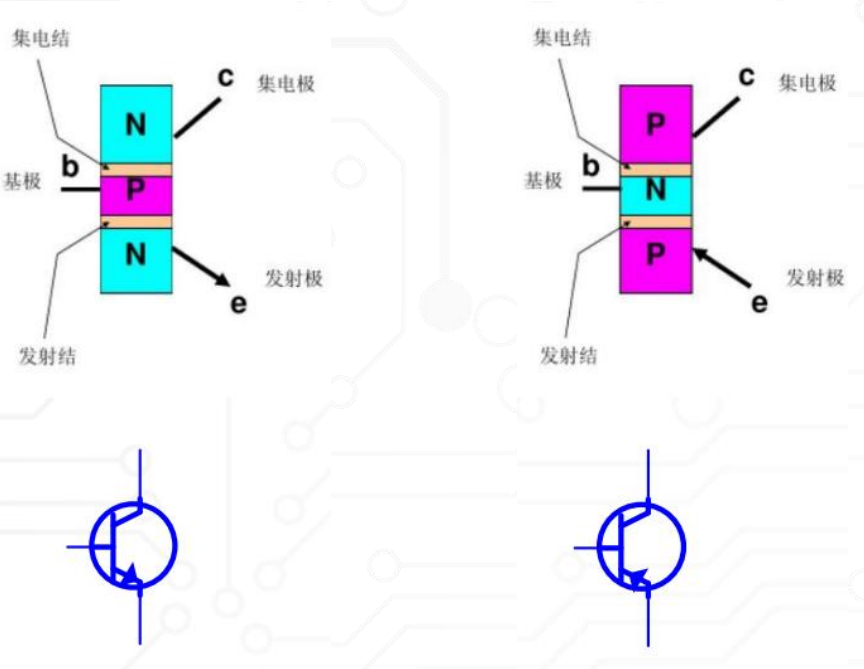

## 开关功能

==三极管可以当成电子开关来使用==

==也可以做放大信号==

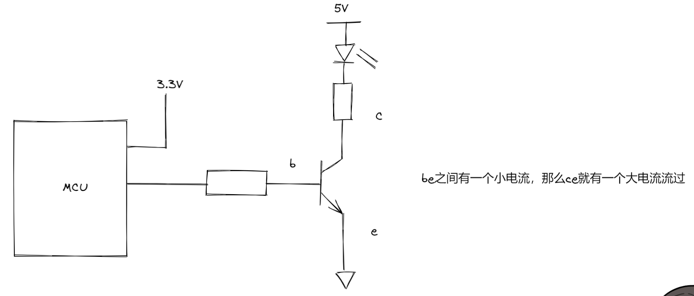

## 开关电路设计注意事项

==理想的开关只有“开”和“关”两种状态，但是三极管不是一个理想的开关，它有“似开不开、似关不关”的第三种状态（放大）==

 三极管的3种工作状态：分别是**截止状态**、**放大状态**、**饱和状态**。

==$I_C = \beta I_B$==  

==$I_e = I_C + I_B$==

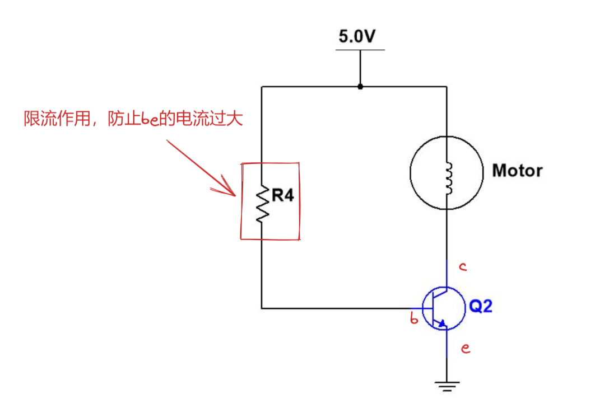

**电压的角度**
$$
V_{ce} = V_{cc} 断开（截止）状态\\
V_{ce}\leq0.3V 饱和导通状态\\
0.3<V_{ce}<V_{cc} 放大状态
$$
**电流的角度**

$$
I_C = \beta I_B\\
I_B = 0 断开（截止）状态\\
I_B\beta>I_C 饱和状态\\
I_B\beta=I_C 放大状态
$$

1. 找出$I_C$最大值（查找数据手册，产品信息）=> $I_C=500mA$

   $I_B\beta>500mA \rightarrow I_B>\frac{500mA}{\beta}, \beta默认是100 \rightarrow I_B>5mA$

2. $I_B=\frac{V_{cc}-V_{be}}{R_4} \rightarrow R_4=\frac{V_{cc}-V_{be}}{I_B} = \frac{5V-0.7V}{5mA} = 0.86K\Omega(最大值)$

## P型三极管开关电路设计注意事项

==当三极管用作开关时，通常N型三极管控制负载的gnd端，P型三极管控制负载的Vcc端==

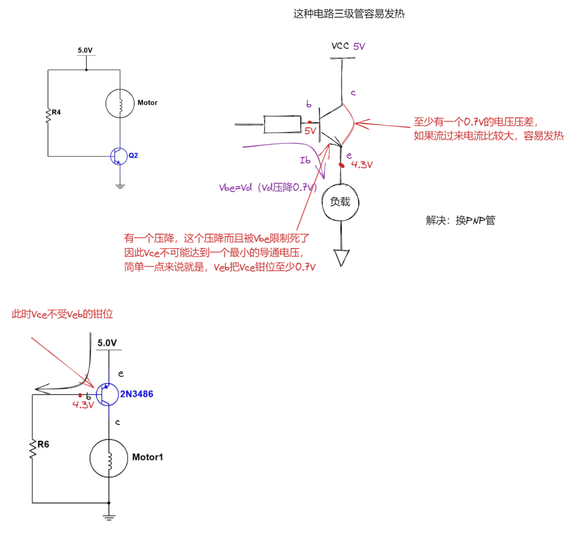

**一、原 NPN 电路的发热根源：无法进入 “低耗饱和区”**

从图中电路看，这是**NPN 三极管的 “发射极带负载” 结构**，但偏置条件错了，导致三极管始终处于**高耗的放大区**：

- NPN 的正偏要求：$V_B>V_E（V_{BE}=0.7V）$，所以图中$V_E=V_B−0.7=5−0.7=4.3V$。
- 但 NPN 饱和区的要求是**集电结正偏**（$V_B>V_C$），而图中$V_C=V_{CC}=5V、V_B=5V，所以V_B=V_C$（集电结零偏，不是正偏）。

→ 此时三极管处于**放大区**，$V_{CE}=V_C−V_E=5−4.3=0.7V$（远大于饱和压降$V_{CE(sat)}≈0.3V$）。

管耗$P_T=V_{CE}⋅I_C$，$V_{CE}$没降到 “低耗饱和值”，若$I_C$​较大，管耗会急剧升高→发热。

---

**二、PNP 三极管如何解决：利用 “Ve>Vb” 的偏置特性，轻松进入饱和区**

PNP 的核心偏置规则是 **$V_E>V_B>V_C$**（与 NPN 相反），搭配电路结构调整后，能让三极管进入 “低耗饱和区”：

**1. PNP 的电路结构调整（对应原负载场景）**

通常会把 PNP 的**发射极接电源 VCC（5V）**，**集电极接负载到地**，**基极接低于 VCC 的电压**（比如原电路的 “5V 输入” 需调整为 “4.3V 输入”）：

- 发射结正偏：$V_E−V_B=0.7V$（符合 PNP 正偏要求），即$V_B=V_E−0.7=5−0.7=4.3V$。
- 集电结正偏：$V_B>V_C$（集电极接地，$V_C=0V$），显然$4.3V>0V$，满足饱和区条件。

**2. PNP 饱和后的低耗特性**

当 PNP 进入饱和区时：

- 饱和压降$V_{CE(sat)}≈−0.3V$（绝对值仅 0.3V，远小于原 NPN 的 0.7V）。
- 管耗$P_T=∣V_{CE(sat)}∣⋅I_C$，因$∣V_{CE(sat)}∣$极小，即使$I_C$较大，管耗也会很低→不会发热。

---

**核心差异总结**

|   对比项   |  原 NPN 电路（发射极带负载）  | 换 PNP 后的电路（集电极带负载） |
| :--------: | :---------------------------: | :-----------------------------: |
| 发射结偏置 | $V_B>V_E$（满足，但限制了VE） |  $V_E>V_B$（满足，且VE接电源）  |
| 集电结偏置 |  $V_B=V_E$（零偏，无法饱和）  |   $V_B>V_C$（正偏，轻松饱和）   |
|  VCE压降   |    $0.7V$（放大区，高耗）     |     $≈0.3V$（饱和区，低耗）     |
|    管耗    |            高→发热            |            低→不发热            |

简单说：PNP 的 “发射极电位最高” 的偏置特性，能让三极管轻松进入**低压降、低管耗的饱和区**，完美解决原 NPN 因偏置限制导致的高耗发热问题。

## P型三极管开关的计算方式

> 1. 确定$I_C$的最大值$I_C = 500mA$​
>
>    $I_C = \beta I_B \rightarrow I_B > \frac{500mA}{100} = 5mA$ 
>
> 2. 压降$I_B = \frac{5V-0.7V}{R_6} \rightarrow r_6 = \frac{5V - 0.7V}{R_6} = 860\Omega$
>
>    $860\Omega$是最大值

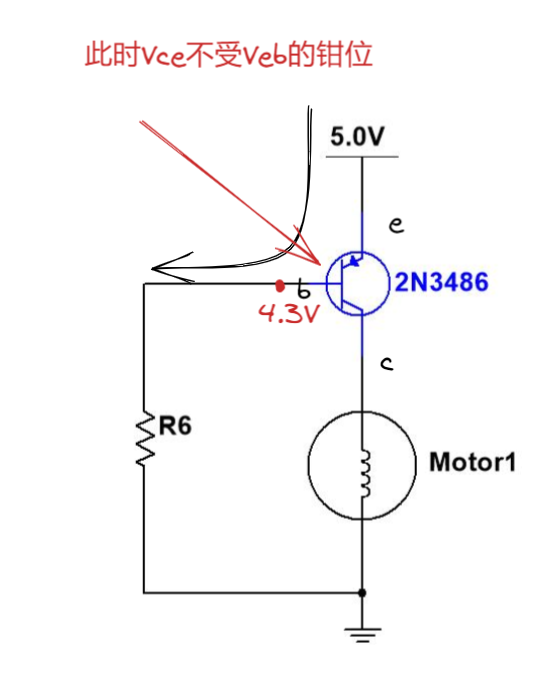

## N型三极管和P型三极管的特性对比

==N型三极管和P型三极管的工作逻辑相反==

==N型三极管控制输出，P型三极管控制输入==

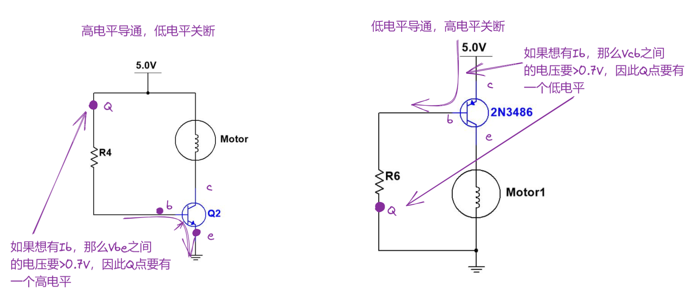

## 三极管的输出反相功能

==三极管集电极信号与输入信号的逻辑相反，所以可以利用三极管对信号进行反相==

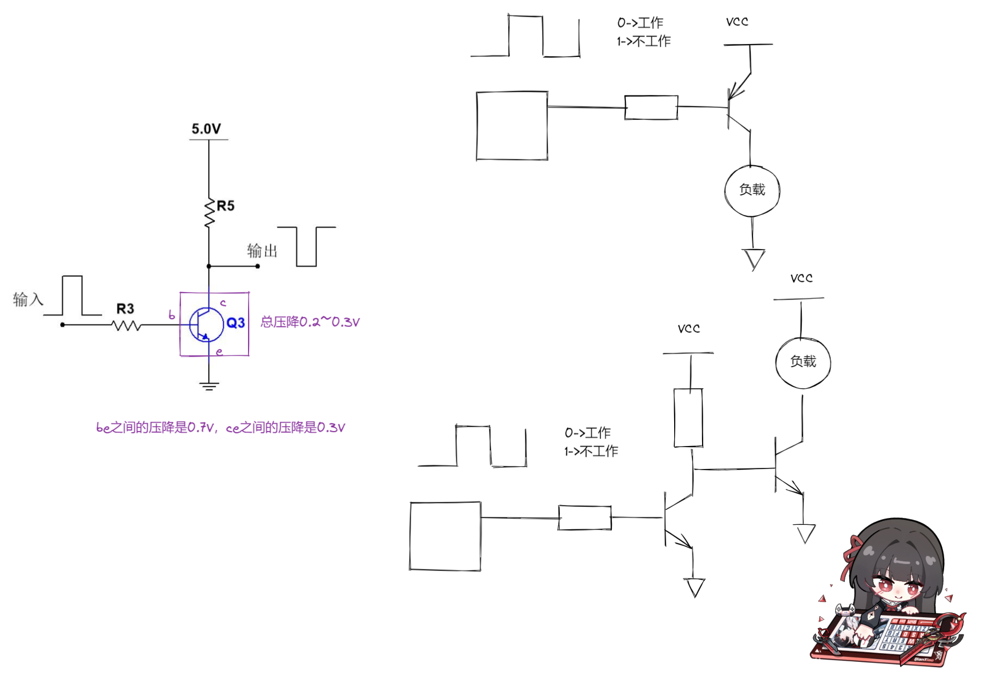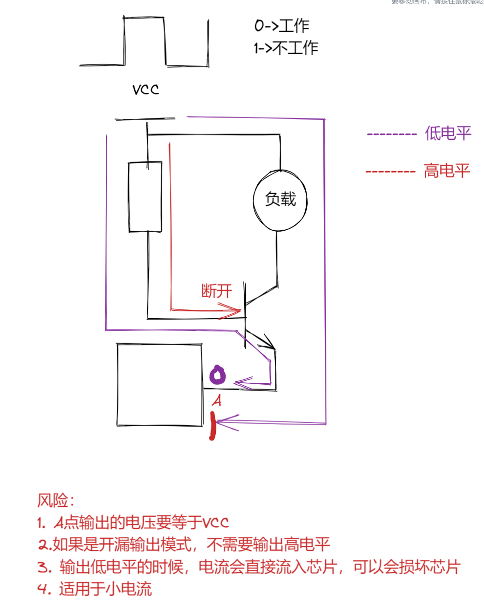

## 三极管的基极下拉电阻的重要性

==给N型三极管的基极加下拉电阻可以改善噪声的干扰==

==N型三极管加下拉电阻，P型三极管加上拉电阻==

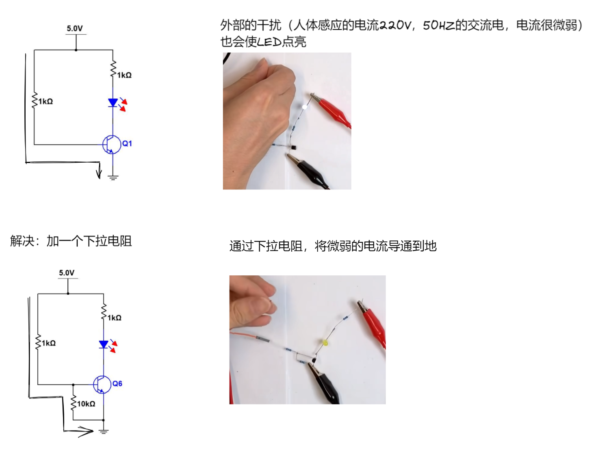

## 三极管的最大耐压

==三极管并不是一个理想开关，每个三极管都有其最大耐压值==

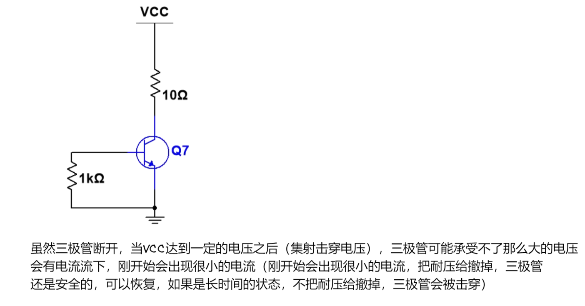

“耐压值”在三极管（双极型晶体管，BJT）上下文中通常指它能承受的最大电压而不发生击穿。常见术语和要点：

$V_{cb} > V_{ce} > V_{eb}$

- 常见的电压标注（datasheet 中的最大额定值）：
  - Vceo：集电极—发射极之间的最大允许电压，基极开路（最常用来表示“耐压”）。
  - Vcbo：集电极—基极之间的最大允许电压，发射极开路。通常比 Vceo 高。
  - Vebo：发射极—基极之间的最大允许电压。
  - Vces（或 Vce(s)：有时给出基极短接时的额定值）等。
- 典型数值范围（仅作参考）：
  - 小信号三极管：大约 20 V、40 V、45 V、60 V、80 V、100 V 等常见档位（例如 2N3904 ≈ 40 V、BC547 ≈ 45 V，TIP 系列为功率管则常见 60–100 V）。
  - 功率三极管 / 高压器件：可达几百伏到上千伏（针对高压开关或特殊用途的器件）。
- 选择与使用建议：
  - 查看器件 datasheet 的 “Maximum Ratings” 中的 Vceo、Vcbo、Vebo。
  - 考虑瞬态电压（浪涌、反向恢复、电感尖峰等），通常对设计留出裕量（常见做法是选择额定耐压 >= 工作电压的 1.5–2 倍，或按项目安全要求更大裕量）。

# 常电电器原理

## 自动出水水龙头工作原理

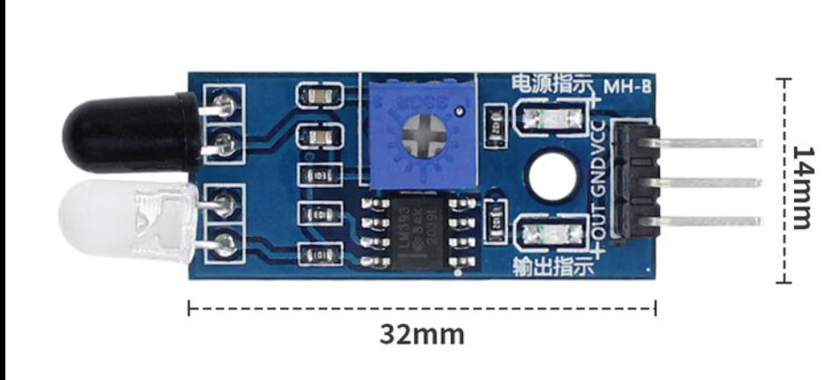

红外避障模块属于**主动式红外传感器**，通过发射特定频率的红外线并检测反射信号来判断障碍物的存在。其工作流程如下：

1. **发射红外线**：模块内置红外发射管（如TCRT5000）持续发射红外线。
2. **反射检测**：当红外线遇到障碍物时，部分光线被反射回接收管。
3. **信号处理**：接收管将光信号转换为电信号，经比较器（如LM339/LM393）处理后输出数字信号（低电平表示检测到障碍物）。
4. **状态指示**：检测到障碍物时，模块上的红色指示灯点亮；电源接通时绿色指示灯常亮。

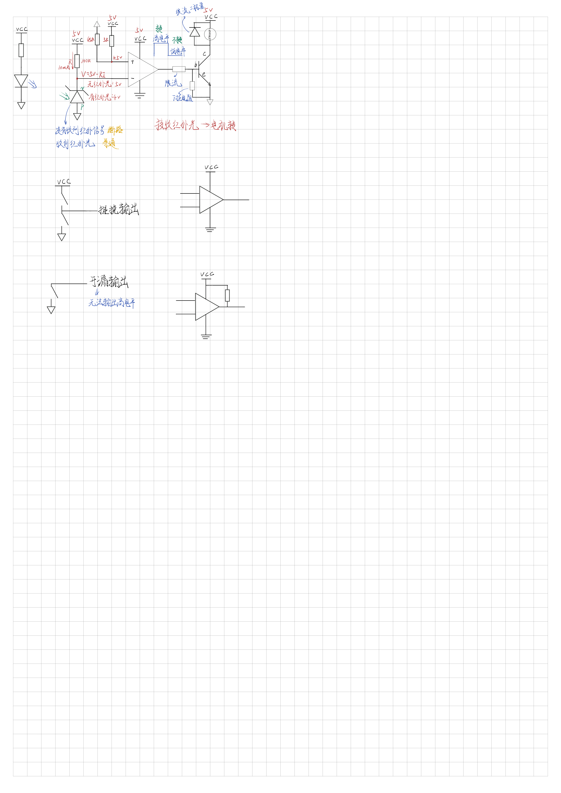

## 温控风扇工作原理

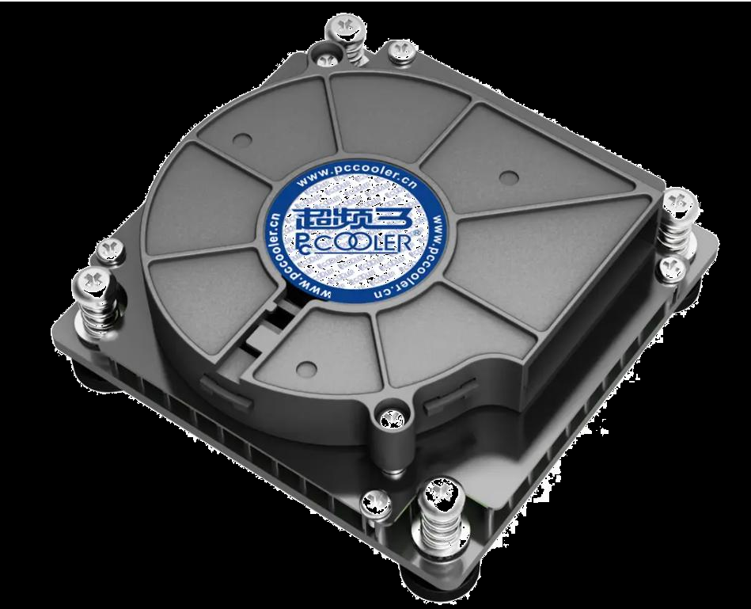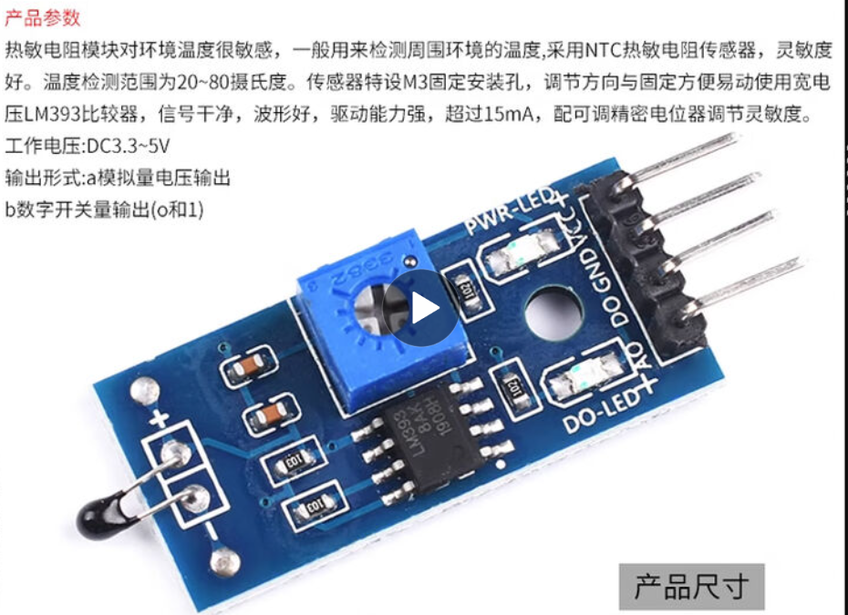

### 热敏传感器（热敏电阻）工作原理

#### **一、核心定义与分类**

热敏传感器（Thermistor）是利用半导体材料的电阻随温度变化特性制成的温度敏感元件，核心分为两类：

- **负温度系数（NTC）热敏电阻**：电阻随温度升高而**减小**，灵敏度高，线性度好，占市场主流。
- **正温度系数（PTC）热敏电阻**：电阻随温度升高而**增大**，居里温度（临界温度）后阻值急剧上升，适用于保护场景。
- **临界温度系数（CTR）热敏电阻**：仅在特定温度区间内阻值急剧变化，应用较少。

#### **二、工作原理**

1. **NTC热敏电阻**
   - 材料：锰、钴、镍等金属氧化物陶瓷。
   - 原理：温度升高时，半导体中自由电子/空穴数量增加，电阻呈指数级下降（公式：*R**T*=*R*25⋅*e**B*(1/*T*−1/298)，*B*为材料常数）。
   - 特性：灵敏度高（温度系数-2%~-6%/℃），响应时间快（<1秒）。
2. **PTC热敏电阻**
   - 材料：钛酸钡（BaTiO₃）陶瓷掺杂稀土元素。
   - 原理：居里温度以下为低阻态（四方晶体结构），超过居里温度后晶体结构变为立方晶系，晶界电阻急剧增大（阻值可上升1000倍以上）。
   - 特性：具有自恢复性，可重复使用。

#### **三、关键参数对比**

| **参数**     | **NTC热敏电阻**              | **PTC热敏电阻**                  |
| :----------- | :--------------------------- | :------------------------------- |
| **温度系数** | -2%~-6%/℃（负）              | +0.5%~+10%/℃（正，居里点后陡增） |
| **测量范围** | -55℃~315℃（高温型可达2000℃） | -40℃~300℃（居里点可调）          |
| **精度**     | ±0.1℃~±1℃                    | ±1℃~±5℃                          |
| **响应时间** | <1秒                         | <10秒                            |
| **典型应用** | 温度测量、补偿               | 过温/过流保护                    |

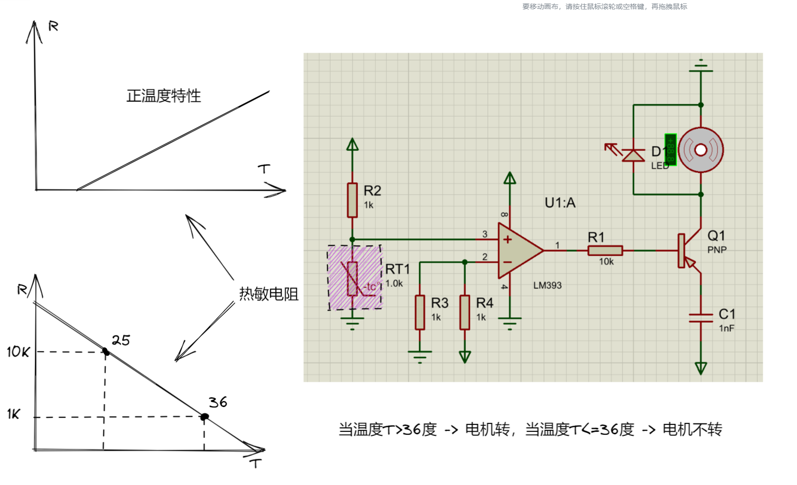

## 人体感应灯工作原理

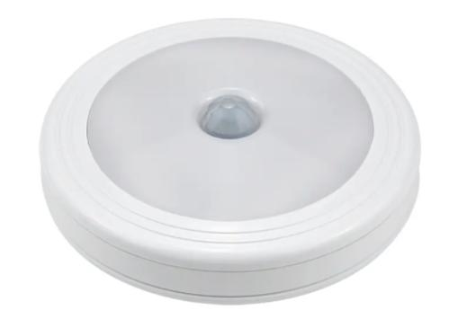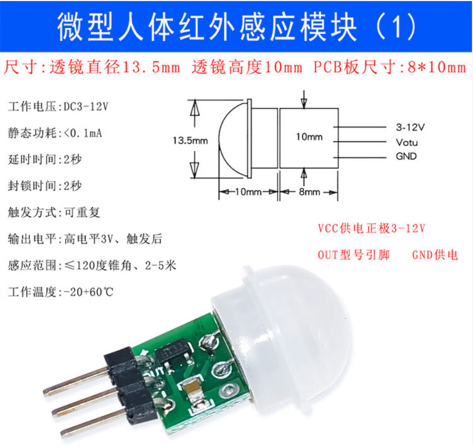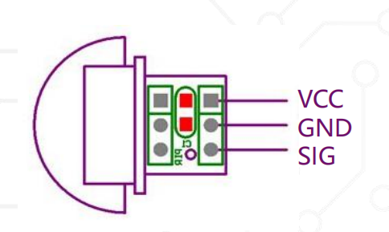

### 人体红外感应模块（PIR模块）深度解析

#### **一、核心定义与工作原理**

人体红外感应模块（通常指**被动红外传感器PIR**）是通过检测人体散发的**红外热辐射**来识别人体存在或移动的电子模块，核心基于**热释电效应**：

1. **热释电效应**：人体体温（$36 - 37℃$）持续辐射**8~14μm波长的红外线**，模块内的热释电晶体（如锆钛酸铅）吸收红外辐射后温度升高，表面电荷发生变化，产生微弱电信号。
2. **菲涅尔透镜聚焦**：模块前端的菲涅尔透镜将探测区域分割为明暗交替的扇形区，人体移动时红外辐射在区域间变化，触发信号波动，从而识别“移动”状态。

#### **二、模块结构与关键组件**

| **组件**         | **功能**                                                     |
| :--------------- | :----------------------------------------------------------- |
| **菲涅尔透镜**   | 聚焦红外辐射，扩大探测范围（通常10~120°视角），增强信号灵敏度。 |
| **热释电探测元** | 核心感应元件，由极化晶体构成，将红外辐射转换为电荷信号。     |
| **前置放大器**   | 高内阻场效应管（FET）组成，将微弱电荷信号放大为可识别的电压信号（如0~5V）。 |
| **信号处理电路** | 滤波、比较、延时电路，输出高/低电平（有人体时输出高电平，无人时低电平）。 |

#### **三、典型模块参数（以HC-SR501为例）**

- **工作电压**：5V~20V（直流）
- **静态功耗**：<50μA（极低功耗）
- **探测距离**：3~7米（可调）
- **探测角度**：110°（水平）
- **输出信号**：高电平3.3V/5V，低电平0V
- **延时时间**：5秒~5分钟（可调）
- **触发方式**：可选择“重复触发”（人在范围内持续输出高电平）或“单次触发”（检测到移动后延时结束输出低电平）。

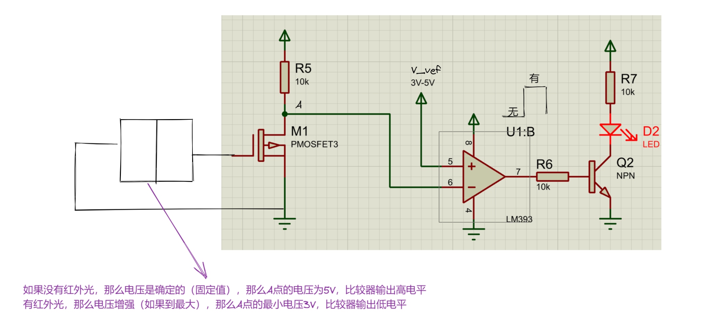

## 光控灯工作原理

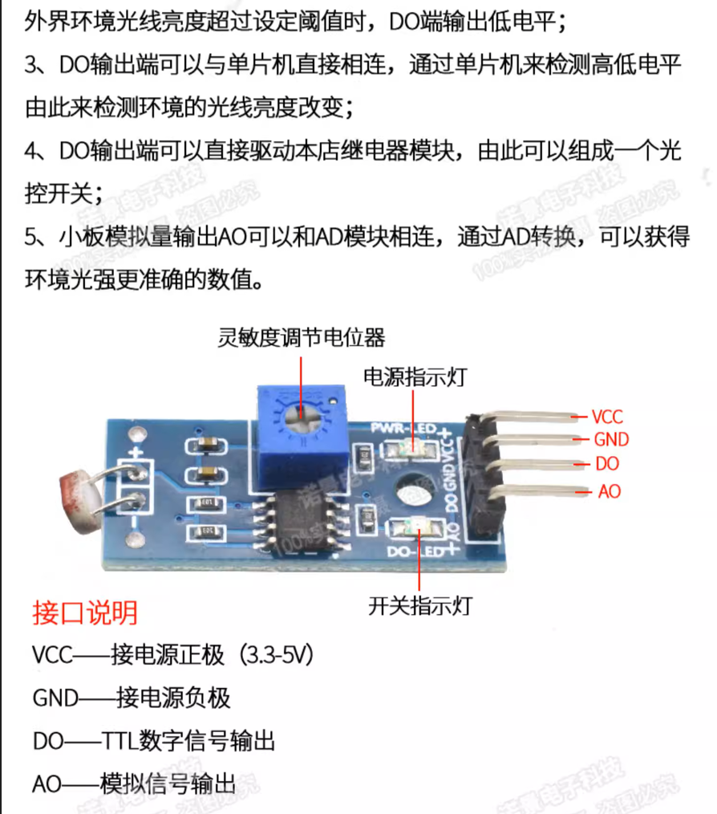

### 光敏电阻传感器（LDR）深度解析

#### **一、核心定义与材料特性**

光敏电阻（Light-Dependent Resistor，简称LDR）是一种基于**内光电效应**的半导体传感器，其电阻值随入射光强度的增加而**指数级减小**。核心材料为**硫化镉（CdS）**、硒化镉（CdSe）等金属氧化物半导体，这些材料在特定波长（可见光400~760nm）的光照下，电阻率会发生显著变化。

- **暗电阻**：无光照时的电阻值，通常为**1MΩ~10MΩ**（部分型号可达15MΩ）。
- **亮电阻**：强光照射下的电阻值，可低至**100Ω~1kΩ**，暗/亮电阻比高达1500:1。

#### **二、工作原理：内光电效应的微观过程**

光敏电阻的核心机制是**光子激发载流子**，具体过程如下：

1. **黑暗状态**：半导体材料（如CdS）中的电子被束缚在**价带**，自由载流子（电子-空穴对）极少，电阻极高。
2. **光照激发**：当光子能量（*E*=*h**ν*）大于半导体的**禁带宽度**（CdS约为2.4eV）时，价带电子吸收光能跃迁至**导带**，同时在价带留下空穴，形成大量可自由移动的**电子-空穴对**。
3. **电阻变化**：载流子浓度急剧增加，半导体导电性增强，电阻值随光照强度升高而**指数级下降**（公式：*R*=*R*0*e*−*k**I*，*k*为灵敏度系数，*I*为光照强度）。

#### **三、结构组成与封装设计**

光敏电阻的结构决定了其灵敏度和稳定性，典型结构包括：

| **组件**     | **功能**                                                     |
| :----------- | :----------------------------------------------------------- |
| **光敏层**   | 核心感应层（如CdS薄膜），通过涂敷或烧结工艺形成，厚度仅几微米，最大化受光面积。 |
| **梳状电极** | 金属电极呈梳齿状交错排列，增加有效接触面积，提高对微弱光信号的响应灵敏度。 |
| **保护层**   | 覆盖透明树脂或玻璃，过滤杂散光（如紫外线），仅允许可见光透过，同时防潮防尘。 |
| **封装外壳** | 金属或塑料外壳，带透明窗口（如玻璃或环氧树脂），确保长期稳定性（工作温度-30℃~+70℃）。 |

#### **四、关键性能参数对比**

| **参数**        | **典型值**                    | **说明**                                                 |
| :-------------- | :---------------------------- | :------------------------------------------------------- |
| **光谱响应**    | 400~760nm（可见光）           | CdS型对黄绿光（550nm）最敏感，匹配人眼视觉。             |
| **响应时间**    | 上升：20~50ms；下降：30~100ms | 光照增强时电阻下降快，减弱时恢复慢（载流子复合需时间）。 |
| **暗/亮电阻比** | 1000:1~1500:1                 | 比值越高，光控灵敏度越强（如GL5528可达1500:1）。         |
| **功耗**        | 50~200mW                      | 低功耗特性适合电池供电场景（如无线传感器）。             |

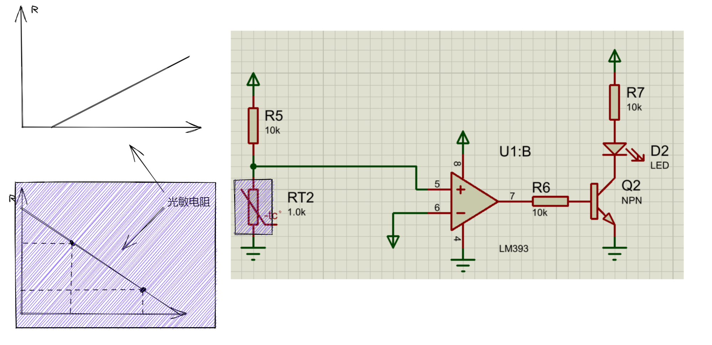

# MOS管

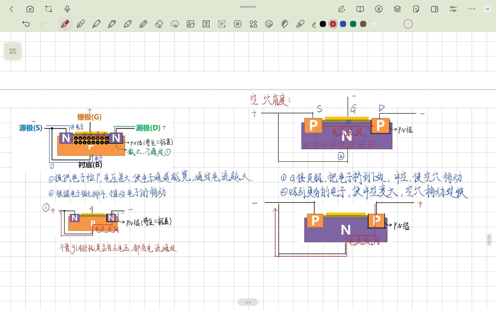

> 必看：

[理解NP结：终于有人讲了，凭什么三极管能放大?哔哩哔哩_bilibili](https://www.bilibili.com/video/BV1fB4y147Gn/?spm_id_from=333.1387.homepage.video_card.click&vd_source=cae5e5e53a7fcdf3a7ac534a5a5e2344)

[1. 了解MOS管：关于MOS管的一切都在这里！MOS管和三极管的区别【极速入门数模电路P15】哔哩哔哩_bilibili](https://www.bilibili.com/video/BV1Y3t4etEtT/?spm_id_from=333.337.search-card.all.click&vd_source=cae5e5e53a7fcdf3a7ac534a5a5e2344)

[2. 了解其本质：Mos管的工作原理_哔哩哔哩bilibili](https://www.bilibili.com/video/BV1344y167qm/?spm_id_from=333.788.recommend_more_video.0&trackid=web_related_0.router-related-2206146-t48nw.1768807062016.285&vd_source=cae5e5e53a7fcdf3a7ac534a5a5e2344)

> 扩展：

[3. 了解IGBT：都2022年了，你还不知道IGBT是什么吗？哔哩哔哩_bilibili](https://www.bilibili.com/video/BV1Pm4y1X7FB/?spm_id_from=333.788.recommend_more_video.2&trackid=web_related_0.router-related-2206146-dw6zb.1768807082269.24&vd_source=cae5e5e53a7fcdf3a7ac534a5a5e2344)

[4. 三种的区别：IGBT/三极管/MOS管的区别哔哩哔哩_bilibili](https://www.bilibili.com/video/BV1cd4y1a7oa/?spm_id_from=333.788.recommend_more_video.3&trackid=web_related_0.router-related-2206146-t48nw.1768807062016.285&vd_source=cae5e5e53a7fcdf3a7ac534a5a5e2344)

[全面认识MOS管，一篇文章就够了-CSDN博客](https://blog.csdn.net/weixin_42328389/article/details/123922558)

[MOS管详解-CSDN博客](https://blog.csdn.net/sinat_42790736/article/details/141866186?ops_request_misc=&request_id=&biz_id=102&utm_term=Mos管&utm_medium=distribute.pc_search_result.none-task-blog-2~all~sobaiduweb~default-0-141866186.142^v102^pc_search_result_base1&spm=1018.2226.3001.4187)

> 强化

[阻性负载下MOS管的米勒平台产生的原因哔哩哔哩_bilibili](https://www.bilibili.com/video/BV18ybZzzED4?spm_id_from=333.788.videopod.sections&vd_source=cae5e5e53a7fcdf3a7ac534a5a5e2344)

[MOS管发热的隐藏元凶！一个视频讲清楚米勒平台。哔哩哔哩_bilibili](https://www.bilibili.com/video/BV1Rj2LBSEq4/?spm_id_from=333.337.search-card.all.click&vd_source=cae5e5e53a7fcdf3a7ac534a5a5e2344)

看完上面的这些，对于MOS管有一定的了解了

## MOS管的基本结构

==由电压来控制，MOS管的三个极都是绝缘的，电阻无限大==

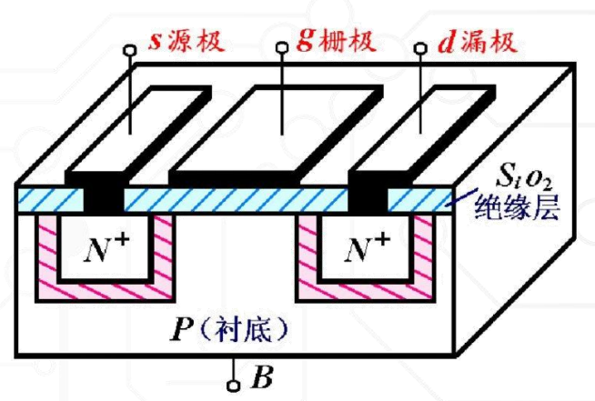

==寄生电容，寄生二极管==

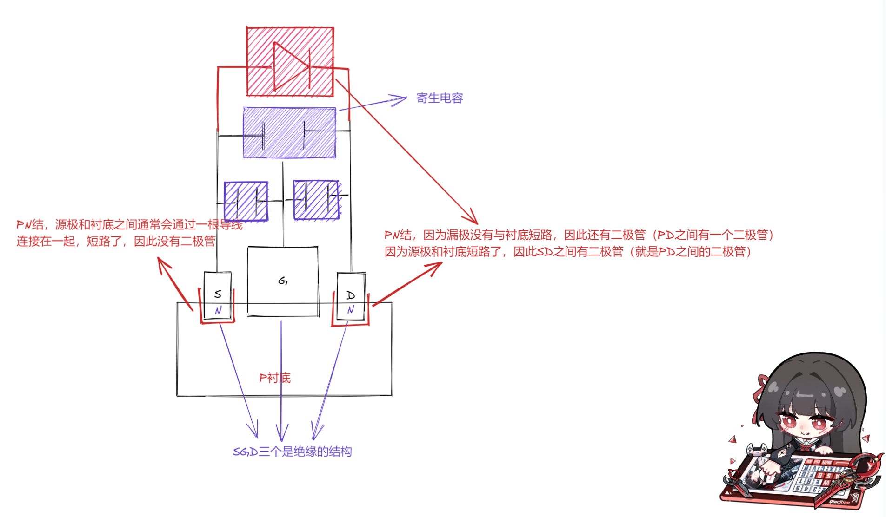

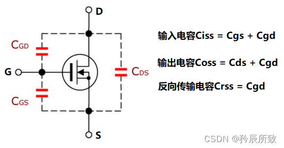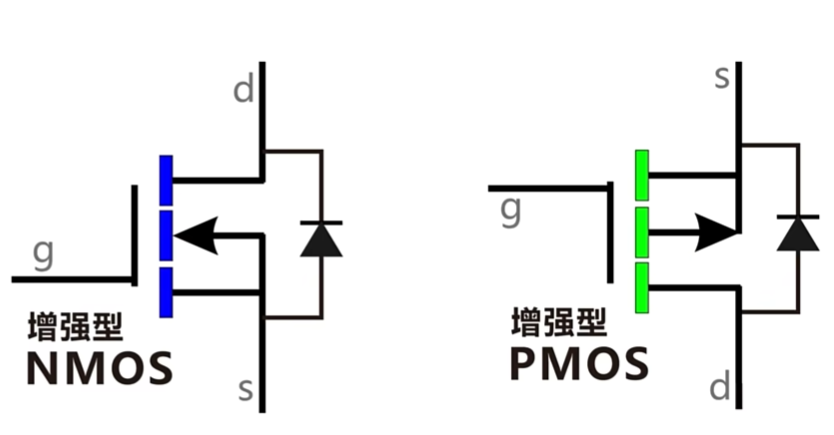

## MOS管的导通条件

$Nmos：V_g-V_s>V_{th}，DS之间导通$

$Pmos： V_g-V_s<V_{th}，DS之间导通$​

$上面公式翻译成人话：$

$当Nmos的g极电压比s极电压大于导通电压（V_{th}）时，DS之间闭合；$

$当Pmos的g极电压比s极电压小于导通电压（V_{th}）时，DS之间闭合；$

**MOS管输出特性曲线**

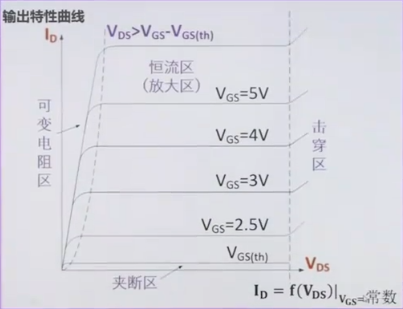

对于N沟道增强型的MOS管，当Vgs >Vgs(th)时，MOS就会开始导通，如果在 D 极和 S 极之间加上一定的电压,就会有电流Id产生。
在一定的Vds下，D极电流 Id 的大小是与 G极电压Vgs有关的。
我们先来看一下MOS管的输出特性曲线，MOS管的输出特性可以分为三个区：夹断区(截止区)、恒流区、可变电阻区

$V_{GS} < V_{GS(th)}$时，MOS管处于夹断区(截止区)：

夹断区在输出特性最下面靠近横坐标的部分，表示MOS管不能导电，处在截止状态。电流ID为0，管子不工作。

$V_{GS} ≥ V_{GS(th)}$，且$V_{DS}>V_{GS} - V_{GS(th)}$，MOS管进入恒流区：

恒流区在输出特性曲线中间的位置，电流ID基本不随$V_{DS}$变化，ID的大小主要决定于电压$V_{GS}$​​，所以叫做恒流区，当MOS用来做放大电路时就是工作在恒流区（饱和区）。
注：MOS管输出特性的恒流区，相当于三极管的放大区。

$V_{GS} > V_{GS(th)}$ ，且$V_{DS}<V_{GS} - V_{GS(th)}$，MOS管进入可变电阻区：

可变电阻区在输出特性的最左边，$I_D$随着$V_{ds}$的增加而上升，两者基本上是线性关系，所以可以看作是一个线性电阻，当$V_{GS}$不同电阻的阻值就会不同，所以在该区MOS管相当就是一个由$V_{GS}$​控制的可变电阻。

击穿区:

随着$V_{DS}$增大，PN结（寄生二极管）承受太大的反向电压而被击穿。

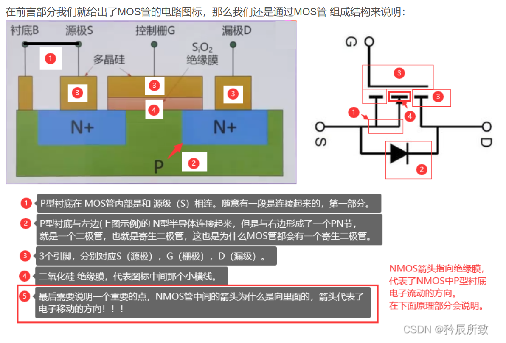

## mos开关电路的设计方法

$Nmos：V_g-V_s>V_{th}，DS之间导通$

$Pmos： V_g-V_s<V_{th}，DS之间导通$

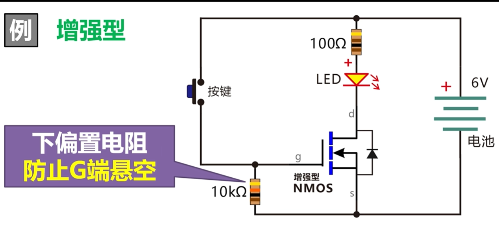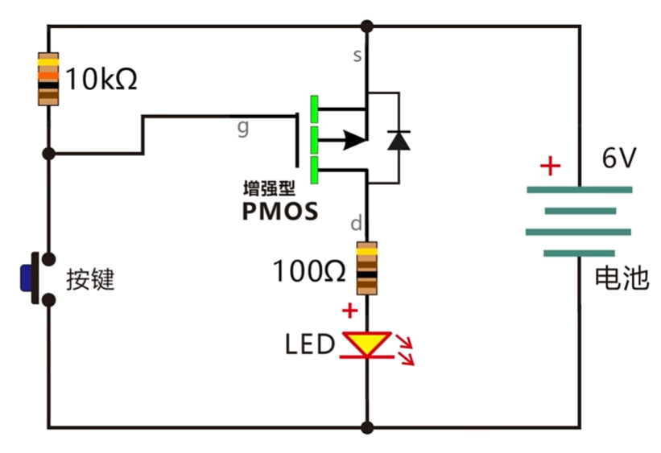

## MOS管寄生电容的影响

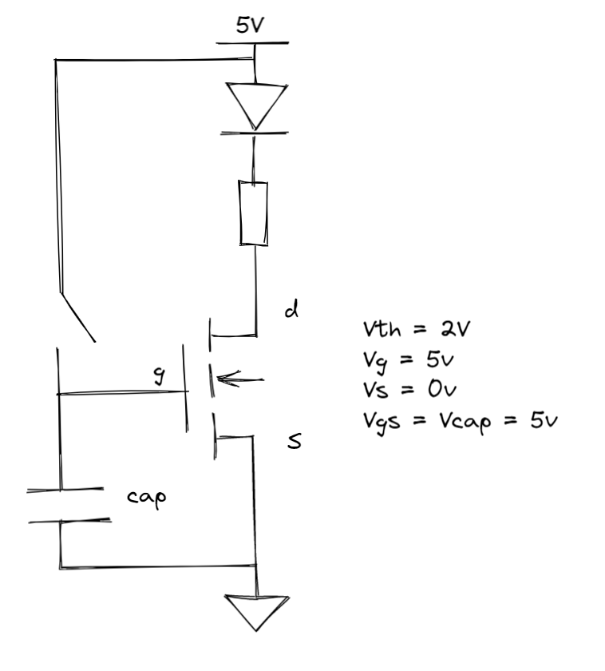

**1.  寄生电容 CGS 的物理本质**

MOS 管的栅极（G）与源极（S）之间是氧化层绝缘结构，这个结构本身就是一个平行板电容 —— 栅极和源极相当于电容的两个极板，氧化层是介质。

这个寄生电容的容量很小（通常 pF 级别），但正因为容量小，**少量电荷就能积累出足够大的电压**。

根据电容的基本公式：

$V_{GS}=\frac{Q}{C_{GS}}$

当开关闭合时，5V 电源给 $C_{GS}$ 充电，积累电荷 $Q=C_{GS}⋅V_{GS}$ ；开关断开后，由于 GS 极间是绝缘的，**电荷 $Q$ 没有泄放通路**，因此 $VGS$ 会一直维持在 5V，只要 $V_{GS}>V_{TH}$ ，MOS 管就持续导通，LED 也就一直亮。

**2.  放电通路缺失的关键矛盾**

MOS 管的栅极输入阻抗极高（绝缘特性），理想情况下栅极电流为 0，这就意味着：

- 充电时：电源通过开关给 $C_{GS}$ 充电，是瞬间完成的；
- 放电时：开关断开后，$C_{GS}$ 上的电荷**无处可去**，电压不会衰减。

和普通电阻负载不同，电阻可以通过电流消耗能量，但 MOS 管栅极几乎不消耗能量，电荷会一直 “存” 在 $C_{GS}$​ 里。

> ==实际上，MOS管不可能做到100%的绝缘，因此还是会有漏电，电容电压会缓慢降低（其时间会比较长），最终还是会关掉==

==解决==

第一种解决办法

==加下拉电阻==

> 下拉电阻：
>
> 释放寄生电容，利用电阻快速把电容释放掉
>
> 电阻值比较大（$K\Omega$级别）因为电阻小了，开关一闭合，电阻会一直耗能，电阻损耗比较大（$P=I*V$，电阻小，电流大，因为是并联，电压是不变的）

另一种解释：

1. 在G级 串联一个电阻，与 C 形成一个RC充放电电路，可以减小瞬间电流值， 不至于损毁MOS管的驱动芯片。

2. 网上还有一种说法是：抑制振荡

   MOS管接入电路，也会有引线产生的寄生电感的存在，与寄生电容一起，形成LC振荡电路。对于开关方波波形，是有很多频率成分存在的，那么很可能与谐振频率相同或者相近，形成串联谐振电路。

串联一个电阻，可以减小振荡电路的Q值，是振荡快速衰减，不至于引起电路故障。

第二种解决办法

==推挽==

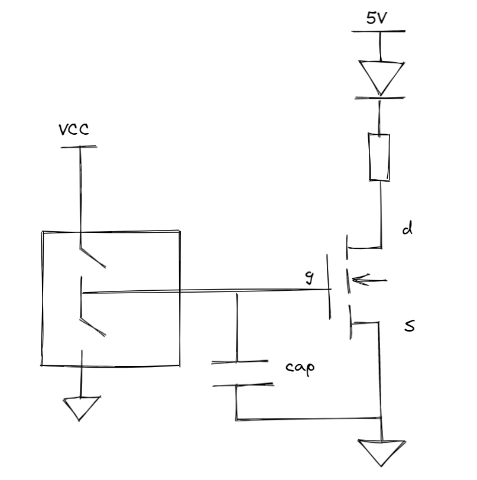

## mos的寄生二极管不能够忽略

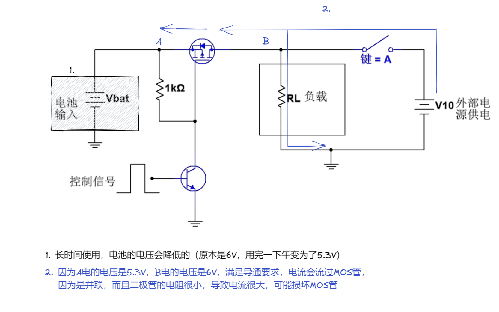

> 当有外部电源，就把电池供电给断开，外部电源供电

==解决==

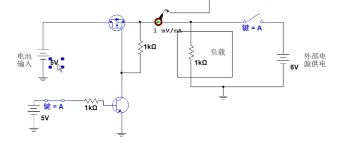

> 但是这样不能关断电源电压给他供电

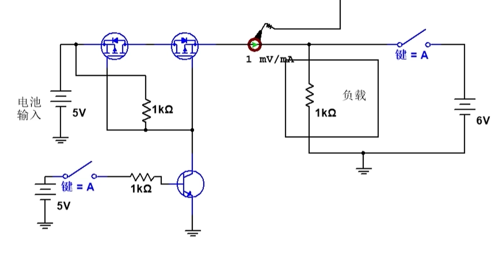

> 1. $1K\Omega$电阻的电阻只管着左侧的PMOS管，没有这个电阻左侧的PMOS管因为$C_{gs}$电容的原因是关不紧的（ds之间有电流流出）
> 2. 右侧的PMOS管，只充当二极管的作用（电源供电，直接通过（会有压降），外部电源供电，截止）

## Nmos管做电源开关时的注意事项

==Nmos控制负载的工作电源时，需要使用自举电容或者一个比电源更高的控制信号来控制mos栅极==

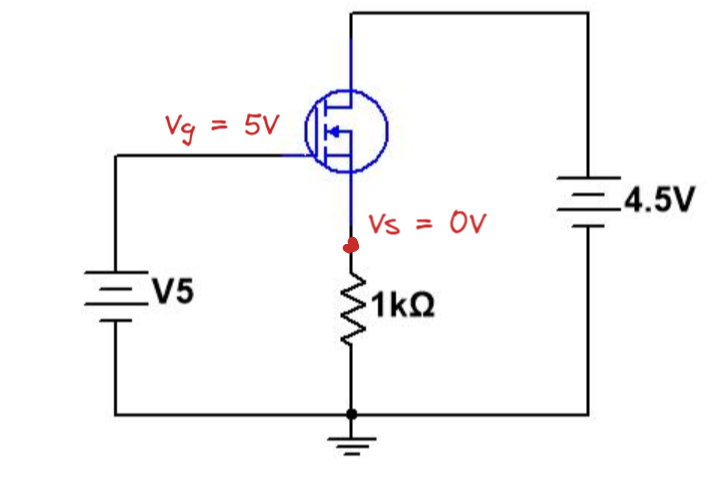

### 问题

**一、核心结论提炼**

当**N-MOS 管的源极 (S) 未直接接地**，而是接在负载与电源之间时，随着负载端电压（即 S 极电压$V_S$）上升，栅源电压 $V_{GS}=V_G−V_S$ 会持续减小。当 $V_{GS}$ 降至**临界导通电压 $V_{GS(th)}$** 附近时，MOS 管会从**饱和导通**进入**线性放大区**，无法实现理想开关的 “完全导通”，最终负载电压被钳位在 $V_G−V_{GS(th)}$ 附近，无法达到电源电压。

**二、数学推导与物理过程**

1. **初始导通阶段**

   设栅极驱动电压 $V_G=5 V$，电源电压 $V_{DD}=4.5 V$，MOS 管阈值电压 $V_{GS(th)}=2V$。

   上电瞬间 $V_S=0 V$，此时

   $V_{GS}=V_G−V_S=5V>V_{GS(th)}$

   MOS 管饱和导通，漏极 (D) 与源极 (S) 之间导通电阻 $R_{DS(on)}$ 极小，$V_S$ 开始从 0 V 上升。

   

2. **电压钳位阶段**

   随着$V_S$ 上升，$V_{GS}$ 线性减小：

   $V_{GS}=5−V_S$

   当 VS 上升至 3 V 时，$V_{GS}=2 V=V_{GS(th)}$，MOS 管达到**“临界饱和点“**。

   若 VS 继续上升至 3.001 V，则 $V_{GS}=1.999 V<V_{GS(th)}$，MOS 管退出饱和区，进入**“线性放大区”**，$R_{DS}$ 急剧增大。

   此时 $R_{DS}$ 与负载构成分压电路，$V_S$ 无法继续上升，被钳位在$ V_G−V_{GS(th)}=3 V$ 附近，远低于电源电压 $4.5 V$​

### 解决

**方案一：强制满足饱和导通条件**

N-MOS 管**饱和导通的核心条件**是：栅源电压 $V_{GS}>V_{GS(th)}$（阈值电压），且在导通过程中该条件**持续成立**。

当源极电压 VS 随负载供电上升至最大值 $V_{DD}（4.5 V）$时，要保证

$V_{GS}=V_G−V_S>V_{GS(th)}$

变形可得栅极电压的最小值要求：

$V_G>V_S+V_{GS(th)}≥V_{DD}+V_{GS(th)}$

**栅极加 10 V 电压**的方案，完全满足该不等式（$10 V>4.5 V+2 V=6.5 V$），从根源上避免了 $V_{GS}$ 降至阈值以下的问题。

**缺点：**成本比较高

**方案二：自举电路**

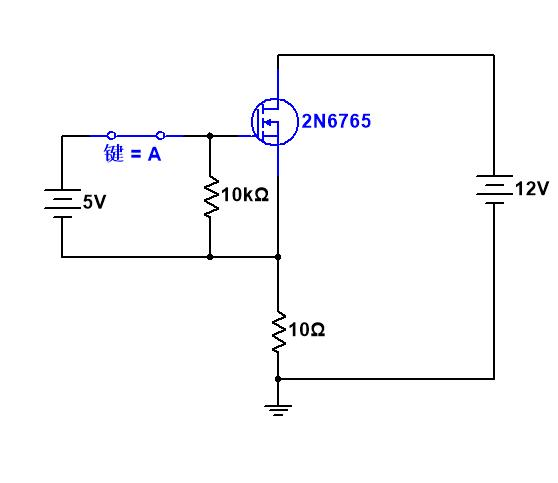

 1）、电路核心：用 “浮动电源” 维持恒定 $V_{GS}$

你这个电路的本质是**自举驱动技术**，核心是把 5V 驱动电源的**负极从公共地改接到 MOS 管的源极 (S)**，让驱动电源变成 “浮动” 的，从而利用 “电源（或电容）两端电压恒定” 的特性，强制维持栅源电压 $V_{GS}$ 始终大于阈值电压，无需额外升压芯片。

------

2）、分阶段详细推导（结合你的电路）

我们以图中 **5V 驱动、12V 负载、10Ω 采样电阻** 为例，设 MOS 管阈值电压 $V_{GS(th)}=2 V$，分 3 个阶段拆解：

**1. 初始关断状态（开关断开）**

- 开关断开时，G 极通过 10kΩ 电阻接地，$V_G=0 V$；S 极无电流，10Ω 电阻无压降，$V_S=0 V$。
- 此时 $V_{GS}=V_G−V_S=0 V<V_{GS(th)}$，MOS 管关断，负载无电流。

**2. 开关闭合瞬间（导通触发）**

- 开关闭合后，5V 正极接 G 极、负极接 S 极，

  此时 S 极电压仍为 0V（电流还未建立），因此：

  $V_{GS}=5 V−0 V=5 V>V_{GS(th)}$

- MOS 管**饱和导通**，12V 电源开始通过 MOS 管、10Ω 电阻到地，电流流过，S 极电压开始上升（10Ω 电阻产生压降）。

**3. 导通后电压跟随阶段（核心自举效应）**

- 关键原理：

  5V 电源（或等效自举电容）的正极永远比负极高 5V，而负极接在 S 极，因此：

  $V_G=V_S+5 V$

- 栅源电压 $V_{GS}=V_G−V_S=5 V$，**恒定不变**，不会随 S 极电压上升而减小。

- 即使 S 极被 12V 抬升到接近 12V（比如 11.8V），G 极电压也会同步抬升到 11.8 V+5 V=16.8 V（相对于公共地），但 $V_GS$ 始终保持 5V，远大于阈值，MOS 管持续饱和导通。

------

 3）、电池串联类比：更直观理解自举

把 5V 电源看作一个 “浮动电池”，当 MOS 管导通后，12V 电源相当于和这个 5V 电池**首尾串联**（12V 正极接 5V 负极），此时：

- 相对于公共地，G 极电压 = 12V + 5V = 17V（近似值）
- 但 MOS 管只关心**G 与 S 的相对电压**，也就是 5V，所以不管 S 极被抬到多高，这个相对电压始终不变，保证 MOS 管全程饱和。

------

 4）、实际工程中用 “自举电容” 代替浮动电源

你用电池演示的效果，在实际电路中是靠**自举电容**实现的，原理完全一致：

1. **电容充电**：MOS 管关断时，自举电容通过二极管从低压电源（如 5V）充电，两端电压充至 5V。
2. **电容放电维持 \**VGS\****：MOS 管导通后，S 极电压抬升，电容两端电压不能突变，因此 G 极电压随 S 极同步抬升，维持 VGS=5 V。
3. **关键器件**：自举电容（1~10μF，选漏电小的陶瓷 / 钽电容）+ 自举二极管（防止电容反向放电）。

------

5）、与传统高压驱动方案的对比

|     方案     |   传统高压驱动（升压芯片）    |      自举驱动（浮动电源）      |
| :----------: | :---------------------------: | :----------------------------: |
| **核心原理** | 用升压芯片生成高于 VDD 的栅压 | 用浮动电源 / 电容维持 VGS 恒定 |
|   **成本**   |     高（需额外升压芯片）      |    低（仅需电容 + 二极管）     |
|  **复杂度**  |   需设计升压电路，布线复杂    | 仅需增加电容和二极管，电路简洁 |
| **适用场景** |       高频、大功率开关        | 直流 / 低频开关，中小功率场景  |

**方案三：用PMOS管代替NMOS管**

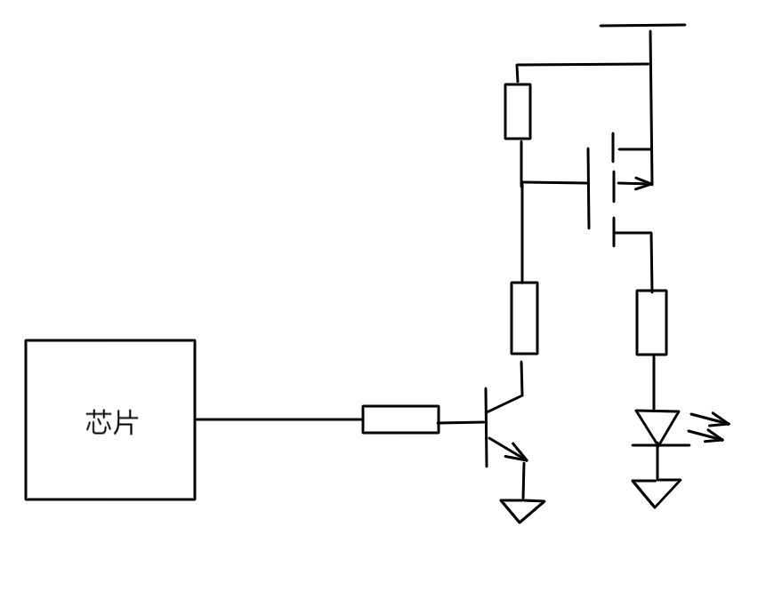

**1）电路核心逻辑：P-MOS 管天生适配 “高端电源开关”**

你这个电路的核心是用 **P-MOS 管** 替代 N-MOS 管作为电源开关，完美解决了 N-MOS 管做 “高端开关” 时需要复杂自举 / 升压电路的问题。

P-MOS 管的导通条件是：**栅极电压（$V_G$） < 源极电压（$V_S$） - 阈值电压（$V_{GS(th)}$）**（即 $V_GS<V_{GS(th)}$，负电压触发）。

因为它的源极（S）直接接电源正极（电路中的最高点，如 12V），只要把栅极（G）拉到更低的电压（如 GND），就能稳定满足导通条件，无需额外驱动电路。

------

**2）完整电路拆解与工作原理**

我们结合你的电路图，分**关断 / 导通**两个状态详细分析：

**1. 电路结构组成**

- **控制端**：MCU（芯片）输出信号 → 基极限流电阻（1kΩ~10kΩ）→ NPN 三极管（如 S8050）基极，三极管发射极接地，集电极接 P-MOS 管栅极。
- **P-MOS 管部分**：源极（S）接 12V 电源，漏极（D）接负载（LED + 限流电阻），栅极（G）通过 **上拉电阻（100kΩ）** 接 12V，同时被三极管拉到 GND。
- **负载端**：LED 串联电阻到地，若为感性负载（如电机 / 继电器），需并联续流二极管（1N4007）。

**2. 关断状态（MCU 输出低电平）**

- MCU 输出低电平 → 三极管基极无电流 → 三极管**截止** → P-MOS 管栅极通过 100kΩ 上拉电阻接$ 12V → V_{GS}=12 V−12 V=0 V$。
- 因为 $0 V>V_{GS(th)}$（如 P-MOS 管阈值为 - 2V），不满足导通条件 → P-MOS 管**关断** → 负载（LED）无供电，不点亮。

**3. 导通状态（MCU 输出高电平）**

- MCU 输出高电平 → 三极管基极有电流 → 三极管**导通** → P-MOS 管栅极被拉到 $GND → V_{GS}=0 V−12 V=−12 V$。
- 因为$ −12 V<V_{GS(th)}$（远小于 - 2V），满足深度饱和导通条件 → P-MOS 管**饱和导通** → 负载（LED）获得 12V 供电，点亮。

------

 **3）、为什么 P-MOS 管能解决 N-MOS 管的痛点？**

|    问题场景    |                     N-MOS 管（高端开关）                     |                     P-MOS 管（高端开关）                     |
| :------------: | :----------------------------------------------------------: | :----------------------------------------------------------: |
| 导通条件稳定性 | 源极电压随负载抬升 → $V_{GS}=V_G−V_S$ 下降 → 易退出饱和区，需自举 / 升压维持 | 源极接电源（固定 12V） →$ V_{GS}=V_G−12 V$，只要栅极拉到地，VGS 稳定为 - 12V → 全程饱和导通 |
| 驱动电路复杂度 |                  高（需自举电容、升压芯片）                  |                   低（仅需三极管 + 电阻）                    |
|    适用场景    |        大功率、高频（>100kHz）、大电流（如电机驱动）         |  中小功率、低频（<100kHz）、简单电源开关（如 LED/USB 供电）  |

------

**4）、关键器件选型与设计注意事项**

**1. 器件选型建议**

|          器件          |    型号推荐     |                       参数要求                        |
| :--------------------: | :-------------: | :---------------------------------------------------: |
|      **P-MOS 管**      | AO3401 / SI2301 |    VGS(th)≤−2 V、VDS(max)≥20 V、ID(max)≥ 负载电流     |
|     **NPN 三极管**     | S8050 / 2N3904  |              耐压≥20V、集电极电流≥100mA               |
|    **栅极上拉电阻**    |   100kΩ 电阻    | 低频场景通用值，高频可减小到 10kΩ（需平衡速度与功耗） |
|    **基极限流电阻**    |  1kΩ~10kΩ 电阻  |              限制基极电流，保护 MCU 引脚              |
| **续流二极管**（可选） | 1N4007 / UF4007 |            感性负载必须加，释放反向电动势             |

**2. 核心设计规则**

- **GS 间电阻必须加**：无论 P-MOS 还是 N-MOS，GS 间都要接 10kΩ~100kΩ 电阻，用于释放寄生电容电荷，防止静电 / 噪声导致误触发。
- **感性负载必须加续流二极管**：电机、继电器等感性负载关断时会产生反向电动势，直接并联续流二极管可避免击穿 P-MOS 管。
- **驱动电平匹配**：若 MCU 输出为 3.3V，需确保 P-MOS 管的 ∣$V_{GS(th)}$∣<3.3 V，否则需要电平转换电路。
- **散热设计**：P-MOS 管导通电阻较大，大电流下发热明显，需根据功率计算散热片尺寸，或选择导通电阻更小的型号。

------

**5）P-MOS 与 N-MOS 的适用场景总结**

|       特性       |              P-MOS 管               |            N-MOS 管             |
| :--------------: | :---------------------------------: | :-----------------------------: |
| 导通电阻 RDS(on) |     较大（同工艺下比 N-MOS 高）     |       较小（适合大电流）        |
|     开关速度     |       较慢（载流子迁移率低）        |        较快（适合高频）         |
|    驱动复杂度    |           低（无需自举）            |      高（高端开关需自举）       |
|     典型应用     | 中小功率低频电源开关（如 LED、USB） | 大功率高频开关（如电机、DC-DC） |

## PMOS管防反接电路的工作原理

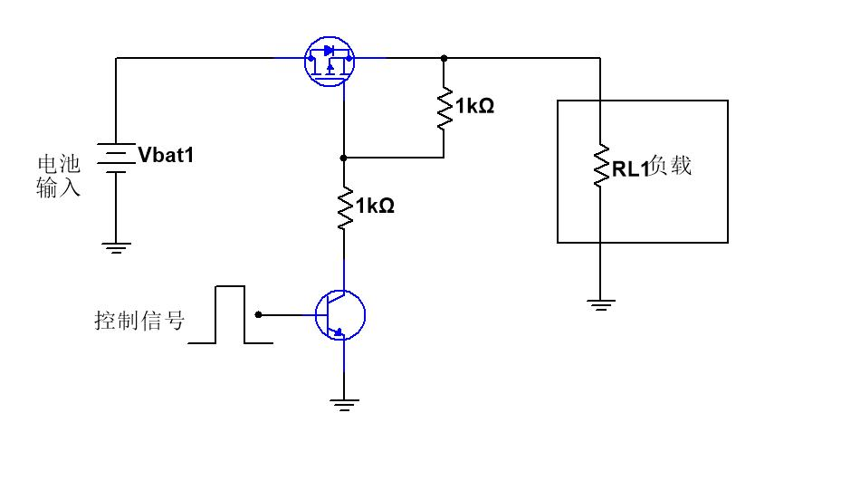

###  PMOS 防反接电路详细工作原理拆解

我把整个过程按**正常上电、完全导通、反接保护**三个阶段来详细解释，帮你把每个节点的电压和电流变化理清楚。

------

**一、 核心元件角色先梳理**

|       元件       |                             作用                             |
| :--------------: | :----------------------------------------------------------: |
|   **PMOS 管**    | 主开关，寄生体二极管是 “应急通路”，导通条件是 $V_{GS} < V_{th}$（通常栅极比源极低 2V 以上） |
|  **NPN 三极管**  |     由 MCU 控制，用来拉低 PMOS 的栅极电压，满足导通条件      |
| **1kΩ 分压电阻** |        产生 PMOS 栅极的分压电压，确保 $V_{GS}$ 足够负        |
|     **LDO**      |       把后级电压（11.3V→12V）降压到 3.3V，给 MCU 供电        |
|     **MCU**      |  上电后输出高电平，触发三极管导通，让 PMOS 进入高效导通状态  |

------

**二、 正常上电的完整流程（分阶段）**

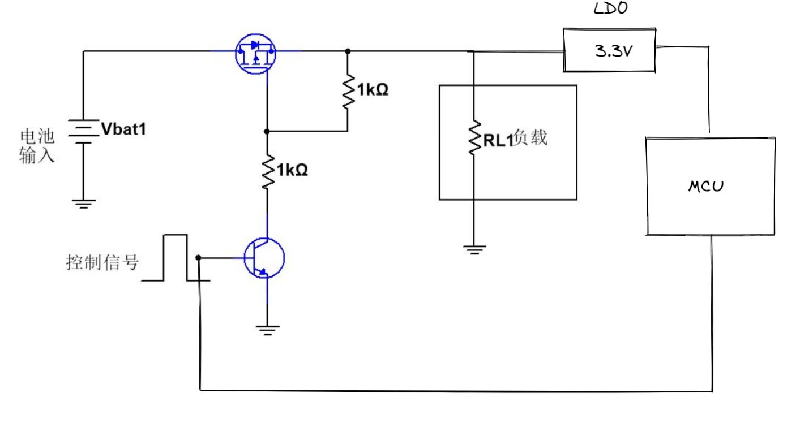

**阶段 1：刚接 12V 电池，MCU 未启动（控制信号为低电平）**

- 电池正极 → PMOS 的**源极（S）**，此时三极管基极是低电平，三极管**截止**（断开）。

- 因为 PMOS 还没导通，电流只能通过 PMOS 内部的**寄生体二极管**（方向：S→D）流向后级。

- 体二极管有$≈0.7V$ 的正向压降，所以后级（D 极）初始电压为：$12V - 0.7V = 11.3V$

- 11.3V 一路给负载 RL 供电，另一路经 LDO 降压到 3.3V，给 MCU 供电，MCU 开始初始化。

**阶段 2：MCU 启动，输出高电平控制信号**

- MCU 输出高电平 → NPN 三极管基极得到高电平 → 三极管**导通**（集电极 C 与发射极 E 连通）。

- 此时 PMOS 的源极 S 是 12V，两个 $1kΩ$ 电阻串联在 S 与地之间，分压后栅极 G 的电压约为：$12V × (\frac{1k} {(1k+1k)}) = 6V$

- PMOS 的 $ V_{GS} = V_G - V_S = 6V - 12V = -6V$，远小于导通阈值（如 -2V），因此 PMOS**完全导通**。

- PMOS 导通后，S 与 D 之间的电阻仅毫欧级，寄生体二极管被短路，后级电压从 11.3V 上升到 **$≈12V$**（仅 MOS 管导通压降，约 0.1V），供电效率大幅提升。

------

**三、 电池反接时的保护机制**

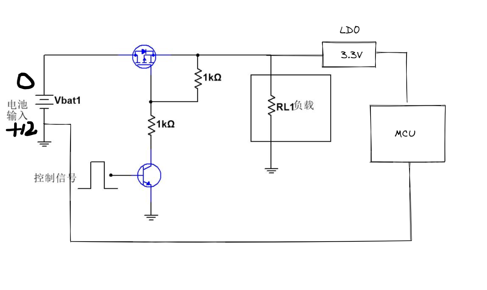

反接后，整个电路的电位参考系反转，我们重点看**电流是否能形成损坏性回路**：

1. **MOS 管栅极电位分析**：

   三极管的发射极现在接 12V（原接地端），基极因 MCU 无供电而悬空 / 低电平，因此基极相对于发射极的电压为负，三极管保持**截止**。

   下方电阻下端悬空，栅极通过上方 1kΩ 电阻接源极（0V），因此栅极电压 = 源极电压 = 0V → `Vgs = 0V - 0V = 0V`，MOS 管**截止**（P 沟道需要`Vgs < 0`才导通）。

   

2. **寄生二极管的阻断作用**：

   P 沟道 MOS 管的寄生二极管是「源极→漏极」方向（阳极接源极、阴极接漏极）。

   反接后，源极是 0V，漏极连接后级输入端，而后级的地现在是 12V（原接地端）。此时寄生二极管的阳极（0V）和阴极（漏极电位≈0V，因 MOS 管截止、后级无电流）之间**无正向电压差**，二极管不会导通。

   

3. **无损坏性电流路径**：

   电池反接后，12V 在原接地端，0V 在原正端。要损坏后级，必须有反向电流从 12V（MCU 地）流入 MCU 电源引脚，再经 LDO、漏极、MOS 管回到 0V。

   但 MOS 管截止，寄生二极管也不导通，这个电流路径被彻底切断 → 后级无反向电流，MCU、LDO 等元件不会因反向高压 / 电流损坏。

   

---

**四、 两种控制方式对比（带 MCU vs 不带 MCU）**

 **1. 带 MCU 控制（你的电路）**

- ✅ **优点**：MCU 可在上电后延迟或根据系统状态（如过压检测）控制 PMOS 导通，实现软启动或条件导通，增加灵活性。
- ❌ **缺点**：依赖 MCU 初始化，初始阶段需体二极管供电（11.3V），效率稍低，直到 PMOS 导通后才会到 12V。

**2. 不带 MCU（直接将下方 1kΩ 电阻接地，去掉三极管）**

- ✅ **优点**：电路更简单，上电即导通，不依赖 MCU。两个 1kΩ 电阻直接分压，栅极 G 电压为 6V，`VGS=-6V`，PMOS 立刻导通，初始供电就是 12V，效率更高。
- ❌ **缺点**：缺少可控性，无法实现软启动或条件导通，只要上电就导通。
- 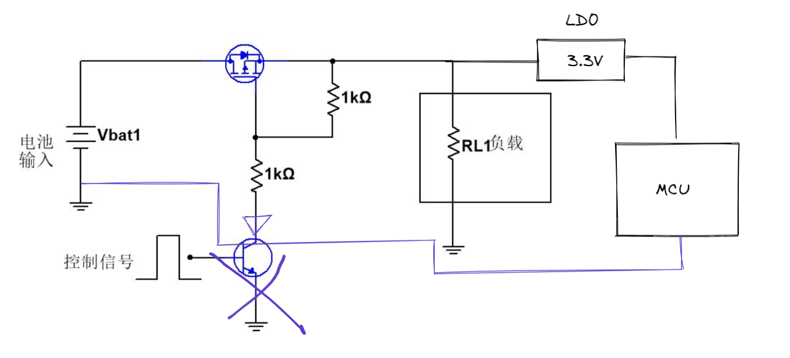
------

**关键原理总结**

- **正常上电**：体二极管 “应急供电”→MCU 启动→三极管导通→分压拉低栅极→PMOS 完全导通→短路体二极管→高效供电。
- **反接保护**：体二极管反向截止→阻断电流→后级无损坏。
- 核心是**PMOS 的体二极管和 $V_{GS}$ 导通条件**，三极管和 MCU 的作用是让 PMOS 从 “体二极管导通” 过渡到 “MOS 管完全导通”，提升效率与可控性。

## mos管DS之间的电流可以双向导通

三极管的ce之间有电流方向，但是mos没有。

==只要mos的gs之间满足导通条件，mos管DS之间的电流可以双向导通(N型三极管只能从集电极流向它的发射极)==

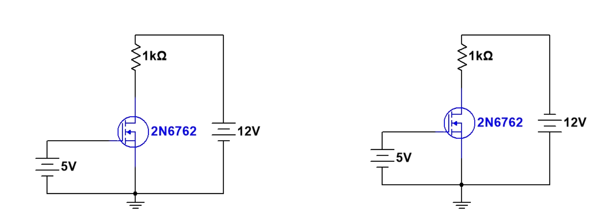

**1. MOS 管的核心：沟道的双向导电性**

以图中的 **N 沟道增强型 MOS 管（2N6762）** 为例，其内部结构是：

- 衬底为 P 型半导体，源极（S）和漏极（D）为 N 型掺杂区，栅极（G）是绝缘的金属层。
- 当栅极与源极间加正向电压（$V_{GS}>V_{th}，V_{th}$为阈值电压）时，栅极会吸引衬底中的电子，在衬底表面形成**N 型反型层（导电沟道）**，直接连通 S 和 D。

💡 关键结论：

导电沟道是**纯电阻性的半导体通道**，没有单向导电性。电子可以从 S→D 流动，也可以从 D→S 流动 —— 只要 S、D 之间存在电势差，电流就能双向通过，这是沟道的固有特性。

------

**2. 寄生体二极管：“隐藏的单向通路”**

MOS 管的衬底通常与源极（S）内部相连，因此衬底（P 型）与 S/D（N 型）会形成一个**PN 结二极管（寄生体二极管）**，方向为**S→D**（阳极接 S，阴极接 D）。

- 当 $V_D>V_S$（D 电位高于 S）：二极管反偏，无电流。
- 当 $V_S>V_D$（S 电位高于 D）：二极管正偏，电流从 S→D 流过二极管。

这个二极管是 MOS 管 “天生” 的寄生结构，也是应用中需要特别处理的关键点。

------

**3. 两个电路的对比分析（结合图示）**

我们以图中左右两个电路为例，分别看电流双向性的体现：

**🔹 左图：电源上正下负（常规接法）**

- **导通状态**（$V_{GS}=5V$，满足导通条件）：

  沟道形成，S 与 D 低阻连通，$V_D≈V_S=0V$（接地）。

  电流路径：12V+→1kΩ负载→D→沟道→S→GND→12V−。

  电流方向：**D→S**（正电荷移动方向），寄生二极管反偏（$V_D>V_S$），电流走沟道。

- **截止状态**（$V_{GS}=0V$）：

  沟道消失，S 与 D 高阻隔离，寄生二极管反偏，无电流。
  
------

**🔹 右图：电源下正上负（极性反转）**

- **截止状态**（$V_{GS}=0V$）：

  沟道消失，S 与 D 高阻隔离，但寄生二极管正偏（$V_S=0V>V_D=−12V$）。

  电流路径：GND→S→寄生二极管→D→1kΩ负载→12V−→12V+→GND。

  此时即使 MOS 管未导通，负载仍有电流（寄生二极管的漏电流）。

- **导通状态**（$V_{GS}=5V$）：

  沟道形成，S 与 D 低阻连通（导通电阻远小于二极管），寄生二极管被 “短路”。

  电流路径：GND→S→沟道→D→1kΩ负载→12V−→12V+→GND。

  电流方向：**S→D**（正电荷移动方向），与左图的电流方向完全相反，验证了 MOS 管导通时电流可双向流动。

**缺点：**没法控制$1K\Omega $电阻的供电情况（不闭合还是有电流流过）

**解决：**==加一个镜像MOS管，抵消原先MOS管的寄生二极管==

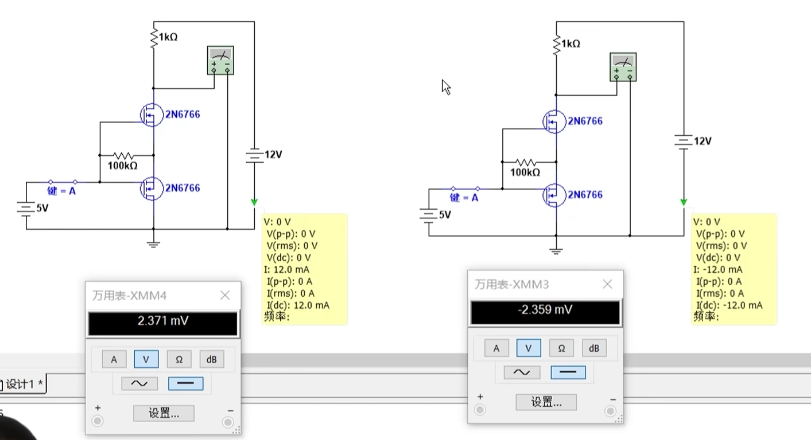

------

**✅ 核心结论：为什么 MOS 管电流可以双向？**

- **沟道本质**：导通时的沟道是低阻通路，仅起 “导电导线” 作用，电流方向由外部电路的电压极性决定，与管子 “源 / 漏” 的命名无关（源漏结构对称，仅应用时人为定义）。
- **寄生二极管的角色**：截止时可能引入反向漏电流，但导通时沟道电阻远小于二极管，电流会优先走沟道，从而实现 “可控的双向电流”。

## MOS管的导通电流与$V_{gs}$的关系

==MOS管的导通电流与Vgs的大小成正比，大部分mos当Vgs大于4.5V时，进入饱和状态==

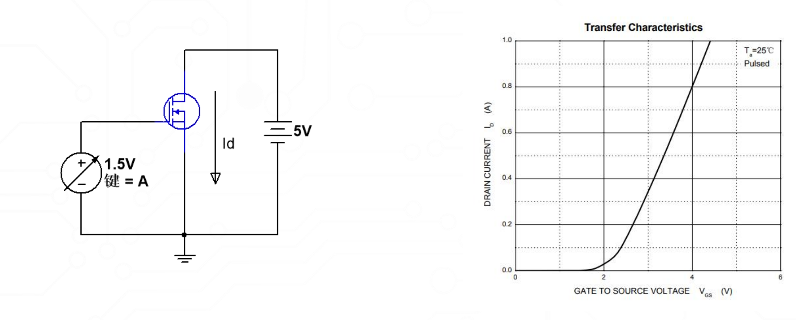

**MOS管输出特性曲线**

对于N沟道增强型的MOS管，当Vgs >Vgs(th)时，MOS就会开始导通，如果在 D 极和 S 极之间加上一定的电压,就会有电流Id产生。
在一定的Vds下，D极电流 Id 的大小是与 G极电压Vgs有关的。
我们先来看一下MOS管的输出特性曲线，MOS管的输出特性可以分为三个区：夹断区(截止区)、恒流区、可变电阻区

$V_{GS} < V_{GS(th)}$时，MOS管处于夹断区(截止区)：

夹断区在输出特性最下面靠近横坐标的部分，表示MOS管不能导电，处在截止状态。电流ID为0，管子不工作。

$V_{GS} ≥ V_{GS(th)}$，且$V_{DS}>V_{GS} - V_{GS(th)}$，MOS管进入恒流区：

恒流区在输出特性曲线中间的位置，电流ID基本不随$V_{DS}$变化，ID的大小主要决定于电压$V_{GS}$​​，所以叫做恒流区，当MOS用来做放大电路时就是工作在恒流区（饱和区）。
注：MOS管输出特性的恒流区，相当于三极管的放大区。

$V_{GS} > V_{GS(th)}$ ，且$V_{DS}<V_{GS} - V_{GS(th)}$，MOS管进入可变电阻区：

可变电阻区在输出特性的最左边，$I_D$随着$V_{ds}$的增加而上升，两者基本上是线性关系，所以可以看作是一个线性电阻，当$V_{GS}$不同电阻的阻值就会不同，所以在该区MOS管相当就是一个由$V_{GS}$​控制的可变电阻。

击穿区:

随着$V_{DS}$增大，PN结（寄生二极管）承受太大的反向电压而被击穿。

## MOS管的最大耐压

==所有的mos管都有最大耐压值==

==栅源击穿电压，源漏击穿电压，漏栅击穿电压，是不一致的==

**耐压的核心参数**

1. **漏源击穿电压 $BV_{DS}$**

   这是 MOS 管耐压的最关键指标，**测试条件为栅源短路（$V_{GS}=0 V$）**，指漏极（D）和源极（S）之间能够承受的最大反向电压。

   - 当 MOS 管**截止**时，漏源极之间会承受全部电源电压，此时电压必须严格小于 $BV_{DS}$；
   - 若 $V_{DS}>BV_{DS}$，器件内部会发生**雪崩击穿**，大量电流瞬间流过 MOS 管，导致器件永久性烧毁。
   - 举例：你提到的 2N7000（N 沟道 MOS 管），$BV_{DS}=60 V$，意味着截止状态下 $V_{DS}$ 绝对不能超过 60 V。

2. **其他耐压参数（辅助参考）**

   - **栅源击穿电压 $BV_{GS}$**：栅极与源极之间的最大耐压，通常为 ±20 V 左右，超过会击穿栅极氧化层，MOS 管直接失效；
   - **漏栅击穿电压 $BV_{DG}$**：漏极与栅极之间的耐压，一般略低于 $BV_{DS}$，实际应用中关注较少。

**耐压余量**

为了应对电源波动、浪涌电压等工况，选型时必须留足耐压余量，工程上的核心公式为：

$V_{DS(max})≤\frac{BV_{DS}}{K}$

其中 K 为**余量系数**，取值规则如下：

1. **成本敏感场景**：$K=1.2∼1.5$，满足基本可靠性要求；
2. **工业 / 车载场景**：$K=2∼3$，应对严苛的电压波动和浪涌；
3. **极端环境（如高压浪涌）**：$K≥3$，需结合 TVS 管等浪涌保护器件。

**举例**：若电源电压为 12 V，按 K=1.2 计算，所需 $BV_{DS}≥12×1.2=14.4 V$；若按 K=2 计算，则 $BV_{DS}≥24 V$，2N7000（60 V）完全满足要求。

