# 比较器

## 工作特性

比较器有两个输入信号$V+$和$V-$；以及一个输出信号$V_{out}$

当$V+>V-$时，$V_{out}$为高电平；

当$V+<V-$时，$V_{out}$​为低电平

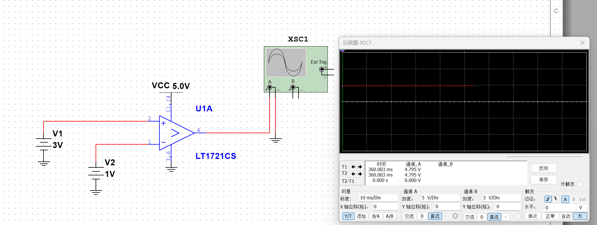

## 使用比较器的注意事项_输出是否要接上拉电阻

==比较器的输出结构主要分为OC||OD（开漏）、推挽输出三种结构==

==其中OC和OD要加上拉电阻，推挽输出不需要加上拉电阻==

 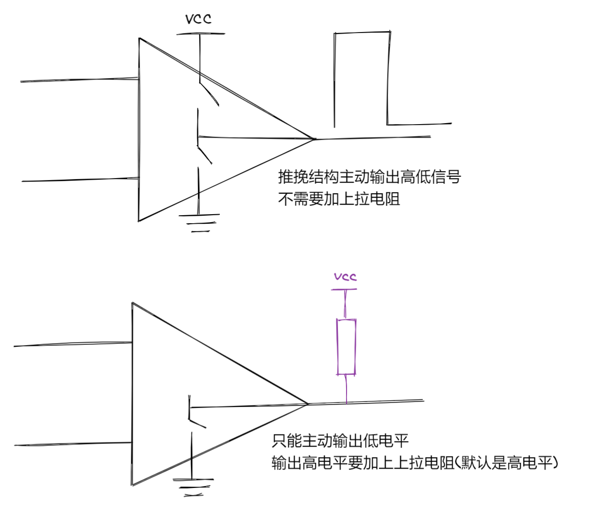

> 不加上拉电阻，受外界的环境的影响，因此需要加上上拉电阻

## 比较器OC和OD输出结构的区别

OC（集电极开路）和OD（漏极开路）是两种**原理相似但器件基础不同**的输出结构，核心区别源于实现它们的半导体器件类型（三极管 vs MOS管），具体差异如下：

 **1. 器件基础与结构本质**

- **OC（Open Collector）**：
  基于**双极型三极管（BJT）** 实现，输出端为三极管的**集电极（Collector）** 开路。当三极管导通时，输出被拉低（接近地电位）；截止时，输出呈高阻态，需外接上拉电阻才能输出高电平。

  - 典型特征：三极管存在**饱和压降**（约0.3V），因此输出低电平时实际电压为0.3V左右，而非理想0V。

- **OD（Open Drain）**：
  基于**场效应管（MOSFET）** 实现，输出端为MOS管的**漏极（Drain）** 开路。原理与OC一致，但MOS管为电压控制型器件，导通时漏源极电阻极低（几毫欧到几十欧），截止时漏极开路。

  - 典型特征：输出低电平时接近**理想0V**（MOS管导通压降可忽略），静态功耗远低于OC（MOS管截止时几乎无电流）。

    

**2. 输出特性差异**

| **特性维度**       | **OC（三极管）**                 | **OD（MOS管）**                               |
| :----------------- | :------------------------------- | :-------------------------------------------- |
| **低电平压降**     | 约0.3V（三极管饱和压降）         | 接近0V（MOS管导通电阻极低）                   |
| **高电平驱动能力** | 依赖上拉电阻，电流由电阻限制     | 依赖上拉电阻，但MOS管输入阻抗高，适合高阻负载 |
| **静态功耗**       | 三极管截止时仍有微小漏电流       | MOS管截止时漏电流可忽略，功耗极低             |
| **开关速度**       | 受三极管载流子复合速度限制，较慢 | MOS管无电荷存储效应，开关速度更快             |

**3. 典型应用场景**

- **OC的主要应用**：
  传统模拟/数字电路（如TTL逻辑门）、继电器驱动、大电流负载控制（需配合功率三极管）。由于三极管的电流驱动特性，OC更适合**低阻抗、大电流**的负载场景（如驱动LED、蜂鸣器）。
- **OD的主要应用**：
  现代数字系统（如CMOS逻辑、单片机IO口）、总线协议（如I2C、SMBus）、电平转换电路。例如：
  - **I2C总线**：多个OD输出的设备可直接并联（线与逻辑），通过上拉电阻实现总线电平统一；
  - **电平转换**：通过外接不同电压的上拉电阻（如3.3V→5V），轻松实现不同电平标准的转换；
  - **低功耗场景**：手机、传感器等电池供电设备中，OD的低静态功耗优势明显。

**4. 核心共性：依赖上拉电阻**

OC和OD的输出**本身无高电平驱动能力**，必须外接**上拉电阻**才能输出有效高电平。上拉电阻的作用是：

- 当内部开关（三极管/MOS管）截止时，电流从外部电源经上拉电阻流向输出端，将电平拉高；
- 电阻取值通常为**1kΩ~10kΩ**（需平衡驱动能力与功耗：电阻越小，驱动能力越强，但静态功耗越大）。

## 推挽上拉电阻的使用注意事项

==推挽用上拉的应用场景一般是比较器输出端离负载布线较远会产生较大的寄生电容，或者负载端接入了一个较大的电容，才需要上拉电阻，但是加上上拉电阻会加大功耗==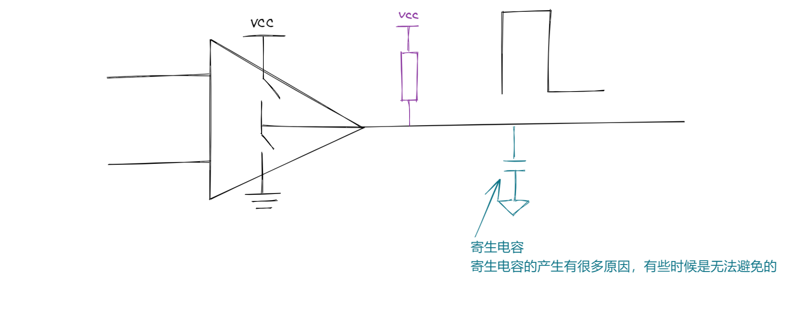

1. 信号线的每一个电平的变化，其实就是对我们这个信号线上面的一个寄生电容进行一个充放电，比如说我这里面一开始是低电平，然后我这个开关一闭合，它从低电平变成高电平，那对应的其实就是我们这个 VCC 来给我们这个电容充电，然后当我这个开关一断开啊，变成一个低电平的时候呢，其实就是我们这个寄生电通过我们这个开关进行放电，所以它一放完之后呢，它就变成一个低电平了啊，所以我们在这里呢就可以看到，就是你这个信号线上面的每一个高低电平的变化，其实都是对我们这个电路上面的这个寄生电容进行一个充放电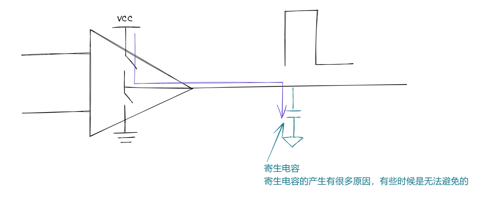
2. 加这个上拉电阻的话呢，可以加快我们对应的这个充电的一个过程，假如说你没有这个电阻的话呢，你这开关一闭合，它的这个充电路径就只有这个路径，但是当你加了这个上拉电阻之后呢，它的这个充电路径就是$A+B$​，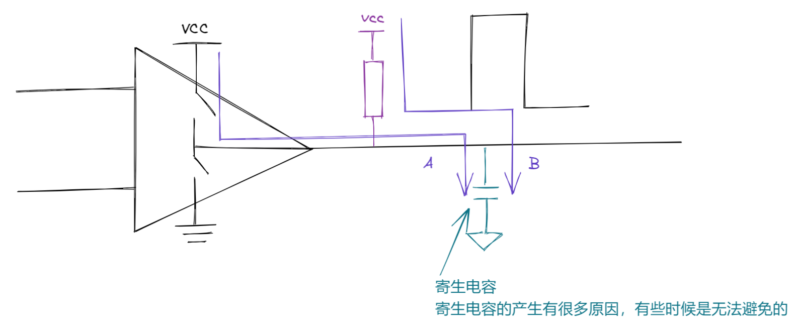那对应它的这个充电的这个电阻就减小了，所以它的这个上升速度会更快

3. 缺点：就是在于你加了上拉电阻之后呢，它会增加你这里面的这个低电平的损耗啊，

   就是当我这个开关闭合之后呢，如果你没有加上拉电阻的话呢，我这个电由放电放放完之后，这一个回路是不是就没有电流了呀？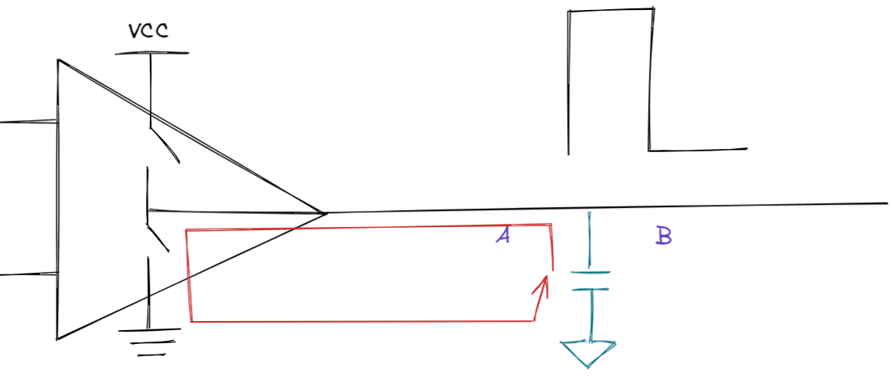但是当你加了这个电阻之后呢，这时候我们就会发现，变成$0$伏了，依旧会有一个电流下来的啊，所以这样子的话呢，它会增加这这个对应的一个损耗啊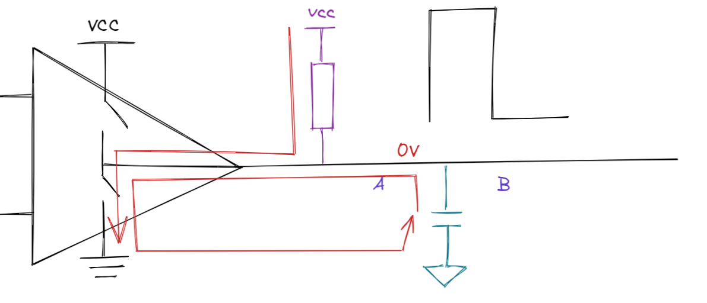

4. 上拉电阻$R$​的选型

   - 上拉电阻 $R$ 的选型是**上升速度**、**静态功耗**、**器件灌流能力**的三角平衡，量化关系：

     **上升速度**：寄生电容 $C_{par}$ 的充电时间常数 $\tau = R \cdot C_{par}$，$$R$$ 越小，$\tau$ 越小，上升沿越陡（信号切换越快）；

     **静态功耗**：低电平时，$VCC$经上拉电阻流向放电端，电流 $$I = \frac{VCC - V_{OL}}{R}$$（$$V_{OL}$$ 是拉低端的低电平电压），$$R$$ 越小，$$I$$ 越大，静态功耗 $$P = I \cdot (VCC - V_{OL})$$ 越高；

     **器件灌流限制**：放电端（芯片引脚/开关）的**最大灌流电流** $$I_{OL(max)}$$ 是器件极限参数（就是你说的“最大吸收电流”），必须满足$I < I_{OL(max)}$，否则会烧毁器件。

​	==在手册上标注的有的器件灌流限制==

5. **上升速度 = 最大传输速度**的底层逻辑

   本质是**数字信号的上升沿越陡，能避免的 “信号失真 / 码间串扰” 就越少**：

   - 低速信号时，上升沿缓一点没关系；但当信号传输频率变高，缓的上升沿会导致前一个比特的信号还没稳定，后一个比特就开始传输，直接出现信号叠加失真，而**更小的上拉电阻带来的陡上升沿，能让信号更快达到稳定电平**，从而支持更高的传输频率，这就是 “上升速度决定最大传输速度” 的关键。

上拉电阻越小 → 充电 $\tau$ 越小 → 上升沿越陡 → 信号传输速度越高；

电阻越小 → 低电平灌流越大 → 功耗越高，且不能超过**开关 / 芯片输出端的最大吸收电流**（超了会烧毁器件）；

选型优先级：**先满足器件耐受（电流＜$I_{ol (max)}$）→ 再满足信号传输速度（$\tau$ 匹配传输频率）→ 最后兼顾功耗（在满足前两者的前提下，电阻尽量取大，减少静态损耗）**。

## 使用比较器的注意事项-输入范围

==比较器的输入范围不能够超出芯片的供电范围，超过芯片供电范围可能会工作异常==

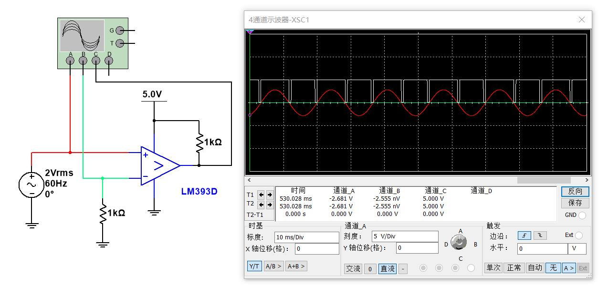

> 尽量不要低于$0.0V$，不要高于$5.0V$​。
>
> 高一点低一点没有问题，不要超过二极管压降$0.7V$

理论上：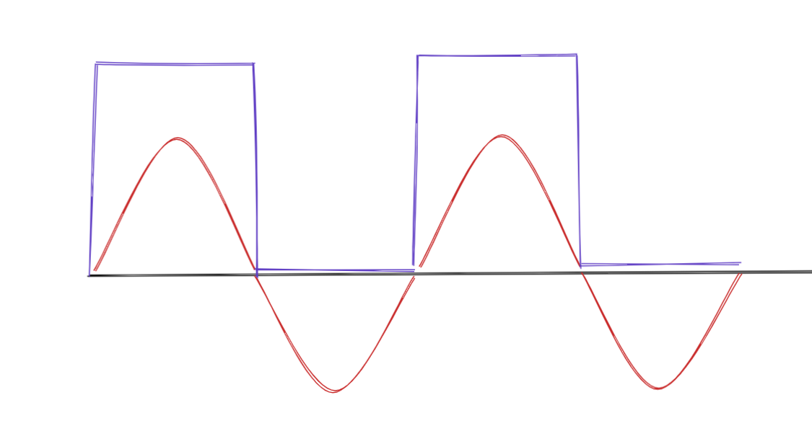

实际上：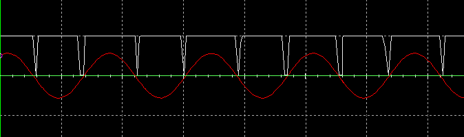

> 在低于$-0.7V$时，变回高电平

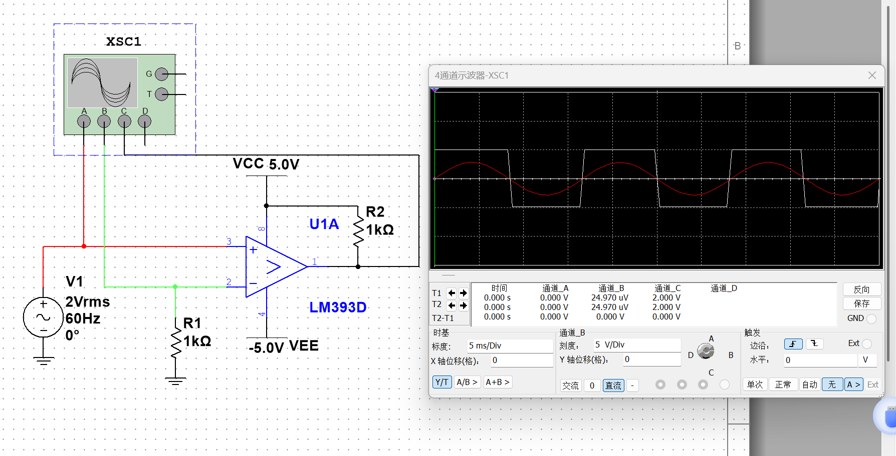

> 接地改为$-5V$就可以解决

## **使用比较器的注意事项-颤振问题**

==比较器有偏置电压，简单来说就是比较器的两输入端本身就存在一定的压差==

比较器在输入在阈值附近来回穿过时出现的“颤振”（chatter、抖动、抖抖几下）现象。

### **现象是什么（直观描述）**

- 当正弦波从低到高或从高到低经过参考电压（你举例是 1V）时，理想上输出应在某一瞬间从低变高或从高变低。但实际上输出在阈值附近会反复切换几次（抖动）然后才稳定成高或低。这就是颤振。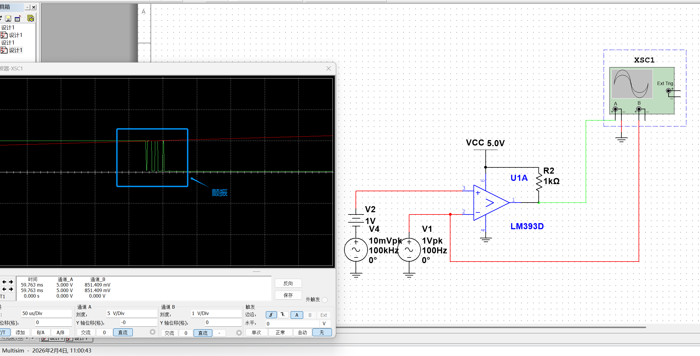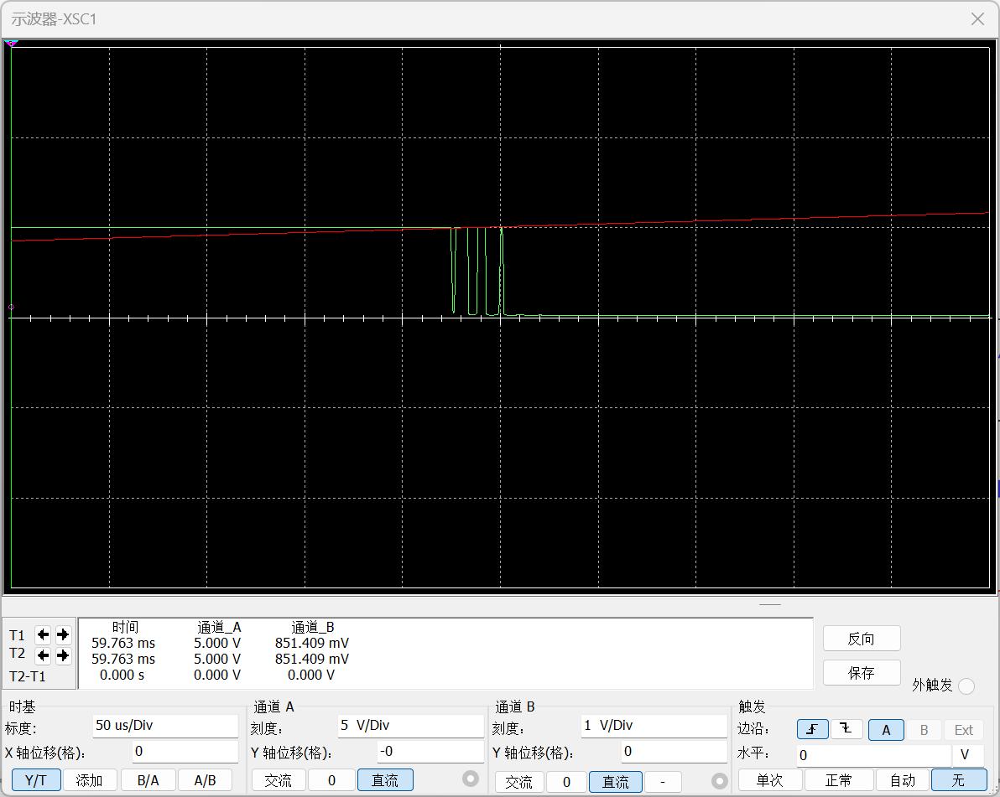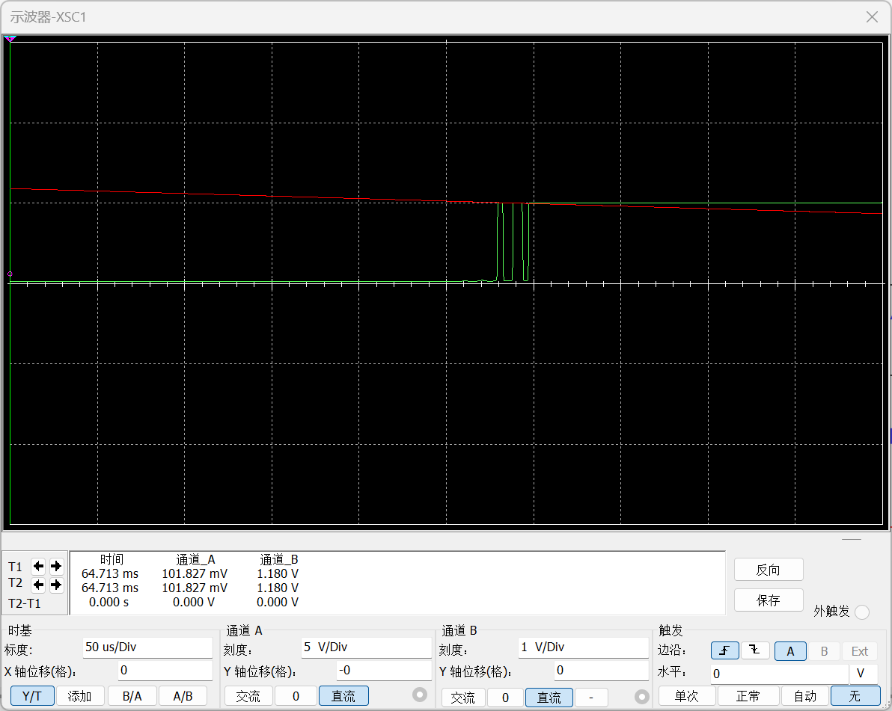

### **为什么会发生（主要原因）**

理想情况下，我们期望比较器在上阈值和下阈值是同一个电压点。但在现实中，由于电路中的寄生电容和电感，当输出状态改变时，微小的能量会反馈回输入端，形成一个**不希望的正反馈回路**。这个反馈信号加上原本的噪声，就足以让输出在阈值点附近犹豫不决。

- 输入噪声／干扰：参考点附近的微小电压噪声会使输入在阈值上下摆动，从而触发多次切换。
- 输入边沿缓慢（低斜率）：当输入电压相对于时间的变化率 $\frac{dV_{in}}{d_t}$ 很小时，哪怕很小的噪声也能在较长时间内把信号“推”过阈值，导致多次触发。
- 缺乏滞后（无或滞后太小）：比较器没有足够的正反馈（即没有 Schmitt 式滞后），使得上阈和下阈几乎相同，极易颤振。
- 比较器内部放大器与输出级的延迟和寄生振荡：比较器内部结构在临界点可能会产生放大器级别的振荡或寄生反馈，特别是在输入阻抗与布局不当时。
- 布线与旁路不良：长输入线、耦合噪声、电源去耦差会放大颤振倾向。

### **解决**

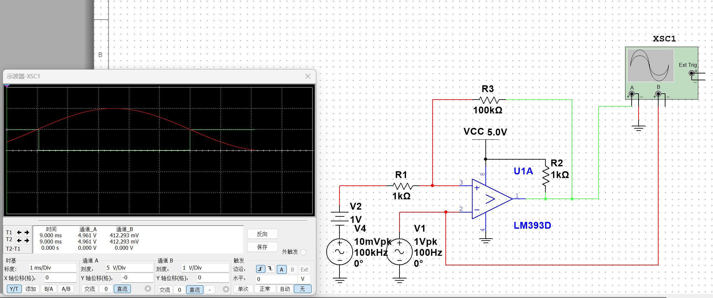

滞回能解决颤振问题，核心是通过**引入正反馈构建双阈值（回差电压）** ，打破 “V + 与 V - 在单阈值附近反复交叉” 的恶性循环，给比较器的输出跳变设置 “单向门槛”，从根源上抵御微小干扰。

> 补充实操关键点：==回差电压可通过电阻配比调整（如加大 1k 电阻可增大回差），能适配不同噪声、偏置漂移场景 —— 噪声越大，可适当加大回差，既不影响正常信号跳变，又能彻底抑制颤振，这也是该方案在硬件实操中通用性强的原因。==

### 那么就引出了一个问题：为什么正反馈会导致有一个回差电压呢？

**正反馈正是实现迟滞的手段**。

**正反馈如何生成死区（迟滞区间）**

要理解正反馈如何“生成死区”，我们可以把这个过程拆解成**单阈值 → 双阈值 → 状态锁定**的三步逻辑，用LM393电路做具体例子，把原理讲透。

---

#### 1. 先看没有正反馈时：只有一个阈值，没有死区

如果把正反馈电阻 $R_3$（$100\,\text{k}\Omega$）拆掉，比较器同相端的电压就固定为：
$$
V_+ = V_2 = 1\,\text{V}
$$
反相端输入是 $V_1$（$1\,\text{V}_\text{pk}$、$100\,\text{Hz}$ 正弦波），叠加在 $1\,\text{V}$ 直流上。

此时比较器只有**一个阈值点**：$1\,\text{V}$。只要 $V_1 > 1\,\text{V}$，输出低；$V_1 < 1\,\text{V}$，输出高。

问题在于：当 $V_1$ 刚好在 $1\,\text{V}$ 附近时，哪怕只有 $10\,\text{mV}$ 的噪声，也会让 $V_1$ 在 $1\,\text{V}$ 上下反复穿越，导致输出频繁翻转——这就是**震颤**。

> 没有正反馈时，比较器是“健忘”的：它只看当前输入，不记得上一刻的输出状态，所以对噪声极度敏感。

---

#### 2. 加上正反馈后：输出“拽”着阈值走，创造出两个门限

在电路里，$R_3$ 把输出端和同相端连起来，形成了**正反馈**。这时候，同相端的电压 $V_+$ 不再是固定的 $1\,\text{V}$，而是由 $V_2$ 和输出电压 $V_{\text{out}}$ 共同决定的：
$$
V_+ = V_2 \cdot \frac{R_3}{R_1+R_3} + V_{\text{out}} \cdot \frac{R_1}{R_1+R_3}
$$

##### 场景1：输出为高电平（$V_{\text{out}} = V_H = 5\,\text{V}$）

代入公式：
$$
V_{\text{TH+}} = 1\,\text{V} \cdot \frac{100\,\text{k}\Omega}{1\,\text{k}\Omega+100\,\text{k}\Omega} + 5\,\text{V} \cdot \frac{1\,\text{k}\Omega}{1\,\text{k}\Omega+100\,\text{k}\Omega} \approx 1.0396\,\text{V}
$$
这就是**上门限**：只有当反相端输入 $V_1 > 1.0396\,\text{V}$ 时，输出才会从高翻转为低。

##### 场景2：输出为低电平（$V_{\text{out}} = V_L = 0\,\text{V}$）

代入公式：
$$
V_{\text{TH-}} = 1\,\text{V} \cdot \frac{100\,\text{k}\Omega}{1\,\text{k}\Omega+100\,\text{k}\Omega} + 0\,\text{V} \cdot \frac{1\,\text{k}\Omega}{1\,\text{k}\Omega+100\,\text{k}\Omega} \approx 0.9901\,\text{V}
$$
这就是**下门限**：只有当反相端输入 $V_1 < 0.9901\,\text{V}$ 时，输出才会从低翻转为高。

---

#### 3. 死区是怎么“锁死”输出状态的？

死区（迟滞区间）就是两个阈值之间的范围：
$$
\Delta V = V_{\text{TH+}} - V_{\text{TH-}} \approx 1.0396\,\text{V} - 0.9901\,\text{V} = 49.5\,\text{mV}
$$

我们用一个完整的正弦波周期，看它如何在死区里“碰壁”：

1. **初始状态（输出高）**：
   - 阈值被“拽”到 $V_{\text{TH+}} \approx 1.0396\,\text{V}$。
   - $V_1$ 从 $0\,\text{V}$ 开始上升，只要 $V_1 < 1.0396\,\text{V}$，输出就一直保持高电平。
   - 即使 $V_1$ 在 $1\,\text{V}$ 附近有 $10\,\text{mV}$ 的噪声，也远小于死区宽度 $49.5\,\text{mV}$，所以输出不会乱跳。

2. **第一次翻转（高→低）**：
   - 当 $V_1$ 上升超过 $1.0396\,\text{V}$ 时，反相端电压高于同相端，输出翻转为低。

3. **状态锁定（输出低）**：
   - 输出变低后，正反馈立刻把阈值“拽”到 $V_{\text{TH-}} \approx 0.9901\,\text{V}$。
   - 此时 $V_1$ 开始从峰值下降，只要 $V_1 > 0.9901\,\text{V}$，输出就一直保持低电平。
   - 哪怕 $V_1$ 上叠加了 $10\,\text{mV}$ 的噪声，也无法让它跌落到 $0.9901\,\text{V}$ 以下，所以输出稳定。

4. **第二次翻转（低→高）**：
   - 当 $V_1$ 下降到低于 $0.9901\,\text{V}$ 时，反相端电压低于同相端，输出翻转为高。

> 正反馈的核心作用，就是让比较器“记住”自己上一刻的输出状态：
> - 输出高时，阈值被抬高，让输入信号“更难”触发翻转。
> - 输出低时，阈值被拉低，让输入信号“更难”触发翻转。
>
> 这种“记忆”能力，就是死区的本质——它在两个阈值之间创造了一个**输出状态保持不变的安全区**，噪声再大，只要不越界，输出就不会乱跳。

---

#### 4. 用一句话总结死区的生成逻辑

正反馈通过**输出电压对输入阈值的动态调制**，把单一阈值变成了一对高低门限，在两者之间形成了一个**输出状态锁定的区间**。这个区间就是死区，它让比较器从“对噪声敏感的单阈值器件”，变成了“对噪声免疫的双阈值施密特触发器”。

**其他解决办法：**

1. 引入滞后（施密特触发）：用正反馈形成两个阈值（上阈和下阈），这样输入必须跨越更大的电压差才会再次翻转，能有效抑制噪声触发。
   - 可用带有内置滞后的比较器，或在电路中通过反馈电阻实现外部施密特触发。
2. 在输入端增加小的低通滤波（RC）：去掉高频噪声，但注意不要把时间常数做得太大以免丢失信号边沿信息或产生过度延迟。
3. 在输入串联小电阻：与输入电容共同形成缓冲，减少由输入电容和布线造成的振荡。
4. 电源和接地去耦：在比较器电源引脚附近放置陶瓷去耦电容，缩短回流路径，降低由开关瞬变耦合到输入的可能性。
5. 避免把敏感输入与高速或高电流回路并行走线，减小耦合噪声。
6. 选择合适的比较器：带有内部滞后、输入保护和合适带宽/速度特性的器件能更稳定。
7. 如果必须精确阈值且对迟滞敏感，采用数字去抖（采样后软件滤波或定时器确认）或硬件锁存/抖动抑制电路。

# 运放

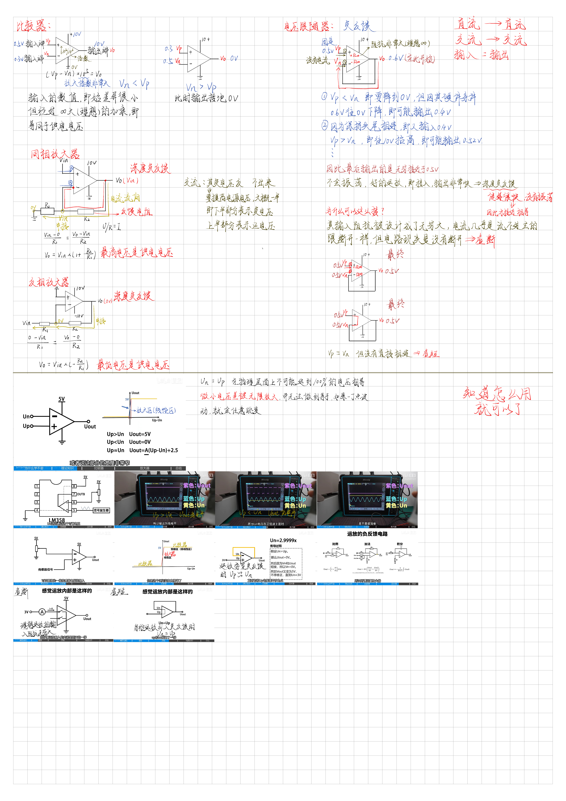

[一看就会 运算放大器！看不懂我叫你爸爸！哔哩哔哩_bilibili](https://www.bilibili.com/video/BV1VeQdYUELe/?spm_id_from=333.337.search-card.all.click&vd_source=cae5e5e53a7fcdf3a7ac534a5a5e2344)

[【极速入门数模电路】重新认识运算放大器！模拟计算机冷知识哔哩哔哩_bilibili](https://www.bilibili.com/video/BV1ZyjdzmE6G/?spm_id_from=333.337.search-card.all.click&vd_source=cae5e5e53a7fcdf3a7ac534a5a5e2344)

[电子小白学不会运放？一开始掌握这两个用法就够了！哔哩哔哩_bilibili](https://www.bilibili.com/video/BV1n44y1Q7We?spm_id_from=333.788.recommend_more_video.0&trackid=web_related_0.router-related-2479604-gjmc5.1770993842512.832&vd_source=cae5e5e53a7fcdf3a7ac534a5a5e2344)

## 运放的常见作用

==运放：运算放大器，常用于做信号处理。如：信号放大、滤波、积分、微分、整流、甚至可以用来做电路主控等等。其功能非常强大==

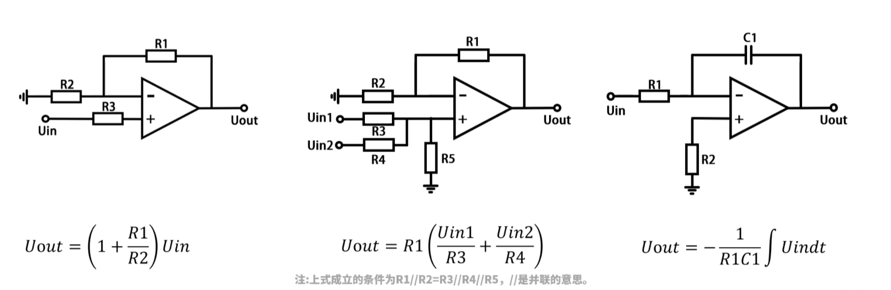

> 第一个电路分析起来很简单，那我就分析后面两个电路

### 差分运放电路输出推导(第二个电路)

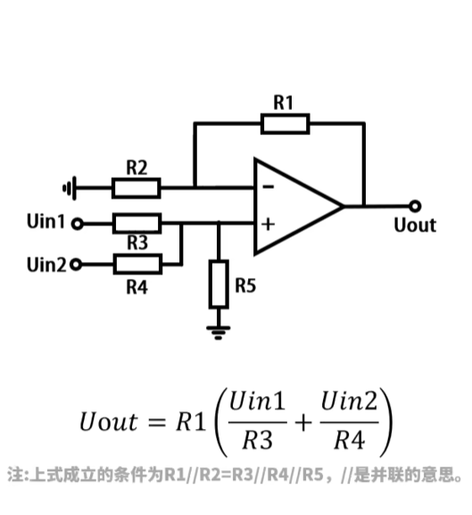

这是一个**差分输入运放电路**，我们可以通过运放的**虚短**（($U_+ = U_-$)）和**虚断**（输入电流 ($I_{in} \approx 0$)）特性来推导输出表达式。

---

#### 1. 同相端电压 \(U_+\) 计算

根据虚断，同相端的电流满足：
$$
\frac{U_{in1} - U_+}{R_3} + \frac{U_{in2} - U_+}{R_4} = \frac{U_+}{R_5}
$$
整理得：
$$
\frac{U_{in1}}{R_3} + \frac{U_{in2}}{R_4} = U_+ \left( \frac{1}{R_3} + \frac{1}{R_4} + \frac{1}{R_5} \right)
$$

---

#### 2. 反相端电压 ($U_-$) 计算

根据虚断，反相端的电流满足：
$$
\frac{0 - U_-}{R_2} + \frac{U_{out} - U_-}{R_1} = 0
$$
整理得：
$$
U_- = U_{out} \cdot \frac{R_2}{R_1 + R_2}
$$

---

#### 3. 利用虚短 ($U_+ = U_-$) 建立关系

将 ($U_+$) 和 ($U_-$) 的表达式代入虚短条件：
$$
\frac{U_{in1}}{R_3} + \frac{U_{in2}}{R_4} = U_{out} \cdot \frac{R_2}{R_1 + R_2} \cdot \left( \frac{1}{R_3} + \frac{1}{R_4} + \frac{1}{R_5} \right)
$$

---

#### 4. 引入并联条件简化

题目给出的关键条件是：
$$
R_1 \parallel R_2 = R_3 \parallel R_4 \parallel R_5
$$
即：
$$
\frac{R_1 R_2}{R_1 + R_2} = \frac{R_3 R_4 R_5}{R_3 R_4 + R_3 R_5 + R_4 R_5}
$$
两边取倒数可得：
$$
\frac{R_1 + R_2}{R_1 R_2} = \frac{R_3 R_4 + R_3 R_5 + R_4 R_5}{R_3 R_4 R_5} = \frac{1}{R_3} + \frac{1}{R_4} + \frac{1}{R_5}
$$

将此关系代入 ($U_+$)的表达式：
$$
U_+ = \left( \frac{U_{in1}}{R_3} + \frac{U_{in2}}{R_4} \right) \cdot \frac{R_1 R_2}{R_1 + R_2}
$$

再结合 ($U_- = U_{out} \cdot \frac{R_2}{R_1 + R_2}$) 和 ($U_+ = U_-$)，消去公共项后得到：
$$
U_{out} = R_1 \left( \frac{U_{in1}}{R_3} + \frac{U_{in2}}{R_4} \right)
$$

---

#### 结论

在满足 ($R_1 \parallel R_2 = R_3 \parallel R_4 \parallel R_5$) 的条件下，该差分运放电路的输出为：
$$
\boldsymbol{U_{out} = R_1 \left( \frac{U_{in1}}{R_3} + \frac{U_{in2}}{R_4} \right)}
$$

这个公式表明，输出是两个输入信号按比例加权后的和，比例系数由反馈电阻 ($R_1$) 和输入电阻 ($R_3$)、($R_4$) 决定。

### 反相积分器电路分析

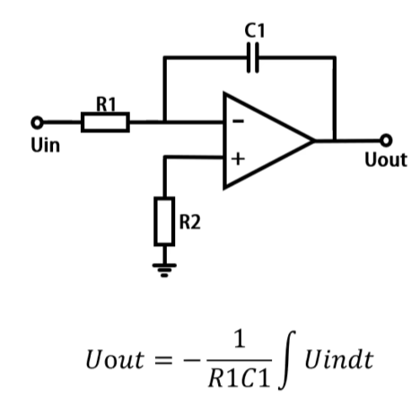

这是一个典型的**反相积分运算电路**，通过运放的虚短、虚断特性，实现对输入信号的积分运算。

---

#### 1. 电路结构
- 输入信号 $$U_{in}$$ 经电阻 $$R_1$$ 接入运放**反相端**
- 运放**同相端**经电阻 $$R_2$$ 接地（$$R_2$$ 用于平衡输入偏置电流，通常取 $$R_2 = R_1$$）
- 反馈元件为电容 $$C_1$$，连接运放输出端与反相端，构成**电压并联负反馈**

---

#### 2. 核心原理推导
利用运放的两个关键特性：
- **虚短**：$$U_+ = U_-$$（同相端与反相端电位近似相等）
- **虚断**：运放输入电流近似为0

** 步骤1：确定同相端电位**
同相端经 $$R_2$$ 接地，因此 $$U_+ = 0$$。根据虚短，反相端电位 $$U_- = 0$$（反相端为**虚地**）。

**步骤2：电流关系**
由于虚断，流过 $$R_1$$ 的电流全部流入电容 $$C_1$$：
$$
I_{R1} = I_{C1}
$$
其中：
- 流过 $$R_1$$ 的电流：$$I_{R1} = \frac{U_{in} - U_-}{R_1} = \frac{U_{in}}{R_1}$$（因 $$U_- = 0$$）
- 流过 $$C_1$$ 的电流：$$I_{C1} = C_1 \cdot \frac{d(U_- - U_{out})}{dt} = -C_1 \cdot \frac{dU_{out}}{dt}$$（因 $$U_- = 0$$）

**步骤3：建立微分方程**
将电流关系代入：
$$
\frac{U_{in}}{R_1} = -C_1 \cdot \frac{dU_{out}}{dt}
$$
整理得：
$$
dU_{out} = -\frac{1}{R_1 C_1} U_{in} dt
$$

**步骤4：积分求解**
对两边积分（初始条件 $$U_{out}(0) = 0$$）：
$$
U_{out} = -\frac{1}{R_1 C_1} \int U_{in} dt
$$

---

#### 3. 结论
该反相积分器的输出表达式为：
$$
\boldsymbol{U_{out} = -\frac{1}{R_1 C_1} \int U_{in} dt}
$$
- 负号表示输出与输入相位相反
- 积分时间常数由 $$R_1 C_1$$ 决定，决定了积分的速率

---

#### 4. 典型应用
- **波形变换**：将方波输入转换为三角波输出
- **滤波电路**：作为低通滤波器，抑制高频噪声
- **控制与测量**：在PID控制器、积分型模数转换器中实现积分运算
- **信号处理**：用于计算信号的累积量（如电荷量、能量等）

## 运放的重要特性

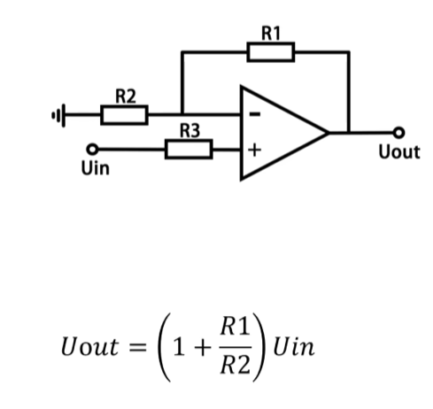

### 虚短

虚短的概念是指==运放在正常工作过程中，其$V+=V-$==；

原因：

1. 从数学公式上解释： $V_{out} = (V_+ - V_-) * {GAIN}_{开环}$

   ${GAIN}_{开环}$这个值是非常大的：$\frac{V_{out}}{{GAIN}_{开环}} = (V_+ - V_-)$

2. 从物理本质上解释： 

   当运放发现$V+>V-$时，输出$V_{out}$上升

   当运放发现$V+≤V-$时，输出$V_{out}$下降

条件：

1. 深度负反馈
2. 输出不饱和（处于在放大区）

**负反馈（稳定、纠错）**

**一句话：偏差出现 → 系统往反方向拉 → 回到稳定**

- 作用：**稳、准、抑制波动**

- 生活例子：

  - 空调：温度高了制冷，低了制热，把温度稳住
  - 人体体温：热了出汗，冷了发抖，维持 37℃

- 电路里：

  运放放大、稳压电源、稳压电路，几乎所有追求稳定的电路都用负反馈。

- **只要接了负反馈，基本都属于「深度负反馈」**

------

**正反馈（放大、失控、突变）**

**一句话：偏差出现 → 系统顺着偏差推 → 偏差越来越大**

- 作用：**放大、加速、触发突变、产生振荡**

- 生活例子：

  - 麦克风靠近音箱：一点声音→越放越大→啸叫
  - 雪崩：一点松动→越滑越大→崩塌

- 电路里：

  正弦波振荡器、触发翻转（如施密特触发器翻转）、用来 “起振” 或 “跳变”。

------

**最简总结**

- **负反馈 = 维稳、纠错**
- **正反馈 = 放大、突变**

### 虚断

[72.运放虚断的根本原因哔哩哔哩_bilibili](https://www.bilibili.com/video/BV1gHSyY3E6q?spm_id_from=333.788.videopod.episodes&vd_source=cae5e5e53a7fcdf3a7ac534a5a5e2344&p=74) (他讲的这种理解我觉得是很好理解的)

虚断的概念是指==运放的输入端口相对于外部电路来说，可以认为是断路==。

**先看一个简单的电路**

：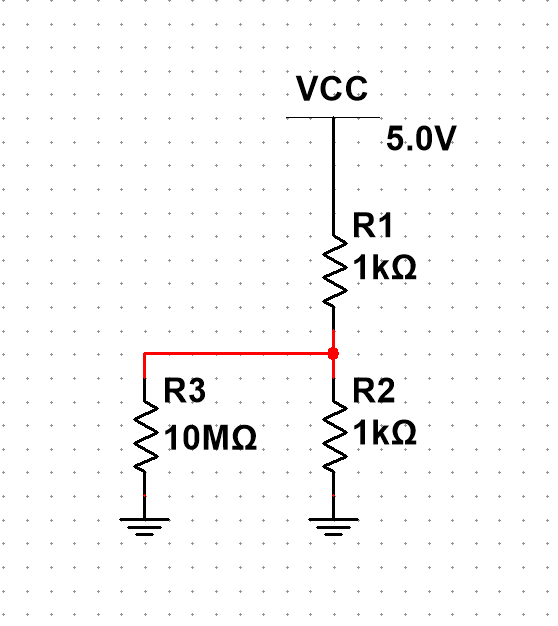

#### 运放「虚断」通俗讲解（电阻分压引入版）

##### 一、用电阻分压电路，从零理解「虚断」

**1. 基础电路**
- 电源：5V
- 电阻：两个 `1kΩ` 电阻串联分压
- 中间点电压：
$$V = 5V \times \frac{1k}{1k+1k} = 2.5V$$

**2. 并联一个极大电阻**
在其中一个 `1kΩ` 电阻两端，**并联一个 10MΩ 超大电阻**：

- 原电阻：$R_1 = 1kΩ$
- 并联电阻：$R_2 = 10MΩ$

并联后总电阻：
$$R_{并} = \frac{R_1 \times R_2}{R_1 + R_2} = \frac{1k \times 10M}{1k + 10M} \approx 1kΩ$$

**3. 结论**

- 总电阻**几乎还是 1kΩ**
- 分压点电压**几乎还是 2.5V**
- 10MΩ 电阻**并上去跟没并，对电路几乎没影响**

---

##### 二、什么是「虚断」？

从上面例子可以直接得出：

- 这个 10MΩ 电阻**真实存在，不是物理断开**
- 但它对原有电阻网络**几乎不产生影响、几乎不分流**
- 对电路分析来说，**等效看成断路**

这种：
**物理上没断，但对电路效果近似断路 → 就叫「虚断」。**

---

##### 三、对应到运放的虚断

运放输入端的虚断，本质和上面一模一样：

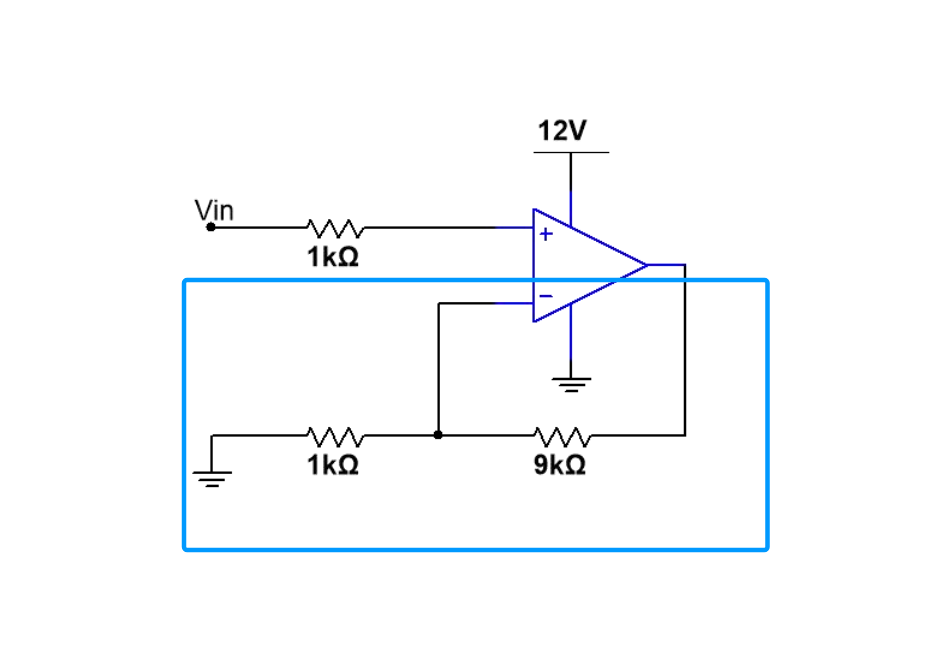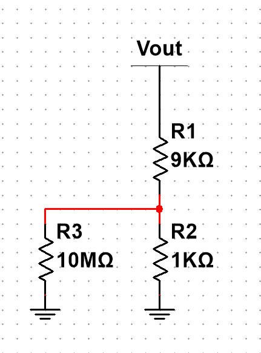

- 运放**输入阻抗极大**（几十 MΩ～几百 MΩ 级别）
- 相当于在外部电路上**并联了一个超级大电阻**
- 运放输入电流（偏置电流 $I_B$）极小（nA 级）
- 对外部电路几乎不影响、不改变电压

所以我们分析运放时：
**直接把输入端当成「虚断」，认为输入电流 ≈ 0。**

#### 运放虚断 & 偏置电流 IB 核心知识点
##### 1. 虚断的本质
运放输入端电流近似为 0（虚断）的核心原因：
- 运放输入偏置电流 **IB（Input Bias Current）** 极小，通常为**纳安（nA）级别**；
- 外部电路的工作电流多为**毫安（mA）级别**，nA 相对于 mA 可直接忽略，因此满足“虚断”条件。

##### 2. 外部电阻为何不能取太大？

以同相放大电路为例，理想放大倍数公式为：
$$
A_v = 1 + \frac{R_f}{R_1}
$$
- 理论上，$ \frac{9kΩ}{1kΩ} $、$ \frac{90kΩ}{10kΩ} $、$ \frac{9MΩ}{1MΩ} $ 的放大倍数均为 10；
- 但电阻取到 **兆欧（MΩ）级** 时，虚断不再严格成立：
  1. 运放输入阻抗虽高（百MΩ级），但外部电阻接近该量级时，IB 无法再忽略；
  2. IB 会在大阻值电阻上产生明显电压误差，导致输出电压计算值与实际值偏差大；
  3. 工程上普遍选用 **千欧（kΩ）级电阻**，避免 IB 引入的误差。

##### 3. 含 IB 的真实输出公式
考虑偏置电流影响时，同相放大电路的实际输出电压为：
$$
V_{out} = V_{in} \times \left(1 + \frac{R_f}{R_1}\right) + I_B \cdot R_{eq}
$$
- 典型案例：LM317（LDO 稳压芯片）需计入该公式，因内部基准运放的 IB 相对较大，无法忽略；
- 理解该原理后，分析芯片工作机制会更清晰。

##### 4. 核心结论
- 虚断成立的前提：外部电阻远小于运放输入阻抗，且阻值不会让 IB 产生可测误差；
- 电阻选型原则：优先 kΩ 级，避免 MΩ 级（除非特殊场景并补偿 IB 误差）；
- IB 是运放关键参数，低 IB 运放更适合高阻抗输入场景。

## 运放电路的分析办法

[2-4 运放电路分析](看这个就行)

### 同相放大器

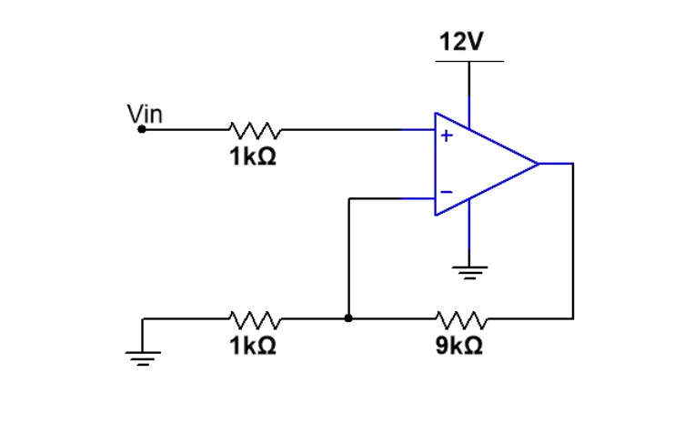

### 反相放大电路

### 单电源反相放大电路

### 差分放大电路

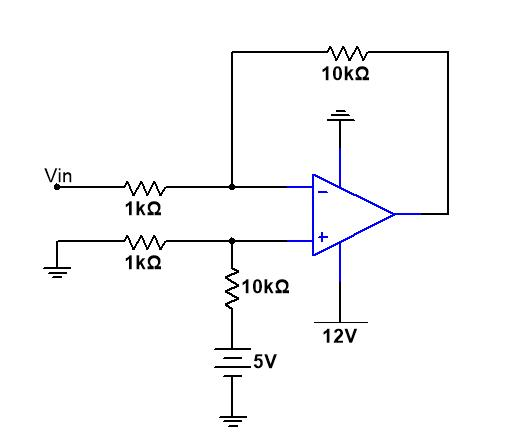

# 运放电路分析

## 同相放大器

### 同相比例运放电路完整分析
#### 一、电路结构
- 运放类型：同相比例放大器
- 外围电阻：
  - 输入限流电阻 ($R_{in}=1\ \text{k}\Omega$)
  - 反馈电阻 ($R_f=9\ \text{k}\Omega$)
  - 接地电阻 ($R_1=1\ \text{k}\Omega$)
- 供电：($+12\ \text{V}$) 单电源供电
- 核心特性：**虚短**、**虚断**

---

#### 二、理想运放分析（虚短 + 虚断）
**1. 虚断特性**
运放输入偏置电流 ($I_B \approx 0$)，输入端无电流流入流出。

因此输入电阻 ($1\ \text{k}\Omega$) 无压降：
$$
V_+ = V_{in}
$$

**2. 反相端电压（分压公式）**
$$
V_- = V_{out} \cdot \frac{R_1}{R_f + R_1}
$$

代入参数：
$$
V_- = V_{out} \cdot \frac{1\ \text{k}\Omega}{9\ \text{k}\Omega + 1\ \text{k}\Omega}
= \frac{V_{out}}{10}
$$

**3. 虚短特性**
$$
V_+ = V_-
$$

联立得：
$$
V_{in} = \frac{V_{out}}{10}
$$

**4. 理想放大倍数**
$$
V_{out} = 10 \cdot V_{in}
$$

通用同相放大公式：
$$
A_v = 1 + \frac{R_f}{R_1}
$$

---

#### 三、为何电阻不能取到 MΩ 级？（偏置电流 ($I_B$)）

1. 运放输入偏置电流 ($I_B$) 为 **nA 级**
2. 外部电路电流为 **mA 级**
   - nA 远小于 mA → 可忽略 → **虚断成立**
3. 若外部电阻取 **MΩ 级**：
   - 输入阻抗 ≈ 百MΩ
   - 外部电阻 ≈ 运放输入阻抗
   - \(I_B\) 产生的压降不可忽略
   - 虚断失效，输出严重失真

---

#### 四、考虑 ($I_B$) 的实际输出公式

$$
V_{out} = V_{in}\left(1+\frac{R_f}{R_1}\right) + I_B \cdot R_{eq}
$$

- 典型应用：**LM317 LDO**
  内部运放 ($I_B$) 较大，必须计入偏置电流项。

---

#### 五、线性工作范围

电源电压限制输出摆幅：
$$
V_{out(max)} \approx 12\ \text{V}
$$

最大不失真输入电压：
$$
V_{in(max)} = \frac{12\ \text{V}}{10} = 1.2\ \text{V}
$$

- ($V_{in} \le 1.2\ \text{V}$)：线性放大
- ($V_{in} > 1.2\ \text{V}$)：输出饱和

---

#### 六、工程结论

1. 放大倍数：**10 倍**
2. 电阻优选：**kΩ 级**，避免 MΩ 级
3. 虚断前提：外部电阻 **远小于** 运放输入阻抗
4. 高精度电路：必须考虑 $I_B$ 误差

## 反相放大电路

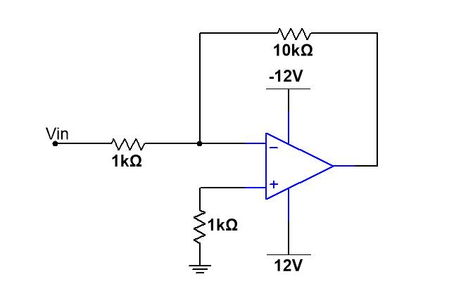

### 反相比例运放电路完整分析

#### 1. 电路识别
这是一个**反相比例放大器**，核心特征：
- 输入：$$V_{in}$$ 经 $$1\ \text{kΩ}$$ 电阻接反相端
- 反馈：反相端与输出端之间接 $$10\ \text{kΩ}$$ 反馈电阻
- 同相端：经 $$1\ \text{kΩ}$$ 电阻接地
- 供电：双电源 $$\pm12\ \text{V}$$ 供电

---

#### 2. 同相端电压 $$V_+$$ 计算
根据运放**虚断**特性（输入端电流≈0），同相端的 $$1\ \text{kΩ}$$ 电阻上无电流，因此：
$$
V_+ = 0\ \text{V}
$$

---

#### 3. 利用虚短+虚断求解输出电压
**3.1 虚短特性**
运放线性工作时满足 $$V_- = V_+$$，因此反相端电压为：
$$
V_- = 0\ \text{V}
$$

**3.2 虚断特性**
反相端输入电流近似为0，流入反相端的电流等于流出的电流，电流方程为：
$$
\frac{V_{in} - V_-}{1\ \text{kΩ}} = \frac{V_- - V_{out}}{10\ \text{kΩ}}
$$

**3.3 代入推导输出公式**
将 $$V_- = 0\ \text{V}$$ 代入电流方程：
$$
\frac{V_{in} - 0}{1\ \text{kΩ}} = \frac{0 - V_{out}}{10\ \text{kΩ}}
$$
整理得：
$$
\frac{V_{in}}{1\ \text{kΩ}} = -\frac{V_{out}}{10\ \text{kΩ}}
$$
两边同乘 $$10\ \text{kΩ}$$：
$$
V_{out} = -10V_{in}
$$

---

#### 4. 线性工作范围
运放双电源 $$\pm12\ \text{V}$$ 供电，输出摆幅受电源限制（$$-12\ \text{V} \leq V_{out} \leq 12\ \text{V}$$）：
- 下限条件：$$-12\ \text{V} \leq -10V_{in} \implies V_{in} \leq 1.2\ \text{V}$$
- 上限条件：$$-10V_{in} \leq 12\ \text{V} \implies V_{in} \geq -1.2\ \text{V}$$

因此电路线性工作的输入范围为：
$$
-1.2\ \text{V} \leq V_{in} \leq 1.2\ \text{V}
$$

---

#### 5. 核心结论
- **输出公式**：$$V_{out} = -10V_{in}$$，反相放大倍数为 $$-10$$（输出与输入反相）；
- **线性范围**：输入电压 $$V_{in}$$ 需在 $$-1.2\ \text{V} \sim 1.2\ \text{V}$$ 之间，超出则输出饱和；
- **工程意义**：反相比例放大器输入阻抗由输入电阻决定（$$1\ \text{kΩ}$$），输出阻抗低，适合信号反相放大场景。

## 单电源反相放大电路

### 带直流偏置的反相比例运放电路完整分析
#### 1. 电路识别
这是一个**带偏置的反相比例放大器**：
- 反相端：由 $V_{in}$ 经 $1\ \text{kΩ}$ 输入，反馈电阻 $10\ \text{kΩ}$ 连接输出与反相端。
- 同相端：由 $5\ \text{V}$、$10\ \text{kΩ}$ 和 $1\ \text{kΩ}$ 组成分压偏置电路。
- 供电：单电源 $12\ \text{V}$，地为参考电位。

---

#### 2. 同相端电压 $V_+$ 计算
同相端的分压网络为 $5\ \text{V} \to 10\ \text{kΩ} \to \text{同相端} \to 1\ \text{kΩ} \to \text{地}$，根据分压公式：
$$
V_+ = 5\ \text{V} \times \frac{1\ \text{kΩ}}{10\ \text{kΩ} + 1\ \text{kΩ}} = \frac{5}{11}\ \text{V} \approx 0.4545\ \text{V}
$$

---

#### 3. 利用虚短虚断求解输出
**3.1 虚短特性**
运放线性工作时满足 $V_- = V_+$，因此：
$$
V_- = \frac{5}{11}\ \text{V}
$$

**3.2 虚断特性**
反相端输入电流近似为0，因此流入反相端的电流等于流出的电流：
$$
\frac{V_{in} - V_-}{1\ \text{kΩ}} = \frac{V_- - V_{out}}{10\ \text{kΩ}}
$$

**3.3 代入求解 $V_{out}$**
将 $V_- = \frac{5}{11}\ \text{V}$ 代入方程：
$$
\frac{V_{in} - \frac{5}{11}}{1} = \frac{\frac{5}{11} - V_{out}}{10}
$$
两边乘以10并整理：
$$
10V_{in} - \frac{50}{11} = \frac{5}{11} - V_{out}
$$
$$
V_{out} = \frac{5}{11} + \frac{50}{11} - 10V_{in} = 5\ \text{V} - 10V_{in}
$$

---

#### 4. 线性工作范围
运放单电源 $12\ \text{V}$ 供电，输出摆幅限制为 $0\ \text{V} \leq V_{out} \leq 12\ \text{V}$：
- 下限：$5 - 10V_{in} \geq 0 \implies V_{in} \leq 0.5\ \text{V}$
- 上限：$5 - 10V_{in} \leq 12 \implies V_{in} \geq -0.7\ \text{V}$

因此，电路线性工作范围为：
$$
-0.7\ \text{V} \leq V_{in} \leq 0.5\ \text{V}
$$

---

#### 5. 核心结论
- **输出公式**：$V_{out} = 5\ \text{V} - 10V_{in}$，放大倍数为 $-10$（反相放大），并叠加了 $5\ \text{V}$ 的直流偏置。
- **线性范围**：输入电压需在 $-0.7\ \text{V}$ 到 $0.5\ \text{V}$ 之间，否则输出饱和。
- **工程意义**：通过同相端偏置，将反相放大器的输出直流电平抬升至 $5\ \text{V}$，适合单电源供电下的信号处理场景。

## 差分放大电路

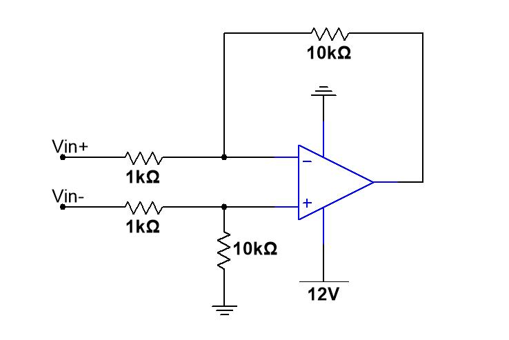

### 差分运放电路完整分析

#### 1. 电路识别
这是一个**差分放大器**（差分信号调理电路），核心特征：
- 差分输入：$V_{in+}$（经 $1\ \text{kΩ}$ 接反相端）、$V_{in-}$（经 $1\ \text{kΩ}$ 接同相端）
- 反馈网络：反相端与输出端之间接 $10\ \text{kΩ}$ 反馈电阻
- 同相端偏置：$10\ \text{kΩ}$ 电阻接地，构成分压网络
- 供电方式：单电源 $12\ \text{V}$ 供电，地为电位参考点

---

#### 2. 同相端电压 $V_+$ 计算
根据运放**虚断**特性（输入端电流≈0），$V_{in-}$ 经 $1\ \text{kΩ}$ 和 $10\ \text{kΩ}$ 电阻分压，同相端电压为：
$$
V_+ = V_{in-} \times \frac{10\ \text{kΩ}}{1\ \text{kΩ} + 10\ \text{kΩ}} = \frac{10}{11}V_{in-}
$$

---

#### 3. 利用虚短+虚断求解输出电压
 **3.1 虚短特性**
运放线性工作时满足 $V_- = V_+$，因此反相端电压为：
$$
V_- = \frac{10}{11}V_{in-}
$$

**3.2 虚断特性**
反相端输入电流近似为0，流入反相端的电流等于流出的电流，电流方程为：
$$
\frac{V_{in+} - V_-}{1\ \text{kΩ}} = \frac{V_- - V_{out}}{10\ \text{kΩ}}
$$

**3.3 代入推导输出公式**
将 $V_- = \frac{10}{11}V_{in-}$ 代入电流方程：
$$
\frac{V_{in+} - \frac{10}{11}V_{in-}}{1} = \frac{\frac{10}{11}V_{in-} - V_{out}}{10}
$$
两边同乘 $10$ 展开：
$$
10V_{in+} - \frac{100}{11}V_{in-} = \frac{10}{11}V_{in-} - V_{out}
$$
整理合并同类项：
$$
V_{out} = \frac{110}{11}V_{in-} - 10V_{in+}
$$
最终简化为差分放大核心公式：
$$
V_{out} = 10(V_{in-} - V_{in+}) = -10(V_{in+} - V_{in-})
$$

---

#### 4. 线性工作范围
运放单电源 $12\ \text{V}$ 供电，输出摆幅受电源限制（$0\ \text{V} \leq V_{out} \leq 12\ \text{V}$）：
- 下限条件：$10(V_{in-} - V_{in+}) \geq 0 \implies V_{in-} \geq V_{in+}$
- 上限条件：$10(V_{in-} - V_{in+}) \leq 12 \implies V_{in-} - V_{in+} \leq 1.2\ \text{V}$

因此电路线性工作的差分输入范围为：
$$
0 \leq V_{in-} - V_{in+} \leq 1.2\ \text{V}
$$

---

#### 5. 核心结论
- **输出公式**：$V_{out} = 10(V_{in-} - V_{in+})$，差分放大倍数为 $-10$（输出与差分输入反相）；
- **线性范围**：差分输入差值 $V_{in-} - V_{in+}$ 需在 $0\ \text{V} \sim 1.2\ \text{V}$ 之间，超出则输出饱和；
- **工程意义**：对称电阻网络实现差分信号放大，可有效抑制共模干扰，适用于传感器（如热电偶、应变片）信号调理场景。

# 轨对轨运放 and Vos

## 轨对轨与非轨对轨运放详解

---

### 第一部分：轨对轨运放详解

#### 一、什么是轨对轨运放？

在运算放大器中，“轨”（Rail）指电源电压。对于单电源供电，正轨是 \(V_{CC}\)（如 +5V），负轨是 GND（0V）；对于双电源供电，正轨是 \(+V_{CC}\)，负轨是 \(-V_{EE}\)。

**轨对轨（Rail-to-Rail）运放**是指其==输入或输出电压能力可以非常接近==（甚至达到）电源轨的运放。根据能力范围，分为：

- **输入轨对轨**：输入信号可以从负轨到正轨。
- **输出轨对轨**：输出电压可以从负轨到正轨。
- **满摆幅（输入/输出均轨对轨）**：两者都具备。

#### 二、为什么需要轨对轨运放？

传统运放（如 LM358、LM741）多为**非轨对轨**，其输入或输出摆幅受到限制：
- **输入范围限制**：例如 LM358 在单电源 5V 供电时，输入共模电压范围约为 0~3.5V，无法处理接近 GND 或接近 VCC 的信号。这导致低端电流检测（信号接近 GND）或高端电流检测（信号接近 VCC）时无法正常工作。
- **输出范围限制**：传统运放输出无法达到电源轨，例如在 5V 供电时最大输出可能只有 3.5V，最小输出可能 1.5V，浪费了动态范围，尤其在低电压系统中不可接受。

随着低电压、单电源、电池供电设备的普及，轨对轨运放成为必需，因为它能充分利用有限的电源电压范围，提供更大的动态范围。

#### 三、输入轨对轨的工作原理

实现输入轨对轨的关键是设计一个能在整个电源电压范围内正常工作的输入级。通常采用**互补差分输入对**结构：

- **PMOS 差分对**：处理接近负轨（GND）的输入信号。PMOS 管的源极可接正轨，栅极可接受低至负轨的电压。
- **NMOS 差分对**：处理接近正轨（VCC）的输入信号。NMOS 管的源极可接负轨，栅极可接受高至正轨的电压。
- 两个输入对并联，通过控制电路使其在不同输入范围内自动切换或同时工作。

**工作区域**：
- 当输入电压接近负轨（如 0V）时，PMOS 对导通，NMOS 对截止。
- 当输入电压接近正轨（如 5V）时，NMOS 对导通，PMOS 对截止。
- 在中间区域，两个对同时工作，共同提供跨导。

**潜在问题**：
- **交越失真**：在两个输入对切换区域，总跨导可能变化，导致运放增益变化，引起非线性失真。现代设计通过优化偏置电路使总跨导保持恒定。
- **输入失调电压变化**：不同输入对可能有不同的失调电压，导致在整个输入范围内 VOS 发生变化。精密轨对轨运放会采用校准技术来改善。

#### 四、输出轨对轨的工作原理

输出级要实现接近电源轨的输出，通常采用**共源级**或**互补输出级**：

- **NMOS + PMOS 互补输出**：NMOS 负责拉电流到正轨，PMOS 负责灌电流到负轨。当输出需要接近正轨时，NMOS 管进入线性区，漏源电压很小，使输出接近 VCC；当需要接近负轨时，PMOS 管进入线性区，输出接近 GND。
- 这种结构类似于 CMOS 反相器，但需配合适当的偏置以避免交越失真。

**限制因素**：
- 输出管导通电阻 (\(R_{DS(on)}\)) 和负载电流会导致一定的压降，因此输出电压无法绝对等于电源轨，但可以非常接近（如相差几 mV 到几十 mV）。
- 输出摆幅还与负载有关：负载越重，压降越大。

#### 五、轨对轨运放的优缺点

**优点**
1. **宽动态范围**：输入/输出可覆盖整个电源电压，特别适合低电压（如 3.3V、1.8V）系统。
2. **单电源操作**：无需双电源即可处理地电位附近的信号，简化电路设计。
3. **高精度**：在数据采集、传感器接口等应用中，能最大化 ADC 的输入范围，减少增益误差。
4. **适合电池供电**：充分利用电池电压，延长工作时间。

**缺点**
1. **设计复杂，成本略高**：相比传统运放，内部电路更复杂，价格稍贵。
2. **可能存在的非线性**：输入级切换区域可能导致增益变化或失真，高性能应用需选精密型。
3. **输入失调电压变化**：某些低成本轨对轨运放 VOS 随输入共模电压变化较大。
4. **功耗可能稍高**：互补输入级需要额外的偏置电流。

#### 六、主要应用场景

- **单电源数据采集系统**：传感器信号可能接近 GND 或 VCC，如压力传感器、光电二极管。
- **电池管理**：电流检测（高端/低端）、电池电压监测。
- **音频设备**：便携式音频放大器需要最大摆幅。
- **汽车电子**：宽电压范围内工作。
- **比较器应用**：输入需覆盖整个电源范围。
- **电机控制**：电流采样。

#### 七、如何选择合适的轨对轨运放？

1. **确认输入/输出轨对轨需求**：是否需要同时输入和输出轨对轨？有些应用仅需其中一种。
2. **电源电压范围**：运放必须支持你的供电电压（如 1.8V~5.5V）。
3. **输入失调电压 (VOS)**：对于精密测量，需选择低 VOS 且 VOS 随共模电压变化小的型号。
4. **带宽和压摆率**：根据信号频率选择。
5. **噪声**：低噪声设计需关注输入电压噪声密度。
6. **静态电流**：电池供电设备需低功耗型号。
7. **输出驱动能力**：能否驱动所需负载。

#### 八、常见轨对轨运放型号举例

| 型号     | 类型            | 电源电压  | 特点                   |
| -------- | --------------- | --------- | ---------------------- |
| LMV321   | 输入/输出轨对轨 | 2.7V~5.5V | 低成本，通用           |
| MCP6001  | 输入/输出轨对轨 | 1.8V~5.5V | 低功耗，单位增益稳定   |
| OPA333   | 输入/输出轨对轨 | 1.8V~5.5V | 零漂移，低失调，精密   |
| AD8605   | 输入/输出轨对轨 | 2.7V~5.5V | 低噪声，低失调         |
| TLV9001  | 输入/输出轨对轨 | 1.8V~5.5V | 低成本，容性负载驱动强 |
| MAX44248 | 输入/输出轨对轨 | 2.7V~5.5V | 高精度，低功耗         |

#### 九、总结

轨对轨运放是现代电子设计中不可或缺的元件，它打破了传统运放的电压限制，使得在低压单电源系统中也能处理满幅信号。理解其工作原理和特性，有助于合理选型，避免设计陷阱，实现高性能电路。

在设计时需注意：并非所有轨对轨运放都一样——输入级的结构差异会导致 VOS 随共模电压变化，输出级的驱动能力影响摆幅，需根据具体应用仔细选择。

---

### 第二部分：非轨对轨运放详解

#### 一、什么是非轨对轨运放？

非轨对轨运放是指其**输入电压范围**和/或**输出电压摆幅**无法达到电源轨（即电源电压的两个极端）的运算放大器。

- **输入非轨对轨**：输入信号必须限制在电源电压范围内的一个子区间内，不能太靠近正电源轨或负电源轨（地）。
- **输出非轨对轨**：输出电压无法摆到电源轨，与正负轨之间总存在一定的电压差（称为输出饱和压降）。

传统的通用运放，如 LM358、LM324、741、NE5532、TL081 等，都属于非轨对轨类型。它们在双电源供电（如 ±15V）时代是主流，但在低压单电源应用中限制凸显。

#### 二、输入非轨对轨的原因与工作原理

##### 1. 输入级结构决定共模范围

运放的输入级通常由差分对管构成，常见类型有：
- **BJT（双极型晶体管）差分对**：如 NPN 或 PNP 对管。
- **JFET（结型场效应管）差分对**：如 NJFET 或 PJFET 对管。
- **MOSFET 差分对**：如 NMOS 或 PMOS 对管（但早期 MOS 运放较少）。

这些输入级都有其正常工作的共模电压范围，超出范围会导致输入级晶体管进入截止区或饱和区，运放失去放大作用。

##### 以 BJT 输入级为例（如 LM358 的 PNP 输入级）：
- LM358 采用 PNP 晶体管作为输入差分对。PNP 管的发射极接正电源，基极输入信号。为了使 PNP 管工作在放大区，需要保证基极电压（即输入共模电压）比发射极电压低一定值（至少一个 VEB 压降，约 0.6V），同时还要为尾电流源留出电压余量。
- 因此，输入共模电压不能太高，必须低于正电源一定值（通常 1.5V~2V）。同时，因为 PNP 管的集电极可以接近负电源，所以输入可以低至负电源（甚至略低于负电源），但对于单电源接地的情况，输入可以低至 0V（甚至负一点），但无法高到接近正电源。
- 反过来，NPN 输入级的运放（如 741）则输入可以高至接近正电源，但无法低至负电源。

##### 典型输入范围举例：
- **LM358 / LM324**（单电源）：共模输入电压范围为 **0 ~ VCC - 1.5V**（典型值）。即输入信号最高不能超过 VCC - 1.5V，最低可到 0V（实际可略低于 0V，但输出会反相）。
- **NE5532**（双极型，NPN 输入级）：共模输入电压范围为 **±13V**（在 ±15V 供电时），即输入不能太接近负电源。
- **TL081**（JFET 输入级）：共模输入电压范围较宽，通常为 **±11.5V**（±15V 供电时），但仍不能到轨。

##### 2. 为什么不能到轨？

输入级需要一定的“净空”来维持晶体管处于放大区：
- 对于 BJT 差分对，需要一定的基极-发射极电压（约 0.6V）以及尾电流源的电压余量。
- 对于 JFET 差分对，需要一定的栅源电压和夹断电压余量。
- 对于 MOSFET 差分对，需要阈值电压和过驱动电压。

因此，输入共模范围总是与电源轨保持一定距离，这个距离因工艺和设计而异，一般在 1V 到几伏之间。

#### 三、输出非轨对轨的原因与工作原理

##### 1. 输出级结构决定摆幅

传统运放的输出级常采用**互补推挽射极跟随器**（BJT）或**源极跟随器**（FET）。这种结构具有低输出阻抗、高驱动能力，但存在一个固有缺点：输出电压无法达到电源轨。

##### 以 BJT 射极跟随器输出级为例：
- 输出级由 NPN 和 PNP 管组成，NPN 管负责拉电流（输出高电压），PNP 管负责灌电流（输出低电压）。
- NPN 射极跟随器：基极电压比发射极电压高一个 \(V_{BE}\)（约 0.6V）。当输出试图接近正电源时，NPN 管的基极电压需要比正电源还高 \(V_{BE}\)，但基极电压来自前级放大，无法超过正电源，因此输出电压最高只能到 \(V_{CC} - V_{CE(sat)} - V_{BE}\) 左右，通常比 VCC 低 1~2V。
- PNP 射极跟随器类似，输出电压最低只能到 \(V_{EE} + V_{CE(sat)} + V_{BE}\)（或对地单电源时，最低只能到 1~2V）。

##### 典型输出摆幅举例：
- **LM358**（单电源 5V）：最大输出电压约 **3.5V**（负载较轻时），最小输出电压约 **0.1~0.3V**（实际上 LM358 输出可以接近地，因为它的输出级是集电极开路结构？需要澄清：LM358 输出级是 NPN 达林顿管上拉，PNP 管下拉，下拉可以到接近地，但上拉不能到 VCC，通常典型值为 VCC-1.5V。具体数据手册：在 5V 供电、负载 2kΩ 时，最大输出约 3.5V，最小输出约 0.2V。
- **NE5532**（±15V 供电）：最大输出电压约 **±12V ~ ±13V**，离轨差 2~3V。
- **TL081**（±15V 供电）：最大输出电压约 **±12V ~ ±13.5V**。

##### 2. 为什么输出不能到轨？

输出级晶体管需要一定的饱和压降（\(V_{CE(sat)}\) 或 \(V_{DS(on)}\)）才能工作。当输出管进入饱和区或线性区时，其管压降不可能为零，这导致输出与电源轨之间存在电压差。负载电流越大，压降越大。

#### 四、与非轨对轨相关的重要参数

1. **输入共模电压范围 (Input Common-Mode Voltage Range)**：运放正常工作时允许的输入电压范围。数据手册中通常给出测试条件，如 \(V_{ICR}\) 或 Common-Mode Input Voltage Range。
2. **输出电压摆幅 (Output Voltage Swing)**：在指定负载和供电条件下，运放能输出的最大和最小电压。通常表示为 \(V_{OH}\)（高电平输出）和 \(V_{OL}\)（低电平输出），并给出与电源轨的差值。

#### 五、非轨对轨运放的实际影响

##### 1. 低端电流检测失效（与你讲课内容直接相关）
在低端电流检测中，采样电阻上的电压非常接近地（0V）。如果使用非轨对轨运放且其输入范围不能到地，那么输入信号可能落在共模范围之外，导致运放无法正常工作，输出误差巨大。这就是你在讲课中提到的 LM358 在单电源下测不准的原因。

##### 2. 高端电流检测同样困难
如果检测高端电流（采样电阻靠近正电源），输入信号接近 VCC，同样需要运放输入范围能接近 VCC，否则也会失效。

##### 3. 动态范围损失
在 ADC 驱动等应用中，如果运放输出不能满摆幅，会浪费 ADC 的部分量程，降低信噪比。例如 5V 供电下，最大输出只有 3.5V，则 ADC 的满量程无法利用，必须增加增益或使用参考电压调整，带来额外复杂度。

##### 4. 可能引起失真
当输出信号接近电源轨时，由于输出级进入饱和区，会产生削波失真。

#### 六、常见非轨对轨运放型号及范围

| 型号   | 输入共模范围（典型，单电源5V） | 输出摆幅（典型，5V，轻载）      | 输入级类型 |
| ------ | ------------------------------ | ------------------------------- | ---------- |
| LM358  | 0 ~ 3.5V                       | 0.02V ~ 3.5V                    | PNP 输入   |
| LM324  | 0 ~ 3.5V                       | 0.02V ~ 3.5V                    | PNP 输入   |
| NE5532 | 需双电源，单电源性能差         | ±12V (@±15V)                    | NPN 输入   |
| TL081  | 可单电源但需偏置，输入范围有限 | ±12V (@±15V) 或 0.5V~4.5V (@5V) | JFET 输入  |
| UA741  | 需双电源，单电源下无法工作     | ±13V (@±15V)                    | NPN 输入   |

*注：具体数值以数据手册为准，不同测试条件有差异。*

#### 七、为什么还在使用非轨对轨运放？

尽管轨对轨运放很流行，非轨对轨运放在许多场合仍有优势：

1. **成本低**：传统工艺成熟，价格便宜。
2. **某些性能更优**：
   - **噪声**：BJT 输入级通常比 CMOS 轨对轨输入级噪声低。
   - **速度**：某些非轨对轨运放具有更高的带宽和压摆率。
   - **精密特性**：如低失调、低温漂等，经典精密运放如 OP07 也是非轨对轨，但精度极高。
3. **双电源应用无压力**：在 ±15V 等双电源系统中，输入输出范围通常足够覆盖信号摆幅，轨对轨并非必需。
4. **供电电压较高**：当供电电压较高（如 12V 以上）时，传统运放的输入输出范围通常能满足大多数信号需求，轨对轨优势不明显。

#### 八、如何应对非轨对轨运放的限制？

在实际电路设计中，可以采取以下方法规避其限制：

##### 1. 针对输入范围限制
- **加负电源**：如你讲课中提到的，给运放提供负电源（如 -5V），使输入共模范围覆盖信号。这适用于低端检测，输入信号接近 GND，加负电源后 GND 相对运放变为正电压，落在输入范围内。
- **抬升偏置（电平移位）**：将输入信号平移到一个适合运放输入的直流电平上。例如用电阻分压给同相端加一个偏置电压，使信号在运放输入范围内。
- **选择适合的输入级类型**：如果信号接近地，选择 PNP 输入级的运放（如 LM358）可以工作；如果信号接近正电源，选择 NPN 输入级的运放（如 NE5532 但需注意单电源能力有限）。
- **使用仪表放大器**：某些仪表放大器具有宽输入范围。

##### 2. 针对输出范围限制
- **提高电源电压**：给运放提供更高电压，使输出摆幅足够覆盖所需范围。
- **使用后级电平移位**：将输出信号通过电阻分压或电平转换电路，调整到 ADC 的输入范围。
- **选择轨对轨输出运放**：如果必须单电源低电压且需要满摆幅，直接选用轨对轨输出运放。

##### 3. 结合软件校准
如你讲课所述，对于失调电压等影响，可以用软件校准消除。但对于输入共模范围根本性限制，软件无法弥补，只能通过硬件解决。

#### 九、总结

非轨对轨运放是传统运放的主流，其输入输出范围受内部晶体管工作条件的限制，无法达到电源轨。在现代低压单电源系统中，这些限制可能导致电路失效，特别是在靠近电源轨的信号检测中。

理解非轨对轨运放的特性，有助于我们在设计时正确选型并采取适当的偏置、电平移位或供电方案，或者直接选用轨对轨运放来满足需求。同时，非轨对轨运放凭借成本、噪声、速度等优势，在双电源或较高电压系统中仍广泛使用，是工程师工具箱中不可或缺的部分。

在实际工程中，应根据信号范围、供电条件、性能要求和成本综合考虑，选择最合适的运放类型。

---
*文档结束*

## 为什么比较器和运放都有输入失调电压（VOS）？

输入失调电压（\(V_{OS}\)）是运算放大器和比较器共有的非理想特性。尽管它们的功能不同——运放用于闭环放大，比较器用于开环电压比较——但两者的输入级都基于**差分放大器结构**，因此产生 \(V_{OS}\) 的根源完全相同。

---

### 一、什么是输入失调电压？

**定义**：对于一个理想的**差分放大器**，当两个输入端电压相等时，输出应为零（对于运放）或输出应跳变（对于比较器）。但实际器件中，由于内部电路不对称，需要施加一个很小的差分输入电压，才能使输出达到预期状态。这个所需的差分电压就是 **输入失调电压 \(V_{OS}\)**。

通俗理解：可以看作器件内部自带的一个“微小偏差电压”，叠加在输入信号上，导致实际比较或放大的基准点偏离理想值。

---

### 二、产生 \(V_{OS}\) 的根本原因

\(V_{OS}\) 源于芯片制造过程中的**随机物理不匹配**，没有任何两个晶体管能做到完全一致。具体包括以下几个方面：

#### 1. 输入对管的阈值电压（\(V_{th}\)）失配
- 即使是同一晶圆上相邻的晶体管，由于掺杂浓度、氧化层厚度等工艺参数的微观波动，两个管的阈值电压也会有微小差异。
- 对 MOSFET 而言，\(V_{th}\) 失配意味着在相同栅压下的导通能力不同；对 BJT 而言，则是基极-发射极电压 \(V_{BE}\) 的失配。这种差异必须靠外部施加的失调电压来“平衡”。

#### 2. 几何尺寸（W/L）失配
- 光刻、刻蚀等工艺步骤会引入沟道宽度和长度的微小偏差，导致两个管的跨导（\(g_m\)）不一致。
- 跨导不同意味着即使在相同栅压下，两个管的电流增益也不同，同样需要失调补偿。

#### 3. 负载元件失配
- 输入级通常采用有源负载（如电流镜）或电阻。如果负载元件值不匹配（例如电流镜比例偏差、电阻阻值偏差），即使输入对管完全对称，输出也会偏移，从而等效为输入失调。

#### 4. 温度梯度
- 芯片工作时，不同区域可能存在微小温差，导致晶体管参数（如 \(V_{th}\)、迁移率）随温度变化不一致，引入额外的失调分量。

#### 5. 机械应力
- 封装过程中产生的机械应力会改变半导体材料的能带结构，影响晶体管的电特性，进一步加剧不匹配。

#### 6. 长期漂移
- 器件老化也可能导致参数缓慢变化，使 \(V_{OS}\) 随时间轻微改变。

这些因素都是随机的、不可控的，因此每个器件的 \(V_{OS}\) 大小和方向都不同，数据手册中通常给出典型值和最大值范围。

---

### 三、为什么运放和比较器都存在 \(V_{OS}\)？

运放和比较器的输入级本质上都是**差分对**结构，因此上述物理不匹配问题对两者同样存在。它们的差异主要体现在后续设计和应用上：

- **运放**：通常用于闭环放大，要求高精度、低失真。为了减小 \(V_{OS}\)，一些精密运放会采用**斩波稳定**、**自动归零**或**激光修调**等技术，使 \(V_{OS}\) 降至微伏级。但成本、功耗或带宽可能受影响。
- **比较器**：主要追求高速开环比较，通常没有频率补偿（带宽极宽），但精度要求相对较低。因此比较器的 \(V_{OS}\) 一般比精密运放大（几毫伏到十几毫伏），而且往往不内置校准电路。此外，比较器常引入**滞后（正反馈）** 来避免噪声误触发，但滞后并不消除 \(V_{OS}\)，只是让跳变点产生回差。

因此，尽管两者产生 \(V_{OS}\) 的物理根源相同，但实际应用中，运放的 \(V_{OS}\) 可能经过优化而更小，而比较器的 \(V_{OS}\) 通常更大且更直接地影响比较阈值。

---

### 四、\(V_{OS}\) 对电路的影响

- **对运放**：在直流放大器中，\(V_{OS}\) 会导致输出直流偏移；在高增益电路中，可能使输出饱和。需要外部调零或选择低 \(V_{OS}\) 运放。
- **对比较器**：\(V_{OS}\) 会使实际比较阈值偏离设定值。例如，过零检测器可能不是在 0V 跳变，而是在 ±\(V_{OS}\) 处跳变，导致精度下降。

---

### 五、如何应对 \(V_{OS}\)？

#### 1. 选择合适器件
- 对精度要求高时，选用低 \(V_{OS}\) 的精密运放或比较器。
- 注意数据手册中的 \(V_{OS}\) 最大值及温漂。

#### 2. 外部调零/校准
- 利用外部电位器或数字电路在输入端叠加补偿电压。
- 对于单片机系统，可进行软件校准：先测量零点偏移，再在测量结果中减去。

#### 3. 系统设计考虑
- 通过交流耦合避免直流失调。
- 在比较器应用中，可加入滞后电路来克服 \(V_{OS}\) 带来的不确定性（但滞后不消除 \(V_{OS}\)）。

---

### 总结

比较器和运放的输入失调电压（\(V_{OS}\)）源于**差分输入级元器件的物理不匹配**，这是半导体工艺的固有随机性造成的。虽然两者功能不同，但产生机制一致。理解 \(V_{OS}\) 的成因，有助于我们在电路设计中正确评估误差，并采取适当的校准或选型措施，以满足系统精度要求。

