# 恒流源电路

## 低端反馈电路

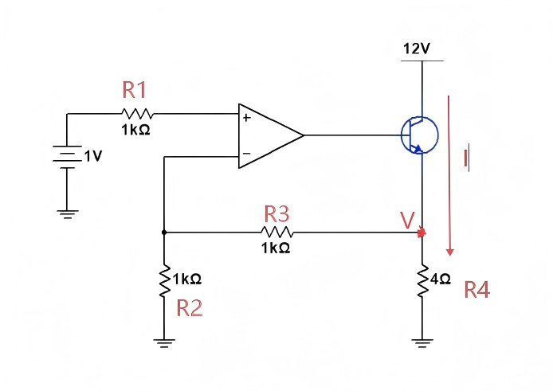

本电路为**深度电压负反馈 + NPN三极管功率扩流**的精密电子负载恒流源：

1. 输入端提供**稳定1V基准电压**，接入运放同相端；
2. 三极管发射极采样电压，经$R_3、R_2$分压网络反馈至运放反相端；
3. 运放依托理想**虚短、虚断**特性，强制反相端电压精准跟随基准电压；
4. 运放输出动态调整三极管基极电位，改变三极管$V_{CE}$管压降；
5. 闭环作用下，负载回路电流被牢牢钳位恒定，抑制负载阻值、电源波动带来的电流扰动；
6. 本质：恒流源不凭空产生能量，仅对**12V电压源的输出电流做闭环限流/恒流控制**。

### 一、基本概念

#### 1. 恒压源

- 输出**电压恒定不变**；
- 负载电阻 $R_L$ 变化时，**电流随之改变**；
- 遵循 $I=\dfrac{U}{R}$，$U$ 固定，$R$ 变则 $I$ 变。

#### 2. 恒流源
- 输出**电流恒定不变**；
- 负载电阻 $R_L$ 变化时，**电压随之改变**；
- 遵循 $U=I\cdot R$，$I$ 固定，$R$ 变则 $U$ 变。

#### 3. 电路定位
本电路为**运放 + 三极管（只负责开关电流） + 电阻网络**构成的**低端反馈恒流源**，属于**电压控制电流源（VCCS）**，由输入电压 $V_{IN}$ 控制，输出与负载无关的恒定电流。

---

### 二、电路参数
- 输入基准电压：$V_{IN}=1\ \text{V}$
- 运放反馈分压电阻：$R_2=R_3=1\ \text{k}\Omega$
- 电流采样电阻：$R_4=4\ \Omega$

---

### 三、核心分析依据：虚短 & 虚断
电路为**深度负反馈**，运放工作在线性区：
1. **虚断**
   运放输入端电流近似为 0，流过 $R_2$、$R_3$ 的电流相等 $I_2 == I_3 == 0$。

2. **虚短**
   同相端与反相端电位相等：
   $$V_+ = V_-$$

---

### 四、严谨公式推导

$V_E = V$

1. 由虚短：
   $$V_- = V_+ = V_{IN} = 1\ \text{V}$$

2. 由虚断，$R_2$ 与 $R_3$ 电流相等：
   $$\frac{V_-}{R_2}=\frac{V_E - V_-}{R_3}$$

3. 代入 $R_2=R_3=1\ \text{k}\Omega$、$V_-=1\ \text{V}$：
   $$\frac{1}{1000}=\frac{V_E-1}{1000} \implies V_E=2\ \text{V}$$

4. 回路恒定电流：
   $$I=\frac{V_E}{R_4}=\frac{2}{4}=0.5\ \text{A}=500\ \text{mA}$$​

---

### 五、负载的作用与恒流机制
1. **负载定义**
   串联在主回路中的用电元件（$1\ \Omega$、$2\ \Omega$、$5\ \Omega$ 等），只消耗电能，不参与控制。

2. **恒流原理**
   - 负载增大 → 电流有减小趋势
   - 采样电阻 $R_4$ 电压下降
   - 运放通过负反馈调节三极管导通程度
   - 强制将电流拉回 $0.5\ \text{A}$

结论：**负载阻值变化不改变输出电流大小。**

---

### 六、输出电压随负载的变化规律

恒流源特性：**电流恒定，电压自适应负载**
$$U_{\text{out}} \approx I\cdot R_L$$

- 负载 $R_L=1\ \Omega$：输出电压约 $2.5\ \text{V}$
- 负载 $R_L=5\ \Omega$：输出电压约 $4.5\ \text{V}$

结论：**负载越大，输出电压越高；负载越小，输出电压越低。**

---

### 七、仿真误差解释（501 mA 而非 500 mA）
1. 实际运放存在**输入偏置电流**，不满足理想虚断；
2. 反馈电阻 $1\ \text{k}\Omega$ 偏小，偏置电流影响不可忽略；
3. 导致 $V_E$ 略大于 $2\ \text{V}$，电流略偏大。

改善方式：增大反馈电阻至 $10\ \text{k}\Omega$ 以上，可显著减小误差。

---

### 八、恒压源 vs 恒流源（核心对比）
| 类型     | 恒定量     | 负载增大时变化 | 负载减小时变化 |
|----------|------------|----------------|----------------|
| 恒压源   | 电压 $U$   | 电流 $I$ 减小  | 电流 $I$ 增大  |
| 恒流源   | 电流 $I$   | 电压 $U$ 增大  | 电压 $U$ 减小  |

一句话总结：**恒压源稳压不恒流，恒流源恒流不稳压。**

---

### 九、整体总结
本电路利用运放**虚短、虚断**与闭环负反馈，将采样电阻上端电压稳定在 $2\ \text{V}$，在 $4\ \Omega$ 电阻上实现
$$I=0.5\ \text{A}$$
的恒定输出电流。
- 负载变化只改变输出电压，不改变电流；
- 仿真误差由运放非理想特性引起；
- 恒流源与恒压源特性相反，是典型的电压—电流转换电路。

## 低端反馈型运放恒流源电路注意事项

###  限制一：运放的**最大输出电压**（$V_{omax}$）

1.  **原理**：运放的输出电压（$V_o$）不可能超过其供电电压（$12V$）。实际上，非轨到轨运放的最大输出会比电源电压低一些。
2.  **影响**：负载电流 $I_{out}$ 流过负载 $R_{load}$ 和取样电阻 $R4$ 会产生压降。回路电压关系为：$V_o = V_{BE} + V_{R4} + V_{Rload}$。
    *   当 $R_{load}$ 增大时，其两端压降 $V_{Rload}$ 也随之增大。
    *   一旦 $V_{Rload}$ 的大小使得所需 $V_o$ 超过运放能提供的最大值（比如讲解中提到的 $11.3V$，这是 $12V - V_{BE}$ 的估算值），运放输出电压饱和，无法再维持 $V_{R3} = 1V$​ 的恒定状态，输出电流便会下降。**这是对最大负载电阻的限制。**

#### 2. 最大负载电阻的限制

- 因为电压源电压有限，当负载电阻过大时，所需负载电压会超过电源能提供的最大值，恒流将无法维持。
- **具体计算**（以恒流值 1A、采样电阻 4Ω、电源电压 12V、运放供电 12V 为例）：
  - 采样电阻两端电压：$( V_{Rs} = 1A \times 4Ω = 4V )$
  - 三极管发射极电压（即负载电压 + 采样电阻电压）：$( V_E = 1A \times (R_L + 4Ω) )$
  - 运放输出最高电压受供电限制约为 12V，三极管基极-发射极压降 $( V_{BE} \approx 0.7V )$，因此发射极最高电压 $( V_{E\_max} \approx 12V - 0.7V = 11.3V )$
  - 最大允许的总回路电阻：$( \frac{V_{E\_max}}{1A} = 11.3Ω )$
  - 减去固定的采样电阻 4Ω，得到**最大负载电阻**： 
    $R_{L\_max} = 11.3Ω - 4Ω = 7.3Ω$
  - 若忽略三极管 $( V_{BE} )$ 压降（理论极限），最大负载电阻为 $( \frac{12V}{1A} - 4Ω = 8Ω )$，但实际电路无法达到，因为三极管和运放均有压降（0.7V的压降）。

- **结论**：对于 12V 电源、1A 恒流、4Ω 采样电阻，实际最大负载电阻约为 **7.3Ω**。超过该值，输出电压无法再升高，电流将下降，无法保持 1A 恒流。

#### 3. 仿真验证数据
- 负载 2Ω：$回路电压 ≈ 6V（2Ω+4Ω）×1A = 6V，电流 = 1A（正常）$
- 负载 5Ω：$回路电压 ≈ 9V，电流 = 1A（正常，未超 11.3V）$
- 负载 10Ω：$理论需回路电压 14V，但发射极最大仅 11.3V，实际电流 < 1A（运放输出已饱和）$
- 若将电源和运放供电提升至 **24V**，则最大负载电阻可相应提高（例如 24V 下，忽略压降时可达 24V/1A - 4Ω = 20Ω，实际约 19.3Ω），重新仿真可恢复 1A 恒流。

#### 4. 关键限制因素

- **电压源的最大电压**（本例 12V）
- **采样电阻上的固定压降**（1A × 4Ω = 4V）
- **三极管的导通压降**（$( V_{BE} $) 约 0.7V，还有 $( V_{CE} )$ 饱和压降取决于三极管类型，本例中运放输出至发射极路径主要受 $V_{BE}$ 限制）
- **运放的输出摆幅**（通常比供电电压低 1~2V，本例按满幅输出 12V 近似，实际可能略低）

#### 5. 实际设计建议
- 根据所需最大负载电阻和恒流值，反推所需电压源电压：  
  $V_{supply} \ge I_{set} \times (R_{L\_max} + R_{sense}) + V_{drop}$
  
  其中 $( V_{drop} )$ 包括三极管压降（约 0.7~1.5V）及运放输出压降。
- 务必预留足够的电压余量，确保在最大负载时，运放和三极管仍工作在线性区。

| 元件 | 核心功能说明 |
|:--:|:--:|
| $1V$基准电压源 | 提供稳定温度漂移极低的参考基准，直接决定恒流精度 |
| $R_1=1\,\text{kΩ}$ | 同相端输入保护电阻，抑制浪涌静电，理想状态无压降损耗 |
| 运算放大器 | 闭环误差控制核心，依靠虚短虚断实现高精度跟随，动态修正三极管驱动 |
| $R_2、R_3=1\,\text{kΩ}$ | 比例反馈网络，放大采样电压、构建闭环反馈系数，固定增益倍数为2倍 |
| $NPN$三极管 | 功率调整扩流器件，接收基极信号、动态改变自身管压降，补偿系统扰动 |
| $12V$主电源 | 恒流输出全部能量来源，电压上限直接决定恒流带载极限 |
| 负载电阻$R_4$ | 电流采样载体，串联于回路，将恒定电流转化为电压反馈信号 |

### 限制二：运放的**最大输出电流**（$I_{omax}$）

1.  **原理**：三极管是电流控制型器件，其集电极电流（$I_C$，即近似为负载电流 $I_{out}$）等于基极电流（$I_B$）乘以直流电流增益（$β$）：$I_C ≈ I_{out} = β \times I_B$。
2.  **影响**：运放的输出端直接连接三极管的基极，因此 $I_B$ 完全由运放提供。
    *   **举例计算**：如果设定目标输出电流 $I_{out} = 10A$，且三极管的 $β = 100$，则所需的基极电流 $I_B = I_C / β = 10A / 100 = 0.1A = 100mA$。
    *   **瓶颈所在**：如果运放的最大输出电流能力只有十几到几十毫安（例如讲解中实测的 $LM358$ 约为 $40.6mA$），它就**无法提供足够的 $I_B$**，从而限制了 $I_C$ 的大小，导致实际输出电流远达不到设计值。**这是对最小负载电阻（即最大输出电流）的限制。**

---

####  仿真数据验证与问题复现

讲解通过仿真，清晰地演示了 $LM358$ 运放因输出电流能力不足，导致恒流源失败的过程。

**基本参数**：$V_{in} = 1V$, $R3 = 1\Omega$, 预期恒流值 $I_{out} = 1A$。

*   **正常工作状态（1A）：**
    *   **条件**：负载电阻 $R_{load}$ 合适。
    *   **结果**：电路正常工作，输出电流能达到恒定的 $1A$。
    *   **结论**：此时 $I_B$ 需求仅为 $1A / 100 = 10mA$，在 $LM358$ 的能力范围之内。

*   **过载失效状态（尝试输出 10A）：**
    *   **操作**：为了得到更大的输出电流，将取样电阻 $R3$ 减小为 $0.1\Omega$（$I_{out} = 1V / 0.1\Omega = 10A$）。
    *   **现象1**：输出电流远未达到 $10A$，实际最大值只有大约 $2A$。
    *   **测量与分析**：此时测量运放的输出电流 $I_B$，结果显示其已“饱和”在 **$19.3mA$** 左右。根据 $β=100$ 计算，$19.3mA$ 的基极电流只能支撑约 $1.93A$ 的集电极电流，与观察到的 $2A$ 现象吻合。

*   **电压法排除：**
    *   **操作**：将负载电阻改为 $1\Omega$，再次观察。
    *   **现象**：此时输出电流可以达到 **$6A$** 多，但依然无法达到 $10A$。
    *   **关键测量**：
        1.  **运放输出电压**：仅为 **$9V$** 多（远低于其由 $24V$ 供电时的最大输出能力 $20V$ 以上），说明运放并非因输出电压饱和而受限。
        2.  **运放输出电流**：已经达到了 **$40.6mA$**，这是 $LM358$ 的电流输出极限。
    *   **最终结论**：**限制输出电流达到 $10A$ 的根本原因不是电压，而是运放 $LM358$ 的输出电流能力（$40.6mA$）不足以提供所需的 $100mA$ 基极电流。**

---

#### 解决方案：克服运放输出电流限制

为了解决运放驱动能力不足的问题，讲解提出了两种方案：

##### 方案一：更换更大输出电流的运放

*   **操作**：在仿真中直接换用“理想运放”（输出电流能力不受限）。
*   **结果验证**：设定 $R3 = 0.1\Omega$，目标 $I_{out} = 10A$ 时，电路正常工作，输出电流完美达到 **$10A$**。
*   **测量数据**：此时测量运放的输出电流 $I_B$，其值为 **$101mA$**，与理论计算值 $100mA$（$10A / β=100$）几乎一致。
*   **局限性**：实际中，能输出 $100mA$ 以上电流的运放型号较少，且成本较高。

##### 方案二：增加一个三极管构成达林顿（Darlington）结构

*   **原理**：利用三极管本身就是为了放大电流的特点，在运放和功率三极管之间再增加一个三极管，形成“达林顿管”。第一个三极管（$Q1$）的基极由运放驱动，$Q1$ 的发射极电流去驱动功率三极管（$Q2$）的基极。
*   **电流关系**：总电流增益 $β_{total} ≈ β_1 \times β_2$。如果 $β_1=β_2=100$，那么 $I_{out} = 10000 \times I_{B1}$。要获得 $10A$ 输出电流，所需的运放输出电流 $I_{B1}$ 仅为 $I_B = 10A / 10000 = 1mA$。
*   **仿真验证**：
    *   **条件**：仍然使用输出能力有限的 $LM358$ 运放，搭配达林顿结构。
    *   **结果**：电路成功输出 **$10A$** 的恒定电流。
    *   **测量数据**：此时运放的输出电流**远小于 $1mA$**，几乎不构成任何负担。所有的电流压力都由增加的三极管承担了。

---

#### 总结

1.  **双重限制**：在基本的单管恒流源中，其最大输出能力不仅受限于运放的**最大输出电压**（决定最大负载电阻），更受限于运放的**最大输出电流**（决定最大输出电流）。
2.  **根本原因**：三极管是电流驱动器件，负载电流 $I_C$ 与运放所需输出的驱动电流 $I_B$ 之间是$β$倍的增益关系。当 $I_B = I_C / β$ 超过运放 $I_{omax}$ 时，输出电流就会饱和，恒流功能失效。
3.  **设计准则**：在设计大电流恒流源时，必须计算所需的最大 $I_B$，并确保所选运放的 $I_{omax}$ 大于此值，并留有裕量。
4.  **工程解决方案**：
    *   **直接法**：选用高输出电流能力的运放。
    *   **优选法**：采用**达林顿结构**。这是一个更通用、成本更低的方案，它将电流放大任务分摊给第二个三极管，极大地降低了对运放输出电流的要求（从百毫安级降至毫安甚至微安级），是驱动大电流负载时的标准做法。

## 高端反馈电路（NPN）

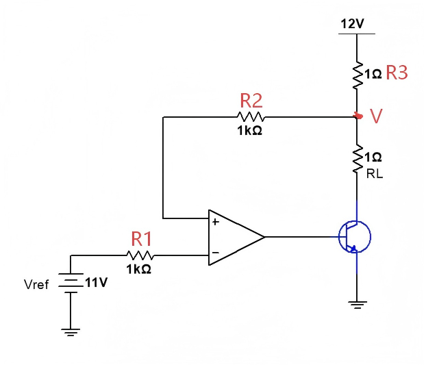

### 一、电路核心特点与定位

这个电路与我们之前讨论的经典低端（Low-Side）恒流源有本质区别。

**低端恒流源（之前讲的）**：
- 负载（$R_L$）一端接电源（$+12V$），另一端接三极管的**集电极**。
- 取样电阻（$R_3$）接在三极管的**发射极**和**地（GND）** 之间。
- 反馈电压取自取样电阻，连接到运放的**反相输入端（-）**。

**高端恒流源（本电路）**：
- 负载（$R_{LOAD}$，即 $R3$ 标记的 $1\Omega$ 电阻）一端接**地（GND）**，另一端接三极管的**发射极**。
- 取样点（反馈电压）在三极管的**集电极**，即 $+12V$ 电源经过 $R3$（$1\Omega$）的那一点。
- **最关键的区别：反馈信号接到了运放的同相输入端（+）**。

很多初学者看到反馈接到同相端会直觉认为是正反馈，从而产生困惑。但讲解中强调：**是否为负反馈，不能只看接到哪个端子，而要分析整个环路的信号走向**。

---

### 二、电路详细工作过程分析（基于运放基本特性）

讲解中采用了一种非常直观、无需公式的“动态跟踪分析法”，核心是牢记运放的两个基本特性：
1.  **若 $V_+ > V_-$，则运放输出 $V_{out}$ 会向上走（升高）**。
2.  **若 $V_+ < V_-$，则运放输出 $V_{out}$ 会向下走（降低）**。

我们跟随讲解，分阶段分析这个电路从上电到稳态的过程。

**电路初始参数设定：**
- 电源电压 $V_{CC} = 12V$
- 参考电压 $V_{ref} = 11V$（接运放反相输入端 $V_-$）
- 取样电阻 $R_{SENSE} = 1\Omega$（连接在 $12V$ 和三极管集电极之间，讲解中标记为 $R3$）
- 运放同相输入端 $V_+$ 连接到取样点，即三极管集电极电压 $V_R$。

---

#### 阶段一：上电但 $V_{ref}$ 尚未接入（$V_{ref}=0V$）

1.  **初始状态**：电源 $12V$ 接入，但 $V_{ref}=0V$。运放输出为 $0V$，三极管截止。
2.  **电压建立**：$12V$ 通过 $1\Omega$ 的取样电阻 $R3$ 到三极管集电极。由于三极管起初是截止的，没有电流流过 $R3$，所以 $R3$ 上没有压降。因此，取样点电压 $V_R$ 几乎立刻被拉到 **$+12V$**。
3.  **运放反应**：此时，$V_+ = V_R \approx 12V$，$V_- = V_{ref} = 0V$。显然，**$V_+ > V_-$**。
4.  **输出动作**：根据特性，运放输出 $V_{out}$ 开始**升高**，驱动三极管的基极。
5.  **导通与稳定**：当 $V_{out}$ 升高到约 $0.6V \sim 0.8V$ 时，三极管导通。有电流 $I_C$ 流过 $R3$ 和 $R_{LOAD}$。$I_C$ 的产生会使得 $R3$ 上产生压降，导致 $V_R = 12V - I_C \times 1\Omega$，$V_R$ 电压开始下降。
6.  **无 $V_{ref}$ 时的稳态**：由于 $V_-=0V$，只要 $V_+ > 0V$，运放就会尽力让输出升高。最终三极管会进入**饱和导通**状态。此时 $V_R$ 的电压等于 $12V$ 减去饱和管压降（约为 $0.3V$）和负载压降，但讲解中提到一个关键点：由于 $R1, R2$ 分压网络的存在，$V_R$ 会被钳位在大约 **6V 多**的水平（如仿真中的 **6.37V**）。运放输出将达到其最大值（接近 $12V$）。

---

#### 阶段二：接入 $V_{ref}=11V$ 之后（动态调节过程）

1.  **瞬间冲击**：$V_{ref}$ 从 $0V$ 跳变到 **$11V$**。此时，$V_- = 11V$，而 $V_+ = V_R$ 在上一阶段稳定在约 $6.37V$。
    瞬间，**$V_+ < V_-$**。
2.  **运放反应**：根据特性，运放输出 $V_{out}$ 开始**降低**。
3.  **连锁反应1：$I_B$ 减小**：$V_{out}$ 降低导致三极管基极电流 $I_B$ 减小。
4.  **连锁反应2：$I_C$ 减小**：由于 $I_C = \beta \times I_B$，集电极电流 $I_C$ 也随之减小。
5.  **连锁反应3：$V_R$ 升高**：$I_C$ 减小，导致在取样电阻 $R3$（$1\Omega$）上的压降 $I_C \times 1\Omega$ 减小。因此，$V_R = 12V - (I_C \times 1\Omega)$ 的值会**升高**。
6.  **动态平衡**：$V_R$ 的升高就是 $V_+$ 的升高。这个过程会持续，直到 **$V_+$ 升高到与 $V_-$ 相等，即 $V_R = V_{ref} = 11V$**。
7.  **达到稳态**：
    -   当 $V_R$ 刚好等于 $11V$ 时，$V_+ = V_-$，系统瞬间平衡。
    -   如果不小心 $V_R$ 稍高于 $11V$，则 $V_+ > V_-$，运放输出会升高，导致 $I_C$ 增大，从而把 $V_R$ 拉回 $11V$。
    -   这个自动调节过程最终使得电路稳定在 $V_+ \approx V_-$ 的状态，即我们常说的**虚短**。

---

#### 阶段三：稳态下的电流计算

一旦理解了稳态是 $V_+ = V_- = V_{ref} = 11V$，计算输出电流就变得极其简单。
-   取样电阻 $R3$ 两端的电压为：$V_{R3} = V_{CC} - V_R = 12V - 11V = 1V$。
-   流过 $R3$ 的电流 $I_C$ 为：$I_C = V_{R3} / R3 = 1V / 1\Omega = 1A$。
-   这个 $I_C$ 几乎全部流向负载 $R_{LOAD}$，因此恒流值就是 **1A**。

---

### 三、仿真数据与波形验证

你提供的仿真截图完美印证了上述分析。

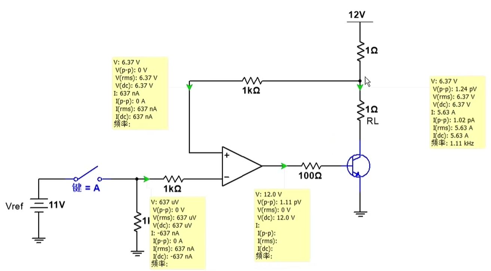**（静态工作点分析）**：

-   **上电但未接入 $V_{ref}$ 的状态**：
    -   $V_{ref}$ 电压：**$637 \mu V$**（近似为0）。
    -   取样点电压 $V_R$：**6.37 V**。
    -   运放输出电压：**12.0 V**（轨到轨输出，即饱和状态）。
    -   负载电流 $I_{RLOAD}$：**637 nA**（几乎无电流）。
    -   **结论**：完全符合阶段一的分析，三极管接近截止，$V_R$​ 由分压电阻决定，运放饱和。

**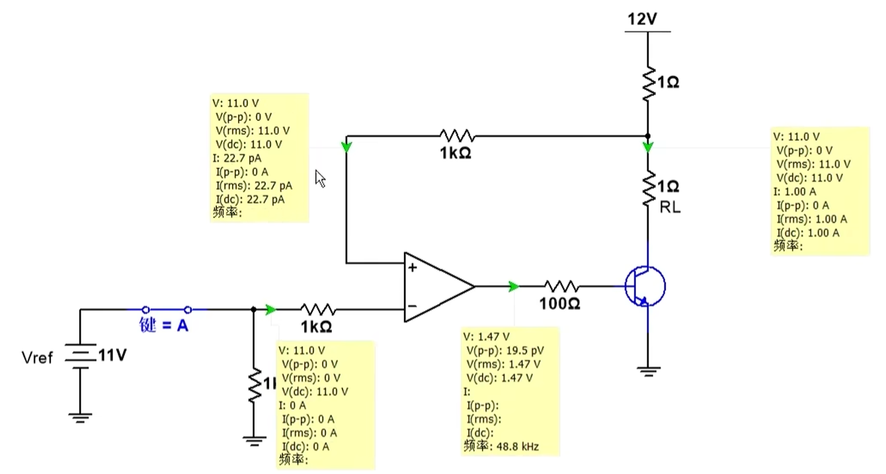（闭合开关接入 $V_{ref}$ 后）**：

-   **接入 $V_{ref}=11V$ 的稳态**：
    -   $V_{ref}$ 电压：**11.0 V**。
    -   取样点电压 $V_R$：**11.0 V**。
    -   运放同相端电流：**$22.7 pA$**（虚断）。
    -   负载 $R_{LOAD}$ 电压：**1.47 V**（对应 $1A \times 1.47\Omega$ 的负载电阻，仿真中使用了 $1.47\Omega$）。
    -   负载电流：$I = 1.47V / 1.47\Omega \approx 1A$。
    -   **结论**：完全符合阶段二和阶段三的分析，虚短建立，$V_+$ 被精准调节至 $11V$，输出恒定的 $1A$​ 电流。

**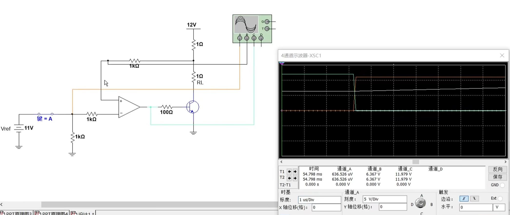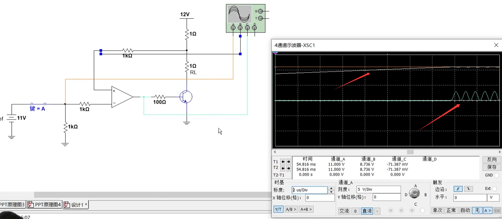（示波器波形）**：

-   这个波形图捕捉了 **$V_{ref}$ 接入瞬间的动态过程**。
    -   **橙色波形**：$V_{ref}$，在开关闭合瞬间从 $0V$ 跳变到 $11V$。
    -   **白色波形**：取样点电压 $V_R$，初始为 $6.37V$，在 $V_{ref}$ 接入后，**缓慢上升**至 $11V$ 并稳定。这生动展示了调节过程。
    -   **绿色波形**：运放输出电压 $V_{out}$，初始为 $12V$（饱和），在 $V_{ref}$ 接入后，**立即下降**以减小 $I_B$，然后在动态调节中找到一个稳定值。
    -   **正弦波（振铃）现象**：讲解中特别提到了绿色波形在跳变瞬间出现了一个正弦波形状的**阻尼振荡**。这是一个非常关键的发现，它表明：
        -   这个反馈环路在受到阶跃信号（$V_{ref}$ 瞬间跳变）的激励时，出现了**环路不稳定性**。
        -   原因通常是环路的相位裕度不足，在某个频率点满足了振荡条件。这可能源于三极管的极间电容、运放的带宽限制以及电路布局等因素。
        -   这是一个很好的工程警示：**原理上正确的电路，在实际中因器件特性和寄生参数可能会导致不稳定。** 解决方案通常是在运放输出和反相输入端之间，或三极管基极和地之间，加入补偿电容（密勒电容）来调整环路的频率响应。

---

### 总结

1.  **电路性质**：这是一个**高端（High-Side）恒流源**，负载一端接地。
2.  **反馈类型**：属于**负反馈**！虽然反馈信号接入了运放的同相端（+），但经过三极管的倒相作用，整个环路仍然是负反馈。分析时不能只看局部。
3.  **分析方法**：运用运放的基本工作规律（$V_+ > V_-$ 则 $V_{out}\uparrow$，反之则 $V_{out}\downarrow$）可以直观地理解任何复杂的运放电路如何达到稳态，比死记硬背“负反馈接反相端”更有用。
4.  **稳态结论**：电路稳态时满足 **虚短**，即 $V_{取样点} = V_{ref}$。由此可推导出恒流值 $I_{out} = (V_{CC} - V_{ref}) / R_{SENSE}$。在本例中为 $(12V - 11V) / 1\Omega = 1A$。
5.  **额外的工程课题**：仿真中观察到的振铃现象揭示了**环路稳定性**问题，这是设计高性能恒流源时不可忽视的一环，需要通过频率补偿等技术手段解决。

## 高端反馈电路自激振荡问题

针对的是恒流源电路中运放控制环路的**振荡（自激震荡）问题**。

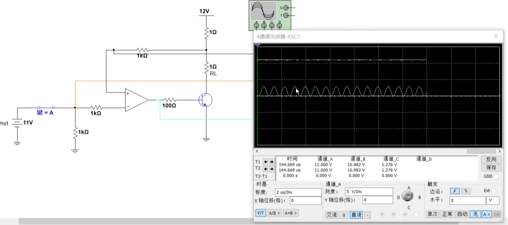

### 核心问题：运放输出为何出现正弦波（振荡）？

在电路上电或$V_{ref}$​接入的瞬间，仿真示波器捕捉到运放的输出电压、取样点电压等并非平滑过渡，而是呈现出一种衰减或等幅的正弦波形状，即发生了**振荡**。这并非电路原理错误，而是**环路稳定性**这一实际工程问题的体现。

振荡的本质就是**控制器跑得太快，反馈信号跟不上**，导致控制器“瞎指挥”产生过冲和来回振荡。

---

### 一、 振荡产生的直观解释

你提供的讲解中，用一个非常形象的比喻解释了振荡的根本原因：**速度不匹配**。

-   **控制者（运放）**：反应速度极快（高带宽、高摆率）。
-   **被控对象（三极管及反馈路径）**：反应相对迟缓，存在延时（由三极管的结电容、载流子渡越时间等造成）。
-   **振荡过程**：运放快速地发出一个“减小电流”的指令（降低$V_{out}$），但由于三极管反应慢，这个指令的效果（取样点电压$V_R$的上升）要“晚一会儿”才能传回运放的输入端。当这个迟到的反馈信号终于到达时，运放可能已经发出了过量的调整指令，于是又需要向反方向过调，如此循环往复，便形成了振荡。
-   **书本理论的对应解释**：当环路增益大于 $1$ ($|A\beta| > 1$)且反馈信号的相位延时达到 $180^\circ$（变为正反馈）时，系统就会振荡。

---

### 二、 消除振荡的两个方向及解决方案

根据“速度不匹配”这一根本原因，我们可以从两个相反的方向入手解决：**要么让控制者慢下来，要么让被控对象快起来。**

---

#### 方向一：降低运放的控制速度（压低带宽）

这是更常用、更简单的方法。核心思想是让“急性子”的运放慢下来，使反馈信号能跟得上。

**解决方案1：加入积分电容（密勒电容）**

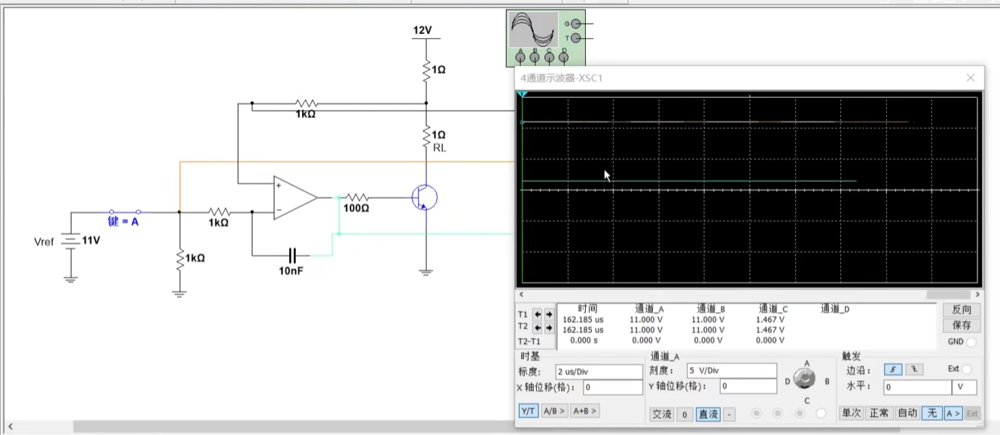

1.  **操作方法**：如上图的电路图所示，在运放的**输出端**和**反相输入端（$V_-$）** 之间并联一个电容（讲解例中为 **10nF**）。这个电容常被称为**积分电容**或**补偿电容**。
2.  **作用机理**：
    -   这个电容构成了一个高频负反馈通路。
    -   对于快速变化的信号（如振荡趋势），电容的阻抗很低，相当于把运放的输出直接耦合回反相输入端，形成强烈的负反馈。
    -   这极大地**降低了电路的高频增益，压缩了运放的带宽**。运放对信号的响应速度被强制减慢，其输出电压（$V_{out}$）的变化速度（即摆率）也随之下降。
    -   速度一降，反馈信号自然就能跟上了，振荡的条件也就被破坏。

**解决方案2：降低运放的增益带宽**

**没有降低增益宽带 $100M$**

**增益宽带降低到 $10M$**

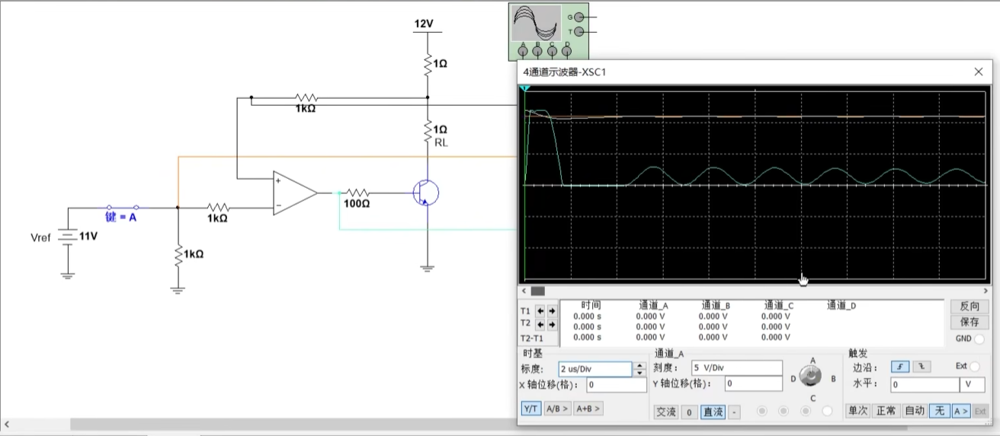

**增益宽带降低到 $0.1M$**

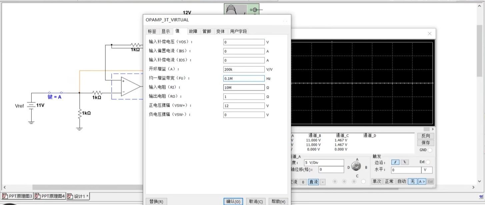

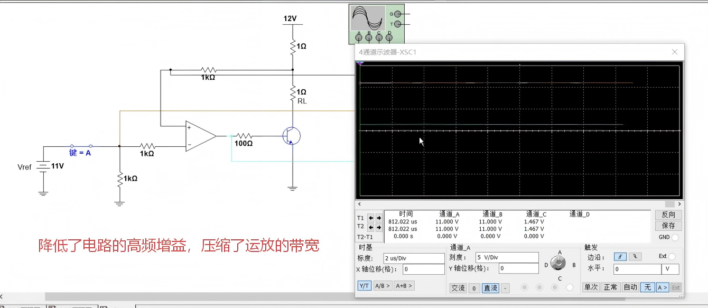

- **关键设置**：FUI = **0.1 MHz**（即100kHz）。这是普通运放（如LM358约为1MHz）的十分之一，更是高速运放（100MHz）的千分之一。

- **效果**：运放自身的响应速度被严格限制在很低的水平，无需额外电容，它对三极管来说本身就是个“慢性子”。

  

---

####  方向二：加快反馈通路的速度

这个方向是让“慢性子”的反馈路径快起来。但讲解中通过仿真发现，此方法改善有限，往往仍需结合压低带宽法。

**解决方案：减小三极管延时 + 增加前馈电容**

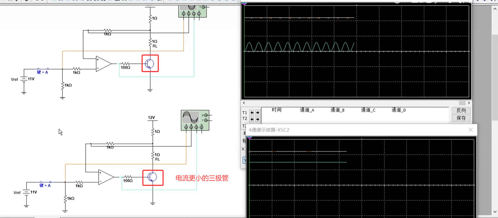

1. **加快三极管本身速度**：
   -   **原理**：反馈路径的延时很大程度来自功率三极管的开关速度。一般而言，**电流容量更小、特征频率更高的三极管，其开关速度更快。**
   -   **仿真证据（文件 26.png）**：
       -   对比了两种三极管：原电路（上）和“电流更小的三极管”（下）。
       -   结果：下方的电路明显没有发生上方电路那样的剧烈振荡。
       -   结论：直接更换一个速度更快的三极管能够改善稳定性。但这在实际应用中有局限性，因为功率管的选型通常由负载电流和功耗决定，不能随意更换为小电流管。

   

2. **加入“加速”电容（前馈电容）**：

   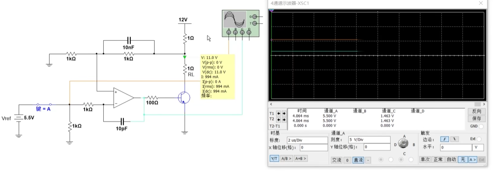

   -   **操作方法**：在反馈分压电阻（如 $R1, R2$）的其中一个电阻上并联一个电容。讲解中提到，这通常还需要调整分压比，形成**频率补偿网络**。
   -   **原理**：这个电容为高频的反馈信号提供了一条“快速通道”，绕过电阻的分压延时，让输出电压的变化更快地传递到运放输入端。
   -   **仿真结果**：讲解者尝试后指出，**单纯加这个电容效果不佳**。因为反馈路径的速度瓶颈主要在**三极管本身**，若三极管速度不够，外部加速效果有限。
   -   **最终方案（结合法）**：最终仍需要在该电容的基础上，**再适当压低运放的带宽**（例如在运放输出到反相端加一个 **10pF** 的小电容），才能实现最终的全温度、全工况稳定。

---

### 三、 最终总结

1.  **问题本质**：运放恒流源的振荡是由于**反馈环路稳定性不足**引起的，本质是运放调节速度过快而反馈链路反应过慢导致的**速度失配**。
2.  **判断依据**：仿真或实测中，在负载或输入电压突变时，若输出电压/电流出现高频正弦波叠加，即可断定存在稳定性问题。
3.  **解决方案的思路与优先级**：
    -   **首选方案**：**压低运放带宽**。通过在运放输出端与反相输入端之间并联一个合适的**积分电容**来轻松实现。这是最可靠、最简单、最通用的做法。
    -   **辅助方案**：**加快反馈速度**。可通过选用速度更快的三极管来实现，但受限于功率设计要求。
    -   **复杂方案**：构建包含前馈电容和电阻的**频率补偿网络**，同时结合压低带宽法进行精细调谐。

好的，我们严格依据你提供的PNP型恒流源内容，按照“电路结构 ➔ 动态过程 ➔ 公式计算 ➔ 仿真验证 ➔ 工程要点”的思路，做进一步的条理化总结。

---

## 高端反馈电路（PNP）

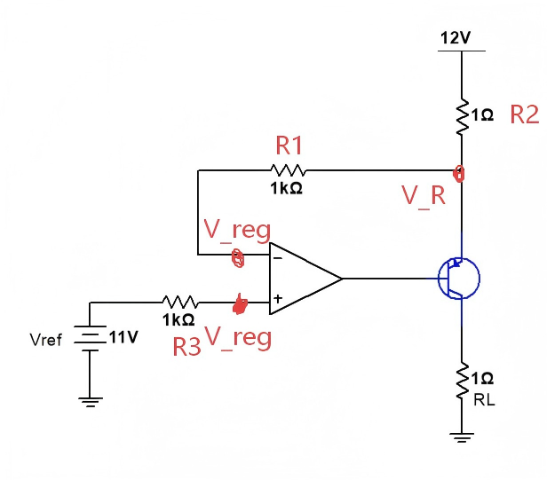

现在讨论的是**恒流源电路的另一种重要形式：使用 PNP 三极管的高端输出恒流源**。

这份讲解的核心是：当负载必须一端接地时，我们如何用 PNP 管实现高端恒流输出，并详细分析了它的启动和调节过程。

---

### 一、电路基本结构与核心变化

对比我们之前讨论的 NPN 型高端恒流源，这个电路的根本变化在于**三极管极性**和**反馈位置**。

**之前：NPN 型高端恒流源**
-   **功率管**：NPN 三极管。
-   **负载位置**：发射极对地。
-   **取样电阻位置**：集电极与 $12\mathrm{V}$ 电源之间。
-   **反馈连接**：反馈接到运放**同相端（+）**。

**现在：PNP 型高端恒流源**
-   **功率管**：PNP 三极管（文件 28.png）。
-   **负载位置**：集电极对地。
-   **取样电阻位置**：发射极与 $12\mathrm{V}$ 电源之间。
-   **反馈连接**：反馈接到运放**反相端（-）**。这是关键区别。

**为什么要这样改？**
因为 PNP 管的发射极是其电流的“出口”。将发射极接电源，取样电阻放在发射极回路，就能精确控制从电源流向负载的总电流。而反馈接反相端，就意味着这构成了一个更常规的负反馈结构，分析和设计都更直接。

---

### 二、运放工作特性分析法（动态过程详解）

讲解依然使用了运放的基本分析法：$V_+ > V_-$ 则 $V_{out} \uparrow$，$V_+ < V_-$ 则 $V_{out} \downarrow$。

设 $V_{ref}=11\mathrm{V}$（接 $V_+$），取样点电压 $V_R$（接 $V_-$）。

#### 阶段一：上电瞬间

-   **状态**：$V_{out} \approx 0\mathrm{V}$，PNP 管发射极 $V_E=12\mathrm{V}$，基极 $V_B$ 由上拉电阻连接到 $12\mathrm{V}$，但运放输出为 0，所以 $V_{EB}$ 压差很大（约 $12\mathrm{V}$）。
-   **运放输入**：$V_+ = 11\mathrm{V}$，$V_- = V_R$。刚上电时，三极管尚未完全导通，$V_R$ 会迅速接近 $12\mathrm{V}$。所以 $V_-$ (约$12\mathrm{V}$) $> V_+$ ($11\mathrm{V}$)。
-   **运放反应**：$V_- > V_+$，运放输出 $V_{out}$ 会**往下走**（或保持在低电平）。$V_{out}$ 变低，会增强 PNP 管的导通程度。

#### 阶段二：三极管导通与电流建立

-   **导通**：运放输出 $V_{out}$ 较低，使得 PNP 管 $V_{EB}$ 大于开启电压（约 $0.7\mathrm{V}$），管子开始导通。
-   **电流路径**：电流从 $12\mathrm{V}$ 电源流出，经取样电阻 $R_2(1\Omega)$ 进入发射极，从集电极流出，再流过负载 $R_L$ 到地。
-   **$V_R$ 电压下降**：随着集电极电流 $I_C$ 增大，取样电阻 $R_2$ 上的压降 $I_C \times 1\Omega$ 也增大。因此，$V_R = 12\mathrm{V} - I_C \times 1\Omega$ 开始**下降**。

#### 阶段三：负反馈的自我调节

-   **趋近平衡**：$V_R$ 不断下降，意味着 $V_-$ 向着 $V_+ = 11\mathrm{V}$ 靠近。
-   **达到稳态**：当 $V_R$ 恰好下降到 **$11\mathrm{V}$** 时，$V_- = V_+$，运放的差模输入为零。
-   **动态平衡**：此时，系统会自动维持这个状态。例如，当负载变化使电流有减小趋势时，$V_R$ 会升高，导致 $V_- > V_+$，运放输出会降低，使 PNP 管导通更强，电流回升，最终 $V_R$ 被拉回 $11\mathrm{V}$。这是一个经典的负反馈调节过程。

---

### 三、稳态电流的计算

利用 **虚短** 概念（$V_+ = V_-$），可以轻松计算恒流值。

1.  **已知条件**：$V_+ = V_{ref} = 11\mathrm{V}$，因此 $V_- = V_R = 11\mathrm{V}$。
2.  **计算取样电阻压降**：电阻 $R_2$ 两端的电压 $V_{R2} = V_{CC} - V_R = 12\mathrm{V} - 11\mathrm{V} = 1\mathrm{V}$。
3.  **计算恒流电流**：流过 $R_2$ 的电流 $I_C = V_{R2} / R_2 = 1\mathrm{V} / 1\Omega = 1\mathrm{A}$。
4.  **结论**：无论负载 $R_L$ 如何变化，只要电源和运放有足够的调节范围，流过负载的电流恒定为 **$1\mathrm{A}$**。公式为：
    $$I_{out} = \frac{V_{CC} - V_{ref}}{R_{SENSE}}$$

---

### 四、仿真波形分析与工程要点

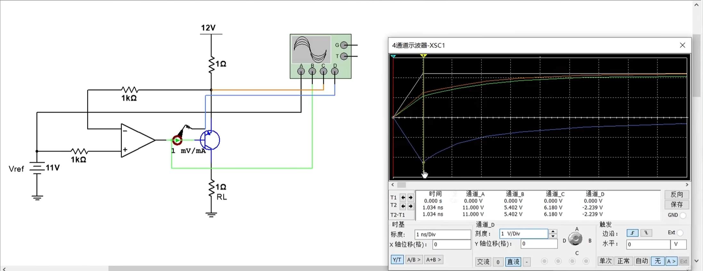

**启动瞬间的电流尖峰**

-   **现象**：讲解中提到，上电瞬间，运放输出端会**吸收**一个很大的脉冲电流，仿真值可达 **$-2\mathrm{A}$** 左右。
-   **原因**：启动时，取样点电压 $V_R$ 还没有建立，运放 $V_-$ 端电压为 0（或很低），而 $V_+$ 为 $11\mathrm{V}$，运放会瞬间尽力把输出拉高。但由于是 PNP 管，驱动它需要低电平，运放实际上在尽力吸收电流。这个冲击电流是运放和 PNP 管基极在动态建立工作点时的瞬间过冲。
-   **工程对策**：讲解明确指出，“在实际中，这里应该还要加多一个电阻去把这个电流给限制一下”，即在运放输出端和 PNP 管基极之间串联一个**基极限流电阻**，以保护运放和三极管。

---

### 总结

1.  **电路形式选择**：当负载需要接地时，应选择 **PNP 型高端恒流源**。
2.  **反馈极性**：PNP 型电路的反馈网络通常接回运放的**反相输入端（-）**，构成直接了当的负反馈，这与 NPN 型接同相端不同，更易于分析。
3.  **核心分析方法**：无论何种拓扑，牢记运放的 **$V_+ > V_- \Rightarrow V_{out} \uparrow$ 、$V_+ < V_- \Rightarrow V_{out} \downarrow$** 法则，就能清晰推导出整个电路的自我调节过程。
4.  **计算公式**：稳态下利用“虚短”（$V_+ = V_-$）可简洁求出恒流值：$I_{out} = (V_{CC} - V_{ref}) / R_{SENSE}$。
5.  **工程细节**：PNP 管的基极输入回路可能产生冲击电流，需在运放输出端串联**基极限流电阻**；运放在驱动 PNP 管时，其输出电压可能低于地电位（或产生负压摆幅），选型时也要注意这点。
6.  **稳定性**：虽然这次主要讲功能，但之前讨论的环路稳定性问题（需要补偿电容压带宽）在此类 PNP 电路中**同样适用**，因为它的环路相移风险并没有消失。如果出现振荡，同样需要加积分电容。

