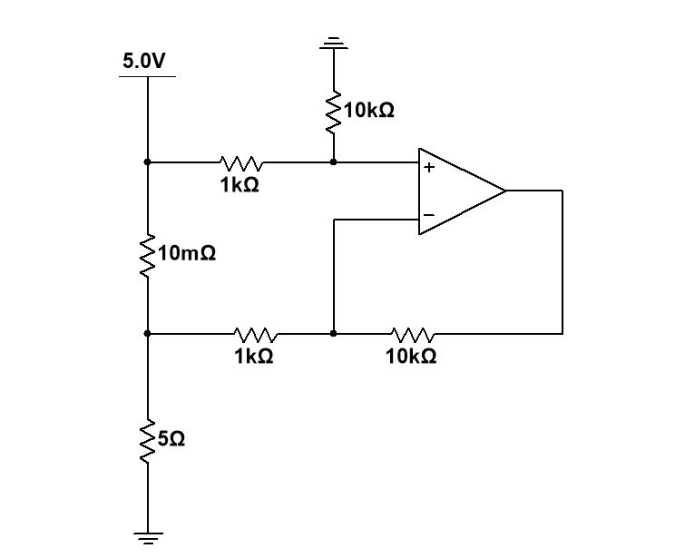
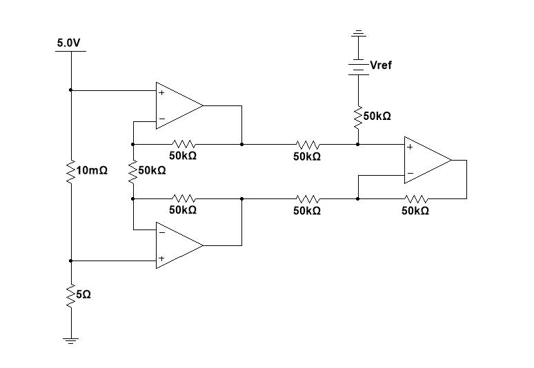
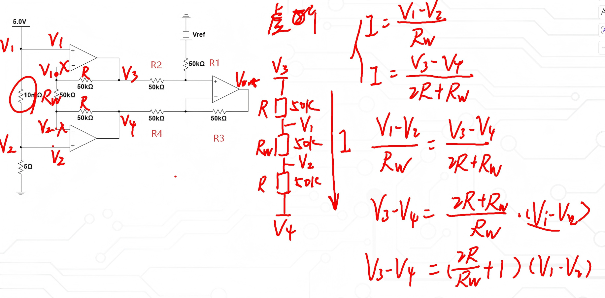
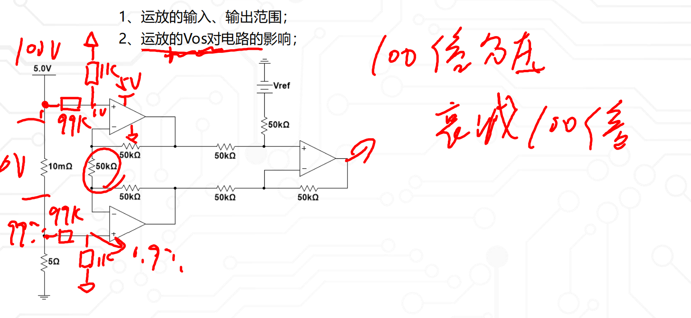
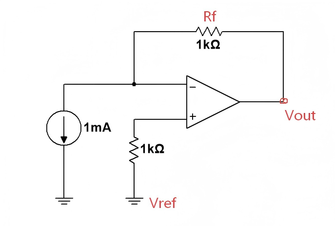
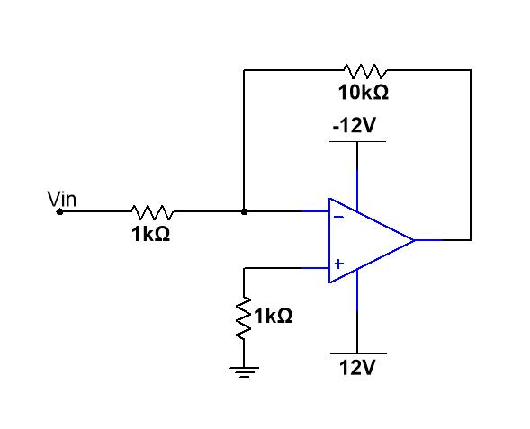

# 电流检测电路

## 单端检测（低端检测）

 **一、电路参数计算**

**1. 分压计算**

首先，计算 5.0V 电源经过 5Ω 和 10mΩ 电阻分压后，同相输入端（+）的电压 $$V_+$$。

总电阻：

$$R_{\text{总}} = 5\,\Omega + 10\,\text{m}\Omega = 5.01\,\Omega$$

10mΩ 电阻上的电压降：

$$V_+ = 5.0\,\text{V} \times \frac{10\,\text{m}\Omega}{5.01\,\Omega} \approx 5.0\,\text{V} \times \frac{0.01\,\Omega}{5.01\,\Omega} \approx 9.98\,\text{mV}$$

**2. 运放反馈分析**

这是一个**同相比例放大器**，反馈网络由 1kΩ 和 9kΩ 电阻组成。

根据运放“虚短”和“虚断”特性：

$$V_- = V_+ \approx 9.98\,\text{mV}$$

输出电压 $$V_{\text{out}}$$ 与反相端电压 $$V_-$$ 的关系：

$$V_{\text{out}} = V_- \times \left(1 + \frac{9\,\text{k}\Omega}{1\,\text{k}\Omega}\right) = V_- \times 10$$

**3. 最终输出**

代入 $$V_-$$ 的值：

$$V_{\text{out}} \approx 9.98\,\text{mV} \times 10 \approx 99.8\,\text{mV}$$

由于 10mΩ 远小于 5Ω，也可以近似计算：

$$V_+ \approx 5.0\,\text{V} \times \frac{0.01\,\Omega}{5\,\Omega} = 10\,\text{mV}$$

$$V_{\text{out}} \approx 10\,\text{mV} \times 10 = 100\,\text{mV}$$

**结论**

该电路的输出电压约为 **100 mV**（精确值约为 99.8 mV）。

**关键要点**

- 运放工作在线性区，满足“虚短”（$$V_+ = V_-$$​）和“虚断”（输入电流为0）。

  虚短：1. 有深度负反馈；

  虚断：电阻不能为$M\Omega$级别

- 同相比例放大器的增益公式为 $$A_v = 1 + \frac{R_f}{R_1}$$，这里增益为 10。

## 低端检测注意事项

1、运放的输入、输出范围；

2、运放的$V_{os}$对电路的影响；

### 低端电流检测电路 · 注意事项与解决方法（精简版讲义）

我们刚才推导的都是理想运放的情况：1A 电流，100mV 输出，看上去很完美。

但是一换成实际运放，比如 LM358，问题就来了：理论上应该输出 100mV，实际测出来可能却是 113mV，误差很大。

为什么会这样？因为实际运放不是理想的。主要有两个工程中必须注意的问题。

---

**一、第一个坑：运放的输入共模范围**

低端检测时，采样电阻上的电压非常小，只有十几毫伏，而且非常靠近地。

很多普通运放不是==轨对轨==（[2-5 轨对轨运放 and Vos.md](D:\Typora\PCB\2-5 轨对轨运放 and Vos.md)）的，它的输入并不能真正到 0V。当输入信号太靠近地时，已经超出了它的正常工作范围，测出来必然不准。

**怎么办？解决办法有两个：**

1. 方法1：给运放加负电源
比如给运放加一组 -5V 电源。这样输入信号（十几 mV）就完全落在运放的输入范围内了。

加上负电源后你会发现：
- 输入为 0 时，输出接近 0（比如 -317μV）
- 带上负载后，输出基本就是 99.5mV，精度明显提高

---

**二、第二个坑：输入失调电压 $V_{OS}$ 的影响**

即使加了负电源，你可能还是发现有一点点误差：理论应该是 99.8mV，实际测出来是 99.5mV。差了 0.3mV。

这 0.3mV 就是运放自身的输入失调电压，我们通常叫 $V_{OS}$（[2-5 轨对轨运放 and Vos.md](D:\Typora\PCB\2-5 轨对轨运放 and Vos.md)）的，它的输入并不能真正到 0V。当输入信号太。你可以这样理解：运放自己内部自带了一个很小的输入电压，哪怕你外部不加信号，它自己也会输出一点电压。

**怎么办？用软件自校准来补救**

1. 先断开负载，让电流 = 0，测出此时的输出，比如是 -0.3mV
2. 把这个值存在单片机里，作为零点偏移
3. 接上负载，测出带载时的总输出，比如是 99.5mV
4. 计算：  
   `99.5mV - (-0.3mV) = 99.8mV`

刚好和理论值一致。这就是硬件做不到完美的地方，我们通过软件校准来弥补。

---

**三、实际工程中的考量：负电源不方便，成本高**

刚才说的加负电源确实好用，但在实际产品中会带来新问题：
- 负电源需要额外的电路，增加成本
- 很多单片机的 ADC 不能采集负电压

**怎么办？用单电源 + 抬升偏置电压**

不加负电源了，只用一个单电源，加一个简单的偏置电路：把整个输出信号往上抬一个固定电压，比如抬 1V。

效果是：
- 无负载时，输出 ≈ 1V

- 有负载时，输出 ≈ 1.1V

- 差值还是 100mV，精度一点没丢

- 全程都是正电压，ADC 随便采，再也不用负电源了

   

---

**总结**

低端电流检测，在实际工程里就抓这三点：

1. **输入信号必须落在运放的输入共模范围内**  
   信号靠近地时要特别小心，不行就加负电源，或者用抬偏置的办法解决

2. **必须考虑运放的非理想参数**  
   主要是输入失调电压 VOS 和输入偏置电流 IB，这些都会直接带来测量误差

3. **解决思路有两条路**  
   - 硬件上：选合适的运放、加负电源、抬偏置  
   - 软件上：做零点自校准，把 VOS 的影响消掉

两条路配合着用，就能做出既成本合理、又精度够用的产品。

## 高端检测

==采样电阻在负载和地之间就是低端 在负载和电源之间就是高端==

​                            $V_1 - V_2 = I_1 * 10mR\\V_+ = \frac{V_1 * 10k}{10k + 1k}\\ \frac{(V_{out} - V_-)}{10k} = \frac{(V_- - V_2)}{1k} \rightarrow V_- = \frac{(V_{out} - V_2)*1k}{10k + 1k} + V_2\\V_{out} = \frac{10k}{1k}(V_1-V_2)$

> 结合电路结构和原理，其核心问题集中在**输入阻抗低、分流干扰、精度受限、适用场景窄**四大类，具体拆解如下：
>
> ------
>
> **一、核心根源：输入阻抗极低，严重分流负载电流**
>
> 1.  **阻抗计算与分流原理**
>
> 运放同相输入端的等效输入阻抗，由 1kΩ 和 10kΩ 电阻串联决定：
>
> - 同相端对地的等效阻抗 ≈ **1kΩ + 10kΩ = 11kΩ**（运放虚短虚断下，输入阻抗由外部电阻主导）
> - 反相输入端的等效阻抗 ≈ **1kΩ + 10kΩ = 11kΩ**
>
> 2. **分流影响（以你提到的小电流场景为例）**
>
> 假设负载工作电流仅 10mA，负载电压 10V：
>
> - 采样电阻（10mΩ）上的电压仅 `I×R = 10mA × 10mΩ = 100μV`
>
> - 而同相端支路的分流电流 ≈ `5V / 11kΩ ≈ 0.45mA`，反相端支路也有近似电流
>
> - 分流电流（≈0.45mA）占负载总电流（10mA）的
>
>   4.5%，直接导致：
>
>   ✅ 负载实际工作电流被分流，偏离设计值
>
>   ✅ 采样电阻上的电压被分流拉低，电流采样值严重失真
>
>   ✅ 小电流场景下误差呈指数级放大，完全无法满足精度要求
>
> ------
>
> **二、其他关键弊端**
>
> 1. **共模抑制比（CMRR）受电阻匹配度限制**
>
> 该电路本质是**差分放大电路**，其共模抑制能力完全依赖 4 个电阻（1kΩ×2、10kΩ×2）的精度匹配：
>
> - 若电阻存在 1% 的阻值误差，共模抑制比会从理论值（100dB+）骤降至 40dB 以下
> - 电源纹波、温度漂移会进一步放大共模误差，导致采样结果受共模电压（5V）严重干扰
>
> 
>
> 2. **运放输入偏置电流 / 失调电压引入额外误差**
>
> - 运放自身的输入偏置电流（IB）会在 1kΩ/10kΩ 电阻上产生额外压降，叠加在采样信号上
> - 失调电压（Vos）会直接放大 10 倍（电路增益 = 10k/1k=10 倍），在小信号采样（如 100μV）时，误差占比超过 100%，完全失效
>
> 
>
> 3. **适用场景极度受限**
>
> - **仅适用于大电流场景**：仅当负载电流≥1A 时，分流电流（≈0.45mA）占比 < 0.05%，影响可忽略
> - **小电流 / 精密采样场景完全不可用**：负载电流 < 100mA 时，分流误差已不可接受，无法使用
>
> 
>
> 4. **电源电压波动直接影响采样精度**
>
> 同相端直接接 5V 电源，电源的纹波、漂移会直接耦合到采样回路，导致输出电压随电源波动，采样结果不稳定，无法实现精准电流检测。
>
> ------
>
> **三、本质问题总结**
>
> 该电路的核心缺陷是**用低阻电阻网络搭建差分放大，牺牲输入阻抗换取电路简单**，最终导致：
>
> > 小电流场景分流严重、采样精度差、抗干扰能力弱、适用场景极窄

==**解决**==

> 对比上一版普通差分放大电路，这版电路从**输入阻抗、分流干扰、精度、抗干扰、适用场景**等维度实现了全面优化，核心优势如下：
>
> ------
>
> **一、核心突破：输入阻抗大幅提升，彻底解决分流问题**
>
> 1. **结构原理**
>
> 电路在采样电阻两端**各加了一级电压跟随器（运放接成单位增益缓冲器）**：
>
> - 电压跟随器的核心特性是**虚断**：运放输入端几乎不取电流（输入阻抗高达 MΩ~GΩ 级）
> - 采样电阻两端的信号直接接入运放同相端，完全不会从主回路分流
>
> 2. **对比优势**
>
> |      维度      |              上一版普通差分电路              |                   本版改进电路                   |
>| :------------: | :------------------------------------------: | :----------------------------------------------: |
> |    输入阻抗    |  由 1kΩ/10kΩ 电阻主导，仅约 11kΩ，分流严重   |    由运放输入特性主导，高达 GΩ 级，几乎无分流    |
>| 小电流场景影响 | 10mA 负载电流下，分流占比≈4.5%，采样严重失真 | 分流电流 < 1μA，占比 < 0.01%，完全不影响负载工作 |
> |   负载兼容性   |           仅适用于≥1A 的大电流场景           |   支持 mA 级甚至 μA 级小电流采样，适用范围极广   |
>
> ------
>
> **二、精度与抗干扰能力全面升级**
> 
> 1. **共模抑制能力大幅提升**
> 
> - 上一版电路：共模抑制比完全依赖 4 个电阻的匹配精度，1% 电阻误差会导致 CMRR 骤降至 40dB 以下
>- 本版电路：前端电压跟随器隔离了共模电压的直接耦合，后端差分放大的共模抑制能力更稳定，同时可通过电阻匹配进一步优化，整体 CMRR 提升至 80dB 以上，抗电源纹波、共模干扰能力大幅增强
> 
>2. **失调与偏置误差显著降低**
> 
>- 上一版电路：运放输入偏置电流在 1kΩ/10kΩ 电阻上产生额外压降，失调电压被放大 10 倍，小信号采样完全失效
> - 本版电路：电压跟随器的单位增益结构不会放大失调电压，后端差分放大的误差影响被隔离，同时高输入阻抗避免了偏置电流的压降误差，小信号采样精度提升 100 倍以上
>
> 3. **电源波动干扰被彻底隔离**
> 
>- 上一版电路：同相端直接接 5V 电源，电源纹波、漂移直接耦合到采样回路，输出随电源波动
> - 本版电路：电压跟随器隔离了电源与采样回路的直接连接，共模电压被缓冲，后端差分放大仅放大采样电阻的差模信号，电源波动对采样结果几乎无影响
>
> ------
> 
>**三、功能与灵活性升级**
> 
>1. **支持参考电压偏移，适配单电源采样**
> 
> 电路新增了`Vref`参考电压输入，可灵活设置输出的直流偏置：
>
> - 上一版电路：输出以地为基准，无法适配单电源运放的负电压输出需求
>- 本版电路：通过`Vref`可将输出抬升至单电源运放的线性工作区，无需双电源供电，适配性更强
> 
>2. **增益灵活可调**
> 
>后端差分放大电路的增益由电阻比值决定（本版为 1 倍，可通过修改电阻比值轻松调整），上一版电路增益固定，灵活性不足。
> 
>------
> 
> **四、本质改进总结**
>
> 上一版电路是 “牺牲输入阻抗换简单”**的低成本方案，仅适用于大电流、低精度场景；**
>
> **本版电路通过电压跟随器 + 仪表放大器结构 **，从根源上解决了分流问题，实现了**高输入阻抗、高精度、高抗干扰、宽适用范围**的电流检测，是工业级、精密级电流采样的标准方案。
>
> ------
>
> **补充：电路原理速算（验证优势）**
>
> 以 10mA 负载电流为例：
>
> - 采样电阻电压：`I×R = 10mA × 10mΩ = 100μV`
>- 上一版电路分流：`5V / 11kΩ ≈ 0.45mA`，占比 4.5%
> - 本版电路分流：运放输入偏置电流 < 1μA，占比 < 0.01%，完全可忽略
> 

==**公式计算**==

> # 仪表放大器型高端电流检测电路 原理与设计手册
>
> 
>
> ##  一、电路结构与核心公式推导
>
> ### 1. 电路拓扑说明
>
> 该电路为**带电压跟随器的仪表放大器型高端电流检测电路**，分为两级：
>
> - **前端增益级**：2个电压跟随器 + 采样电阻 \( R_W \) + 2个增益电阻 \( R \)，实现高输入阻抗采样与信号放大
> - **后端差分级**：4个匹配电阻 + 参考电压 ( $V_{text{ref}}$ )，实现差分输出与电平偏移，适配单电源运放
>
> ---
>
> ### 2. 前端仪表放大级推导
>
> #### 电路参数
>
> - 采样电阻：$$ R_W = 10\,\text{mΩ} $$（串联在负载回路，采集电流信号）
> - 增益电阻：$$ R = 50\,\text{kΩ} $$
> - 采样电压：$$ V_1 - V_2 = I_{\text{load}} \cdot R_W $$（$$ I_{\text{load}} $$ 为负载工作电流）
>
> #### 推导过程
>
> 根据运放**虚短、虚断**特性：
>
> 1.  两个电压跟随器的反相端电压等于同相端电压：$$ V_X = V_1 $$，$$ V_Y = V_2 $$
> 2.  流过采样电阻 $$ R_W $$ 的电流：
>     $$ I = \frac{V_1 - V_2}{R_W} $$
> 3.  由于运放虚断，该电流全部流过两个串联的增益电阻 $$ R $$，因此：
>     $$ I = \frac{V_3 - V_4}{2R + R_W} $$
> 4.  联立两式消去电流 $$ I $$：
>     $$ \frac{V_1 - V_2}{R_W} = \frac{V_3 - V_4}{2R + R_W} $$
> 5.  整理得到前端增益公式：
>     $$ V_3 - V_4 = \frac{2R + R_W}{R_W} \cdot (V_1 - V_2) = \left( \frac{2R}{R_W} + 1 \right) (V_1 - V_2) $$
>
> 
>
> ##  后端差分放大级：无参数通用推导 + 有参数代入计算
>
> ###  一、无参数通用推导（通用差分放大+参考偏置电路）
>
> ### 1. 电路拓扑与符号定义
>
> 后端为**四电阻差分放大+参考电压偏置**电路，通用参数定义：
>
> - 同相端输入：参考电压 $$V_{\text{ref}}$$、前端放大输出 $$V_3$$
> - 反相端输入：前端放大输出 $$V_4$$、最终输出 $$V_{\text{out}}$$
> - 同相端电阻：$$R_1$$（接 $$V_{\text{ref}}$$）、$$R_2$$（接 $$V_3$$）
> - 反相端电阻：$$R_3$$（接 $$V_4$$）、$$R_4$$（接 $$V_{\text{out}}$$）
>
> ### 2. 虚短虚断核心分析
>
> 根据运放**虚短**特性：$$V_+ = V_-$$
> 根据运放**虚断**特性：运放输入端无电流，电阻串联分压成立
>
> （1）同相端电压计算
>
> 同相端为 $$V_{\text{ref}}$$ 与 $$V_3$$ 经 $$R_1、R_2$$ 分压：
> $$
> V_+ = \frac{R_2 \cdot V_{\text{ref}} + R_1 \cdot V_3}{R_1 + R_2}
> $$
>
> （2）反相端电压计算
>
> 反相端为 $$V_{\text{out}}$$ 与 $$V_4$$ 经 $$R_4、R_3$$ 分压：
> $$
> V_- = \frac{R_3 \cdot V_{\text{out}} + R_4 \cdot V_4}{R_3 + R_4}
> $$
>
> （3）联立求解通用输出公式
>
> 由 $$V_+ = V_-$$，联立两式：
> $$
> \frac{R_2 \cdot V_{\text{ref}} + R_1 \cdot V_3}{R_1 + R_2} = \frac{R_3 \cdot V_{\text{out}} + R_4 \cdot V_4}{R_3 + R_4}
> $$
>
> （4）对称电阻简化（仪表放大器标准匹配：$$R_1=R_2=R_3=R_4=R$$）
>
> 当四电阻完全匹配（$$R_1=R_2=R_3=R_4=R$$），代入上式：
> $$
> \frac{R \cdot V_{\text{ref}} + R \cdot V_3}{R + R} = \frac{R \cdot V_{\text{out}} + R \cdot V_4}{R + R}
> $$
> 约去所有电阻后，得到**对称匹配下的通用输出公式**：
> $$
> \boxed{V_{\text{out}} = V_3 - V_4 + V_{\text{ref}}}
> $$
>
> （5）代入前端增益公式，得到完整电路输出
>
> 前端仪表放大级增益公式：
> $$
> V_3 - V_4 = \left( \frac{2R}{R_W} + 1 \right) (V_1 - V_2)
> $$
> 将其代入后端输出公式，得到**完整电路的有参数输出公式**：
> $$
> V_{\text{out}} = \left( \frac{2R}{R_W} + 1 \right) (V_1 - V_2) + V_{\text{ref}}
> $$
> 结合采样电压与负载电流的关系 $$V_1 - V_2 = I_{\text{load}} \cdot R_W$$，最终可表示为：
> $$
> \boxed{V_{\text{out}} = \left( \frac{2R}{R_W} + 1 \right) \cdot I_{\text{load}} \cdot R_W + V_{\text{ref}}}
> $$
>

**注意事项**

==**1、运放的输入、输出范围；**==

==**2、运放的Vos对电路的影响；**==

> # 综合分析：高端电流检测 + 电阻分压 + 仪表放大电路
>
> ## 1. 为什么高端检测要加电阻分压？（对应讲课内容+电路图）
>
> - 高端检测时，采样点电压**非常接近电源电压**（比如 5V、12V、甚至更高）。
> - 运放供电一般只有 5V 或 3.3V，如果直接输入，会**超出运放输入共模范围**，导致信号失真、运放饱和。
> - 解决方法：**用电阻分压把高压“拉低”**，让它落在运放正常输入范围内。
>
> 对应电路图实现：
>
> - 上端：99kΩ + 1kΩ 分压，把 5V 共模电压衰减到 1/100。
> - 下端：同样 99kΩ + 1kΩ 分压，也衰减 1/100。
>   这样运放看到的电压从接近 5V → 降到约 0.05V 级别，完全安全。
>
> ---
>
> ## 2. 分压带来的两个关键问题（讲课要点+图中结构对应）
>
> ### （1）输入阻抗变低 → 会分流主回路
>
> 分压电阻如果太小，会从主回路**抽取电流**，导致：
>
> - 采样不准
> - 小电流时误差巨大
>
> 电路图的优化设计：
>
> - 图中用 **99k + 1k** 大电阻，就是为了：
>   1. 提高输入阻抗
>   2. 尽量减小对负载电流的影响
>      这也是讲课中强调“**分压电阻一定要取大一点**”的核心原因。
>
> ### （2）差分信号也被一起衰减 100 倍
>
> - 原来的采样电压：$$V_{\text{sense}}=I\cdot R_W$$
> - 经过 100:1 分压后：$$\Delta V_{\text{后}} = \dfrac{V_{\text{sense}}}{100}$$
>
> 信号补偿方案：
>
> - 信号变得非常小，必须**在后级运放把增益补回来**，才能得到足够大的输出。
> - 图中结构是两级放大：
>   1. 前端跟随 + 差分增益级
>   2. 后端差分放大级
>      两级配合把衰减的信号重新放大，恢复幅度。
>
> ---
>
> ## 3. 电路图结构与讲课内容的完全对应
>
> ### 讲课核心思路
>
> > 高压高端采样 → 分压降共模 → 保证分压电阻足够大、不分流 → 后级放大补增益 → 注意 Vos
>
> ### 电路图实现逻辑
>
> 1. **两路 100:1 电阻分压**
>    把高共模电压降到运放安全输入范围内。
> 2. **前端两个电压跟随器**
>    提高输入阻抗，防止分流负载电流，保证采样精度。
> 3. **中间差分增益级**
>    放大被衰减 100 倍的微弱电流信号。
> 4. **后端差分放大 + Vref 偏置**
>    进一步调整增益、适配单电源输出。
> 5. **整体结构 = 仪表放大器**
>    高共模抑制比，完美适配高端电流检测场景。
>
> ---
>
> ## 4. Vos（失调电压）的综合影响
>
> ### 讲课要点
>
> - 仪表放大器本身 Vos 通常较小，影响可控；
> - 如果精度要求高，也可以通过校准消除 Vos 误差。
>
> ### 对应电路图的注意事项
>
> - 前端跟随器的 Vos 会直接变成差分误差；
> - 后端运放 Vos 会叠加到输出；
> - 小电流采样时，Vos 可能淹没有效信号；
>   → 必须选用低失调运放，或做校准。
>
> ---
>
> ## 最终核心总结
>
> 该高端电流检测电路，通过**99k+1k 电阻分压**将高共模电压衰减 100 倍，使其进入运放安全输入范围；同时采用**大电阻分压+电压跟随器**保证高输入阻抗，避免分流负载；再通过**前后两级仪表放大结构**把衰减后的微弱信号重新放大，并配合参考电压偏置适配单电源系统；最后需关注运放失调电压 Vos 对小信号精度的影响，必要时进行校准。
>
> 
---

## 跨组放大

---

### 电路本质：跨阻放大器（TIA）

**跨阻放大器（Transimpedance Amplifier, TIA）**，核心功能是把微弱电流（nA级~mA级）转换成电压信号，特别适合光敏二极管、光电倍增管、电化学电极这类“电流型传感器”的信号处理。

它的核心优势：
- 高输入阻抗，不会“拉低”微弱电流源的输出
- 直接把电流线性转电压，不需要额外放大
- 对微小电流的检测精度远高于“电流采样电阻+运放放大”的方案

---

#### 1. 公式推导（和你讲的逻辑完全对应）

根据理想运放的**虚短**和**虚断**特性：
1.  虚短：$V_- = V_+ = V_{\text{REF}}$
2.  虚断：运放反相端不吸取电流，电流源的电流$I$全部流过反馈电阻$R_f$
3.  反馈电阻上的电压差：$V_{\text{out}} - V_- = I \times R_f$
4.  代入$V_- = V_{\text{REF}}$，得到最终公式：
    $$
    V_{\text{out}} = V_{\text{REF}} + I \times R_f
    $$
    
5.  

你举的例子：
- $I=1\ \mathrm{mA}$，$R_f=1\ \mathrm{kΩ}$，$V_{\text{REF}}=0\ \mathrm{V}$
  $$V_{\text{out}} = 0 + 1\mathrm{mA} \times 1\mathrm{kΩ} = 1\ \mathrm{V}$$
  和我们之前算的例子（电流方向相反，所以输出为负）本质是同一个公式，只是电流流向不同导致符号变化。

---

#### 2. 关键要点补充（帮你避坑）

**（1）为什么微弱电流场景必须用TIA？**

- 传统方案：电流$I$流过采样电阻$R$，得到电压$V=I \times R$。
  但电流极小时（比如1nA），就算用1MΩ电阻，电压也只有1μV，噪声、运放失调会直接淹没信号；
  而且采样电阻会改变电流源的负载，影响传感器的线性。
- TIA方案：运放反相端被钳位在$V_{\text{REF}}$，传感器两端电压固定，工作状态不受影响，同时直接把电流放大成清晰的电压信号。

**（2）VREF的作用是什么？**

- 单电源供电时，把静态输出抬升到电源中间值（比如2.5V），避免输出负电压，同时区分正负电流（双向电流检测）。
- 比如电化学实验中，电极需要固定偏置电压，VREF可以直接给电极提供稳定偏置，同时不影响电流检测。

**（3）实际设计的关键限制**

- 反馈电阻不能无限大：电阻越大，输出噪声、带宽限制越明显，还需要并联补偿电容防止振荡。
- 运放选型：微弱电流检测必须用**低输入偏置电流运放**（比如pA级偏置电流），否则运放自身的偏置电流会直接干扰信号。

---

### 运放输入端为什么都要加电阻？

**运放平衡电阻（也叫偏置电流补偿电阻）**

---

#### 1. 为什么要让同相端电阻等于反相端外接电阻的并联值？

你说的完全正确，这个设计的目的就是**抵消运放输入偏置电流（$I_B$）在外部电阻上产生的误差电压**。

以反相放大器为例：
- 反相端外接电阻网络是：输入电阻 $R_{in}$ 和反馈电阻 $R_f$ 并联，等效电阻 $R_{eq} = R_{in} \parallel R_f$。
- 运放两个输入端的偏置电流 $I_{B1}$、$I_{B2}$ 会分别在反相端和同相端的外接电阻上产生压降：
  - 反相端压降：$V_{-} = I_{B1} \times (R_{in} \parallel R_f)$
  - 同相端压降：$V_{+} = I_{B2} \times R_p$（$R_p$ 是同相端的接地电阻）

如果我们让 $R_p = R_{in} \parallel R_f$，且运放的 $I_{B1} \approx I_{B2}$，那么 $V_{-} \approx V_{+}$，偏置电流带来的误差电压 $\Delta V = V_{-} - V_{+}$​ 就会被抵消，大大降低输出误差。

如 果 我 们 让 $R_p = 0$ ， 那 么  $V_{-} 和 V_{+}$ 有 一 个 电 压 差 $\Delta V$

---

#### 2. 误差的本质是什么？

- 当两个输入端外接电阻不匹配时，即使输入信号为0，运放也会把偏置电流产生的压差 $\Delta V$ 放大，最终体现在输出端，变成一个**固定的直流失调误差**。
- 尤其是高增益、高反馈电阻的电路，这个误差会被放大很多倍，影响非常明显。

---

#### 3. 举个和你电路匹配的例子

就拿你之前的反相放大器来说：
- $R_{in}=1\ \mathrm{kΩ}$，$R_f=10\ \mathrm{kΩ}$
- 反相端等效并联电阻：
  $$
  R_{eq} = 1\mathrm{kΩ} \parallel 10\mathrm{kΩ} \approx 0.909\ \mathrm{kΩ}
  $$
- 所以同相端的平衡电阻 $R_p$ 取 $1\ \mathrm{kΩ}$ 是非常合理的，和 $R_{eq}$ 几乎相等，刚好抵消偏置电流的影响。

#### 4. 为什么电阻越大，偏差电压会越大？
你说的完全正确，偏差电压的本质，就是**偏置电流 $I_B$ 在外部电阻上产生的压降**：
$$V_{\text{offset}} = I_B \times R_{\text{eq}}$$
- 当 $R_{\text{eq}}$（反相端等效并联电阻）越大，同样的 $I_B$ 产生的压降就越大。
- 比如：$I_B=100\ \mathrm{nA}$，$R_{\text{eq}}=1\ \mathrm{MΩ}$，就会产生 $100\ \mathrm{nA} \times 1\ \mathrm{MΩ} = 100\ \mathrm{mV}$ 的误差电压；
  当 $R_{\text{eq}}=100\ \mathrm{MΩ}$，误差直接变成 $10\ \mathrm{V}$，完全超出了运放的正常输出范围。

这也是为什么跨阻放大器（TIA）在高反馈电阻时，对运放的偏置电流要求极其苛刻。

---

#### 5. 为什么加了匹配电阻，误差会大幅下降？
你加的这个同相端电阻，核心作用是**让两个输入端的外接等效电阻相等**：
- 反相端等效电阻：$R_{-} = R_{in} \parallel R_f$
- 同相端匹配电阻：$R_{+} = R_{-}$

此时，偏置电流在两个输入端产生的压降分别是：
$$V_{-} = I_{B-} \times R_{-}, \quad V_{+} = I_{B+} \times R_{+}$$
当 $R_{+}=R_{-}$ 且 $I_{B-} \approx I_{B+}$ 时，$V_{-} \approx V_{+}$，运放输入端的差模误差电压就被抵消了，输出误差自然大幅下降。

你例子里的“从-20mV降到-4.6mV”，就是这个抵消效果的直接体现。

---

#### 6. 为什么加了匹配电阻，误差不能完全消失？
你提到的“失调电流”，就是这个误差残留的根本原因：
- 运放的两个输入端偏置电流 $I_{B-}$ 和 $I_{B+}$ 不可能完全相等，它们的差值叫**输入失调电流 $I_{OS}$**：
  $$I_{OS} = |I_{B-} - I_{B+}|$$
- 即使 $R_{+}=R_{-}$，失调电流依然会在两个电阻上产生微小的压差：
  $$\Delta V = I_{OS} \times R_{\text{eq}}$$
  这个压差就是你例子里剩下的-4.6mV误差的来源。

---

#### 7. 关键总结

1.  **高阻电路必须做电阻匹配**：当电路里的输入/反馈电阻在几百kΩ以上时，偏置电流带来的误差会急剧放大，不做匹配会直接导致输出严重失调。
2.  **匹配电阻的取值规则**：永远取“反相端外接电阻的并联值”，也就是 $R_p = R_{in} \parallel R_f$。
3.  **误差的两个层次**：
    - 偏置电流 $I_B$ 带来的误差，可以通过电阻匹配大部分抵消；
    - 失调电流 $I_{OS}$ 带来的误差，只能通过选择 $I_{OS}$ 更小的运放来降低。

---

#### 8. 补充两个实用细节

1.  **什么时候可以省略这个电阻？**
    - 当运放的偏置电流非常小（比如pA级的CMOS运放），或者外接电阻阻值很低（几kΩ以下），偏置电流产生的压降可以忽略，就可以直接把同相端接地，不用额外加平衡电阻。
2.  **如果运放是单电源供电怎么办？**
    - 同相端通常不会直接接地，而是接一个偏置电压（比如电源的一半，$V_{CC}/2$），这时候的平衡电阻依然要等于反相端的等效并联电阻，来抵消偏置电流的影响。

---

