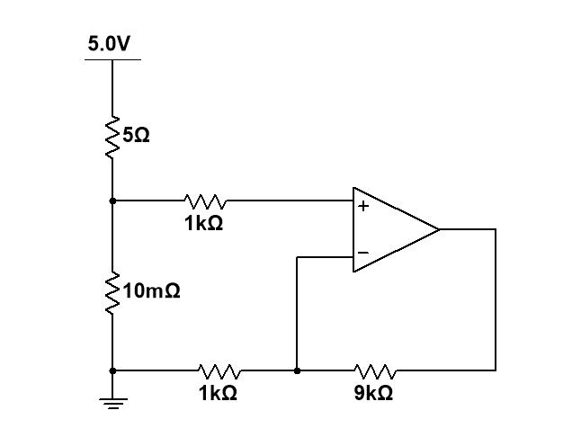
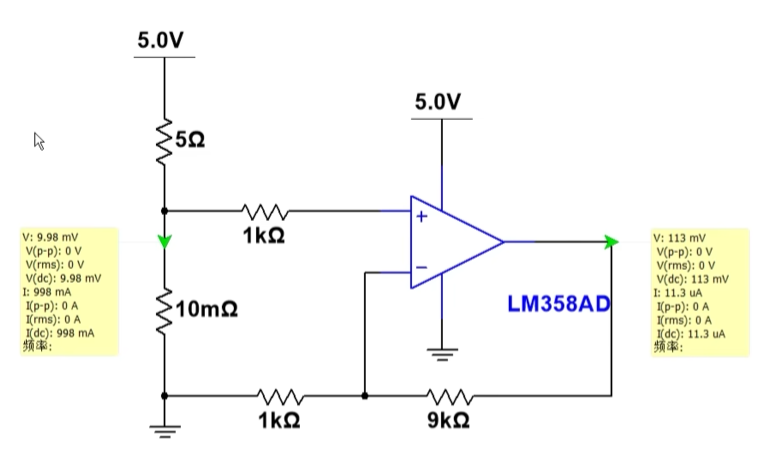
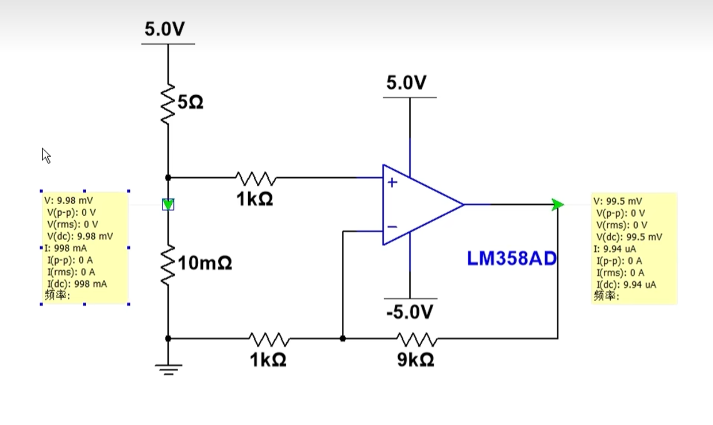
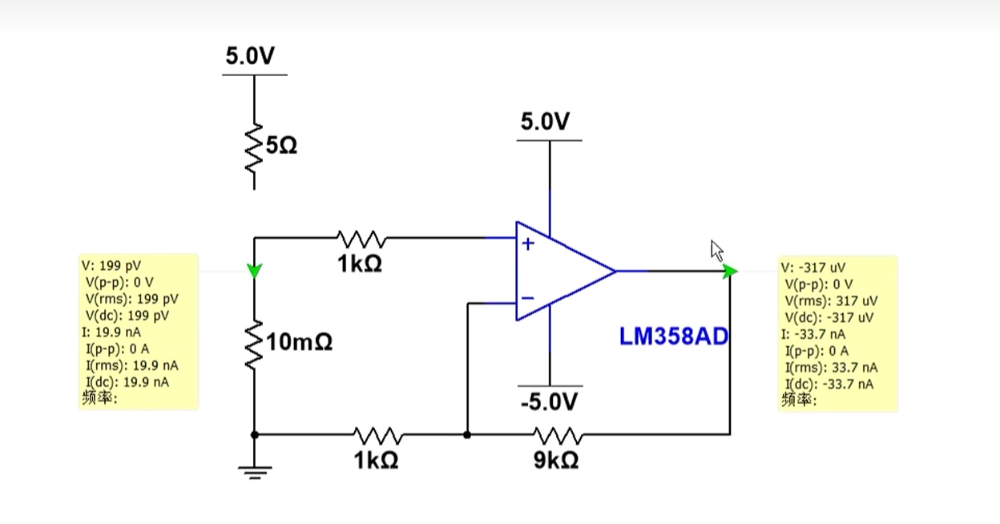
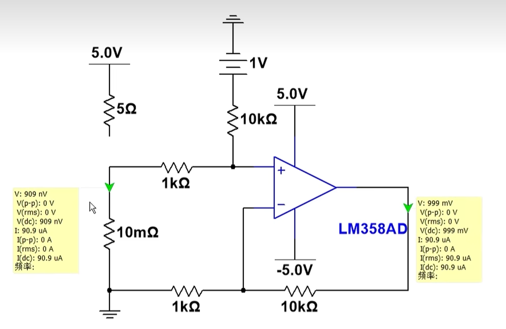
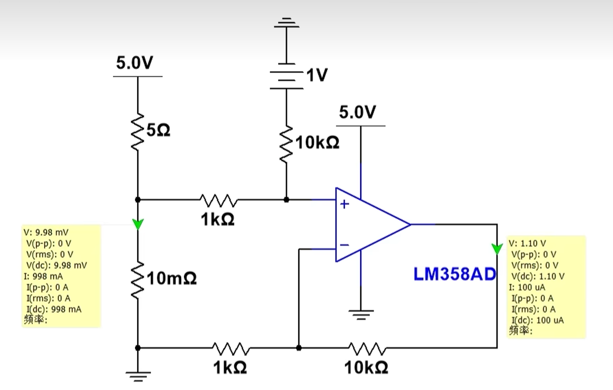

# 电流检测电路

## 单端检测（低端检测）

### 一、电路参数计算

**1. 分压计算**

首先，计算 5.0V 电源经过 5Ω 和 10mΩ 电阻分压后，同相输入端（+）的电压 $$V_+$$。

总电阻：

$$R_{\text{总}} = 5\,\Omega + 10\,\text{m}\Omega = 5.01\,\Omega$$

10mΩ 电阻上的电压降：

$$V_+ = 5.0\,\text{V} \times \frac{10\,\text{m}\Omega}{5.01\,\Omega} \approx 5.0\,\text{V} \times \frac{0.01\,\Omega}{5.01\,\Omega} \approx 9.98\,\text{mV}$$

**2. 运放反馈分析**

这是一个**同相比例放大器**，反馈网络由 1kΩ 和 9kΩ 电阻组成。

根据运放“虚短”和“虚断”特性：

$$V_- = V_+ \approx 9.98\,\text{mV}$$

输出电压 $$V_{\text{out}}$$ 与反相端电压 $$V_-$$ 的关系：

$$V_{\text{out}} = V_- \times \left(1 + \frac{9\,\text{k}\Omega}{1\,\text{k}\Omega}\right) = V_- \times 10$$

**3. 最终输出**

代入 $$V_-$$ 的值：

$$V_{\text{out}} \approx 9.98\,\text{mV} \times 10 \approx 99.8\,\text{mV}$$

由于 10mΩ 远小于 5Ω，也可以近似计算：

$$V_+ \approx 5.0\,\text{V} \times \frac{0.01\,\Omega}{5\,\Omega} = 10\,\text{mV}$$

$$V_{\text{out}} \approx 10\,\text{mV} \times 10 = 100\,\text{mV}$$

**结论**

该电路的输出电压约为 **100 mV**（精确值约为 99.8 mV）。

**关键要点**

- 运放工作在线性区，满足“虚短”（$$V_+ = V_-$$​）和“虚断”（输入电流为0）。

  虚短：1. 有深度负反馈；

  虚断：电阻不能为$M\Omega$级别

- 同相比例放大器的增益公式为 $$A_v = 1 + \frac{R_f}{R_1}$$，这里增益为 10。

## 低端检测注意事项

1、运放的输入、输出范围；

2、运放的$V_{os}$对电路的影响；

### 低端电流检测电路 · 注意事项与解决方法（精简版讲义）

我们刚才推导的都是理想运放的情况：1A 电流，100mV 输出，看上去很完美。

但是一换成实际运放，比如 LM358，问题就来了：理论上应该输出 100mV，实际测出来可能却是 113mV，误差很大。

为什么会这样？因为实际运放不是理想的。主要有两个工程中必须注意的问题。

---

**一、第一个坑：运放的输入共模范围**

低端检测时，采样电阻上的电压非常小，只有十几毫伏，而且非常靠近地。

很多普通运放不是==轨对轨==（[2-5 轨对轨运放 and Vos.md](D:\Typora\PCB\2-5 轨对轨运放 and Vos.md)）的，它的输入并不能真正到 0V。当输入信号太靠近地时，已经超出了它的正常工作范围，测出来必然不准。

**怎么办？解决办法有两个：**

1. 方法1：给运放加负电源
比如给运放加一组 -5V 电源。这样输入信号（十几 mV）就完全落在运放的输入范围内了。

加上负电源后你会发现：
- 输入为 0 时，输出接近 0（比如 -317μV）
- 带上负载后，输出基本就是 99.5mV，精度明显提高

---

**二、第二个坑：输入失调电压 $V_{OS}$ 的影响**

即使加了负电源，你可能还是发现有一点点误差：理论应该是 99.8mV，实际测出来是 99.5mV。差了 0.3mV。

这 0.3mV 就是运放自身的输入失调电压，我们通常叫 $V_{OS}$（[2-5 轨对轨运放 and Vos.md](D:\Typora\PCB\2-5 轨对轨运放 and Vos.md)）的，它的输入并不能真正到 0V。当输入信号太。你可以这样理解：运放自己内部自带了一个很小的输入电压，哪怕你外部不加信号，它自己也会输出一点电压。

**怎么办？用软件自校准来补救**

1. 先断开负载，让电流 = 0，测出此时的输出，比如是 -0.3mV
2. 把这个值存在单片机里，作为零点偏移
3. 接上负载，测出带载时的总输出，比如是 99.5mV
4. 计算：  
   `99.5mV - (-0.3mV) = 99.8mV`

刚好和理论值一致。这就是硬件做不到完美的地方，我们通过软件校准来弥补。

---

**三、实际工程中的考量：负电源不方便，成本高**

刚才说的加负电源确实好用，但在实际产品中会带来新问题：
- 负电源需要额外的电路，增加成本
- 很多单片机的 ADC 不能采集负电压

**怎么办？用单电源 + 抬升偏置电压**

不加负电源了，只用一个单电源，加一个简单的偏置电路：把整个输出信号往上抬一个固定电压，比如抬 1V。

效果是：
- 无负载时，输出 ≈ 1V

- 有负载时，输出 ≈ 1.1V

- 差值还是 100mV，精度一点没丢

- 全程都是正电压，ADC 随便采，再也不用负电源了

   

---

**总结**

低端电流检测，在实际工程里就抓这三点：

1. **输入信号必须落在运放的输入共模范围内**  
   信号靠近地时要特别小心，不行就加负电源，或者用抬偏置的办法解决

2. **必须考虑运放的非理想参数**  
   主要是输入失调电压 VOS 和输入偏置电流 IB，这些都会直接带来测量误差

3. **解决思路有两条路**  
   - 硬件上：选合适的运放、加负电源、抬偏置  
   - 软件上：做零点自校准，把 VOS 的影响消掉

两条路配合着用，就能做出既成本合理、又精度够用的产品。

## 高端检测

==采样电阻在负载和地之间就是低端 在负载和电源之间就是高端==

