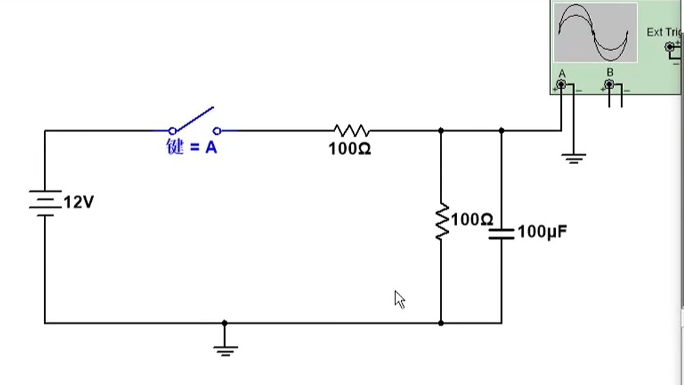
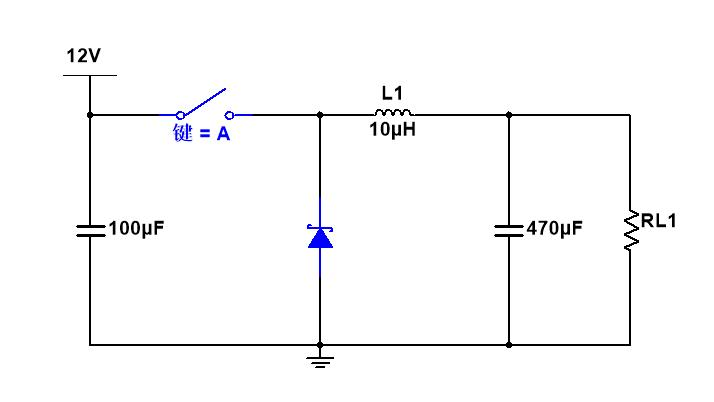
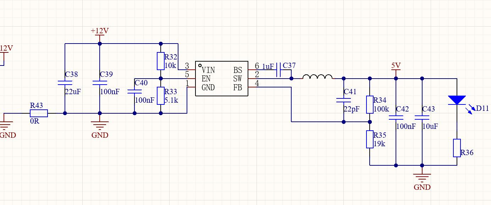
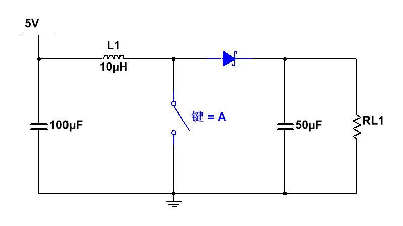
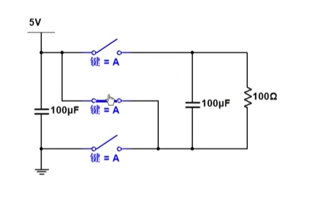
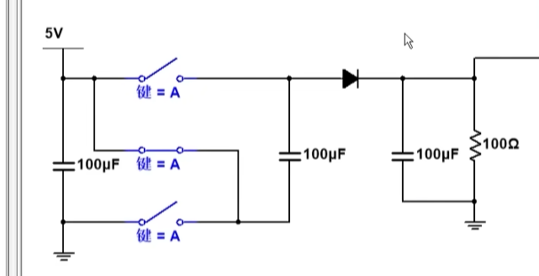
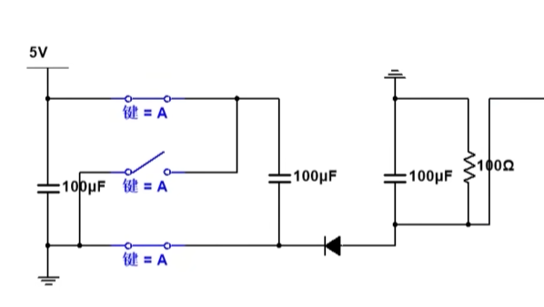

# 最原始的开关电源电路

**手动开关控制：实现12V→5V降压稳压**

我们的目标：不让电容充到12V，稳定输出约5V电压
1. **充电升压**
闭合开关，电源给电容充电，输出电压缓慢上升；
当电压上升到目标上限（约5V）→ **立刻断开开关**
空载时电容无放电通路，电压会稳定维持在峰值

2. **带负载后的循环稳压**
给输出端并联100Ω负载电阻后：
- 开关断开：电容为负载供电，电压缓慢下降；
- 电压跌到下限（约4.9V）：再次闭合开关，电容补电、电压回升；
- 电压回到上限（约5.1V）：再次断开开关。

3. **最终效果**
往复循环开合开关，输出电压只会在**5V附近小幅上下抖动（纹波）**，整体牢牢稳定在目标值，成功把12V输入降压稳压到5V✅

# 降压型开关电源

## BUCK工作原理

### BUCK拓扑是如何设计出来的？

这段讲解完整还原了**经典Buck（降压型）开关电源**，从简陋雏形一步步迭代、解决矛盾、优化缺陷，最终成型的全过程，把开关电源的底层设计逻辑讲得非常透彻👇

---

#### 一、初代雏形：简易RC开关降压电路

**电路结构**
12V直流电源 + 手动开关 + **100Ω串联电阻** + 后端并联100Ω负载电阻 + 100μF输出电容
**能实现的效果**
确实可以完成降压稳压：
- 开关闭合：电容充电，电压缓慢上升
- 电压冲到目标值（如5V），断开开关
- 接负载后电压下跌，跌到下限再次闭合开关补电
- 反复通断，最终输出稳定在5V附近
**致命原生缺陷**
串联电阻是**耗能元件**，电流流过电阻就会持续发热、消耗功率（$P=I^2R$），大量电能直接浪费成热量，效率极低。
完全违背开关电源「**超高效率能量转换、减少发热损耗**」的研发初衷。

---

#### 二、错误优化尝试：直接去掉串联电阻
**直观想法**
电阻耗电，直接拆掉电阻，就没有额外损耗了。
**彻底失效的后果**
电容充放电时间常数公式：
$$\tau = R \times C$$
- 拆掉电阻后，回路等效电阻$R≈0$，充电时间常数$\tau$几乎为0
- 电容充电速度瞬间拉满，**开关一闭合，输出电压一瞬间直接冲到满幅12V**
- 哪怕是高速电子控制电路，响应速度都跟不上；手动操作更是完全来不及在目标电压断开开关，彻底丧失降压控制能力。

---

#### 三、神来之笔：电阻替换为功率电感（核心质变）

把耗能的串联电阻，换成**储能电感**，是整个开关电源设计最巧妙的一步。

**电阻 vs 电感 本质区别**

| 对比维度 | 串联电阻 | 串联理想电感 |
|---|---|---|
| 能量属性 | 耗能元件，通电必发热损耗 | 储能元件，仅储存/释放磁场能量，**理想状态零损耗、效率100%** |
| 电流特性 | 可限流，电压、电流可瞬间突变 | **核心特性：电感电流绝对不能突变**，天生抑制电流瞬间飙升 |
| 控制友好度 | 拉长充电时间，降低开关控制难度 | 同样拉长电流、电压爬升速度，给控制电路留出充足反应时间 |

**替换后的完美收益**
✅ 一举解决两大问题：
1. 彻底消除电阻发热损耗，真正实现开关电源超高效率的核心优势
2. 依然可以限制电流上升速度，电容电压缓慢爬升，开关控制难度大幅降低

---

#### 四、电感带来的新致命问题：高压击穿开关
电感「电流不能突变」的特性，带来了新的电路危机：
1. 开关闭合导通时：电感电流从0缓慢线性上升，能量储存在电感的磁场中
2. 开关瞬间断开的一刹那：
   - 原有供电回路被彻底切断
   - 电感为了维持自身电流不突变，会根据感应电压公式 $U=L \cdot \frac{di}{dt}$，瞬间感应出**几百上千伏的尖峰高压**
   - 这个超高电压会直接击穿、烧毁功率开关器件（MOS管/晶体管），电路直接损坏。

---

#### 五、配套解决方案：增加续流二极管
在开关后端、电感前端，对地反向并联一个二极管，也就是**续流二极管**。
**续流二极管的工作原理**
- 开关闭合时：二极管反向截止，完全不参与电路工作，无任何影响
- 开关断开瞬间：
  电感原有供电通路被切断，此时二极管**正向导通**，给电感搭建了一条全新的、安全的电流回路
  电感储存的能量，会通过二极管续流，持续向后端负载、电容供电
  既避免了电感产生高压尖峰、保护开关器件，又保证了输出电压不会断崖式下跌。

**命名由来**
这个二极管唯一的核心作用，就是给断电后的电感提供「电流继续流动的通路」，因此被叫做**续流二极管**，是Buck拓扑必不可少的核心元件。

---

#### 六、最终成型：标准Buck降压开关电源

**完整电路各元件精准作用**
1. **输入侧100μF电容（输入滤波电容）**
平滑12V输入电源，抑制电源侧纹波、尖峰干扰，给功率开关提供低阻抗、稳定的供电。
2. **可控功率开关**（图中按键，实际电路为高速MOS管）
高频、周期性通断，通过改变导通时间占比（PWM占空比），精准控制输出平均电压。
3. **续流二极管**
开关关断时为电感提供续流回路，吸收高压尖峰，保护功率器件。
4. **功率储能电感L1（10μH）**
限流、抑制电流突变、储能传递能量，全程几乎无额外损耗。
5. **输出侧470μF电容（输出滤波电容）**
进一步平滑输出电压，大幅减小输出电压纹波，给负载提供平稳纯净的供电。
6. **负载RL1**：后端用电负载设备。

---

#### 七、Buck电源完整开关周期
1. **开关导通阶段**
12V电源→开关→电感→输出电容+负载
电感电流线性缓慢上升，电感储存磁场能量，输出电容充电、电压抬升。
2. **开关关断阶段**
输入供电切断
电感通过续流二极管形成独立回路，释放储存的磁场能量，持续为负载和电容供电，输出电压缓慢小幅下降。
3. **循环往复**
高速上万次/秒反复通断开关，通过控制**导通时间占总周期的比例（占空比D）**精准调压。
理想Buck降压核心公式：
$$V_{输出} = V_{输入} \times 占空比D$$
例：12V输入想要稳定5V输出，仅需把占空比稳定控制在≈41.7%，整体能量损耗极低，实际量产效率轻松可达90%~95%以上。

---

#### 整体设计逻辑复盘
1. 先实现简单开关降压 → 发现串联电阻耗能、效率极低
2. 尝试去掉电阻追求零损耗 → 电容充电过快，完全无法控制稳压
3. 电感替换电阻 → 兼顾零损耗+可控的电压爬升
4. 解决电感断电高压问题 → 增加续流二极管
5. 补充输入输出滤波电容优化性能 → 最终得到成熟、高效、稳定的经典Buck降压开关电源

---

## 案例

这是一个**12V转5V的DC-DC Buck降压开关电源电路**，采用集成式Buck控制芯片，实现高效率的直流降压稳压，为后端负载提供稳定的5V供电。下面按模块拆解，带你把每个部分的作用、原理讲透👇

---

### 一、整体电路结构总览
这是一个典型的同步/异步Buck降压拓扑，核心是集成Buck芯片，配合输入滤波、使能控制、自举驱动、反馈分压、输出滤波和负载指示几部分组成，把12V直流输入，高效率地转换为稳定的5V直流输出。

---

### 二、模块1：输入电源与滤波电路
这部分负责给芯片提供干净、稳定的12V输入电源，抑制纹波和尖峰。
- **R43 (0Ω电阻)**：通常作为过线/跳线使用，也可预留位置用于串联保险丝/磁珠，实现过流保护或EMI滤波，这里仅作为电源通路。
- **C38 (22μF) + C39 (100nF)**：
  这是典型的「大容量+小容量」组合输入滤波：
  - 22μF大容量电容（通常为陶瓷/电解）：滤除低频纹波，同时提供瞬态大电流的储能支撑，抑制电源电压波动。
  - 100nF小容量陶瓷电容：滤除高频尖峰和开关噪声，降低电源阻抗，防止芯片工作时的高频干扰串入前级电源。

---

### 三、模块2：芯片供电与使能电路
这部分是Buck芯片的基础工作条件配置：
- **VIN引脚（Pin3）**：芯片供电脚，直接接12V输入，为芯片内部的控制电路、驱动电路供电。
- **EN引脚（Pin5，使能脚）**：
  Buck芯片的使能脚，高电平开启、低电平关闭。这里通过**R32(10kΩ) + R33(5.1kΩ)** 分压，把12V转换为约4V的稳定电压，送到EN脚，强制芯片一直处于开启状态。
  分压计算：$V_{EN} = 12V \times \frac{5.1k}{10k+5.1k} \approx 4.05V$，超过芯片EN脚的开启阈值（通常1-2V），实现上电自动工作。
- **C40 (100nF)**：EN脚的滤波电容，滤除噪声干扰，防止电源波动导致的EN脚误触发，保证芯片稳定开启。
- **GND引脚（Pin1）**：芯片地，提供完整的电流回路。

---

### 四、模块3：核心Buck开关与自举电路
这部分是降压电源的核心能量转换部分，也是你之前学到的Buck拓扑的完整实现：
- **SW引脚（Pin2，开关节点）**：
  芯片内部MOS管的开关输出端，是整个Buck电路的能量核心节点。芯片内部的上管MOS管高频通断，控制SW节点的电压在12V和地之间快速切换，实现能量的间歇性传输。
- **BS引脚（Pin6，自举脚）+ C37 (1μF)**：
  这是Buck芯片必备的**自举驱动电路**：
  - 当SW节点为低电平时，芯片内部的自举二极管给C37充电，C37两端电压约等于VIN（12V）。
  - 当SW节点被上管拉到高电平（接近12V）时，C37两端电压保持不变，此时BS脚电压=SW电压+12V，给上管MOS管的栅极提供足够的驱动电压，保证上管能完全导通。
  - 没有这个自举电容，上管会因为栅极电压不足而无法完全导通，效率会大幅下降甚至无法工作。
- **电感（SW脚后级）**：
  储能电感，是Buck拓扑的核心元件。工作时：
  - 开关导通：12V→SW→电感→负载，电感储存磁场能量，电流线性上升。
  - 开关关断：电感电流通过内部续流二极管（或同步下管）继续流向负载，释放能量，电流线性下降。
  电感的存在既实现了能量传递，又抑制了电流突变，避免了之前你看到的「直接开关电容导致电压瞬间冲到12V」的问题。

---

### 五、模块4：反馈分压与补偿电路
这部分是实现「稳定输出5V」的关键闭环控制部分：
- **FB引脚（Pin4，反馈脚）**：
  Buck芯片内部误差放大器的输入端，会将FB脚电压与内部的基准电压（常见为0.8V/1V，这里按5V输出计算为0.8V）进行比较，从而调整开关的占空比，稳定输出电压。
- **R34 (100kΩ) + R35 (19kΩ) 分压电阻**：
  把输出的5V电压按比例缩小，送到FB脚，分压公式：
  $$V_{FB} = V_{OUT} \times \frac{R35}{R34+R35}$$
  反推输出电压：
  $$V_{OUT} = V_{FB} \times \frac{R34+R35}{R35}$$
  代入数值：$V_{OUT} = 0.8V \times \frac{100k+19k}{19k} \approx 5V$，和目标输出电压完全匹配。
- **C41 (22pF)**：
  反馈补偿电容，和分压电阻组成RC补偿网络，优化电源环路的稳定性，防止输出电压出现振荡、过冲，提升动态响应速度。

---

### 六、模块5：输出滤波与负载指示电路
这部分负责输出纯净、稳定的5V电压，并提供工作状态指示：
- **C42 (100nF) + C43 (10μF)**：
  输出LC滤波的电容部分，和前级电感组成低通滤波器：
  - 10μF大容量电容：滤除低频纹波，同时为负载提供瞬态电流支撑，避免负载突变时电压下跌。
  - 100nF小容量陶瓷电容：滤除高频开关噪声，降低输出纹波，保证5V输出的纯净度。
- **D11 + R36**：
  电源工作指示灯电路：
  - D11是LED指示灯，R36是限流电阻（防止LED过流烧坏）。
  - 当5V输出正常时，电流通过R36点亮LED，直观指示电源处于正常工作状态。

---

### 七、整个电路的稳压工作流程
1.  **上电启动**：12V输入，EN脚分压得到高电平，Buck芯片开启，开始工作。
2.  **开关导通阶段**：芯片内部上管MOS管导通，12V→电感→输出电容+负载，电感储能，输出电压缓慢抬升。
3.  **反馈采样与调整**：输出电压通过R34/R35分压后送入FB脚，芯片将其与内部基准电压比较：
    - 若输出电压低于5V：芯片增加开关导通时间（占空比变大），电感传递更多能量，输出电压抬升。
    - 若输出电压高于5V：芯片减少开关导通时间（占空比变小），电感传递能量减少，输出电压回落。
4.  **开关关断阶段**：上管关断，电感通过续流回路继续向负载供电，电流缓慢下降，输出电压小幅回落。
5.  **循环往复**：芯片通过高频（通常几百kHz）的开关通断，动态调整占空比，最终输出电压稳定在5V附近，纹波被LC滤波大幅抑制，实现高效率稳压。

---

# 升压型开关电源

## Boost升压电路

---

### 一、核心前提：为什么一定要用电感才能升压？

1. 只用**电阻、电容**、普通线材：**永远无法升压**
   无源器件只能分压、耗电、储存少量电荷，遵循能量守恒，不可能把 5V 变成 10V、12V。
2. 想要升压只有一条路：
   **利用电感独有特性**
   - 电感：**电流不能突变**
   - 电感：**电压可以瞬间突变、感应出高压**
3. 配合「开关」控制：
   先给电感**储存磁场能量**，再突然切断回路，电感被迫感应高压，把能量叠加到输入电压上，实现升压。

---

### 二、Boost电路 一步步推导（你讲课原版逻辑）
** 1. 最简雏形：5V输入 + 电感 + 开关**
- 开关**闭合**：
5V电源 → 电感 → 开关 → 地
电感电流慢慢上升，**电能转化为磁场能量储存在电感里**。

- 开关**瞬间断开**：
电感电流不能突然消失，必须维持原来流向；
回路突然断开 → 电感瞬间感应**超高反向电压**。
👉 这就是升压的源头。

** 2. 加输出电容：收集升压能量**
后面加一颗输出电容，用来接收电感释放的高压能量：
公式：$\boldsymbol{V=\dfrac{Q}{C}}$
- 电感强行往电容里灌电荷 $Q$
- 电容容量 $C$ 不变
- 电荷越多 → 输出电压 $V$ 就越高
所以：**开关断开一次，电压往上跳一个台阶**。

**3. 出现致命问题（不加二极管必失败）**
开关再次闭合时：
开关一端直接接地，
如果没有隔离元件，**后面电容好不容易升上去的高压**，会直接通过开关短路放电、瞬间归零。
每次充能一次、放电一次，永远升不上压，白做功。

**4. 关键新增：升压必备「单向二极管」**
二极管作用（唯一核心两点）：
1. **开关闭合时**
二极管反向截止，**隔断后级高压电容**，电容电压不会倒流、不会被拉低。
2. **开关断开时**
电感感应高压 → 二极管正向导通，
电感+输入电源 一起向后级电容充电，电压稳步抬升。

✅ 到此：**标准Boost升压拓扑正式成型**
> 输入电压 → 电感 → 开关下地 + 二极管单向阀 → 输出电容+负载

---

### 三、Boost完整两个工作阶段（必考核心）
**阶段① 开关闭合 —— 电感储能（只存电，不升压）**
1. 电流走：电源 → 电感 → 开关 → GND
2. 电感电流线性上升，储存磁场能量
3. 开关节点被拉到0V
4. 二极管反偏截止，**输出电容独立给负载供电，电压不掉**

**阶段② 开关断开 —— 电感释能 + 叠加升压**
1. 开关断开，电感电流不能突变
2. 电感感应出高压，叠加原本的5V输入
3. 二极管导通，电感能量+电源能量一起灌入输出电容
4. 电容电荷增加 → 输出电压**抬升一个台阶**

---

### 四、仿真现象对应（你实操看到的效果）
1. 反复：闭合 → 断开 → 闭合 → 断开
2. 每断开一次，电压就上一个台阶
3. 带负载后：
- 电压高了：电容慢慢放电、电压小幅回落
- 电压低了：再开关补一次能量、抬升电压
4. 循环往复，最终**稳定在设定高压（如10V、12V）**

**仿真中提到的关键问题解释**

1.  **为什么要加负载？**
    如果没有负载，后级电容会被电感一直充电，电压会持续上升，直到电感能量耗尽或元件击穿，实际电路中必须带负载，或者增加过压保护。
2.  **为什么开关断开太快/太慢会影响升压？**
    开关断开时间太长，电感的能量会全部释放，电压升到峰值后就不会再上升；断开时间太短，电感储存的能量不足，电压抬升的台阶就很小，升压效率低。
3.  **二极管为什么必须存在？**
    如果没有二极管，开关闭合时，后级电容的能量会直接通过开关泄放到地，之前充的电会瞬间归零，完全无法实现升压，二极管是能量单向流动的“阀门”。

---

### 五、Boost稳压逻辑（和你手动操作一致）

1. 当输出电压低于目标值（比如 10V）：开关闭合，电感充能，然后断开，电感释能给电容充电，电压抬升一个台阶。
2. 开关再次闭合时：二极管反偏，电容电压不会被拉低，只是电感再次充能。
3. 当电压升到目标值以上：开关断开，电感释能结束，二极管截止，电容给负载供电，电压缓慢下跌。
4. 电压跌到目标值以下时：重复 “开关闭合→断开” 的循环，最终输出电压会在目标值附近小幅波动，实现稳定的高压输出。

1. 输出＜目标电压：
频繁开关，多给电感充能、多次释放，抬高输出
2. 输出＞目标电压：
减少开关次数、减少电感能量释放，让负载慢慢拉低电压
3. 实际芯片：
用PWM自动控制开关快慢、占空比，替代人手，实现全自动稳压

---

### 六、Boost 核心公式（理解升压倍数）

和Buck降压电路类似，Boost电路也有理想状态下的输出电压公式，能帮你直观理解“升压倍数”和开关占空比的关系：
$$V_{OUT} = \frac{V_{IN}}{1-D}$$

- $D$ 是开关导通的占空比（导通时间/周期总时间）
- 举例：想要5V输入升到10V输出，需要的占空比 $D=50\%$；想要升到12V，占空比约为$58.3\%$
- 占空比越高，升压倍数越大，但也会带来更大的电感电流和开关损耗，实际电路中占空比一般不会超过90%。

---

### 七、Boost & Buck 最强对比总结（一套吃透开关电源）

| 项目 | Buck 降压 | Boost 升压 |
|:----:|:---------:|:----------:|
| 功能 | 高电压 → 低电压 | 低电压 → 高电压 |
| 电感作用 | 限流+储能，平缓电压 | 储能+感应高压，叠加升压 |
| 核心器件 | 续流二极管 | 升压单向二极管 |
| 开关位置 | 电感前端 | 电感后端 |
| 导通时 | 给负载+电感供电 | 只给电感储能 |
| 断开时 | 电感续流放电 | 电感感应高压升压 |
| 共同优点 | 用电感储能，**无电阻发热，效率极高** ||
| 共同核心 | 依靠：电感电流不能突变 ||

---

## 电感饱和

**饱和电流、公式原理、饱和现象、烧坏原因、选型规范**

---

### 一、开关电源电感 最重要选型原则

开关电源选电感，**第一指标：饱和电流 $(I_{sat})$**
1. 电感饱和电流，**必须大于电路实际最大峰值电流**；
2. 必须留安全余量：
   - 最低标准：取 **1.2倍**
   - 稳妥标准：取 **1.5倍**
3. 举例：
   电路理论电感峰值电流 = 10A
   - 保守选型：$(I_{sat} \ge 12A)$（1.2倍）
   - 优质选型：$(I_{sat} \ge 15A)$（1.5倍）

**反面错误选型**
实际峰值10A，你选饱和电流只有1A的电感；
👉 电感**百分百饱和**，电路直接工作异常、烧毁器件。

---

### 二、核心公式（你讲课用到的关键）
电感基础电压电流公式：
$V = L \cdot \frac{\Delta I}{\Delta t}$
去掉负号、变形得到**电流变化率公式**：
$\boldsymbol{\frac{\Delta I}{\Delta t} = \frac{V}{L}}$

**用你现场的例子计算**
输入电压 $(V=5\mathrm{V})$，电感$ (L=10\mathrm{\mu H})$
$$
\frac{\Delta I}{\Delta t} 
= \frac{5}{10\mathrm{\mu H}} 
= 500000\ \mathrm{A/s} 
= \boldsymbol{0.5\mathrm{A/\mu s}}
$$

意思：
**电感不饱和时，每 1微秒，电流只会平缓上涨 0.5A**
→ 电流线性、缓慢、可控上升，这就是电感的限流作用。

---

### 三、正常不饱和 电感工作状态
1. 电感未饱和 → 电感量 (L) 稳定不变
2. 电感两端电压 (V) 不变、(L) 不变
3. **电流变化率固定**，电流缓慢斜着往上走
4. 核心作用：
   抑制电流突变、限制电流上升速度、正常储能、稳压
5. 开关闭合时：
   电流匀速缓慢爬升，电路可控、安全、无冲击。

---

### 四、电感一旦饱和 = 彻底废掉
**1. 饱和本质**
当电感实际电流 **超过自身饱和电流**：
- 磁芯磁通饱和；
- **电感量 L 急剧暴跌、几乎归零**；
- 电感不再具备「抑制电流」的能力；
- 👉 **电感直接等同于一根普通导线**。

**2. 代入公式看后果**

$\frac{\Delta I}{\Delta t} = \frac{V}{L}$
$(L)$ 无限变小 → 电流变化率$(\boldsymbol{\dfrac{\Delta I}{\Delta t}})$ 无限变大
✅ 通俗讲：
**电流不再慢慢涨，而是一瞬间爆炸式飙升、直冲最大值**，完全不受控。

---

### 五、电感饱和带来的严重恶果
1. **电流瞬间暴冲**
原本缓慢上升的电流，瞬间拉满，形成巨大尖峰电流；
2. **开关器件直接烧毁**
MOS管/开关承受超大过流、过热、击穿炸裂；
3. **电感严重发烫、发烫短路**
磁芯饱和损耗暴增，线圈发热严重，甚至烧绝缘、短路；
4. **整个电源系统崩溃**
输出电压拉垮、稳压失效、掉压、重启、炸机；
5. 完全失去Buck/Boost原本的降压、升压功能。

---

### 六、一句话区分两种状态
- **不饱和**：电感=储能+限流元件，电流线性缓慢上升，电源稳定工作；
- **饱和**：电感=一根导线，无限流、无储能，电流暴走，硬件烧毁。

---

**全文终极总结（可直接背诵/讲课用）**
1. 开关电源选电感，**饱和电流是第一参数**，比电感值更重要；
2. 电感饱和电流必须大于电路最大峰值电流，预留 **1.2~1.5倍余量**；
3. 公式 \(\boldsymbol{\dfrac{\Delta I}{\Delta t}=\dfrac{V}{L}}\) 决定：电感量越大，电流上升越慢，越安全；
4. 电感正常工作时，电流匀速缓慢爬升，依靠电感特性限流、储能；
5. 电流超标→电感饱和→电感量骤降，失去限流能力；
6. 饱和后电感变成纯导线，电流瞬间猛增；
7. 最终会导致：开关烧毁、电感发烫、电源崩溃、稳压失效；
8. 核心结论：
**开关电源电感，饱和电流一定要往大留余量，绝对不能刚好卡着最大工作电流选。**

## 电荷泵升压工作原理

这个讲的这个就是**电荷泵（也叫自举电源、电容倍压电路）**，它是一种**无电感的开关电源拓扑**，核心是靠「电容储能+开关切换」实现电压变换，和之前讲的Buck/Boost电感型电源是完全不同的思路。我们顺着你的讲解逻辑，把原理、问题、解决方案一次性讲透👇

---

### 一、核心思想：不用电感，靠电容“叠加电压”升压
电荷泵的本质，是利用**电容两端电压不能突变**的特性，通过开关切换电容的连接方式，把输入电压和电容储存的电压“叠加”起来，实现升压（甚至负压），全程不需要电感。

---

### 二、基础电荷泵的升压过程

我们以你仿真的“5V→10V升压”为例，拆解两个关键阶段：

**阶段1：飞电容充电（上、下开关闭合，中间开关断开）**
- **电流路径**：`5V电源 → 上开关 → 中间100μF电容（飞电容） → 下开关 → GND`
- 飞电容两端电压被缓慢充到**5V**，极性保持“上正下负”。
- 此时负载直接接在飞电容两端，电压为5V（但这不是我们的目标）。

**阶段2：电压叠加（上、下开关断开，中间开关闭合）**
- 飞电容的下端，通过中间开关被直接接到5V输入电源；
- 电容两端电压不能突变，因此上端电压 = 下端电压（5V） + 电容储存的电压（5V） = **10V**；
- 此时飞电容直接给负载供电，负载得到10V电压，完成一次升压。

**致命缺陷：负载电压大幅波动**
当开关切回阶段1时，飞电容的下端被拉回GND，上端电压瞬间从10V掉到5V，负载电压直接“断崖式下跌”，根本无法正常工作——这就是你说的“掉压问题”。

---

### 三、关键改进：加二极管+输出电容（第二张图）

为了解决掉压问题，你加了**单向二极管**和**输出电容**，这是电荷泵能稳定工作的核心。我们看改进后的两个阶段：

**阶段1：飞电容充电（上、下开关闭合，中间开关断开）**
- 飞电容被充到5V，此时二极管的阳极电压=5V，阴极电压=输出电容的电压（比如9V）；
- 二极管**反向截止**，输出电容和负载完全不受影响，输出电容继续给负载供电，电压保持稳定，不会掉回5V。

**阶段2：电压叠加+输出电容充电（上、下开关断开，中间开关闭合）**
- 飞电容上端电压升到10V，超过二极管阴极电压，二极管**正向导通**；
- 飞电容的能量通过二极管，给输出电容充电，输出电容的电压被抬升（比如从9V升到9.7V，减去肖特基二极管0.3V的压降）；
- 输出电容同时给负载供电，电压只会小幅波动，不会出现断崖式下跌。

**循环往复，实现稳定输出**
每个开关周期，飞电容都会给输出电容补充一点能量，输出电容的电压会慢慢抬升到稳定值（接近10V减去二极管压降），最终稳定在目标电压附近，纹波很小，负载可以正常工作。

---

### 四、电荷泵的拓展：不仅能升压，还能产生负压
你提到电荷泵“既可以升压也可以产生负压”，原理是一样的，只是电容极性的切换方式不同：
- **升压**：电容充电时上正下负，叠加时把下端接正电压，上端电压=正电压+电容电压；
- **负压**：电容充电时下正上负，叠加时把上端接GND，下端电压=GND - 电容电压，得到负电压。

比如用5V输入，就能轻松得到-5V的负压，非常适合给运放、传感器等需要双电源供电的器件提供负电源。

---

### 五、电荷泵 vs 电感型开关电源（Buck/Boost）
| 对比项 | 电荷泵（Charge Pump） | 电感型Boost/Buck |
|--------|-----------------------|------------------|
| 核心元件 | 电容+开关+二极管 | 电感+开关+二极管 |
| 升压原理 | 电容电压叠加 | 电感储能+感应高压 |
| 体积/成本 | 小、低（无电感） | 大、高（需要功率电感） |
| EMI噪声 | 低（无电感辐射） | 较高（电感和开关的高频噪声） |
| 带载能力 | 小电流（mA级，适合轻载） | 大电流（A级，适合重载） |
| 效率 | 轻载时效率接近100% | 重载时效率更高 |
| 典型应用 | 小功率、低噪声场景（如运放负电源、USB供电、电池升压） | 大功率、高效率场景（如笔记本电源、电机驱动、电源适配器） |

---

电荷泵的本质，是**用“电容储能+开关切换”替代了电感的储能升压功能**，靠二极管和输出电容解决了负载掉压问题，实现了稳定的升压/负压输出。它体积小、成本低、噪声低，适合小功率场景；而电感型开关电源带载能力更强，适合大功率场景，两者各有优势。

## 电荷泵负压电路 

这个电路是**负压电荷泵（Negative Charge Pump）**，和你之前讲的升压电荷泵是“对称拓扑”，核心原理都是利用**电容两端电压不能突变**的特性，通过开关切换电容电位，实现无电感产生负压。

---

### 一、核心前提：为什么用电荷泵能产生负压？
电荷泵产生负压的底层逻辑，和升压完全同源：
- 电容的**两端电压不能突变**，只能通过充放电改变；
- 给电容充好固定电压后，**人为改变电容一端的电位**，另一端的电位会被“强制拉低/抬高”，实现电压变换；
- 产生负压的关键：把电容的高电位端拉到地，低电位端就会被拉到负电位。

---

### 二、完整工作过程（两个核心阶段）
我们以你仿真的“5V输入→-5V输出”为例，拆解每一步的电位变化：

**阶段1：飞电容充电（上、下开关闭合，中间开关断开）**
- **电流路径**：`5V电源 → 上开关 → 飞电容上极板 → 飞电容下极板 → 下开关 → GND`
- 充电完成后，飞电容两端形成稳定电压：
  - 上极板电位：`V上 = 5V`
  - 下极板电位：`V下 = 0V`
  - 电容两端电压：`Vcap = V上 - V下 = 5V`（上正下负，上极板比下极板高5V）

**阶段2：电位切换，产生负压（上、下开关断开，中间开关闭合）**
- 中间开关闭合后，飞电容的**上极板被强制接到GND**，此时：
  - 上极板电位瞬间变为：`V上 = 0V`
  - 因为电容两端电压不能突变，`Vcap` 必须保持5V不变，因此：
    $$Vcap = V上 - V下 = 5V$$
    $$0V - V下 = 5V$$
    $$V下 = -5V$$
- 飞电容的下极板直接产生了**-5V的负压**，这就是电荷泵产生负压的核心原理。

---

### 三、关键改进：二极管+输出电容解决“掉压问题”
和升压电荷泵一样，直接带负载会出现致命缺陷：开关切回充电阶段时，飞电容下极板会回到0V，负压瞬间消失，负载电压断崖式下跌，无法正常工作。

你的改进方案（加二极管+输出电容）完美解决了这个问题：
1.  **负压产生阶段（开关切换后）**
    - 飞电容下极板为-5V，二极管正向导通，输出电容的负极电位被拉低，电荷通过二极管流向飞电容，输出电容充电，负极电压接近-5V（减去二极管压降）。
2.  **飞电容充电阶段（开关切回后）**
    - 飞电容下极板回到0V，二极管反向截止，输出电容与飞电容隔离，不再受开关切换影响，保持-5V电压，持续给负载供电。

**为什么你仿真里得到的是-4点多伏？**
这是因为二极管存在**正向压降**（普通二极管约0.7V，肖特基二极管约0.3V），输出电压 = `-5V + 二极管压降`，比如肖特基二极管压降0.3V，输出就是-4.7V，和你看到的仿真结果完全一致。

---

### 四、升压电荷泵 vs 负压电荷泵：对称的逻辑
两种拓扑的原理完全对称，只是开关连接方式和二极管方向相反：

| 对比项 | 升压电荷泵 | 负压电荷泵 |
|--------|------------|------------|
| 目标输出 | 2×VIN（如5V→10V） | -VIN（如5V→-5V） |
| 充电阶段电容极性 | 上正下负（V上=5V，V下=0V） | 上正下负（V上=5V，V下=0V） |
| 切换阶段连接方式 | 下极板接+VIN，上极板悬空 | 上极板接GND，下极板悬空 |
| 切换后电容电位 | 上极板=10V，下极板=5V | 上极板=0V，下极板=-5V |
| 二极管方向 | 阳极接飞电容，阴极接输出电容 | 阳极接输出电容，阴极接飞电容 |

---

### 五、负压电荷泵的特点与应用
**核心优势**
1.  **无电感、低成本**：不需要功率电感，体积小、成本低，无电感辐射噪声。
2.  **结构简单**：仅靠电容、开关和二极管就能实现负压，调试难度低。
3.  **轻载效率高**：无电感损耗，轻载时效率接近100%。

**局限性**
- **带载能力弱**：仅适合小电流负载（mA级），重载时电压纹波大、效率低。
- **输出电压有限**：通常只能产生固定倍数的负压（如-5V、-10V），无法灵活调压。

**典型应用场景**
- 给运放、模拟电路提供负电源（如±5V双电源供电）；
- 传感器、RS232接口等需要负压的小功率设备；
- 电池供电设备中，从单节5V电源产生负电压。

---

### 六、最终总结（一句话吃透）
负压电荷泵的本质，是**通过开关切换电容一端的电位，利用“电容电压不能突变”的特性，把另一端的电位强制拉到负电位，再通过二极管和输出电容隔离，实现稳定的负压输出**。它和升压电荷泵是一对互补拓扑，都是无电感电压变换的经典方案，适合小功率场景的升压/负压需求。

# 全篇终极大总结（背诵级核心）

1. 开关电源分两大基础拓扑：
   - Buck：降压
   - Boost：升压
2. 二者全部放弃「电阻分压耗电」的老旧方案，**全部用电感储能**，实现高效率。
3. 电感两大特性是开关电源的根基：
   - 电流不能突变
   - 电压可突变、可感应高压
4. Buck 逻辑：
   开关间断输送能量，用电感平缓电压，把高压切少一点，实现降压。
5. Boost 逻辑：
   先开关闭合给电感存能量，断开瞬间电感出高压，叠加输入电压；
   加二极管防止高压倒流，一步步台阶式抬升电压，实现升压。
6. 二极管是两种拓扑的保命元件：
   - Buck：续流、防高压击穿开关
   - Boost：单向隔离、防止高压电容放电
7. 不管升压还是降压，本质都是：
**用开关控制电感储能/释能的时间，控制传递到后级的能量多少，从而控制输出电压大小。**

---

