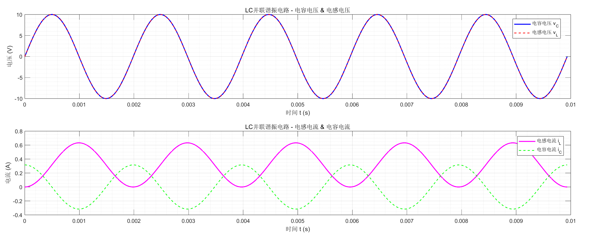
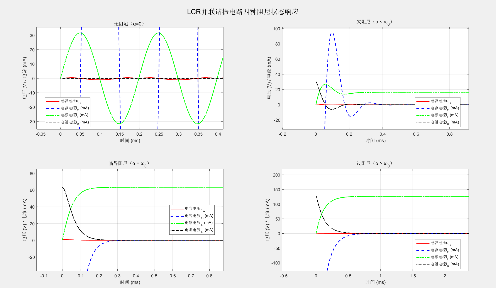
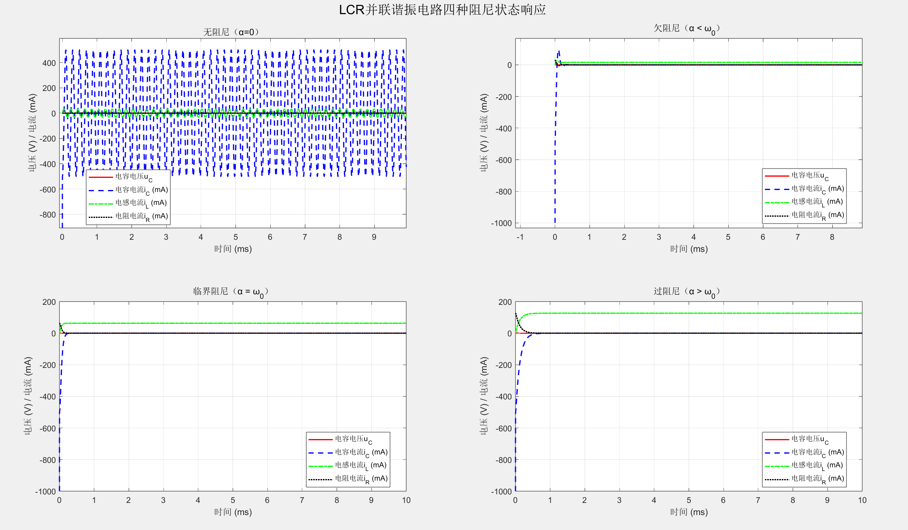
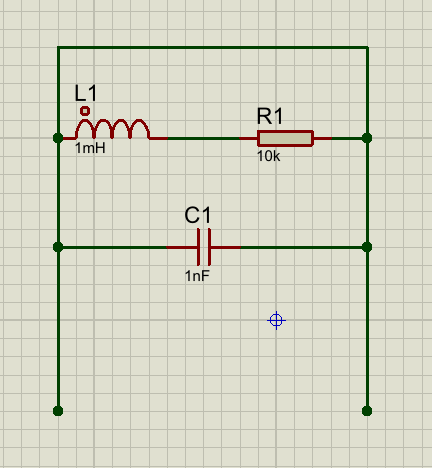

# 差模/共模

## 基础概念：共模（Common Mode）与差模（Differential Mode）

这两个概念针对**双导线传输系统**（如差分信号线、电源线、通信线），描述信号相对于**参考地**的电位关系。

### 共模（CM）

- **定义**：双导线中的**两根线**相对于**参考地**（如大地、电路地），同时存在**大小相等、极性相同**的电位。

- **核心特点**：两根线之间的电位差为 **0**，信号是 “对地共态” 的。

- **通俗类比**：两个人并排以相同速度、相同方向跑步，相对于地面的运动状态一致，两人之间没有相对位移。

- 数学表达：差模电压 $V_{DIFF}=V_1-V_2$（*V*1,*V*2 为两导线对地电压）。

- 典型场景：

  - 差分信号线的两根线，同时被地电位波动影响；
  - 设备外壳带电时，相线和零线对地同时存在相同电压。

  

### 差模（DM）

- **定义**：双导线中的**两根线之间**存在**大小相等、极性相反**（或成比例的电位差），信号传输不依赖参考地。
- **核心特点**：信号是 “线间差态” 的，对地电位可相互抵消，抗干扰能力强。
- **通俗类比**：两个人面对面拔河，两人相对于地面的运动方向相反，相对位移是拔河的有效 “信号”。
- 数学表达：共模电压 $V_{COM}=(V_1+V_2)/2$。
- 典型场景：
  - 差分通信（如 RS-485、CAN 总线）的有用信号；
  - 交流电中相线和零线之间的电压（220V 市电本质是差模电压）。

## 共模干扰与差模干扰

干扰是叠加在**有用信号**上的无用噪声，根据干扰的模式分为两类，来源和危害各不相同。

### 共模干扰（Common Mode Interference）

- **定义**：叠加在双导线上的**共模噪声**，表现为两根线对地同时产生相同的干扰电位。
- 主要来源
  - 地电位差：不同设备接地位置不同，导致地线存在电位差，传导到信号线上；
  - 电磁辐射：外部电磁场（如电机、变频器、雷电）耦合到两根信号线上，产生同向感应电压；
  - 电源浪涌：电网中的浪涌电压通过地线传导，形成共模干扰。
- **危害**：共模干扰会转化为差模干扰（如电路不平衡时），干扰有用信号的传输，还可能导致设备误触发、损坏，甚至产生电磁兼容（EMC）问题。

### 差模干扰（Differential Mode Interference）

- **定义**：叠加在**两根导线之间**的差模噪声，表现为线间的无用电位差。
- 主要来源
  - 线间耦合：相邻导线的电磁感应（如电源线和信号线平行布线）；
  - 电源纹波：开关电源的纹波电压直接叠加在线间；
  - 信号反射：传输线阻抗不匹配导致的信号反射噪声。
- **危害**：直接叠加在有用差模信号上，降低信号信噪比，导致通信误码、测量精度下降。

### 共模干扰 vs 差模干扰 核心区别

|   维度   |      共模干扰      |       差模干扰       |
| :------: | :----------------: | :------------------: |
| 存在位置 |  导线与参考地之间  |     两根导线之间     |
| 信号极性 |     同向、等幅     | 反向、等幅（或比例） |
| 主要来源 | 地电位差、电磁辐射 |  线间耦合、电源纹波  |

| **特性**     | **差模干扰**                     | **共模干扰**                   |
| :----------- | :------------------------------- | :----------------------------- |
| **传导路径** | 导线之间（如L-N线）              | 导线与地之间                   |
| **相位关系** | 大小相等、相位相反               | 大小相等、相位相同             |
| **频率分布** | 低频为主（<1MHz）                | 高频为主（>1MHz）              |
| **危害表现** | - 直接淹没有用信号，导致采样误差 | - 转化为辐射干扰，EMC测试超标  |
|              | - 在PCB走线中产生差模辐射        | - 电路不平衡时转为差模干扰     |
| **转化机制** | 线路阻抗不平衡时与共模互相转化   | 通过寄生电容或电感耦合转为差模 |

## 共模滤波与差模滤波

滤波的核心是**针对性抑制对应模式的干扰**，通过无源器件（电感、电容）构建滤波电路，让干扰噪声被旁路或衰减，有用信号正常通过。

### 共模滤波（Common Mode Filtering）

- **目标**：抑制双导线上的共模干扰，将共模噪声旁路到地或衰减。

- **核心器件**

  1. 共模电感（Common Mode Choke）
     - 原理：两根导线同向绕制在同一铁芯上。当共模电流通过时，产生的磁场同向叠加，电感呈现高阻抗，阻碍共模电流；当差模电流通过时，磁场反向抵消，电感呈现低阻抗，几乎不影响有用差模信号。
     - 应用：开关电源 EMI 滤波、差分通信总线前端。
  2. Y 电容（Y-Capacitor）
     - 原理：接在导线与参考地之间的电容，对高频共模干扰呈现低阻抗，将高频共模噪声旁路到地。
     - 注意：Y 电容容量受安全标准限制（通常 nF 级），防止漏电导致触电。

- **典型电路**：共模电感串联在导线上，Y 电容并联在导线与地之间，构成共模滤波电路。

  

### 差模滤波（Differential Mode Filtering）

- **目标**：抑制两根导线之间的差模干扰。

- **核心器件**

  1. 差模电感（Differential Mode Inductor）
     - 原理：单根导线穿过铁芯（或独立绕制），串联在导线上。对差模电流呈现高阻抗，衰减差模干扰；对直流或低频有用信号阻抗低，影响小。
     - 区别于共模电感：差模电感是单绕组，共模电感是双绕组同向绕制。
  2. X 电容（X-Capacitor）
     - 原理：并联在两根导线之间的电容，对高频差模干扰呈现低阻抗，将差模噪声旁路，不会引入对地漏电风险。
     - 容量：比 Y 电容大（通常 μF 级），主要滤除低频差模干扰。

- **典型电路**：差模电感串联在导线上，X 电容并联在导线之间，构成差模滤波电路。

  

### 实际应用：EMI 滤波器的组合

大多数电源或通信接口的 EMI 滤波器，会**同时集成共模滤波和差模滤波**，形成完整的抗干扰方案：

- 前端：共模电感 + Y 电容 → 抑制共模干扰；
- 后端：差模电感 + X 电容 → 抑制差模干扰。

## 总结

- **共模**是 “对地共态” 信号，**差模**是 “线间差态” 信号；
- **共模干扰**来自地电位差、辐射，用**共模电感 + Y 电容**抑制；
- **差模干扰**来自线间耦合、纹波，用**差模电感 + X 电容**抑制。

# 偏置信号

在电子电路中，**偏置信号**（通常称为**直流偏置**）指的是为电路元件（如晶体管、运放）提供合适静态工作点的**直流电压或直流电流分量**，它不是需要传输的有效交流信号，而是保障电路正常工作的 “基础信号”。

## 1. 偏置信号的核心作用

偏置信号的本质是给有源器件设定一个稳定的静态工作状态，避免信号失真。

举个典型例子：

晶体管放大电路中，需要给基极加一个**直流偏置电压**，让晶体管的发射结处于正向导通状态，使其工作在**放大区**。如果没有这个偏置，当输入的交流信号负半周到来时，晶体管会进入截止区，导致信号被削波，出现**截止失真**。

简单说，偏置信号就是电路的 “静态基准”，交流信号会叠加在这个基准上进行传输或处理。

## 2. 结合 LR 高通滤波理解偏置信号的消除

你之前提到的 **“电感接地、输出取自电感” 的 LR 高通拓扑**，核心优势就是**完全消除输出信号中的直流偏置**，原理和偏置信号的属性直接相关：

- 偏置信号一般是**直流分量**（频率 f=0）；
- 电感对直流的感抗 $X_L = $，等效于**短路导线**；
- 电路中的直流偏置会通过电感直接流入大地，无法在电感两端形成直流电压，因此输出端只有被筛选后的**交流高频信号**，完全没有直流偏置的干扰。

## 补充：偏置信号≠干扰信号

需要注意的是，偏置信号本身不是 “无用信号”—— 在有源电路中它是必需的，但在**信号传输、滤波输出**等场景中，直流偏置反而会成为干扰（比如影响后级电路的静态工作点），这时候就需要像 LR 高通滤波这样的电路，把偏置信号和有效交流信号分离开

## 4. 基准

在电子电路中，**偏置信号**（更准确地称为**直流偏置**）是为**有源半导体器件**（晶体管、场效应管、运算放大器等）提供稳定**静态工作点**的**直流电压或直流电流**，它是保障有源器件正常工作的 “静态基准信号”，**并非需要传输的交流有效信号**。

我们可以从 **核心定义、核心作用、典型应用、与有效信号的区别** 四个维度，对偏置信号进行全面拆解：

### 1.  核心定义：“静态基准” 的本质

偏置信号的核心是**直流分量**（频率 f=0），它的作用对象是**有源器件**（区别于电阻、电容、电感等无源器件）。

- 无源器件（如电阻）：无需偏置，加电就能工作，阻抗特性仅由自身参数决定。
- 有源器件（如三极管）：内部存在 PN 结，需要特定的直流电压 / 电流条件才能进入预定工作状态，这个条件就是偏置信号提供的。

简单来说：偏置信号是给有源器件 “搭好工作平台” 的直流信号。

### 2.  核心作用：避免信号失真，保障有源器件正常工作

偏置信号的最关键作用，是**设定有源器件的静态工作点**—— 即无交流有效信号输入时，器件内部的电压、电流稳定状态。

以**NPN 型三极管共射放大电路**为例，直观理解偏置的必要性：

- **无偏置信号的情况**：

  三极管基极无直流电压，发射结处于零偏置状态。当输入交流信号（如正弦波）时：

  - 信号正半周：基极电位升高，发射结正偏，三极管导通，信号被放大；

  - 信号负半周：基极电位降低，发射结反偏，三极管截止，负半周信号完全丢失

    最终输出波形会出现截止失真，无法完整还原输入信号。

- **有偏置信号的情况**：

  在基极与电源之间接一个偏置电阻 Rb，提供**基极直流偏置电流 \**IBQ\****，使三极管在无交流信号时，就处于**发射结正偏、集电结反偏**的**放大区**。

  此时输入交流信号，会叠加在直流偏置上，信号的正负半周都能被三极管线性放大，输出波形无失真。

**总结**：偏置信号的核心使命是**让有源器件工作在预定的线性工作区**，避免信号失真。

### 3.  典型应用场景：哪里需要偏置信号？

偏置信号广泛存在于所有包含有源器件的电路中，常见场景包括：

1. 晶体管放大电路

   共射、共集、共基放大电路中，基极 / 栅极的直流偏置电压 / 电流，决定了晶体管的放大倍数和线性范围。

2. 运算放大器电路

   运放需要输入偏置电流来补偿内部晶体管的基极电流，避免输出出现零点漂移；部分运放还需要外接偏置电压，设定输出的直流基准。

3. 射频 / 微波电路

   振荡器、混频器、功率放大器中的有源器件（如射频三极管、GaN 器件），需要精准的直流偏置，来保证频率稳定性和功率效率。

### 4.  偏置信号 vs 交流有效信号：关键区别

|   对比维度   |         偏置信号（直流偏置）         |             交流有效信号             |
| :----------: | :----------------------------------: | :----------------------------------: |
|   信号类型   |             直流（f=0）              |      交流（f>0，如音频、射频）       |
|   核心作用   |        设定有源器件静态工作点        |    传输信息（如声音、图像、数据）    |
| 是否需要传输 |     不需要，属于电路 “内部基准”      |      需要，是电路的 “目标信号”       |
|   处理方式   | 有源电路中必需，输出端常通过滤波去除 | 需要放大 / 滤波 / 传输，保留核心信息 |

# 谐振频率和截止频率

振频率和截止频率是滤波电路中的两个核心频率参数，**物理本质、适用场景、作用完全不同**，前者是 LC 谐振电路的固有频率，后者是所有滤波电路（RC/RL/LC）划分通带与阻带的分界频率。下面从定义、公式、物理意义、适用电路四个维度，对两者进行系统性拆解：

## 一、 截止频率（Cutoff Frequency）

### 1.  核心定义

截止频率（记为fc）是**滤波电路划分通带和阻带的分界频率**，在这个频率下，输出信号的幅度衰减为通带最大幅度的1/2（约 0.707 倍），对应功率衰减为通带的一半，因此也叫 **-3dB 频率**。

截止频率是**所有滤波电路（RC/RL/LC 高通、低通）都具备的参数**，其本质是电路的阻抗平衡点 —— 此时滤波元件（电容 / 电感）的电抗等于电阻的阻抗。

### 2.  典型电路的截止频率公式

| 滤波电路类型 |        核心拓扑         |    截止频率公式    |         物理意义          |
| :----------: | :---------------------: | :----------------: | :-----------------------: |
| RC 高通滤波  | 电容串联 + 电阻并联接地 |      fc=2πRC1      |     容抗XC=R时的频率      |
| RC 低通滤波  | 电阻串联 + 电容并联接地 |      fc=2πRC1      |     容抗XC=R时的频率      |
| RL 高通滤波  | 电阻串联 + 电感并联接地 |      fc=2πLR       |     感抗XL=R时的频率      |
| RL 低通滤波  | 电感串联 + 电阻并联接地 |      fc=2πLR       |     感抗XL=R时的频率      |
|   LC 滤波    |   电感 + 电容组合拓扑   | 需结合具体拓扑推导 | 通带与阻带的 - 3dB 分界点 |

#### 3.  核心作用

- 定义滤波电路的**通带范围**：比如高通滤波的通带是f>fc，低通滤波的通带是f<fc；
- 决定滤波电路的**频率选择能力**：截止频率附近的衰减斜率，决定了通带和阻带的过渡陡峭程度。

## 二、 谐振频率（Resonant Frequency）

### 1.  核心定义

谐振频率（记为f0）是**LC 谐振电路的固有频率**，当信号频率等于谐振频率时，电感的感抗XL和电容的容抗XC大小相等、相位相反，即 XL=XC，此时 LC 组合的总电抗出现**极值**（串联谐振时电抗为 0，并联谐振时电抗为无穷大）。

**谐振频率仅存在于含电感和电容的 LC 电路中**，RC/RL 电路无谐振现象，因此没有谐振频率。

### 2.  谐振频率的核心公式

无论 LC 串联还是并联谐振，谐振频率的计算公式统一为：

f0=2πLC1

推导依据：谐振时 XL=XC，即 2πf0L=2πf0C1，整理后得到上述公式。

### 3.  LC 谐振的两种典型模式（核心差异）

| 谐振模式 |    电路拓扑    | 谐振时的总电抗 |         核心特性         |       典型应用       |
| :------: | :------------: | :------------: | :----------------------: | :------------------: |
| 串联谐振 | 电感与电容串联 |  总（纯阻性）  | 电路总阻抗最小，电流最大 | 选频放大器、信号筛选 |
| 并联谐振 | 电感与电容并联 |  总（纯阻性）  | 电路总阻抗最大，电流最小 |   滤波电路、振荡器   |

### 4.  核心作用

- 实现**精准选频**：利用谐振时的阻抗极值，筛选出谐振频率附近的信号，抑制其他频率信号；
- 提升 LC 滤波电路的**衰减斜率**：在截止频率之外引入谐振峰 / 谷，让阻带衰减更快，选频特性更陡峭。

## 三、 谐振频率与截止频率的核心区别

| 对比维度 |          截止频率**fc**           |          谐振频率**f0**          |
| :------: | :-------------------------------: | :------------------------------: |
| 适用电路 |       RC/RL/LC 所有滤波电路       |      仅含 L 和 C 的 LC 电路      |
| 物理本质 | 电抗与电阻的平衡点（-3dB 衰减点） | 感抗与容抗的抵消点（电抗极值点） |
| 公式依赖 |     依赖电阻、电容 / 电感参数     |       仅依赖电感和电容参数       |
| 核心功能 |          划分通带与阻带           |      实现精准选频、增强衰减      |
| 相位特性 |         信号相位偏移 45°          |   信号相位与输入同相（纯阻性）   |

## 四、 两者在 LC 滤波电路中的关联

在**LC 高通 / 低通滤波电路**中，截止频率fc和谐振频率f0可能相等或不相等，取决于电路拓扑：

1. 当 LC 滤波电路以**谐振点作为通带分界**时，fc=f0，此时谐振频率就是截止频率；
2. 当 LC 滤波电路的谐振点位于**阻带内**时，f0\\=fc，谐振点会让阻带衰减进一步增大，提升滤波效果。

**理想情况（无损耗 \**R→∞\**）**：fc=f0，谐振频率就是截止频率，通带为 f>f0；

**实际情况（含损耗 \**R<∞\**）**：fc>f0，两者的差值由损耗电阻 R 决定，R 越小，差值越小；

关系本质：LC 并联高通的截止频率是**谐振峰值的 - 3dB 衰减点**，谐振频率是**通带峰值点**，理想状态下两点重合。

# 谐振和振荡

## 谐振/振荡

**谐振**和**振荡**是电子电路与物理学中密切相关但本质不同的概念，核心区别在于**是否依赖外部持续激励**以及**能量的来源与转换方式**，下面从定义、本质、条件、应用四个维度详细拆解：

**一、 核心定义与物理本质**

**1.  谐振（Resonance）**

谐振是**受迫振动 / 振荡**的特殊状态：当**外界周期性激励信号的频率**等于**系统固有频率**时，系统的响应（电压、电流、振幅）达到最大值的现象。

- **物理本质**：外界持续向系统输入能量，且输入能量的频率与系统固有频率匹配，此时系统储能元件（电感L、电容C）的能量交换效率最高，能量损耗（电阻R消耗）与输入能量达到动态平衡。

- 数学模型（以串联 RLC 电路为例）：

  电路固有谐振频率 $f_t = \frac{1}{2 \pi \sqrt{LC}}$

  当激励频率 $f=f_t$时，电路阻抗$Z=R$达到最小值，回路电流 $I=\frac{U_s}{R}$达到最大值，出电流谐振。

**2.  振荡（Oscillation）**

振荡是**自激的周期性能量转换过程**：系统在**无外部持续激励**的情况下，依靠自身储能元件的能量往复转换，维持周期性的信号输出（需补充损耗能量）。

- **物理本质**：能量在电感的磁场能和电容的电场能之间周期性转换，由于实际电路存在电阻损耗，必须通过**正反馈环节**将部分输出能量反馈到输入端，补充损耗，才能维持持续振荡。

- **数学模型**（以 LC 振荡电路为例）：

  无损耗 LC 回路的自由振荡频率 $f_t = \frac{1}{2 \pi \sqrt{LC}}$（与谐振频率公式一致）；

  实际振荡电路需满足 **巴克豪森判据**：反馈信号的相位与输入信号相位相同（正反馈），反馈幅度足够大以补偿损耗。

**二、 关键区别对比表**

| 对比维度         | 谐振                                                         | 振荡                                               |
| ---------------- | ------------------------------------------------------------ | -------------------------------------------------- |
| **激励条件**     | 必须有**持续外部激励信号**                                   | 无持续外部激励，仅需**初始激励**（如电源上电冲击） |
| **能量来源**     | 能量由外部激励持续提供                                       | 能量来自系统内部储能元件，损耗由正反馈补充         |
| **频率决定因素** | 由**外部激励频率**和**系统固有频率**共同决定（仅当两者相等时谐振） | 由**系统自身参数**（、或RC）决定，等于固有频率     |
| **系统结构**     | 无源电路（RLC）或带激励的有源电路，**无需反馈**              | 必须包含**正反馈网络**和放大环节，属于有源电路     |
| **核心目的**     | 选频、滤波、阻抗匹配（如收音机选台、谐振滤波）               | 产生周期性信号（如正弦波振荡器、方波发生器）       |

**三、 两者的内在联系**

1. **振荡以谐振为基础**：振荡电路的振荡频率，本质上就是电路的**固有谐振频率**，只有当电路工作在谐振状态时，才能维持稳定的频率输出。

2. **谐振是振荡的一种特殊受迫形式**：如果给振荡电路施加外部激励，当激励频率等于振荡频率时，电路会进入谐振状态，输出幅度会进一步放大。

   

**四、 典型应用举例**

- 谐振的应用：
  - 串联 RLC 谐振电路：用于收音机的调谐回路，选择特定频率的广播信号。
  - 并联 RLC 谐振电路：用于高频放大器的负载，实现阻抗匹配和选频。
- 振荡的应用：
  - LC 正弦波振荡器：用于通信设备产生载波信号。
  - RC 桥式振荡器：用于低频信号发生器产生正弦波。
  - 多谐振荡器：用于数字电路产生方波时钟信号。

## LCR的谐振和振荡

**一、谐振（Resonance）：电路的“共振”状态**

谐振是**外部信号频率与电路固有频率匹配时的特殊工作状态**，核心是**能量交换效率最大化**。

- **核心条件**：当输入信号频率（策动频率）等于电路固有频率$f0$ 时，电感的感抗（$X_L=ωL$）与电容的容抗（$X_C=\frac{1}{ωC}$）完全相等（$X_L=X_C$），此时电路总电抗为零。
- LCR串联电路的谐振特性：
  1. **阻抗最小且纯阻性**：总阻抗 $Z=R$（仅由电阻决定），电路对电流的阻碍作用最弱。
  2. **电流最大**：回路电流 $I=\frac{V_{in}}R$ 达到峰值，且与输入电压同相。
  3. **电压互补**：电感与电容两端电压大小相等、相位相反（$V_L=−V_C$），相互抵消，因此电阻电压等于输入电压（$V_R=−V_{in}$）。
  4. **品质因数Q**：谐振时电感（或电容）电压与输入电压的比值 $Q=\frac{X_L}R=\frac{X_C}R$，$Q$值越高，谐振峰越尖锐，选频能力越强（如收音机调谐电路）。

**二、振荡（Oscillation）：能量的周期性“摇摆”**

振荡是**电路内部电场能与磁场能的自主周期性转换过程**，无需持续外部信号驱动（初始能量触发即可）。

- 理想LC振荡电路（无电阻）：

  1. **能量转换**：电容充电时存储电场能，放电时电场能转化为电感的磁场能；电感放电时磁场能又转化为电容的电场能，如此循环，形成**等幅振荡**。
  2. **固有频率**：振荡周期由LC参数唯一决定，公式为$ T=2\pi \sqrt{LC}$，频率 $f_0 = \frac{1}{2 \pi \sqrt{LC}}$（与谐振频率公式一致）。

- 实际LCR振荡电路（含电阻）：

  电阻会消耗能量，导致振荡幅度逐渐衰减（阻尼振荡）。根据阻尼程度可分为：

  - 欠阻尼：振荡幅度缓慢衰减，仍有周期性波形（如钟摆的摆动）。
  - 临界阻尼：无振荡，能量最快耗散（如电表指针快速回零）。
  - 过阻尼：能量耗散更慢，无振荡（如阻尼过大的弹簧）。

**三、谐振与振荡的关键区别**

| **维度**     | **谐振**                       | **振荡**                   |
| :----------- | :----------------------------- | :------------------------- |
| **本质**     | 外部信号与电路的“频率匹配”状态 | 内部能量的“周期性转换”过程 |
| **驱动条件** | 需持续外部信号（频率匹配）     | 仅需初始能量（如电容充电） |
| **能量流向** | 外部能量持续输入并被高效吸收   | 内部电场能↔磁场能自主转换  |
| **核心参数** | 策动频率=固有频率              | 固有频率由LC决定           |

**总结**

- **谐振是“状态”**：电路对特定频率信号的响应达到峰值，是**被动的频率选择行为**（如滤波器选频）。
- **振荡是“过程”**：电路自主产生周期性信号，是**主动的能量转换行为**（如振荡器产生高频信号）。
- LCR电路中，**谐振是振荡的“最优状态”**：当振荡频率等于谐振频率时，能量损耗最小，振荡最稳定（如LC振荡器通过谐振维持等幅振荡）。

# $LC$振荡原理（串联）

## 从电荷角度解释$LC$振荡原理（没有阻尼的情况下）

==电容上下两极板发生电荷失衡现象，是导致电容两极板存在电压的原因之一==

> 电容没有电压，上下两极板的正负电荷是相等的

 

> 电容有电压，上下两极板的正负电荷不守恒

 

> 给电容充电之后，上极板的正电荷多，下极板负电荷多，在开关闭合之后，负电荷从下极板到上极板进行移动（就是放电），经过电感，等到下极板的正负电荷相等，但是因为电感（==流过电感的电流不能突变==）导致下极板的负电荷持续移动到上极板，最后的结果是下极板的正电荷多，上极板的负电荷多

> 上面的电流图因为是以逆时针为正方向，电流流向是顺时针

## 解释$LCR$振荡原理（有阻尼的情况下）

==电容在放电的时候，流过电感的理论电流最大值是多少？==

==电感在什么时候开始释放能量？==

$R_C是临界值R_{临界}=2\sqrt{\frac{L}{C}}$

> 这种图展示的电流刻度都是很小的

### 无阻尼的电路（$R=0$）

### 解释

#### 为什么在无阻尼的时候，电容电压为$0$时，电流最大？

以**无阻尼 LCR 串联电路**为模型，设定**初始状态**：电容上极板带正电荷 $Q_0$、下极板带等量负电荷$-Q_0$，对应初始电压$V_0=12V$ ；回路初始电流 $i=0$；电感无磁场能储存。

从**电荷微观移动的速度、受力、能量转化**三个维度，逐刻细化过程（忽略电阻，电荷无损耗，仅在电容极板与回路间转移）：

---

**核心前提**

1. 电容电压本质：$V_C=\frac{Q}{C}$，$Q$ 是极板净电荷量，$Q$越大，极板间电场越强；$Q=0$ 时，极板间电场消失。
2. 电流本质：**电荷的定向漂移速率**，公式 $i=nqSv$（$n$ 为载流子数密度，$q$ 为单个电荷电量，$S$ 为导线截面积，$v$ 为电荷漂移速度）——$v$越大，电流 $i$ 越大。
3. 电感的核心特性：**阻碍电流变化**（楞次定律），电流增大时，电感将电能转化为磁场能；电流减小时，电感将磁场能转化为电能。

$t = 0$

==驱动力$F_{电} == $ 阻碍力$F_{阻}$，且方向相反 → 电荷受到的合力为 0 → 电荷**漂移速度 $v= 0$**，电流 $i=0$。==

（这里可以理解为：电容想推电荷动，电感立刻 “拽住” 不让动，两者力气一样大，电荷暂时静止）

---

**阶段 1：$t=0 \to t<\frac{T}{4}$（电容放电，电流增大，极板电荷减少）**

**电荷分布**：电荷主要集中在电容极板上，回路中自由电荷处于静止状态。

**受力驱动**：

极板间强电场产生电场力$F=qE$（$E=\frac{Q_0}{εS}$ 为极板间电场强度），推动上极板正电荷沿导线顺时针流向下极板。

但电感会阻碍电流的 “突然增大”，立刻产生反向感应电动势$EL=−L\frac{Δt}{Δi}$抵消一部分电场力的推动作用。

**电荷移动细节**：

初始时刻（$t=0$）：电场力最大，但电感阻碍最强，电荷漂移速度$v$ 极小，电流 $i\approx0$；

随时间推移：正电荷持续从极板流出，极板净电荷量 $Q$ 逐渐减少 → 极板间电场强度 $E$ 减弱 → 电场力 $F$ 减小；

同时，电流变化率 $\frac{Δt}{Δi}$ 逐渐减小 → 电感反向电动势 $E_L$ 减弱 → 对电荷移动的阻碍作用变小；

→ 电荷漂移速度 $v$ **持续加快**，回路电流 $i$ 持续增大。

**能量转化**：电容的电场能 → 电感的磁场能 + 电荷的动能（用于提升漂移速度）。

**驱动力 $F_{电}$ 的变化**：电荷开始缓慢移动，电容极板的电荷 $Q$ 逐渐减少 → 电 逐渐**减小**。

**阻碍力 $F_{阻}$ 的变化**：随着电荷移动，电流逐渐增大，但**电流变化率 $ \frac{Δt}{Δi} $ 在逐渐减小**（因为电容的力在减弱，电流增大的趋势变慢）→  $F_{阻}$ 逐渐**减小**。

**关键差异**：$F_{阻}$减小的**速度比 $F_{电}$更快** → 电荷受到的合力 $F_{合}=F_{电}-F_{阻}$。

合力的存在让电荷**持续加速**（就像跑步时，向前的推力比向后的阻力大一点，速度就会越来越快）→ 电荷漂移速度 $v$ 越来越大 → 回路电流 $i=nqSv$ 越来越大。

这个阶段，**电容的力不是比电感的力 “小”，而是略大一点**，刚好能推动电荷加速。

------

**阶段 2：$t=\frac{T}{4}$（临界时刻：$V_C=0，i=I_{max}$，电流最大）**

**电荷分布**：电容上、下极板的正、负电荷完全中和，极板净电荷量 $Q=0$ → 电容电压$V_C=C_Q=0$

**受力与漂移速度的关键突变**：

极板间电场消失 → 电场力 $F=0$，电荷移动不再受电场力驱动；

此时电流达到峰值，电流变化率 $\frac{Δt}{Δi}=0$ → 电感感应电动势 $E_L=0$，对电荷移动的阻碍作用完全消失；

电荷的漂移速度 $v$ 达到最大值：

此前电场力的 “剩余推力” 和电感储存的磁场能，共同让电荷保持最快的漂移速度；且此时没有任何外力（电场力、感应电动势）阻碍电荷流动。

**电流与能量的对应**：

漂移速度 $v$ 最大 → 电流 $i=nqSv$ 达到最大值 $I_max$；

电容电场能完全耗尽 → 全部转化为电感的磁场能$E_L=\frac{1}{2}L{I_{max}}^2$

**易错点澄清**：

极板电荷 $Q=0$，不代表回路中没有电荷，而是所有电荷都在回路中以最快速度移动，没有电荷停留在极板上。

**驱动力$F_{电}$ 的变化**：电容极板的电荷 $Q$ 完全中和（$Q=0$）→ 极板间电场消失 → $F_{电}$。

**阻碍力  $F_{阻}$ 的变化**：此时电流已经达到最大值，**电流变化率 $ \frac{Δt}{Δi} $**（电流从 “增大” 转为 “即将减小”，这一刻变化率为 0）→  $F_{阻}$。

**速度与电流的峰值**：电荷不再受任何力的作用（合力为 0），根据牛顿第一定律，电荷会**保持当前的最大速度匀速运动** → 此时漂移速度 $v$ 达到峰值 → 电流 i 达到最大值 $I_{max}$。

同时，电容电压 $V_C=\frac{Q}C=0$，电场能完全转化为电感的磁场能。

------

**阶段 3：$t>\frac{T}4→t=\frac{T}2$（电容反向充电，电流减小）**

**电荷分布**：电荷仍在回路中流动，但开始在电容下极板积累正电荷、上极板积累负电荷（反向充电）。

**受力阻碍**：

反向充电的电容会产生反向电场，电场力方向与电荷流动方向相反，阻碍电荷继续移动；

同时，电流开始减小，电感产生同向感应电动势（试图维持电流不变），但反向电场力的阻碍作用逐渐占优。

**电荷移动细节**：

反向电场力持续增大 → 电荷漂移速度 $v$ 逐渐减慢 → 回路电流 $i$ 逐渐减小；

电容极板反向净电荷量 $Q$ 逐渐增大 → 反向电压 $V_C$ 逐渐增大。

**能量转化**：电感的磁场能 → 电容的反向电场能

---

**最核心的结论（电荷流向视角）**

电流的大小由**电荷漂移速度**决定，而非极板上的电荷数量：

- 当 $V_C>0$ 时，极板电场力虽能推动电荷流动，但电感的阻碍作用始终存在，电荷漂移速度会被 “牵制”；
- 当 $V_C=0$ 时，**极板电场力消失，电感阻碍作用也消失**，电荷漂移速度达到峰值 → 电流最大。

简单说：**电容电压为 $0$，就是电荷流动 “没有阻力” 的时刻，此时电荷跑得最快，电流自然最大**。

## 欠阻尼的电路（$R < R_C$）

$R_C是临界值R_{临界}=2\sqrt{\frac{L}{C}}$

## 判断各个的阻尼

判断**串联 LCR 振荡电路**的欠阻尼、临界阻尼、过阻尼三种状态，核心逻辑和并联电路一致 —— 对比**阻尼系数$\alpha$与固有角频率$ω_0$的相对大小，但串联电路的参数公式与并联完全不同**，这是关键区别。

**一、串联 LCR 电路的核心方程与参数**

串联 LCR 电路的结构是：**电感$L$、电阻$R$、电容$C$首尾依次连接**，电流处处相等。

若以电容电压vC为研究对象，无激励源的暂态二阶微分方程为：

$LC\frac {d^2{v_C}}{{dt}^2}+RC\frac{dv_C}{dt}+vC=0$

这个方程的形式决定了电路的阻尼特性，我们需要定义两个核心参数：

**1.固有角频率$ω0$**

由$L$和$C$决定，是电路无阻尼时的振荡频率，**和并联电路公式完全相同**：

$ω_0=\frac{1}{\sqrt{LC}}$

 **2. 阻尼系数α**

由**串联电阻$R$和电感$L$** 决定，反映电路的能量损耗速度，**和并联电路公式差异极大**：

$α=\frac{R}{2L}$

- 电阻R越大 → 阻尼系数α越大 → 能量损耗越快；
- 电阻R越小 → 阻尼系数α越小 → 能量损耗越慢。

 **3. 临界阻尼电阻$R_{临界}$**

当$α=ω_0$时，电路处于临界阻尼状态，此时的电阻值为临界电阻，联立公式可得：

$\frac{R_{临界}}{2L} = \frac{1}{\sqrt{LC}}$

化简后得到串联电路的临界电阻公式：

$R_{临界} = 2\sqrt{\frac{L}{C}}$

 **三种阻尼状态的判断条件**

|   阻尼类型   | 核心条件（**α**与**ω0**） | 电阻判断（$R$与$R_{临界}$） |                物理含义                |
| :----------: | :-----------------------: | :-------------------------: | :------------------------------------: |
|  **欠阻尼**  |          $α<ω_0$          |       $R < R_{临界}$        |     能量损耗慢，电路呈**衰减振荡**     |
| **临界阻尼** |          $α=ω_0$          |       $R = R_{临界}$        | 能量损耗速度刚好，**无振荡，衰减最快** |
|  **过阻尼**  |          $α>ω_0$          |       $R > R_{临界}$        |    能量损耗快，**无振荡，衰减缓慢**    |

## 各个阻尼的作用

串联 $LCR$ 电路的**阻尼**（通过串联电阻R控制，阻尼系数$α=\frac{R}{2L}$），核心是**调控电路暂态能量损耗速率**，进而改变响应波形，适配不同工程需求，三种阻尼状态的作用与应用如下：

 **一、欠阻尼（$α<ω_0，R<R_{临界}$）**

- **核心作用**：保留**衰减振荡**特性，实现**选频、谐振、储能与信号振荡**
- **关键表现**：
  - 电压 / 电流呈正弦衰减，阻尼振荡频率$ω_d=\sqrt{{ω_0}^2−α^2}$，接近固有频率$ω_0$
  - 品质因数$Q>0.5$（$Q$越大，衰减越慢、选频越尖锐）
  - 谐振时阻抗最小（纯电阻），电流最大，可实现**串联谐振选频**
- **典型应用**
  - 射频 / 中频选频电路（如收音机、通信接收机的中频滤波器）
  - LC 振荡电路（配合有源放大，实现持续振荡信号输出）
  - 脉冲变压器、谐振变换器中的储能与能量交换回路
- **优缺点**：优点是选频 / 振荡性能好；缺点是暂态响应有过冲，稳定时间长

 **二、临界阻尼（$α=ω_0，R=R_{临界}$）**

- **核心作用**：**无振荡且以最快速度衰减至稳态**，实现**无过冲的快速稳定**

- **关键表现**：

  - 暂态响应为单调衰减曲线，无过冲、无振荡，以最短时间达到稳态（$0$ 或直流值）
  - 品质因数$Q=0.5$，是阻尼的临界点
  - 临界电阻$R_{临界}=2\sqrt{\frac{L}{C}}$

- **典型应用**

  - 示波器探头、脉冲测量电路（避免信号过冲和振荡，保证测量精度）
  - 继电器 / 电磁阀驱动回路（快速关断电流，减少线圈损耗）
  - 二阶系统的最优暂态设计（如电源输出滤波、伺服系统响应控制）

  **优缺点**：优点是无过冲、稳定最快；缺点是无振荡特性，选频性能差

 **三、过阻尼（$α>ω_0，R>R_{临界}$）**

- **核心作用**：**无振荡但衰减缓慢**，适合需要**抑制振荡、平滑过渡、防止过冲**且对稳定时间要求不高的场景
- 关键特性
  1. 暂态响应为缓慢单调衰减曲线，无过冲、无振荡，衰减速度随电阻增大而变慢
  2. 品质因数$Q<0.5$，无谐振峰值，选频特性差
  3. 电阻越大，阻尼越强，衰减越慢
- 典型应用
  - 高压直流输电线路的过电压抑制（平滑浪涌电压，避免振荡击穿）
  - 精密仪器的缓慢充放电回路（如积分电路、$RC$ 滤波器的扩展）
  - 机械系统的减震（电气模拟机械阻尼，抑制振动）
- **优缺点**：优点是完全无过冲、无振荡；缺点是稳定时间长，响应慢

**四、阻尼的通用核心价值（串联电路）**

1. **抑制过冲与振荡**：避免暂态响应中的电压 / 电流尖峰，保护器件
2. **控制稳定时间**：通过调整R，在 “快速响应” 和 “无过冲” 间折中
3. **调节品质因数$Q$**：$Q=\frac{ω_0 L}{R}$，决定选频特性的尖锐程度与能量损耗速率
4. **适配不同工况**：同一$ L、C$ 参数下，仅调整串联电阻，即可切换欠 / 临界 / 过阻尼，满足不同暂态需求

**五、三种阻尼的核心作用对比表**

| 阻尼类型 |      核心作用      |       核心优势       |    核心劣势    |          典型场景          |
| :------: | :----------------: | :------------------: | :------------: | :------------------------: |
|  欠阻尼  |  选频、谐振、振荡  | 振荡特性好，选频尖锐 | 有过冲，稳定慢 |   收音机选频、LC 振荡器    |
| 临界阻尼 |   快速无过冲稳定   |   稳定最快，无过冲   | 无振荡，选频差 |    示波器探头、脉冲测量    |
|  过阻尼  | 平滑过渡，抑制振荡 |  完全无过冲、无振荡  |    稳定最慢    | 高压过电压抑制、精密充放电 |

**六、补充说明（工程设计的核心考量）**

1. 串联 $ LCR$ 的阻尼由**串联电阻**$R$ 决定（$α=\frac{R}{2L}$），电阻越大，阻尼越强；
2. 实际设计中，常通过调整串联电阻来切换阻尼状态，适配不同的暂态 / 稳态需求；
3. 欠阻尼适合**信号处理与谐振**，临界阻尼适合**测量与快速控制**，过阻尼适合**浪涌抑制与平滑过渡**。

# $LC$振荡原理（并联）

## 无阻尼

## 有阻尼

## 判断各个的阻尼

判断 $LCR$ 并联振荡电路的**欠阻尼、临界阻尼、过阻尼**三种状态，核心依据是**阻尼系数$\alpha$与固有角频率$ω_0$的相对大小，同时也可以通过电路参数计算**和**波形特征观察**快速区分。

**一、核心判断依据（理论公式法）**

 **1. 先明确两个关键参数**

对于 并联电阻$R$ 的 $LCR$ 振荡电路（电阻与 $L、C$ 并联）：

- **固有角频率**$ω_0$：由 $L、C$ 决定，是电路的固有属性，公式为$ω_0=\frac{1}{\sqrt{LC}}$，它反映了电路无阻尼时的振荡频率。

- **阻尼系数**$α$：由 $R、C$ 决定，反映电路的能量损耗速度，公式为$α=\frac{R}{2L}$

  电阻R越小，阻尼越强（能量损耗越快）；R越大，阻尼越弱。

**2. 三种阻尼的判断条件**

|   阻尼类型   | 核心条件 |                 物理含义                 |
| :----------: | :------: | :--------------------------------------: |
|  **欠阻尼**  |  $α<ω0$  |      能量损耗慢，电路能维持衰减振荡      |
| **临界阻尼** |  $α=ω0$  | 能量损耗速度刚好让电路无振荡，且衰减最快 |
|  **过阻尼**  |  $α>ω0$  |     能量损耗快，电路无振荡，且衰减缓     |

**3. 用 并联电阻R 直接判断（更实用）**

将$α=ω_0$代入公式，可推导出**临界阻尼电阻**$R_{临界}$：

$R_{临界}=\frac{\sqrt{L/C}}{2}$

只需对比实际并联电阻$R$与$R_{临界}$的大小，即可快速判断：

- $R < R_{临界}$→ 欠阻尼

- $R = R_{临界}$→  临界阻尼

- $R > R_{临界}$→ 过阻尼

**举例**：之前 MATLAB 仿真中$L=10mH,C=10μF$

$R_{临界}=\frac{\sqrt{10e^-3/10e^-6}}{2}=\frac{\sqrt{1000}}{2}\approx15\Omega$

- $R=5R_{临界}\approx19\Omega$→ 欠阻尼
- $R=R_{临界}\approx15.8\Omega$→ 临界阻尼
- $R=0.1R_{临界}\approx1.58\Omega$→ 过阻尼

# 输入信号的频率与谐振，振荡

## 谐振，振荡定义

好的，我们来详细解释LCR谐振电路中的这三个核心频率概念：**输入频率**、**谐振频率**和**截止频率**。

为了清晰理解，我们以一个**串联LCR电路**为例进行说明。电路包含一个电感（L）、一个电容（C）和一个电阻（R）串联，并接入一个正弦交流电压源。

---

**1. 输入频率**

*   **定义**：输入频率，也称为**信号频率**或**激励频率**，是施加到LCR电路上的外部交流电压源的频率。通常用符号 **\( f \)** 或 **\( \omega \)**（角频率，\(\omega = 2\pi f\)）表示。
*   **性质**：**这是一个变量，由信号源决定，可以人为改变。** 它是我们研究电路响应的“自变量”。
*   **作用**：整个电路的行为（阻抗、电流、电压分布）都强烈依赖于输入频率 \( f \) 与电路自身的固有频率（谐振频率）之间的相对关系。
*   **类比**：就像你推秋千的频率。你可以选择快速轻推，也可以选择慢速推，或者按照秋千自然的摆动节奏（谐振频率）去推。

---

**2. 谐振频率**

*   **定义**：谐振频率是LCR电路本身的一个**固有属性**。当输入频率等于这个特定频率时，电路会发生“谐振”现象。通常用符号 **\( $f_0$ \)** 或 **\( $\omega_0$ \)** 表示。
*   **计算公式**：
    \[$f_0 = \frac{1}{2\pi\sqrt{LC}} \quad \text{或} \quad \omega_0 = \frac{1}{\sqrt{LC}}$\]
    它**只由电感L和电容C的数值决定**，与电阻R和输入信号无关。
*   **谐振时的电路特性**（以串联LCR为例）：
    1.  **阻抗最小且为纯电阻性**：感抗（\($X_L = \omega L$\)）和容抗（\($X_C = 1/\omega C$\)）大小相等，方向相反，相互抵消。电路总阻抗 \($Z = R$\)，达到最小值。
    2.  **电流最大**：由于阻抗最小，回路电流 \(I = V/R\) 达到最大值，且与电源电压同相位。
    3.  **电感和电容上的电压**：它们各自两端的电压（\($V_L = I \cdot X_L$))， \($V_C = I \cdot X_C$\)）可能远大于电源电压，其比值即为电路的**品质因数Q**（\($Q = \frac{\omega_0 L}{R} = \frac{1}{\omega_0 C R}$\)）。Q值越高，电压放大作用越强。
*   **物理意义**：在谐振频率下，电感的磁场能量和电容的电场能量以最大效率在两者之间周期性地交换，电源只需要补充电阻上的能量损耗。
*   **应用**：用于选频（如收音机调台）、滤波、频率生成等。

---

**3. 截止频率**

*   **定义**：截止频率通常用于描述**频率选择性电路**（如滤波器）的性能边界。它不是一个单一的点，而是一对频率点（\(f_{c1}\) 和 \(f_{c2}\)），在这两点上，电路的输出功率下降到最大输出功率的一半，或输出电压/电流下降到最大值的 \(1/\sqrt{2} \approx 0.707\) 倍（即-3 dB点）。
*   **与谐振频率的关系**：在谐振电路中，我们通常关注以谐振频率 \(f_0\) 为中心的**通频带**。通频带的两个边界就是两个截止频率。
*   **计算公式**（对于串联LCR谐振电路）：
    \[$f_{c1}, f_{c2} = f_0 \sqrt{1 + \left(\frac{1}{2Q}\right)^2} \mp \frac{f_0}{2Q}$\]
    其中，\($f_{c1}$\) 为下截止频率，\($f_{c2}$\) 为上截止频率，Q为品质因数。
    **通频带宽度（带宽）** 为：
    \[$BW = f_{c2} - f_{c1} = \frac{f_0}{Q}$\]
*   **物理意义**：
    *   在截止频率点，电路的阻抗从最小值R上升到 \($\sqrt{2}R$\)，电流下降到谐振电流的 \($1/\sqrt{2}$\)。
    *   **带宽BW** 直接反映了电路的选择性。**Q值越高，带宽越窄**，电路只允许非常接近 \(f_0\) 的频率信号顺利通过，选择性越好；**Q值越低，带宽越宽**，电路能通过更宽范围的频率，选择性越差。
*   **应用**：定义了滤波器、放大器等频率响应特性的有效工作范围。

---

**三者的关系与总结**

| 特性                   | 输入频率 \(f\)               | 谐振频率 \(f_0\)                     | 截止频率 \(f_c\)                             |
| :--------------------- | :--------------------------- | :----------------------------------- | :------------------------------------------- |
| **本质**               | **外部变量**，由信号源设定   | **电路固有参数**，由L和C决定         | **电路性能指标**，由 \($f_0$\)、Q和R共同决定 |
| **角色**               | 自变量，我们改变它来测试电路 | 电路响应的中心点/峰值点              | 通频带的边界点（-3 dB点）                    |
| **决定公式**           | 由用户或信号发生器给定       | \($f_0 = 1/(2\pi\sqrt{LC})$\)        | \($BW = f_0 / Q$\)                           |
| **在响应曲线上的位置** | X轴上的任意一点              | 电流（或传输函数）达到**最大值**的点 | 电流（或传输函数）下降到最大值**70.7%** 的点 |

**形象比喻**：
想象一个秋千（LCR电路）。

*   **谐振频率 \(f_0\)**：是秋千自己**固有的自由摆动频率**。
*   **输入频率 \(f\)**：是你**推动秋千的频率**。
*   **截止频率和带宽**：描述了如果你推的频率稍微偏离固有频率（比如快一点或慢一点），秋千还能保持**较好摆动幅度**的**频率范围**。秋千的阻尼大小（相当于电阻R）决定了这个范围是宽还是窄。阻尼小（Q值高），范围很窄，只有频率非常准才能荡得高；阻尼大（Q值低），范围很宽，即使频率不太准也能荡起来一些。

通过理解这三个频率，你就能完全掌握LCR谐振电路的核心频率特性及其在电子工程中的应用。

## MATLAB

- 谐振频率（固有）：$(f_0 = \frac{1}{2\pi\sqrt{LC}})$（与LC滤波器一致）； 

- 截止频率（半功率点）：$(f_c = \frac{1}{2\pi\sqrt{LC}} \cdot \sqrt{1 - \left(\frac{R}{2}\sqrt{\frac{C}{L}}\right)^2})$（当阻尼系数 $(\zeta = \frac{R}{2}\sqrt{\frac{C}{L}} < 1)$时）； 

- 阻尼系数：$(\zeta = \frac{R}{2}\sqrt{\frac{C}{L}})$，($R$) 越大，阻尼越强，谐振峰越平缓，通频带越宽。

  

=== 谐振/振荡关键参数 ===
$固有谐振频率 f_0 = 1000 Hz$
$欠阻尼电阻 R_{under} = 95.5 Ω (ζ=0.3)$
$临界阻尼电阻 R_{critical} = 318.3 Ω (ζ=1.0)$
$过阻尼电阻 R_{over} = 477.5 Ω (ζ=1.5)$

=== 三种阻尼状态核心参数 ===

$$   \begin{align}  谐振频率 f0 = 1000 Hz\\ 电感 L = 0.025330 H\\ 电容 C = 0.000001 F\\ 欠阻尼：ζ=0.5，R=159.2 Ω\\ 临界阻尼：ζ=1.0，R=318.3 Ω\\ 过阻尼：ζ=1.5，R=477.5 Ω   \end{align}   $$

|    维度    |               欠阻尼（蓝色）               |                临界阻尼（红色）                 |             过阻尼（绿色）             |
| :--------: | :----------------------------------------: | :---------------------------------------------: | :------------------------------------: |
|  时域波形  |   有明显振荡（谐振峰导致失真），但响应快   |     无振荡、无超调，波形平滑，响应速度适中      | 无振荡，但响应慢，核心频率幅值略有衰减 |
| 频域幅值谱 |    $f_0$ 处有尖锐谐振峰（干扰未被抑制）    | $f_0$ 处无峰值，$f_{in}$ 保留、干扰衰减（最优） |  $f_0$ 处无峰值，但$f_{in}$ 幅值略降   |
|  幅频特性  | 通频带窄，$f_0$ 处有谐振尖峰，低频衰减最小 |  通频带适中，$f_0$ 处无尖峰，过渡最陡（平衡）   | 通频带宽，$f_0$ 处无尖峰，低频略有衰减 |
