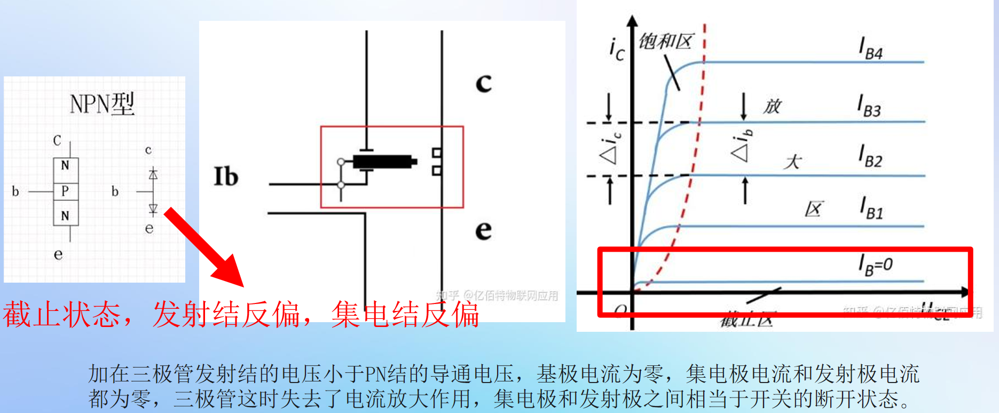
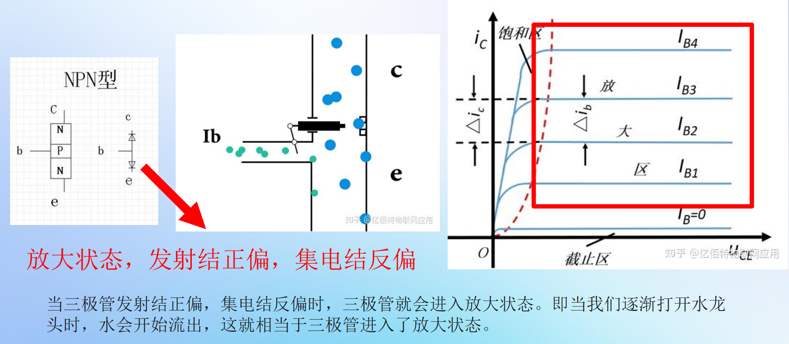
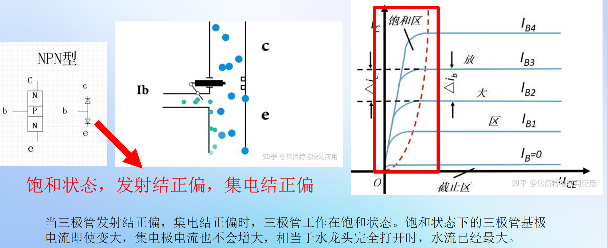

## $PN结$

==电子只能从$N$流向$P$，那么电流只能从$P$流向$N$==


## 三极管

[极速入门三极管NPN与PNP放大原理【极速入门数模电路P05】bilibili](https://www.bilibili.com/video/BV1UM4m1m7ZR?spm_id_from=333.788.videopod.sections&vd_source=cae5e5e53a7fcdf3a7ac534a5a5e2344)

### 引入

**$NPN$三极管**


**$PNP$三极管**


> 问题：为什么有这个小电流，大电流就可以从$N$到$P$了？
>
> 解释：因为小电流会填补$P$的空穴，这样施加更大的电压$P$没有空穴之后会因为互斥力挤压到右边就产生了大电流


**可以类比为水龙头**


### 介绍

**$PNP$**是一种$BJT$，其中一种$N$型材料被引入或放置在两种$P$型材料之间。在这样的配置中，设备将控制电流的流动。$PNP$​晶体管由2个串联的晶体二极管组成。二极管的右侧和左侧分别称为 **集电极-基极二极管和发射极-基极二极管。**

**$NPN$**中有一种 $P$ 型材料存在于两种 $N$ 型材料之间。**NPN晶体管基本上用于将弱信号放大为强信号**。在 NPN 晶体管中，电子从发射极区移动到集电极区，从而在晶体管中形成电流。这种晶体管在电路中被广泛使用。


> 集电极和发射极因为结的不同，面积的不同，不能进行调换使用

### 特性

#### 三极管的3种工作状态


**三极管输出特性曲线**


---

 **在曲线上定位三个工作区**

 **1. 截止区**

*   **在曲线上的位置**：**最下面那条曲线（$I_B = 0$)）与横轴（\($I_C=0$\)）之间的区域**。
*   **如何到达**：当 ($I_B = 0$) 或极小（发射结未导通）时，工作点就位于此区域。
*   **曲线特征**：
    *   \($I_C$\) 几乎为0，只有微小的漏电流 \($I_{CEO}$\)。
    *   即使 \($V_{CE}$\) 变化，\($I_C$\) 也基本不变（水平紧贴横轴）。

 **2. 放大区（线性区）**

*   **在曲线上的位置**：**曲线簇中间那些** **近似水平**、**彼此平行**、**间距均匀**的区域。
*   **如何到达**：当 \($I_B$\) 为某个正值，且 \($V_{CE}$\) 足够大（通常 > 0.7V）时，工作点位于此区域。
*   **曲线特征**：
    *   **核心特性**：对于某条固定的 \($I_B$\) 曲线，当 \($V_{CE}$\) 超过一个较小值后，\($I_C$\) **基本保持恒定**，不随 \($V_{CE}$) 增大而显著增加。曲线几乎是平的。
    *   **放大本质**：看**不同曲线间**的关系。\($I_B$\) 每增加一个固定量（如$20μA$），曲线就向上平移一个固定的、更大的量（如2mA）。这个“上移量  \($I_B$\) 增量”的比值就是 **电流放大系数 $β$**。
    *   **略微上翘**：实际上曲线并非完全水平，而是随 \($V_{CE}$\) 增加有轻微上翘（厄尔利效应），但通常近似为水平。

 **3. 饱和区**

*   **在曲线上的位置**：**所有曲线在左侧** **急剧弯曲并汇聚下降**的区域，靠近纵轴（\($V_{CE}$\)很小）。
*   **如何到达**：当 \($I_B$\) 足够大，使得工作点沿负载线向左移动，最终进入这个弯曲区域。
*   **曲线特征**：
    *   **核心特性**：对于一条固定的 \($I_B$\) 曲线，当 ($V_{CE}$) 降低到很小值时（如<0.5V），($I_C$) 会随着 ($V_{CE}$) 的减小而急剧下降，不再保持恒定。
    *   **曲线汇聚**：不同 \($I_B$\) 的曲线在此区域相互靠拢、几乎重叠。这意味着：在饱和区，**\($I_C$\) 的大小主要由 \($V_{CE}$\) 决定（外部电路约束），而几乎与 \($I_B$\) 无关**。即使再增大 \(I_B\)（换到更高曲线），只要 \($V_{CE}$\) 很低，\($I_C$\) 也差不多大。
    *   **饱和压降**：所有曲线最终都汇聚到 \($V_{CE}$) 约等于 **\($V_{CE(sat)}$\)** （典型值0.1-0.3V）的点。

---

 **四、总结对比表（基于曲线理解）**

| 特性                           | **截止区**                  | **放大区（线性区）**                              | **饱和区**                                          |
| :----------------------------- | :-------------------------- | :------------------------------------------------ | --------------------------------------------------- |
| **在曲线上的位置**             | \($I_B=0$\)曲线下方，近横轴 | 曲线簇中间**水平、等距**的部分                    | 曲线簇左侧**陡峭、汇聚**的部分                      |
| **偏置条件**                   | 发射结反偏/零偏             | 发射结正偏，**集电结反偏**                        | 发射结正偏，**集电结正偏/零偏**                     |
| **\(I_C\) 与 \(I_B\) 关系**    | 无关 (\($I_C \approx 0$\))  | **严格受控**：\($\Delta I_C = \beta \Delta I_B$\) | **几乎无关**：\($I_C$\) 达到最大，不随 \($I_B$\) 增 |
| **\(I_C\) 与 \(V_{CE}\) 关系** | 无关                        | **基本无关**（水平线，放大区特性）                | **强相关**（陡峭线，\($V_{CE}↓$\) 则 \($I_C↓$\)）   |
| **关键电压**                   | \($V_{CE} \approx V_{CC}$\) | \($V_{CE}$\) 可变，通常 > 0.7V                    | \($V_{CE} = V_{CE(sat)}$\)（很小，~0.2V             |
| **核心特点**                   | 开关“断”                    | **电流控制电流源**（模拟放大）                    | 开关“通”，低压降                                    |

 **核心结论**

**输出特性曲线图将抽象的状态具体化：**
*   **截止区**是图的**底部**。
*   **放大区**是图中**平坦、规律的区域**，体现了线性放大特性。
*   **饱和区**是图的**左侧边缘**，体现了开关导通特性。
*   **负载线**是电路约束的体现，**\(I_B\) 的变化驱动工作点在这条线上移动**，从而穿越不同的工作区，这完美解释了之前讨论的“状态转换由 \(I_B\) 驱动”。







#### 文字解释

**正确的工作状态转换过程（以NPN管为例）**

##### **1. 起始：截止区**

- **条件**：`Vbe < 0.5V`（硅管），`Ib ≈ 0`
- **结果**：`Ic ≈ 0`，`Vce ≈ Vcc`（电源电压）
- **状态**：完全关闭，无电流

##### **2. 开始导通：进入放大区**

- **条件**：`Vbe`增加到约0.6-0.7V，开始有`Ib`
- **发生了什么**：
  1. 基极-发射结正偏，电子开始注入
  2. 产生`Ic = β × Ib`
  3. `Vce = Vcc - Ic × Rc` 开始下降
- **此时**：三极管**已经打开**，但处于**线性放大状态**
- **特点**：`Ib`控制`Ic`，且`Ic`与`Vce`基本无关

##### **3. 继续增大Ib：向饱和区过渡**

- **过程**：
  1. `Ib`增大 → `Ic = β × Ib` 也增大
  2. `Ic`增大 → 在Rc上的压降`Ic×Rc`增大
  3. `Vce = Vcc - Ic×Rc` 继续下降
- **临界点**：当`Vce`下降到约0.7V时，集电结开始从反偏变为零偏

##### **4. 进入饱和区**

- **关键条件**：`Ib > Ic(sat) / β`
  其中`Ic(sat) = (Vcc - Vce(sat)) / Rc ≈ Vcc / Rc`
- **发生了什么**：
  1. 集电结变为正偏（`Vce < Vbe`）
  2. `Ic`达到最大值`Ic(sat)`，不再随`Ib`增加
  3. `Vce`下降到饱和压降`Vce(sat)`（约0.2-0.3V）
- **此时**：三极管**完全打开**，相当于开关闭合


##### 饱和区持续下降

**因为在饱和区，集电结从反偏变为正偏，集电区也开始向基区注入载流子，与发射区注入的载流子形成“竞争”，破坏了放大区赖以工作的“单向浓度梯度”，导致有效收集的电流下降。**

**上面的是集电结反偏，发射结正偏的情况，这是集电结正偏，发射结正偏的情况**


**为什么Vce降低，Ic也降低？**

因为`Vce`降低到一定程度后，**集电结由反偏变为正偏**，引发了反向载流子注入。这破坏了放大区赖以工作的**单向浓度梯度**，导致载流子在基区内发生有害的复合与竞争，使得从发射区到集电区的**净电流（Ic）** 减小。

这看似反常的物理现象，恰恰定义了**饱和区**。它告诉我们：三极管不是一个完美的开关，其“导通”状态（饱和区）存在一个**非零的最小压降** `Vce(sat)`，并且在这个区域内，它表现得像一个**小电阻**，遵循欧姆定律。理解这一点，是正确设计和使用三极管开关电路的基础。


**深入物理层面：载流子视角（NPN管）**

让我们进入微观世界，看看电子和空穴的真实搏斗。


 **阶段1：放大区（健康的单向交通）**

text

```
发射区(N) ——> 基区(P) ——> 集电区(N)
  高浓度        超薄        强电场收集
  电子注入      电子扩散     电子被拉走
```


- **发射结正偏**：发射区向基区**注入大量电子**。
- **基区很薄**：大部分注入电子来不及复合，就扩散到集电结边缘。
- **集电结反偏**：这里有一个强大的**从集电区指向基区的电场**（耗尽层电场）。
- **关键**：这个电场对从基区扩散来的电子而言，是**顺风车**，会迅速将它们**扫入集电区**，形成`Ic`。
- **此时**：载流子流动是**单向的**（发射区 → 集电区），`Ic`由发射极注入的电子数（即`Ib`）决定，与集电结电压（`Vce`）关系不大。


 **阶段2：临界点（Vce开始侵入）**

当`Vce`降低到约`Vbe`（0.7V）时：

- 集电结电压`Vcb = Vce - Vbe ≈ 0`。
- 集电结的耗尽层电场**减弱到近乎消失**。
- 电子从基区扩散到集电结边缘后，缺少了强电场的“加速收集”，开始“堆积”。

 **阶段3：饱和区（交通堵塞与逆向车流）**

当`Vce`进一步降低（`Vce < Vbe`，即`Vcb < 0`）：

- **集电结变为正偏**！
- 物理图景发生**根本性逆转**：

text

```
1. 正向注入（我们想要的）：
   发射区(N) —[电子]—> 基区(P) —（扩散）—> 集电结

2. 新出现的反向注入（有害的）：
   集电区(N) —[电子]—> 基区(P)  （因为集电结也正偏了！）
   （更准确地说，是基区(P)的空穴注入集电区，两者等效）
```


**两个致命的后果**：

1. **载流子竞争与复合加剧**：
   - 从集电区反向注入基区的电子（或等效的空穴流入），与从发射区正向注入的电子，在狭窄的基区内**相遇**。
   - 它们发生**大量复合**，白白消耗掉。
   - 相当于一部分我们辛苦从发射区注入的电子，还没到达集电极，就被“逆流”而来的载流子“中和”掉了。
2. **浓度梯度被“熨平”**：
   - 放大区工作的基础，是基区中从发射结到集电结存在巨大的**电子浓度梯度**（发射结边缘浓度高，集电结边缘浓度几乎为0）。
   - 现在集电结也开始向基区注入电子，导致集电结边缘的电子浓度**不再是0，而是显著升高**。
   - 浓度梯度**被减小了**。扩散电流的驱动力（`电流 ∝ 浓度梯度`）因此**减弱**。

**最终结果**：从发射区到集电区的**净电子流（`Ic`）** 下降了。`Vce`越低（集电结正偏越厉害），这种反向注入和浓度梯度破坏就越严重，`Ic`就下降得越厉害。


## 正偏，反偏的概念

三极管的**正偏**和**反偏**是针对其内部两个 PN 结（**发射结**和**集电结**）的偏置电压状态的定义，核心取决于 PN 结两端的电位差方向，直接决定三极管的工作模式。

### 一、 先明确 PN 结的正偏与反偏（基础）

三极管由两个 PN 结组成（发射结：基极 B 与发射极 E 之间；集电结：基极 B 与集电极 C 之间），PN 结的偏置规则是判断三极管偏置的核心：

1. **PN 结正偏**

   定义：PN 结的**P 区电位高于 N 区电位**，即 $V_P>V_N$。

   物理本质：外电场方向与 PN 结内电场方向相反，内电场被削弱，多子的扩散运动占主导，PN 结导通，形成较大的正向电流。

   硅管正偏导通压降约 0.7V，锗管约 0.2V。

   

2. **PN 结反偏**

   定义：PN 结的**N 区电位高于 P 区电位**，即 $V_N>V_P$。

   物理本质：外电场方向与 PN 结内电场方向相同，内电场被增强，少子的漂移运动占主导，PN 结截止，仅存在极小的反向饱和电流。

   

### 二、 三极管的正偏与反偏（分 NPN、PNP 型）

三极管分为**NPN 型**和**PNP 型**，两者的掺杂类型相反，因此偏置电压的极性也相反，以下是具体的偏置条件：

#### 1. NPN 型三极管（最常用）

结构：基区为 P 型，发射区和集电区为 N 型，电极电位关系为 $V_C>V_B>V_E$。

- **发射结正偏**：基极电位高于发射极电位，即 $V_{BE}=V_B−V_E>V_{on}$（$V_{on}$ 为导通压降）。
- **集电结反偏**：集电极电位高于基极电位，即 $V_{BC}=V_B−V_C<0$。

#### 2. PNP 型三极管

结构：基区为 N 型，发射区和集电区为 P 型，电极电位关系为 $V_E>V_B>V_C$。

- **发射结正偏**：发射极电位高于基极电位，即 $V_{EB}=V_E−V_B>V_{on}$。
- **集电结反偏**：基极电位高于集电极电位，即 $V_{CB}=V_C−V_B<0$。

### 三、 偏置状态与三极管工作模式的关系

三极管的**放大、饱和、截止**三种核心工作模式，由两个 PN 结的偏置状态直接决定：

| 工作模式 | 发射结偏置 | 集电结偏置 |                 核心特性                  |
| :------: | :--------: | :--------: | :---------------------------------------: |
|  放大区  |    正偏    |    反偏    |         $I_C=βI_B$，电流放大作用          |
|  饱和区  |    正偏    |    正偏    | $I_C$ 不再随 $I_B$ 增大，三极管导通压降小 |
|  截止区  |    反偏    |    反偏    |      $I_B≈0,I_C≈0$，三极管相当于开路      |

### 四、 物理本质总结

- 发射结正偏的目的：**注入载流子**，让发射区的多子（NPN 为电子，PNP 为空穴）大量扩散到基区。
- 集电结反偏的目的：**收集载流子**，让基区的载流子（未被复合的部分）快速漂移到集电区，形成受控的集电极电流 IC。


## 三极管本质的电流流动

[三极管是如何导电？超形象动画让你一看就懂！哔哩哔哩_bilibili](https://www.bilibili.com/video/BV1kv411574Y/?spm_id_from=333.1007.top_right_bar_window_default_collection.content.click&vd_source=cae5e5e53a7fcdf3a7ac534a5a5e2344)

[终于有人讲了，凭什么三极管能放大? 哔哩哔哩_bilibili](https://www.bilibili.com/video/BV1fB4y147Gn/?spm_id_from=333.1387.favlist.content.click&vd_source=cae5e5e53a7fcdf3a7ac534a5a5e2344)

[1.3 晶体三极管 哔哩哔哩_bilibili](https://www.bilibili.com/video/BV13R4y1q7sp?spm_id_from=333.788.videopod.episodes&vd_source=cae5e5e53a7fcdf3a7ac534a5a5e2344&p=3)


## 特性

**NPN 型三极管** 和 **PNP 型三极管**，二者的核心差异源于**半导体层的排列顺序**和**载流子类型**，进而导致偏置条件、电流方向、应用场景等特性的不同。以下从结构、工作原理、特性曲线、应用等维度进行结构化深度解析。

### 一、 基本结构与载流子类型

三极管由**三层半导体**、**两个 PN 结**组成，三层分别为**发射区 (E)**、**基区 (B)**、**集电区 (C)**，两个 PN 结分别为**发射结（E-B 结）\**和\**集电结（C-B 结）**。

|  类型  | 结构层排列 |   发射区载流子   |    基区载流子    |   集电区载流子   | 主导载流子 |
| :----: | :--------: | :--------------: | :--------------: | :--------------: | :--------: |
| NPN 型 |   N-P-N    | 自由电子（多子） |   空穴（多子）   | 自由电子（多子） |  自由电子  |
| PNP 型 |   P-N-P    |   空穴（多子）   | 自由电子（多子） |   空穴（多子）   |    空穴    |

**关键结构特点**：

1. 基区**厚度极薄**（微米级）且**掺杂浓度最低**，这是三极管实现电流放大的核心物理基础。
2. 发射区**掺杂浓度最高**，目的是向基区注入大量载流子；集电区**面积最大**，目的是收集载流子。

### 二、 核心工作条件（偏置要求）

三极管工作在**放大区**的必要条件是**发射结正偏，集电结反偏**，两类三极管的偏置电压极性完全相反。

#### 1. NPN 型三极管

- 发射结正偏：$V_B>V_E$（基极电位高于发射极电位）
- 集电结反偏：$V_C>V_B$（集电极电位高于基极电位）
- 供电方式：通常采用**正电源**供电，集电极接电源正极，发射极接地（或负电位）。

#### 2. PNP 型三极管

- 发射结正偏：$V_E>V_B$（发射极电位高于基极电位）
- 集电结反偏：$V_B>V_C$（基极电位高于集电极电位）
- 供电方式：通常采用**负电源**供电，发射极接电源正极，集电极接地（或负电位）；也可在单电源系统中利用负压端实现偏置。

### 三、 电流关系与载流子运动规律

三极管的电流放大本质是**基极电流$I_B$对集电极电流$I_C$的控制作用**，遵循**电流分配定律**，两类三极管的电流方向和载流子运动过程存在明显差异。

#### 1. 电流方向与分配公式

电流的实际方向由**主导载流子的运动方向**决定，满足**基尔霍夫电流定律**：

$I_E=I_B+I_C$

其中，$I_E$为发射极电流，$I_B$为基极电流，$I_C$为集电极电流。

|  类型  |   **IE**方向   |  **IB**方向  |   **IC**方向   |    电流控制关系    |
| :----: | :------------: | :----------: | :------------: | :----------------: |
| NPN 型 | **流出**发射极 | **流入**基极 | **流入**集电极 | $I_C=βI_B+I_{CEO}$ |
| PNP 型 | **流入**发射极 | **流出**基极 | **流出**集电极 | $I_C=βI_B+I_{CEO}$ |

注：

- $β$为**电流放大系数**，$β=\frac{Δ{I_C}}{ΔI_B}$，放大区中β为常数（通常为 20~200）；
- $I_{CEO}$为**穿透电流**，是集电结反向饱和电流的β倍，受温度影响显著，越小三极管稳定性越好。

#### 2. 载流子运动过程（放大区）

- **NPN 型**：发射区的自由电子在发射结正偏电场下注入基区 → 少量电子与基区空穴复合形成IB → 大量电子（因基区极薄）扩散到集电结边缘 → 集电结反偏电场将电子拉向集电区形成IC。
- **PNP 型**：发射区的空穴在发射结正偏电场下注入基区 → 少量空穴与基区电子复合形成IB → 大量空穴扩散到集电结边缘 → 集电结反偏电场将空穴拉向集电区形成IC。

### 四、 特性曲线（伏安特性）

三极管的特性曲线直观反映电流与电压的关系，NPN 和 PNP 型的曲线趋势一致，但**电压极性相反**，核心包括**输入特性曲线**和**输出特性曲线**。

#### 1. 输入特性曲线

定义：集电极电压$U_{CE}$固定时，基极电流$I_B$与发射结电压$U_{BE}$的关系曲线 常数。

- 曲线形状：类似二极管的**正向伏安特性**，存在**死区电压**（硅管～0.7V，锗管～0.3V）。
- 差异点：NPN 型的$U_{BE}$为**正电压**，PNP 型的$U_{BE}$为**负电压**（实际关注$U_{BE}$，为正电压）。

#### 2. 输出特性曲线

定义：基极电流$I_B$固定时，集电极电流$I_C$与集射极电压$U_{CE}$的关系曲线 常数。

曲线分为三个工作区：

| 工作区 |        偏置条件        |      $I_C$与$I_B$关系      |       应用场景       |
| :----: | :--------------------: | :------------------------: | :------------------: |
| 截止区 | 发射结反偏，集电结反偏 |       $I_C≈0，I_B=0$       | 开关电路（关断状态） |
| 放大区 | 发射结正偏，集电结反偏 |  $I_C=βI_B，与U_{CE}无关$  |       放大电路       |
| 饱和区 | 发射结正偏，集电结正偏 | $I_C不受I_B控制，I_C<βI_B$ | 开关电路（导通状态） |

- 差异点：NPN 型的$U_{CE}$为**正电压**，PNP 型的$U_{CE}$为**负电压**（实际关注$U_{EC}$，为正电压）。

### 五、 应用特点对比

|    特性    |                NPN 型三极管                 |                PNP 型三极管                 |
| :--------: | :-----------------------------------------: | :-----------------------------------------: |
|  供电适配  |       适配正电源系统，电路设计更通用        | 适配负电源或单电源负压端，多用于低功耗电路  |
|  开关驱动  |    集电极接负载，高电平时导通（拉电流）     |    发射极接负载，低电平时导通（灌电流）     |
| 温度稳定性 | 穿透电流$I_{CEO}$受温度影响大，高温性能略差 |     穿透电流影响相对小，高温稳定性略优      |
|  常见场景  |  音频放大、电源管理、数字开关电路（主流）   | 互补对称电路（如 OTL 功放）、低电压信号处理 |

### 六、 核心异同总结

1. **相同点**

   - 核心放大原理一致：均为**基极电流控制集电极电流**的电流控制电流源（CCCS）；
   - 工作区划分标准一致：截止、放大、饱和区的偏置逻辑相同；
   - 关键参数定义一致：电流放大系数β、穿透电流$I_{CEO}$等参数的物理意义相同。

   

2. **核心差异**

   - 本质差异：半导体层排列顺序与主导载流子类型；
   - 关键差异：偏置电压极性与电流方向；
   - 应用差异：供电方式与电路适配性。
